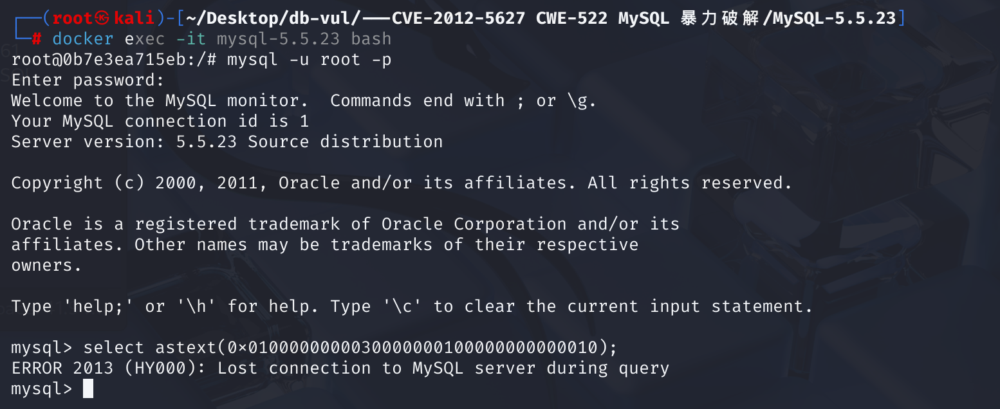
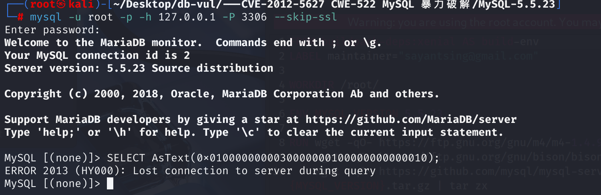
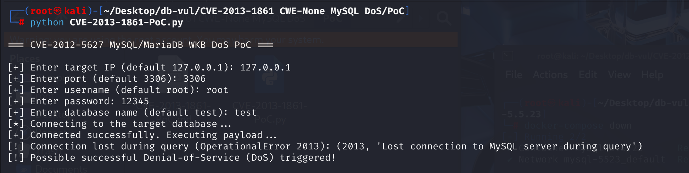

# CVE-2013-1861 CWE-None MySQL DoS

## Vulnerability Background
- **MySQL:** A popular open-source relational database management system (RDBMS), known for its reliability, high performance, and ease of use. As a core component of the LAMP (Linux, Apache, MySQL, PHP/Perl/Python) technology stack, it is widely used in applications and websites of all sizes, from small personal projects to large enterprise-level solutions. MySQL uses Structured Query Language (SQL) for data management and manipulation, supports multiple storage engines to meet different performance and functional needs, and is favored by developers for its extensive community support and abundant documentation resources.
- **WKB (Well-Known Binary)** is a binary format used to compactly represent geometric objects in databases. For example, a WKB representation of a `LineString` (wire string) typically includes the following parts:
  - Byte order (1 byte): Indicates whether the terminal is large or small.
  - WKB type (4 bytes): an integer representing a geometric type (such as `LineString`, `Polygon`, etc.).
  - Number of dots `num_points` (4 bytes): An integer declaring how many points the string contains.
  - Point coordinate sequence: Continuously stores the X and Y coordinates of each point (usually each coordinate is an 8-byte double-precision floating-point number).

## Vulnerability Mechanism
 MariaDB and Oracle MySQL servers have flaws in handling the WKB (Well-Known Binary) binary representation of geometric data. When a server receives a specially designed WKB data (for example, declaring an abnormal number of points, or the WKB data itself is formatted incorrectly or insufficiently long), failure to properly verify and process it can cause internal errors (especially "numerical calculation errors"), ultimately causing the database server process to crash and resulting in Denial of Service (DoS)

## Vulnerability Location
Analyze the MySQL 5.5.23 source code

1. When executing the AsText() function, the Item_func_as_wkt::val_str_ascii method is called to handle parameters and generate results. In the SQL \item _geofunc.cc file, line **120**, function `val_str_ascii`, first retrieves the string form of the parameter via `args[0]->val_str(&arg_val)`, then calls the `Geometry::construct` method to construct the geometric object.

   ```c
   String *Item_func_as_wkt::val_str_ascii(String *str)
   {
     DBUG_ASSERT(fixed == 1);
     String arg_val;
     String *swkb= args[0]->val_str(&arg_val);  Retrieves the parameter in string form
     Geometry_buffer buffer;
     Geometry *geom= NULL;
     const char *dummy;
   
     if ((null_value=
          (args[0]->null_value ||
   	! (geom= Geometry::construct(&buffer, swkb->ptr(), swkb->length())))))  Construct geometric objects
       return 0;
   
     str->length(0);
     if ((null_value = geom->as_wkt(str, &dummy))) // Convert geometric objects to WKT format
       return 0;
   
     return str;
   }
   ```

2. At line **141** of the SQL \spatial.cc file, the `Geometry::construct()` function is used to read the geometry type from WKB data and construct the corresponding geometry subclass object, setting the data pointer `m_data`. At line **147**, it checks whether the parameter's data length is sufficient; it should include at least `SRID_SIZE` (4 bytes for storage reference identifiers) plus `WKB_HEADER_SIZE` (1-byte byte byte order flag and 4-byte geometric type identifier).

   ```c
   Geometry *Geometry::construct(Geometry_buffer *buffer,
                                 const char *data, uint32 data_len)
   {
     uint32 geom_type;
     Geometry *result;
   
   *** 147 lines ****** Checking parameter data length **********************************************
     if (data_len < SRID_SIZE + WKB_HEADER_SIZE)   // < 4 + (1 + 4)
       return NULL;
     /* + 1 to skip the byte order (stored in position SRID_SIZE). */
     geom_type= uint4korr(data + SRID_SIZE + 1);  Read types, such as Polygon
     if (!( result= create_by_typeid(buffer, (int) geom_type))) // Create an object
       return NULL;
     result->m_data= data+ SRID_SIZE + WKB_HEADER_SIZE;  Pointing to WKB data
     result->m_data_end= data + data_len;
     return result;
   }
   ```

3. At line **530** of the SQL \spatial.cc file, when executing the `AsText` function, if the geometry object is of type `LineString`, the `Gis_line_string::get_data_as_wkt` function will be called to convert the `LineString` object to text (WKT). The core step is to read the points and traverse them. However, on line **541**, call the `no_data` function to check the number segment of the checkpoint.

   Then, at line **548**, the `get_point` function is directly called to parse double-precision floating-point numbers, with the data data coming from `construct`'s `m_data`.

   ```c
   bool Gis_line_string::get_data_as_wkt(String *txt, const char **end) const
   {
     uint32 n_points;
     const char *data= m_data;
   
     if (no_data(data, 4))
       return 1;
     n_points= uint4korr(data);  Read the points
     data += 4;
   
     if (n_points < 1 ||
   *** 541 lines ****** checkpoint digit segments ***************************************************
         no_data(data, SIZEOF_STORED_DOUBLE * 2 * n_points) ||
         txt->reserve(((MAX_DIGITS_IN_DOUBLE + 1)*2 + 1) * n_points))
       return 1;
   
     while (n_points--)
     {
       double x, y;
   *** 548 rows ****** Parsing double-precision floating-point numbers ************************************************
       get_point(&x, &y, data);  // Parse double-precision floating-point numbers, read two doubles (total 16 bytes)
       data+= SIZEOF_STORED_DOUBLE * 2;
       txt->qs_append(x);
       txt->qs_append(' ');
       txt->qs_append(y);
       txt->qs_append(',');
     }
     txt->length(txt->length() - 1);		// Remove end ','
     *end= data;
     return 0;
   }
   ```

   At line **324** of the sql \spatial.h file, the `no_data` function only checks whether the dot segment exists (i.e., whether 4 bytes of data are used to store the points), but **does not further verify whether the remaining data is sufficient to accommodate all the coordinate data of the points**. This is where the **vulnerability** lies.

   ```c
   inline bool no_data(const char *cur_data, uint32 data_amount) const
   {
   	return (cur_data + data_amount > m_data_end);
   }
   ```

4. On line 108 of the `Gis_line_string::get_data_as_wkt` function, if the `get_point` `data` goes out of bounds, a double value will be read at the illegal address, causing memory access to go out of bounds, crash, or denial of service.

   ```c
   static void get_point(double *x, double *y, const char *data)
   {
     float8get(*x, data);
     float8get(*y, data + SIZEOF_STORED_DOUBLE);
   }
   ```

## Remediation
 Line 541 of the `Gis_line_string::get_data_as_wkt` function, replacing `no_data`, introduces the `not_enough_points` function to verify whether the remaining data is sufficient to accommodate all the coordinate data of all points.

```c
if (n_points < 1 ||
    not_enough_points(data, n_points) ||
    txt->reserve(((MAX_DIGITS_IN_DOUBLE + 1)*2 + 1) * n_points))
  return 1;
```

## Affected Versions
**MariaDB**：

- Version 5.5.x is lower than 5.5.30
- Version 5.3.x is lower than 5.3.13
- Version 5.2.x is lower than 5.2.15
- Version 5.1.x is lower than 5.1.68

**Oracle MySQL**：

- 5.1.69 and earlier versions
- 5.5.31 and earlier versions
- 5.6.11 and earlier versions

## Environment Setup
Start the Docker environment, MySQL version is 5.5.23. The administrator user is root, and the password is 12345. At the same time, a regular user named testuser was created, with the password testpwd, which has a default database called test for testing purposes.


## Vulnerability Reproduction
Go into the container command line, connect to MySQL, and execute PoC code. You'll see that the MySQL server process unexpectedly terminates (crashes) while processing the query.

```sql
select astext(0x0100000000030000000100000000000010);
```

Because the Docker environment starts MySQL on mysqld_safe, it ensures that if the MySQL server process (`mysqld`) crashes due to vulnerabilities or other reasons, it will be automatically attempted to restart by `mysqld_safe`. That is, after a vulnerability in a Docker container causes the server to crash, you can quickly reconnect again.



Outside the container:

```bash
mysql -u root -p -h 127.0.0.1 -P 3306 --skip-ssl
```



## PoC Analysis
PoC code implements DoS by automatically sending payload query requests after connecting to the database.

Run the PoC file, enter MySQL's IP, port, username, password, and database. Afterwards, you will see MySQL crash and disconnect:

```bash
python CVE-2013-1861-PoC.py
```



```sql
SELECT AsText(0x0100000000030000000100000000000010);
```

Breaking down hexadecimal:

- 01: byte order (Xiaoduan)
- 00000003: geometry type = 3 means the geometry type is polygon
- 00000001: 1 ring (outer outline), but in reality, a polygon requires at least 4 points (a closed linear ring) to form a valid polygon.
- 0000000000000010: One point is declared, but the actual coordinate data provided is insufficient. A complete point coordinate should contain two double-precision floating-point numbers (X and Y), each occupying 8 bytes. Only a portion of the bytes are provided here, which cannot form valid coordinate data.

Trigger points:

- **Incomplete geometric data**: The declared geometric type is Polygon, but the data provided is insufficient to form a valid polygon. A polygon requires at least one closed linear ring, while a linear ring needs at least 4 points (with the start and end points overlapping).
- **Mismatched Number of Points and Data Lengths**: The dot segment declares 1 point, but the actual provided coordinate data is insufficient to parse valid point coordinates.

When the server processes this PoC code, it calls related functions to parse WKB data. Due to data incompleteness and inconsistency, servers may exceed the actual data range during processing, read illegal memory, and cause crashes.

## References
[MySQL / MariaDB - Geometry Query Denial of Service - Linux dos Exploit](https://www.exploit-db.com/exploits/38392)

[Comparing mysql-5.5.23...mysql-5.5.63 · mysql/mysql-server](https://github.com/mysql/mysql-server/compare/mysql-5.5.23...mysql-5.5.63)
