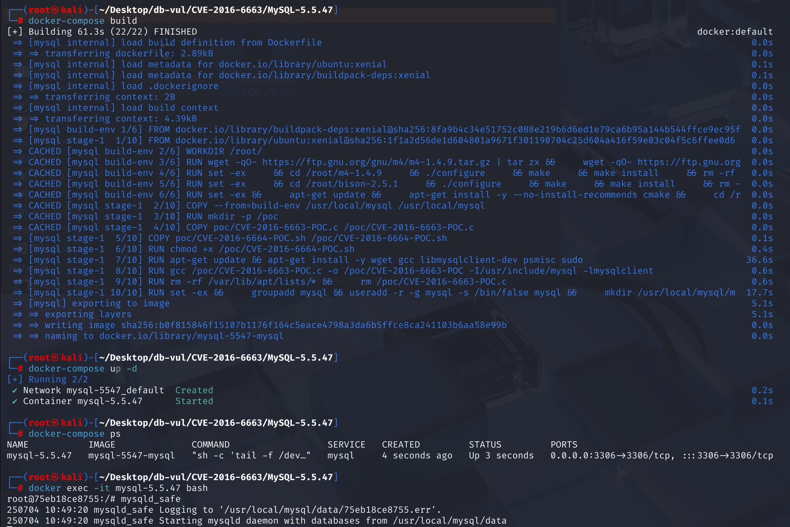
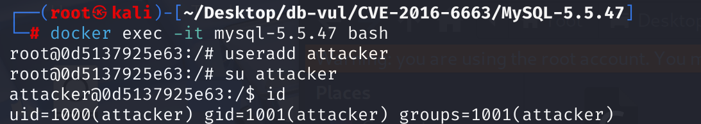

# CVE-2016-6663 CWE-362 MySQL privilege escalation

## Vulnerability Background
- **Race Condition** refers to the system's operational results relying on the execution order of multiple events, which may not be reliably controlled. In the computer field, especially in multithreaded or multi-process environments, when multiple execution streams simultaneously access shared resources (such as memory, files, database records) and at least one stream modifies that resource, a lack of appropriate synchronization mechanisms may lead to condition race. This leads to unpredictable behavior, data corruption, and even security vulnerabilities.

## Vulnerability Mechanism
A local privilege escalation vulnerability in MySQL, MariaDB, and PerconaDB. This vulnerability allows local users with low privileges (such as SELECT, INSERT, and CREATE privileges) to use race conditions to escalate privileges, ultimately executing arbitrary code as database system users (usually `mysql` users). This allows attackers to access all database files on the server and may even further escalate permissions to gain control over the entire system.

- **Race Condition Exploit**: Attackers exploit race conditions generated when performing certain operations (such as repairing tables) in the database, creating specific conditions to gain higher privileges.
- **File System Operations**: By creating symbolic links or replacing files in specific database directories, attackers can manipulate the database's behavior to execute arbitrary code.
- **Privilege Escalation**: After successfully using the above methods, attackers can elevate their permissions to database system users, allowing them to access or modify database files, and may even further elevate them to higher system privileges.

In MySQL, table metadata is stored in `.frm` files, while table data is stored in `.MYD` files. When performing `REPAIR TABLE` and other operations, MySQL creates a temporary `.TMD` file to store the data from the repair process. In some cases, MySQL sets the permissions for `.TMD` files to be the same as those for `.MYD` files. Attackers can exploit this by creating symbolic links with specific permissions to point `.TMD` files to files controlled by the attacker, thereby escalating privileges and executing arbitrary code during the repair process.

## Vulnerability Location
1. When performing `REPAIR TABLE` operations, the `ha_myisam::repair()` function at line **1031** in the **storage/myisam/ha_myisam.cc** file is called. This function is a key function of the MyISAM storage engine in MySQL, and it calls `mi_repair_parallel()` (parallel repair), `mi_repair_by_sort()` (repair by order) and `mi_repair()` functions to repair MyISAM tables.

```c
int ha_myisam::repair(THD *thd, MI_CHECK &param, bool do_optimize)
{
  // ... ...
    /*
      mi_repair*() functions family use file I/O even if memory
      mapping is available.

      Since mixing mmap I/O and file I/O may cause various artifacts,
      memory mapping must be disabled.
    */
    if (remap)
      mi_munmap_file(file);
#endif
    if (mi_test_if_sort_rep(file,file->state->records,key_map,0) &&
	(local_testflag & T_REP_BY_SORT))
    {
      local_testflag|= T_STATISTICS;
      param.testflag|= T_STATISTICS;		// We get this for free
      statistics_done=1;
      if (THDVAR(thd, repair_threads)>1)
      {
        char buf[40];
        /* TODO: respect myisam_repair_threads variable */
        my_snprintf(buf, 40, "Repair with %d threads", my_count_bits(key_map));
        thd_proc_info(thd, buf);
        error = mi_repair_parallel(&param, file, fixed_name,
            param.testflag & T_QUICK);
        thd_proc_info(thd, "Repair done"); // to reset proc_info, as
                                      // it was pointing to local buffer
      }
      else
      {
        thd_proc_info(thd, "Repair by sorting");
        error = mi_repair_by_sort(&param, file, fixed_name,
            param.testflag & T_QUICK);
      }
    }
    else
    {
      thd_proc_info(thd, "Repair with keycache");
      param.testflag &= ~T_REP_BY_SORT;
      error=  mi_repair(&param, file, fixed_name,
			param.testflag & T_QUICK);
    }
// ... ...
}
```

2. In the **storage/myisam/mi_check.c** file, the `mi_repair()` function at line **2135, the `mi_repair_by_sort()` function at line **2218, and the `mi_repair_parallel()` function at line **2631** all call the **2135**  to ensure that temporary files created during the repair process ultimately replace the original files, while preserving the file's metadata (such as permissions, etc.)`change_to_newfile()`

```c
if (!got_error)
  {
    /* Replace the actual file with the temporary file */
    if (new_file >= 0)
    {
      mysql_file_close(new_file, MYF(0));
      info->dfile=new_file= -1;
      if (change_to_newfile(share->data_file_name,MI_NAME_DEXT, DATA_TMP_EXT,
			    (param->testflag & T_BACKUP_DATA ?
			     MYF(MY_REDEL_MAKE_BACKUP): MYF(0))) ||
	  mi_open_datafile(info,share,name,-1))
	got_error=1;
    }
  }
```

3. In the `change_to_newfile()` function at line **2135**, call the `my_redel` function to perform file renaming and metadata copying

```c
/*
	  Let temporary file replace old file.
	  This assumes that the new file was created in the same
	  directory as given by realpath(filename).
	  This will ensure that any symlinks that are used will still work.
	  Copy stats from old file to new file, deletes orignal and
	  changes new file name to old file name
	*/

int change_to_newfile(const char * filename, const char * old_ext,
                      const char * new_ext, myf MyFlags)
{
  char old_filename[FN_REFLEN],new_filename[FN_REFLEN];
  /* Get real path to filename */
  (void) fn_format(old_filename,filename,"",old_ext,2+4+32);
  return my_redel(old_filename,
		  fn_format(new_filename,old_filename,"",new_ext,2+4),
		  MYF(MY_WME | MY_LINK_WARNING | MyFlags));
} /* change_to_newfile */
```

4. In the **mysys/my_redel.c** file, at line **42**, the `my_redel()` function renames a temporary file to the object filename, copies the source file's metadata (such as permissions, etc.), and ensures the atomicity and security of the operation. Here, the `my_copystat()` function is used to copy metadata (such as permissions, owners, etc.) from the source file (`org_name`) to the temporary file (`tmp_name`)

```c
int my_redel(const char *org_name, const char *tmp_name, myf MyFlags)
{
  int error=1;
  DBUG_ENTER("my_redel");
  DBUG_PRINT("my",("org_name: '%s' tmp_name: '%s'  MyFlags: %d",
		   org_name,tmp_name,MyFlags));

  if (my_copystat(org_name,tmp_name,MyFlags) < 0)
    goto end;
  if (MyFlags & MY_REDEL_MAKE_BACKUP)
  {
    char name_buff[FN_REFLEN+20];    
    char ext[20];
    ext[0]='-';
    get_date(ext+1,2+4,(time_t) 0);
    strmov(strend(ext),REDEL_EXT);
    if (my_rename(org_name, fn_format(name_buff, org_name, "", ext, 2),
		  MyFlags))
      goto end;
  }
  else if (my_delete_allow_opened(org_name, MyFlags))
      goto end;
  if (my_rename(tmp_name,org_name,MyFlags))
    goto end;

  error=0;
end:
  DBUG_RETURN(error);
}
```

5. At line **76**, the `my_copystat` function in MySQL is used to copy metadata from one file (such as permissions, owner, timestamp, etc.) to another file. Its main function is to maintain consistency in file properties during file operations, especially when repairing or updating files.

The `chmod()` and `chown()` functions are called to copy the permissions and owner of the source file to the target file, but there is no thorough checks to ensure the object file is not replaced before permission copying. Attackers can exploit this by replacing the target file with another through symbolic links or other means, thereby bypassing permission checks.

```c
	/* Copy stat from one file to another */
	/* Return -1 if can't get stat, 1 if wrong type of file */

int my_copystat(const char *from, const char *to, int MyFlags)
{
  struct stat statbuf;

  if (stat(from, &statbuf))
  {
    my_errno=errno;
    if (MyFlags & (MY_FAE+MY_WME))
      my_error(EE_STAT, MYF(ME_BELL+ME_WAITTANG),from,errno);
    return -1;				/* Can't get stat on input file */
  }
  if ((statbuf.st_mode & S_IFMT) != S_IFREG)
    return 1;

  /* Copy modes */
  if (chmod(to, statbuf.st_mode & 07777))
  {
    my_errno= errno;
    if (MyFlags & (MY_FAE+MY_WME))
      my_error(EE_CHANGE_PERMISSIONS, MYF(ME_BELL+ME_WAITTANG), from, errno);
    return -1;
  }

#if !defined(__WIN__)
  if (statbuf.st_nlink > 1 && MyFlags & MY_LINK_WARNING)
  {
    if (MyFlags & MY_LINK_WARNING)
      my_error(EE_LINK_WARNING,MYF(ME_BELL+ME_WAITTANG),from,statbuf.st_nlink);
  }
  /* Copy ownership */
  if (chown(to, statbuf.st_uid, statbuf.st_gid))
  {
    my_errno= errno;
    if (MyFlags & (MY_FAE+MY_WME))
      my_error(EE_CHANGE_OWNERSHIP, MYF(ME_BELL+ME_WAITTANG), from, errno);
    return -1;
  }
#endif /* !__WIN__ */

  if (MyFlags & MY_COPYTIME)
  {
    struct utimbuf timep;
    timep.actime  = statbuf.st_atime;
    timep.modtime = statbuf.st_mtime;
    (void) utime((char*) to, &timep);/* Update last accessed and modified times */
  }

  return 0;
} /* my_copystat */
```

## Remediation

Install the vendor security release for the deployed branch: MariaDB 5.5.52, 10.0.28, 10.1.18 or later; Oracle MySQL 5.5.53, 5.6.34, 5.7.16 or later; or the corresponding fixed Percona Server/XtraDB Cluster release. The repair hardens the MyISAM repair/temporary-file replacement sequence so an attacker cannot win the race with a symlink and cause the privileged server process to change ownership or permissions on an arbitrary file.

Before upgrading, avoid MyISAM for attacker-writable tables, revoke `REPAIR`, `ALTER`, `CREATE`, and filesystem-related privileges from untrusted database users, and ensure the database data directory and temporary directories are not writable by unrelated local accounts. Run the server under a dedicated account with a restrictive `umask` and mandatory-access-control policy.

## Affected Versions
- MariaDB  < 5.5.52   < 10.1.18   < 10.0.28 
- MySQL   <= 5.5.51 <= 5.6.32 <= 5.7.14 
- Percona Server < 5.5.51-38.2 < 5.6.32-78-1 < 5.7.14-8 
- Percona XtraDB Cluster < 5.6.32-25.17 < 5.7.14-26.17 < 5.5.41-37.0

## Environment Setup
1. In the Docker project, MySQL version is 5.5.47, the administrator user is root, and the password is 12345. A regular user named testuser with the password testpwd has also been created, which has a default database called test, usually automatically created when installing MySQL for testing purposes.

2. In the poc folder, there is a poc file CVE-2016-6663-POC.c. After the container starts, it will automatically use gcc to compile it into CVE-2016-6663-POC.

3. After launching Docker, run the command `docker exec -it mysql-5.5.47 /bin/bash` enter the command line, then enter the command `mysql_safe` start MySQL.



## Vulnerability Reproduction
> **Utilization Process:**
>
> 1. **Create Tables**: The attacker creates a table in the database and performs `REPAIR TABLE` operation.
> 2. **Creating Symbolic Links**: During `REPAIR TABLE` operation, the attacker creates a symbolic link pointing to a malicious file, replacing `.TMD` file.
> 3. **Executing malicious code**: Since `.TMD` file points to a malicious file, MySQL will execute it during the repair process to achieve privilege escalation.
>

1. Reopen the command line in the Docker folder and enter the container command line, create a regular user attakcer, switch to regular users, and check the user ID.

```bash
docker exec -it mysql-5.5.47 bash
```

```cmd
useradd attacker
su attacker
id
```



2. Under the attacker user, run the POC file using a regular MySQL user testuser, password testpwd, and database test.

```cmd
./PoC/CVE-2016-6663-POC testuser testpwd 127.0.0.1 test
```

3. After running, enter the whoami command, and you will see that the current shell is running with the permissions of `mysql` users. When you enter the id command, you will see that euid is mysql, indicating that `attacker` user can now execute commands as `mysql` users. This usually means being able to access and modify MySQL database files, as well as perform operations that other `mysql` users have permission to perform.


## PoC Analysis
**Usage Logic:**

1. **Connect to the database**:
   - Connect to the MySQL database using the provided username, password, and host information.
2. **Prepare temporary directories and tables**:
   - Create a temporary directory `/tmp/mysql_privesc_exploit`.
   - Create two MyISAM tables, `exploit_table` and `mysql_suid_shell`, and set their data directories as temporary directories.
3. **Copy `/bin/bash`**:
   - Copy `/bin/bash` into the `mysql_suid_shell.MYD` file.
4. **Race Condition Loop**:
   - Use `inotify` to monitor file creation and closure events in temporary directories.
   - In the loop, repeatedly attempt to create and repair tables, while attempting to set the permissions of `mysql_suid_shell.MYD` files to SUID and executable.
5. **Race Trigger Condition**:
   - The child process executes `REPAIR TABLE` statements.
   - The parent process replaces the `exploit_table.TMD` file with a symbolic link pointing to `mysql_suid_shell.MYD` within the appropriate time window and sets SUID permissions.
6. **Inspection Permission Enhancement**:
   - After each attempt, check whether the `mysql_suid_shell.MYD` file has successfully obtained SUID access.

## References
[Race condition in Oracle MySQL before 5.5.52, 5.6.x... · CVE-2016-6663 · GitHub Advisory Database](https://github.com/advisories/GHSA-g76x-xjc6-4pgh)

[Bug#24388746: Use CREATE TABLE for privilege escalation and race condition · mysql/mysql-server@4e54738 --- Bug#24388746: PRIVILEGE ESCALATION AND RACE CONDITION USING CREATE TABLE ·  mysql/mysql-server@4e54738](https://github.com/mysql/mysql-server/commit/4e5473862e6852b0f3802b0cd0c6fa10b5253291#diff-57517443fe0f4bad88a066a9142471c49c437d273e58716963ce5d751c271b14)

[MySQL-based databases CVE -2016-6663 Local privilege escalation - dlive - BlogGarden](https://www.cnblogs.com/dliv3/p/6412642.html)
