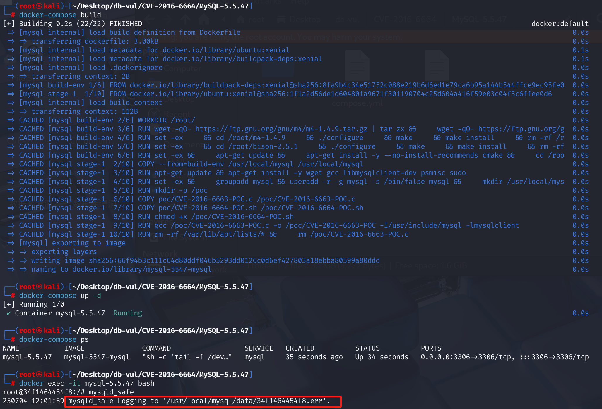
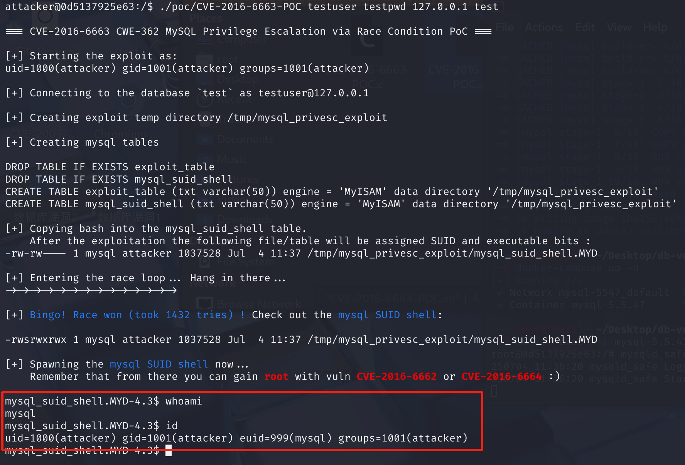
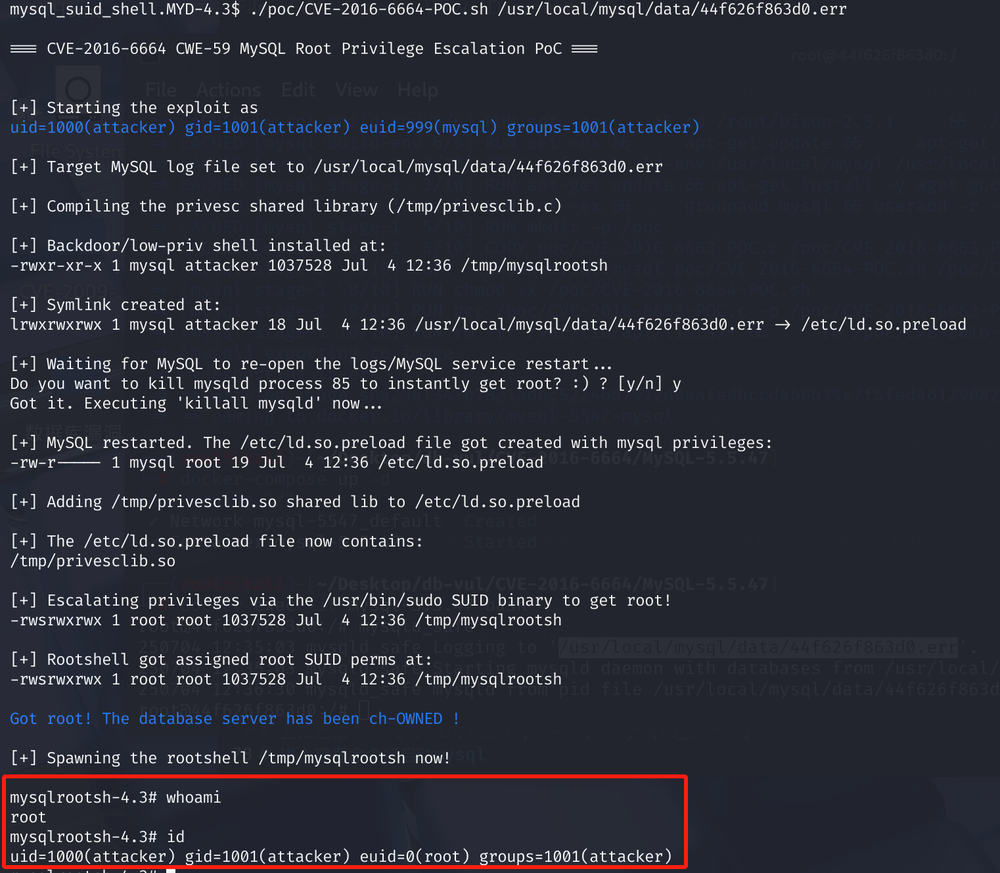

# CVE-2016-6664 CWE-59 MySQL 权限提升

## 漏洞背景

- **基于文件的日志（File-based logging）**：在默认配置下，MySQL 会将错误日志、查询日志、慢查询日志等信息直接写入本地的文件系统中。日志文件通常保存在 MySQL 数据目录中，或者根据 MySQL 配置文件中的 `log-error` 配置项指定的位置。如果日志文件权限设置不当，或者日志文件被攻击者修改，可能会被利用。例如，攻击者可以通过创建符号链接，指向系统中的敏感文件（如 `/etc/ld.so.preload`），然后通过 MySQL 重启触发恶意库的加载，最终提升权限。
- **基于 syslog 的日志（Syslog-based logging）**：`syslog` 是一个系统日志服务，通常用于收集操作系统和应用程序的日志信息，并将其发送到指定的日志服务器或保存在特定的日志文件中。MySQL 支持将日志信息通过 `syslog` 发送，日志将通过系统的 `syslog` 服务来处理，而不是直接写入文件。
- **SUID 位（Set User ID）**：一种特殊的文件权限位，设置后，执行该文件的用户将以文件所有者的权限运行该程序。`sudo` 是一个典型的 SUID 程序，其所有者是 root，并且设置了 SUID 位。这意味着无论哪个用户执行 `sudo`，都会以 root 权限运行。

## 漏洞原理

MySQL 在错误日志处理时没有正确控制文件的权限和访问控制。攻击者可以通过操控错误日志文件（如符号链接到敏感系统文件）并利用系统动态链接库加载机制，注入恶意代码，从而在 MySQL 用户权限下执行恶意操作并提升为 root 权限。

## 漏洞定位

在 **scripts\mysqld_safe.sh** 文件第 **780** 行有一个`while`循环用来监测 Mysql 进程，并在进程失败的情况下执行重启进程。其中的第 **788** 行会在重启过程中，如果发现syslog没有配置记录错误日志文件，则重新创建error log 文件。这段代码的目的是确保 MySQL 在没有配置 syslog 的情况下，仍能正常记录错误信息。

可以看到使用了`touch`创建文件，并且使用`chown`将文件所有者授权给了运行`mysql`进程的用户（通常这个用户是 mysql）。但是缺乏了对符号链接的检查，这导致可以在 `error.log` 文件路径上创建一个符号链接指向其他文件。

```sh
if [ $want_syslog -eq 0 -a ! -f "$err_log" ]; then
  touch "$err_log"               # 创建错误日志文件
  chown $user "$err_log"         # 设置文件所有者为 MySQL 用户
  chmod "$fmode" "$err_log"      # 设置文件权限
fi
```

攻击者删除原有的 MySQL 错误日志文件，并创建一个指向 `/etc/ld.so.preload` 的符号链接。在 Mysql 重启过程中，`mysqld_safe` 脚本会检测错误日志文件。由于新创建了与日志文件同名的符号链接文件，而符号链接指向的文件不存在，所以 Mysql 会认为日志文件不存在，并尝试重新创建。`mysqld_safe`进程通常是以root权限运行的，这使得它有权创建和修改系统级别的文件，如`/etc/ld.so.preload`。

但由于错误日志文件被替换为符号链接，实际创建的是 `/etc/ld.so.preload` 文件，并由 `mysql` 用户拥有。由于 `/etc/ld.so.preload` 文件在 Linux 系统中默认不存在，只有在需要全局预加载特定共享库时，管理员才会创建并配置它。其作用是在系统启动时用于指定预加载的共享库路径，攻击者通过将其指向恶意库文件，可以在系统加载共享库时执行恶意代码。

## 漏洞修复


修复后的代码：

```sh
# Check if the error log file is a symbolic link
if [ $want_syslog -eq 0 -a ! -f "$err_log" -a ! -h "$err_log" ]; then
    if test -w / -o "$USER" = "root"; then
        logdir=`dirname "$err_log"`
        case $logdir in
            /var/log)
                (
                    umask 0137
                    set -o noclobber
                    > "$err_log" && chown $user "$err_log"
                ) ;;
            *) ;;
        esac
    else
        (
            umask 0137
            set -o noclobber
            > "$err_log"
        )
    fi
fi
```


`! -h "$err_log"` 用于检查 `error.log` 是否为符号链接。如果是符号链接，脚本不会重新创建该日志文件，从而避免攻击者借助符号链接覆盖系统文件。

## 影响版本


- MariaDB：5.5.x 低于 5.5.52；10.0.x 低于 10.0.28；10.1.x 低于 10.1.18
- Oracle MySQL：5.5.x 不高于 5.5.51；5.6.x 不高于 5.6.32；5.7.x 不高于 5.7.14
- Percona Server：5.5.x 低于 5.5.51-38.2；5.6.x 低于 5.6.32-78.1；5.7.x 低于 5.7.14-8
- Percona XtraDB Cluster：5.5.x 低于 5.5.41-37.0；5.6.x 低于 5.6.32-25.17；5.7.x 低于 5.7.14-26.17

## 环境搭建

通常，错误日志文件存储路径由 MySQL 配置文件 (`my.cnf`) 中的 `log-error` 选项指定。攻击者如果能够访问到这些日志文件，可能就能够利用这些日志文件的特殊处理漏洞。因此需要求**复现环境**必须是是**基于文件的日志(默认配置)，也就是不能是syslog方式**。

1、在 Docker 项目中，MySQL 版本为 5.5.47，管理员用户为 root，密码为 12345。还创建了一个普通用户 testuser，密码为 testpwd，其具有一个默认数据库 test，通常在安装 MySQL 时自动创建，用于测试目的。

2、在 poc 文件夹下有 poc 文件 CVE-2016-6663-POC.c 、CVE-2016-6664-POC.sh，容器启动后会自动使用 gcc 进行编译为 CVE-2016-6663-POC。

3、启动 Docker 后执行命令`docker exec -it mysql-5.5.47 /bin/bash`进入命令行，再输入命令`mysql_safe`启动 MySQL。

4、可以看到 mysql 的日志文件为 /usr/local/mysql/data/44f626f863d0.err



## 漏洞复现

### 第一步使用CVE-2016-6663将普通用户提升至mysql用户

> **利用过程：**
>
> 1. **创建表**：攻击者在数据库中创建一个表，并执行`REPAIR TABLE`操作。
> 2. **创建符号链接**：在`REPAIR TABLE`操作进行时，攻击者创建一个指向恶意文件的符号链接，替换`.TMD`文件。
> 3. **执行恶意代码**：由于`.TMD`文件指向恶意文件，MySQL在修复过程中会执行该文件，从而实现权限提升。

1、重新在 Docker 文件夹打开命令行并进入容器命令行，新建普通用户 attakcer，并切换到普通用户，查看用户 id。

```bash
docker exec -it mysql-5.5.47 bash
```

```cmd
useradd attacker
su attacker
id
```


2、在attacker用户下，运行 poc 文件，使用普通 mysql 用户 testuser，密码 testpwd，数据库 test。

```cmd
./PoC/CVE-2016-6663-POC testuser testpwd 127.0.0.1 test
```

3、运行后输入whoami命令，可以看到当前 shell 以 `mysql` 用户的权限运行。输入 id 命令可以看到 euid 为 mysql，表示`attacker` 用户现在可以以 `mysql` 用户的身份执行命令。这通常意味着可以访问和修改 MySQL 数据库文件，以及执行其他 `mysql` 用户有权执行的操作。



### 第二步使用CVE-2016-6664将mysql用户提升至系统root用户

> **利用过程：**
>
> 1. **获取 MySQL 用户权限**：通过CVE-2016-6663漏洞获取 `mysql` 用户的权限。
> 2. **创建恶意日志文件**：通过构造一个特殊的错误日志文件，创建一个指向 `/etc/ld.so.preload` 文件的符号链接。该符号链接的目标是 `/etc/ld.so.preload`，它是一个用于加载共享库的系统配置文件。通过将错误日志文件链接到 `/etc/ld.so.preload`，确保当 MySQL 进程重新启动时，`/etc/ld.so.preload` 文件会被 MySQL 自动加载，进而加载恶意共享库。
> 3. **编译恶意共享库**：编写一个 C 语言源代码文件（`privesclib.c`），在该文件中重写 `geteuid()` 函数，目的是在获取到 root 权限时，改变某些关键文件的所有权和权限（如创建一个拥有 root 权限的 SUID shell）。该共享库通过编译生成 `.so` 文件，并在 `/etc/ld.so.preload` 中注入，以便 MySQL 进程重新启动时加载。
> 4. **通过 MySQL 重启执行恶意代码**：触发 MySQL 重启（通过杀死 mysqld 进程），导致 MySQL 重新打开日志文件。当 MySQL 重新加载错误日志时，它会加载 `/etc/ld.so.preload` 中指定的恶意共享库。恶意共享库中的代码修改了后门 shell 文件的权限，允许通过该 shell 获取 root 权限。
> 5. **获取 root 权限**：恶意共享库代码可以通过改变某些文件的权限和所有权（如 `/tmp/mysqlrootsh`）来执行 `root` 权限的操作。通过 SUID（Set User ID）权限提升机制，执行该恶意 shell，从而获得 root 权限。
>

在启动 mysql 服务时可以看到 mysql 的日志文件为 /usr/local/mysql/data/44f626f863d0.err 文件，利用 CVE-2016-6663 漏洞后，在获得的 mysql 用户的命令行中，使用 mysql 的日志文件作为参数运行 CVE-2016-6664 的 poc 文件，执行过程中询问是否终止 mysql 进程，选择 y。

执行完成后进入 shell ，输入命令 whoami 和 id 可以看到成功提取为 root 用户。

```
./PoC/CVE-2016-6664-POC.sh /usr/local/mysql/data/44f626f863d0.err
```



## POC分析

**a. 准备后门 Shell 和共享库**

- **复制后门 Shell**：将合法的 shell（如 `/bin/bash`）复制到 `/tmp/mysqlrootsh`。
- **编写共享库源代码**：创建一个 C 语言源文件 `/tmp/privesclib.c`，重定义 `geteuid()` 函数。当以 `root` 权限执行时，该函数会将 `/tmp/mysqlrootsh` 的所有者更改为 `root`，并设置 SUID 位。
- **编译共享库**：使用 `gcc` 编译上述源文件，生成共享库 `/tmp/privesclib.so`。

**b. 创建符号链接**

- 删除原有的错误日志文件（如 `/var/log/mysql/error.log`）。
- 创建一个符号链接，将错误日志文件指向 `/etc/ld.so.preload`。

**c. 触发日志文件重建**

- 终止 `mysqld` 进程，触发 `mysqld_safe` 脚本的重启机制。
- 在重启过程中，`mysqld_safe` 脚本在检测错误日志文件时，由于创建了符号链接文件，而符号链接指向的文件不存在，所以 Mysql 会认为日志文件不存在，而尝试重新创建。`mysqld_safe`进程通常是以root权限运行的，这使得它有权创建和修改系统级别的文件，如`/etc/ld.so.preload`。由于错误日志文件被替换为符号链接，实际创建的是 `/etc/ld.so.preload` 文件，并由 `mysql` 用户拥。由于 `/etc/ld.so.preload` 文件在 Linux 系统中默认不存在，其作用是在系统启动时用于指定预加载的共享库路径，攻击者通过将其指向恶意库文件，可以在系统加载共享库时执行恶意代码。

**d. 注入共享库**

- 将编译好的共享库路径写入 `/etc/ld.so.preload` 文件。
- 此操作会导致系统在执行任何程序时，首先加载该共享库。

**e. 提升权限**

- 执行一个具有 SUID 权限的二进制文件（如 `/usr/bin/sudo`）。当一个可执行文件设置了 SUID 位时，无论哪个用户执行该文件，都会以该文件所有者的权限运行。执行 `sudo` 命令时，系统会加载 `/etc/ld.so.preload` 文件中的恶意共享库，从而触发权限提升操作。
- 由于共享库中的 `geteuid()` 函数被重定义，当以 `root` 权限执行时，该函数会将 `/tmp/mysqlrootsh` 的所有者更改为 `root`，并设置 SUID 位。
- 此时，攻击者可以通过执行 `/tmp/mysqlrootsh`，获得一个具有 `root` 权限的 shell。

## 参考链接


[mysqld_safe in Oracle MySQL through 5.5.51, 5.6.x through... · CVE-2016-6664 · GitHub Advisory Database](https://github.com/advisories/GHSA-f9x4-3x96-w2vf)

[Vulnerability Reproduction | MySQL privilege escalation vulnerability (CVE-2016-6663 & CVE-2016-6664) combined privilege escalation - Motianlun](https://www.modb.pro/db/104486)

[cve-2016-6664 MySQL Local Privilege Escalation - CSDN Blog](https://blog.csdn.net/whatday/article/details/102856621)

[MySQL Escalation/Conditional Competition Vulnerability Analysis and Exploitation (37)_-CSDN Blog](https://blog.csdn.net/yyj1781572/article/details/130447752?ops_request_misc=%7B%22request%5Fid%22%3A%22baed9dad0f2f0a431b2fd93bd421859e%22%2C%22scm%22%3A%2220140713.130102334..%22%7D&request_id=baed9dad0f2f0a431b2fd93bd421859e&biz_id=0&utm_medium=distribute.pc_search_result.none-task-blog-2~all~sobaiduend~default-2-130447752-null-null.142^v102^pc_search_result_base5&utm_term=cve-2016-6664&spm=1018.2226.3001.4187)
