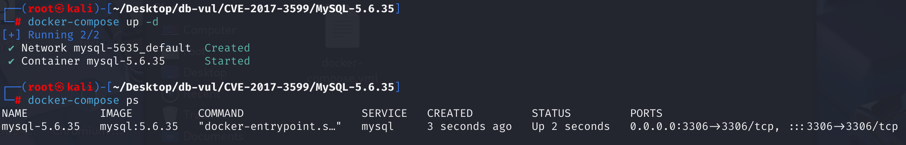
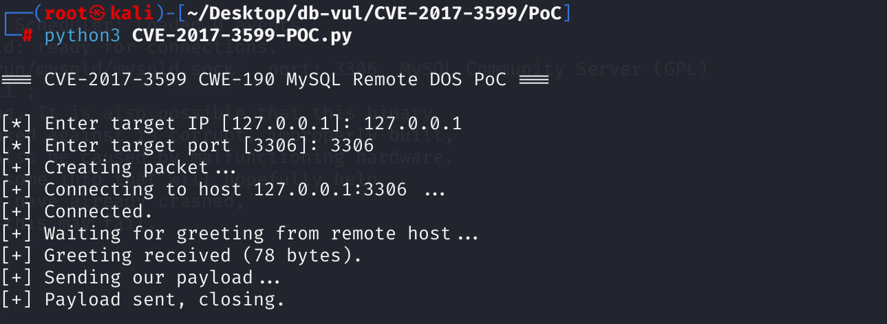
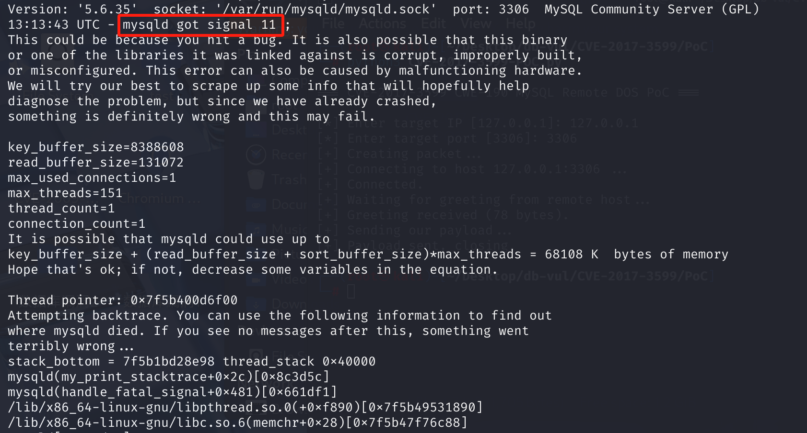

# CVE-2017-3599 CWE-190 MySQL Remote DOS

## Vulnerability Background
- **Pluggable Authentication Mechanism**: MySQL Server supports multiple authentication plugins, allowing users to choose different authentication methods as needed. The pluggable authentication mechanism allows MySQL to flexibly adapt to different security requirements and environments.
- **Authentication Process**: After the client establishes a connection with the MySQL server, the server sends an initial handshake packet to the client. The client constructs and sends the authentication request packet according to the server's instructions. After receiving an authentication request, the server will verify it according to the requirements of the authentication plugin.

## Vulnerability Mechanism
The vulnerability exists in the pluggable authentication subcomponent of the MySQL server and is an integer overflow vulnerability.

- **Authentication Data Processing**: When processing authentication request packets sent by clients, the MySQL server parses the authentication data. Authentication data typically includes information such as passwords or password hash values.
- **Integer Overflow**: During the process of parsing authentication data, there is an issue of integer overflow. Specifically, when the length of authentication data is incorrectly parsed or calculated, it can lead to integer overflow. For example, if the length field of authentication data is set to a very large value but the actual authentication data length is very small, memory access may go out of boundary during subsequent processing.
- **Memory Access Outbounds**: Due to integer overflows causing memory access outbounds, the server may attempt to access invalid memory addresses. This can cause server crashes, enabling remote denial-of-service (DOS) attacks.

Trigger conditions:

- **Authentication Data Length Field**: The length field of authentication data must be set to a very large value to trigger an integer overflow.
- **Certified Data Content**: The content of certified data must meet specific criteria, such as starting with `\xff` or `\xfe` and being less than 8 characters long. This is because these specific values cause specific memory access errors during processing.

## Vulnerability Location
Here, let's take MySQL 5.7.17 as an example

1. After the client connects to the MySQL server, the server sends a greeting message and the client begins the authentication process. The authentication packet sent by the client contains information such as client functions, username, password, etc., which is received by the server and parsed by the `parse_client_handshake_packet()` function at **sql/auth/sql_authentication.cc** at line **1338**. In line 1555, the `get_length_encoded_string` function is used to retrieve passwords from the packet

   ```c
   /* the packet format is described in send_client_reply_packet() */
   static size_t parse_client_handshake_packet(MPVIO_EXT *mpvio,
                                               uchar **buff, size_t pkt_len)
   {
       // ... ...
         passwd= get_length_encoded_string(&end, &bytes_remaining_in_packet,
                                       &passwd_len);
       // ... ...
   }
   ```

2. At line **1527**, define `get_length_encoded_string` functions and call `get_56_lenc_string()` functions (for MySQL 5.6 and earlier) and `get_41_lenc_string()` functions (for MySQL 4.1 and later) in sequence. Both functions are used to parse long-encoded strings, but they are suitable for different versions and scenarios of the MySQL protocol

   ```c
     /*
       When the ability to change default plugin require that the initial password
      field can be of arbitrary size. However, the 41 client-server protocol limits
      the length of the auth-data-field sent from client to server to 255 bytes
      (CLIENT_SECURE_CONNECTION). The solution is to change the type of the field
      to a true length encoded string and indicate the protocol change with a new
      client capability flag: CLIENT_PLUGIN_AUTH_LENENC_CLIENT_DATA.
     */
     get_proto_string_func_t get_length_encoded_string;
   
     if (protocol->has_client_capability(CLIENT_PLUGIN_AUTH_LENENC_CLIENT_DATA))
       get_length_encoded_string= get_56_lenc_string;
     else
       get_length_encoded_string= get_41_lenc_string;
   ```

3. Since the vulnerability exists in MySQL 5.6 and later, analyze the `get_56_lenc_string()` function at line **1239**. The `max_bytes_available` parameter represents the remaining readable bytes in the buffer. The initial value is the number of bytes passed, and the function updates this value based on the parsed string length. After parsing length encoding, subtract the string length and the number of bytes occupied by the length encoding; the final value represents the number of bytes remaining in the buffer after parsing. At line **1265**, the `net_field_length_ll()` function is used to parse length

   ```c
   static
   char *get_56_lenc_string(char **buffer,
                            size_t *max_bytes_available,
                            size_t *string_length)
   {
     static char empty_string[1]= { '\0' };
     char *begin= *buffer;
   
     if (*max_bytes_available == 0)
       return NULL;
   
     /*
       If the length encoded string has the length 0
       the total size of the string is only one byte long (the size byte)
     */
     if (*begin == 0)
     {
       *string_length= 0;
       --*max_bytes_available;
       ++*buffer;
       /*
         Return a pointer to the \0 character so the return value will be
         an empty string.
       */
       return empty_string;
     }
   
     *string_length= (size_t)net_field_length_ll((uchar **)buffer);
   
     DBUG_EXECUTE_IF("sha256_password_scramble_too_long",
                     *string_length= SIZE_T_MAX;
     );
   
     size_t len_len= (size_t)(*buffer - begin);
     
     if (*string_length > *max_bytes_available - len_len)
       return NULL;
   
     *max_bytes_available -= *string_length;
     *max_bytes_available -= len_len;
     *buffer += *string_length;
     return (char *)(begin + len_len);
   }
   ```

4. In the **sql-common/pack.c** file, line **49, `net_field_length_ll()` function, which is used to parse lengths and supports multiple length encoding methods (such as 1 byte, 2 bytes, 3 bytes, or 8 bytes in length). The password field in a packet is defined by two values: password length (1 byte), followed by the actual password field content. This length is calculated by calling the `net_field_length_ll()` function.

   If the buffer sent to the MySQL server points to a length of \xFF, the packet pointer will increase by 9 bytes, and the code can read up to the next 8 bytes to parse the length. If an attacker sends an authentication packet with a password length of \xFE or \xFF and less than 9 bytes after that value (\xFE and \xFF themselves occupy 1 byte), the `net_field_length_ll() ` function will place the pointer outside the variable boundary. The `get_56_lenc_string ` function continues to execute and counts the remaining bytes in the packet.

   When executing max_bytes_available -= len_len, an integer overflow is triggered, where the value of `max_bytes_available` becomes a very large unsigned integer

   ```c
   /* The same as above but returns longlong */
   my_ulonglong net_field_length_ll(uchar **packet)
   {
     uchar *pos= *packet;
     if (*pos < 251) // If the first byte is less than 251, use it directly as the length
     {
       (*packet)++;
       return (my_ulonglong) *pos;
     }
     if (*pos == 251) // If the first byte is 251, return NULL_LENGTH
     {
       (*packet)++;
       return (my_ulonglong) NULL_LENGTH;
     }
     if (*pos == 252) // If the first byte is 252, read the next 2 bytes as the length
     {
       (*packet)+=3;
       return (my_ulonglong) uint2korr(pos+1);
     }
     if (*pos == 253) // If the first byte is 253, read the next 3 bytes as the length
     {
       (*packet)+=4;
       return (my_ulonglong) uint3korr(pos+1);
     }
       If the first byte is 254, read the next 8 bytes as the length
     (*packet)+=9;					/* Must be 254 when here */
     return (my_ulonglong) uint8korr(pos+1);
   }
   ```

## Remediation

Upgrade to Oracle MySQL 5.6.36, 5.7.18, or a later supported release. The patched protocol parser validates authentication-packet lengths and performs size arithmetic in a range that cannot wrap before allocating or copying the client-supplied fields.

Until patched, do not expose port 3306 directly to the Internet; permit connections only from trusted application hosts through a firewall or private network. Connection-rate limits and automatic restart supervision can reduce operational impact, but they do not eliminate the pre-authentication integer-overflow path.

## Affected Versions
5.6.35 and earlier, 5.7.17 and earlier

## Environment Setup
Start the Docker environment, MySQL version 5.6.35



## Vulnerability Reproduction
1. Run the POC code

```bash
python3 CVE-2017-3599-POC.py
```



2. When executing the command line in the container, you can see that the MySQL container is currently not running

```bash
docker-compose ps
```

3. Check the container logs. You can see that when the MySQL server crashes, signal 11 (segment error) is reported, which usually means the MySQL process is trying to access unallocated or inaccessible parts of its memory space.

```bash
docker logs mysql-5.6.35
```



## PoC Analysis
1. Establish a TCP connection with the target database

2. Receiving Server Handshake Packets (Greeting)

3. Construct an authentication package with exceptionally formatted fields; these fields are constructed according to the MySQL login authentication protocol format. The key point is that packet_auth = b' \xff', which is part of the forged authentication data, with length and format not meeting expectations, potentially triggering server-side parsing errors.

   ```python
   packet = packet_cap + packet_max + packet_cset + p_reserved + packet_usr + packet_auth
   packet_len = pack('<I', len(packet))[:3] # Construct a 3-byte field according to the MySQL protocol
   request = packet_len + packet_num + packet
   ```

4. Send the exception packet

5. If the target has the CVE-2017-3599 vulnerability, the MySQL process will crash or stop responding

## References
[CVE-2017-3599 vulnerability reappears | M011y's blog --- CVE-2017-3599 vulnerability reappearing | M011y's Blog](https://yumlii33.github.io/2024/01/14/CVE-2017-3599漏洞复现/)

[SECFORCE - Security without compromise --- SECFORCE - Security without compromise](https://www.secforce.com/blog/pre-auth-mysql-remote-dos-integer-overflow/)
