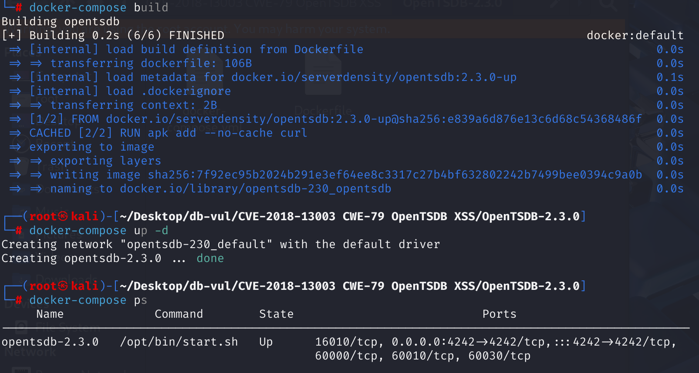
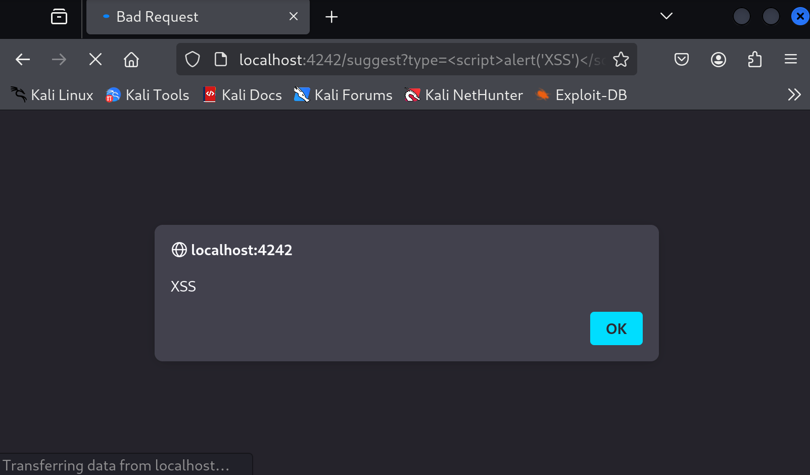

# CVE-2018-13003 CWE-79 OpenTSDB XSS

## Vulnerability Background
- /**suggest**: In OpenTSDB, `/suggest` is an HTTP API endpoint used for queries and providing automatic completion suggestions. It is mainly used to help users quickly construct query statements, especially regarding field names, tags, and other related data involved in the query. Its request parameter `type` is used to specify the type of query suggestion. It can be `metric` (indicator), `tagk` (label key), `tagv` (label value), etc., used to specify the type of suggestion.

## Vulnerability Mechanism
This vulnerability affects `type` parameters of `/suggest` URIs, allowing attackers to execute JavaScript code by injecting malicious scripts. This type of attack is called **Stored XSS**, where malicious code is accepted and stored by the server, and then script execution is triggered when other users access it.

Specifically, these versions did not properly validate or escape input data in `type` parameters, allowing malicious scripts to be injected and executed.

## Vulnerability Location
1. In the **src/tsd/SuggestRpc.java** file, which is the implementation for handling the suggest interface. On line **89**, if the value of the `type` parameter passed in by the user in the URL is not valid, the `BadRequestException` is thrown. The thrown `BadRequestException` triggers `badRequest` method and directly adds the value of the `type` parameter, i.e., the malicious JavaScript code it contains, into the error message

```java
if ("metrics".equals(type)) {
      suggestions = max_results > 0 ? tsdb.suggestMetrics(q, max_results) :
         tsdb.suggestMetrics(q);
    } else if ("tagk".equals(type)) {
      suggestions = max_results > 0 ? tsdb.suggestTagNames(q, max_results) :
         tsdb.suggestTagNames(q);
    } else if ("tagv".equals(type)) {
      suggestions = max_results > 0 ? tsdb.suggestTagValues(q, max_results) :
        tsdb.suggestTagValues(q);
    } else {
      throw new BadRequestException("Invalid 'type' parameter:" + type);
    }
```

2. In the **src/tsd/HttpQuery.java** file, line **393**, the `badRequest` function is used to handle invalid requests sent by the client and generates and sends 400 error responses. Line 430 `exception.getMessage()` directly inserted into the HTML page without any escape. If the `exception.getMessage()` contains user input, attackers can construct malicious input that contains JavaScript code, allowing arbitrary scripts to be executed in the user's browser.

```java
 /**
   * Sends a 400 error page to the client.
   * Handles responses from deprecated API calls
   * @param explain The string describing why the request is bad.
   */
 public void badRequest(final String explain) {
    badRequest(new BadRequestException(explain));
  }
  /**
   * Sends an error message to the client. Handles responses from 
   * deprecated API calls.
   * @param exception The exception that was thrown
   */
  @Override
  public void badRequest(final BadRequestException exception) {
    logWarn("Bad Request on " + request().getUri() + ": " + 
exception.getMessage());
    if (this.api_version > 0) {
      // always default to the latest version of the error formatter since we
      // need to return something
      switch (this.api_version) {
        case 1:
        default:
          sendReply(exception.getStatus(), serializer.formatErrorV1(exception));
      }
      return;
    }
    if (hasQueryStringParam("json")) {
      final StringBuilder buf = new StringBuilder(10 +
          exception.getDetails().length());
      buf.append("{\"err\":\"");
            HttpQuery.escapeJson(exception.getMessage(), buf);
      buf.append("\"}");
      sendReply(HttpResponseStatus.BAD_REQUEST, buf);
    } else {
      sendReply(HttpResponseStatus.BAD_REQUEST,
                makePage("Bad Request", "Looks like it's your fault this time",
                         "<blockquote>"
                         + "<h1>Bad Request</h1>"
                         + "Sorry but your request was rejected as being"
                         + " invalid.<br/><br/>"
                         + "The reason provided was:<blockquote>"
                         + exception.getMessage()
                         + "</blockquote></blockquote>"));
    }
  }
```

## Remediation

Upgrade from OpenTSDB 2.3.0 to a later maintained release and ensure the HTTP UI encodes the `type` and other query parameters for the exact HTML or JavaScript context in which they are rendered. Construct responses with text-safe template or DOM APIs instead of concatenating raw request values.

Until upgraded, restrict the web interface to trusted users, block requests containing markup in the affected parameters at a reverse proxy, and deploy a restrictive Content Security Policy that disallows inline scripts. Input filtering and CSP are defense-in-depth measures; correct output encoding is still required.

## Affected Versions
OpenTSDB<= 2.3.0

## Environment Setup
Start the Docker environment, OpenTSDB version 2.3.0, visit `http://localhost:4242/api/version` to check the version



## Vulnerability Reproduction
Send a request to the following URL, which will trigger a JavaScript pop-up on the returned webpage, indicating that the XSS vulnerability has been successfully triggered.

```http
http://localhost:4242/suggest?type=<script>alert('XSS')</script>
```



## PoC Analysis

```http
http://localhost:4242/suggest?type=<script>alert('XSS')</script>
```

This URL initiates a GET request that accesses the `/suggest` path of the OpenTSDB service and contains a parameter `type` with a value of `<script>alert('XSS')</script>`. This request will trigger a JavaScript pop-up on the returned webpage, indicating that the XSS vulnerability has been successfully triggered.

## References
[OpenTSDB Cross-site Scripting vulnerability · CVE-2018-13003 · GitHub Advisory Database](https://github.com/advisories/GHSA-86vm-8m4p-6263)
