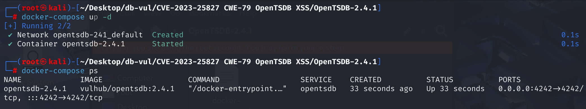
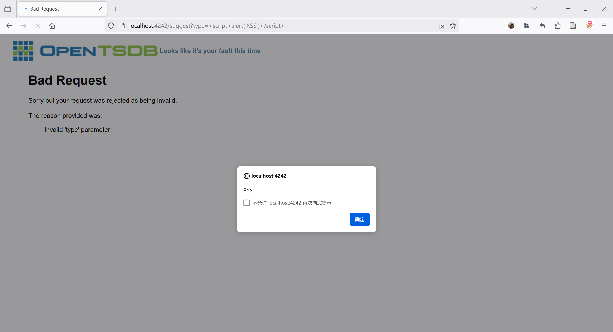

# CVE-2023-25827 CWE-79 OpenTSDB XSS

## Vulnerability Background
- In OpenTSDB's log configuration, the `level` parameter of the `/logs` interface is used to specify the severity level of log messages

## Vulnerability Mechanism
When OpenTSDB's `/logs` interface receives a request and processes `level` parameters, if the value of `level` parameter is illegal or causes an error, the server will generate an error message. However, when generating error messages, the server does not adequately escape the values of `level` parameters, and malicious JavaScript code is directly included in the error messages, allowing arbitrary scripts to be executed in the user's browser. The root cause of this issue is the same as [CVE-2018-13003](https://github.com/advisories/GHSA-86vm-8m4p-6263), which is a reflexive XSS vulnerability in the recommended endpoint.

1. **Parameter Reflection**: OpenTSDB's HTTP query API and logging endpoint reflect user-entered parameter values back into error messages. For example, when a user's request contains illegal parameters, the server will generate an error message containing the parameter values entered by the user.
2. **Insufficient parameter validation**: When user input parameters are included in error messages, they are not adequately validated and escaped. This means attackers can construct special parameter values that contain malicious JavaScript code.

## Vulnerability Location
1. In the **src/tsd/HttpQuery.java** file, line **349**, `internalError` function is used to handle internal server errors, generating and sending 500 error responses. In line **383**, `pretty_exc` variable is inserted directly into the HTML page without any escaping. If the `pretty_exc` contains user input (for example, through certain reflection mechanisms or the exposure of error messages), attackers can construct malicious input to make the `pretty_exc` contain JavaScript code, thereby executing arbitrary scripts in the user's browser

```java
  /**
   * Sends a 500 error page to the client.
   * Handles responses from deprecated API calls as well as newer, versioned
   * API calls
   * @param cause The unexpected exception that caused this error.
   */
public void internalError(final Exception cause) {
    logError("Internal Server Error on " + request().getUri(), cause);

    if (this.api_version > 0) {
      // always default to the latest version of the error formatter since we
      // need to return something
      switch (this.api_version) {
        case 1:
        default:
          sendReply(HttpResponseStatus.INTERNAL_SERVER_ERROR,
              serializer.formatErrorV1(cause));
      }
      return;
    }

    ThrowableProxy tp = new ThrowableProxy(cause);
    tp.calculatePackagingData();
    final String pretty_exc = ThrowableProxyUtil.asString(tp);
    tp = null;
    if (hasQueryStringParam("json")) {
      // 32 = 10 + some extra space as exceptions always have \t's to escape.
      final StringBuilder buf = new StringBuilder(32 + pretty_exc.length());
      buf.append("{\"err\":\"");
      HttpQuery.escapeJson(pretty_exc, buf);
      buf.append("\"}");
      sendReply(HttpResponseStatus.INTERNAL_SERVER_ERROR, buf);
    } else {
      sendReply(HttpResponseStatus.INTERNAL_SERVER_ERROR,
                makePage("Internal Server Error", "Houston, we have a problem",
                         "<blockquote>"
                         + "<h1>Internal Server Error</h1>"
                         + "Oops, sorry but your request failed due to a"
                         + " server error.<br/><br/>"
                         + "Please try again in 30 seconds.<pre>"
                         + pretty_exc
                         + "</pre></blockquote>"));
    }
  }
```

2. In the **src/tsd/HttpQuery.java** file, line **393**, `badRequest` function is used to handle invalid requests sent by the client and generate and send 400 error responses. The **430** line is `exception.getMessage()` directly inserted into the HTML page without any escape. If the `exception.getMessage()` contains user input, attackers can construct malicious input containing JavaScript code to execute arbitrary scripts in the user's browser.

```java
  /**
   * Sends a 400 error page to the client.
   * Handles responses from deprecated API calls
   * @param explain The string describing why the request is bad.
   */
public void badRequest(final String explain) {
    badRequest(new BadRequestException(explain));
  }

  /**
   * Sends an error message to the client. Handles responses from 
   * deprecated API calls.
   * @param exception The exception that was thrown
   */
  @Override
  public void badRequest(final BadRequestException exception) {
    logWarn("Bad Request on " + request().getUri() + ": " + exception.getMessage());
    if (this.api_version > 0) {
      // always default to the latest version of the error formatter since we
      // need to return something
      switch (this.api_version) {
        case 1:
        default:
          sendReply(exception.getStatus(), serializer.formatErrorV1(exception));
      }
      return;
    }
    if (hasQueryStringParam("json")) {
      final StringBuilder buf = new StringBuilder(10 +
          exception.getDetails().length());
      buf.append("{\"err\":\"");
      HttpQuery.escapeJson(exception.getMessage(), buf);
      buf.append("\"}");
      sendReply(HttpResponseStatus.BAD_REQUEST, buf);
    } else {
      sendReply(HttpResponseStatus.BAD_REQUEST,
                makePage("Bad Request", "Looks like it's your fault this time",
                         "<blockquote>"
                         + "<h1>Bad Request</h1>"
                         + "Sorry but your request was rejected as being"
                         + " invalid.<br/><br/>"
                         + "The reason provided was:<blockquote>"
                         + exception.getMessage()
                         + "</blockquote></blockquote>"));
    }
  }
```

3. The method `execute` at line **37** of the **src/tsd/LogsRpc.java** file is the main way to handle `/logs` requests, where `Level.toLevel` method is used to convert the value of `level` parameters into `Level` Target. At line **50**, if the conversion fails (i.e., the value of the `level` parameter is not valid log level), a `BadRequestException` is thrown. The `BadRequestException` thrown triggers the `badRequest` method and restores the value in the `level`, i.e., the malicious content JavaScript code is directly added to the error message. Error messages `exception.getMessage()` are inserted directly into the HTML page without any HTML escaping.

```java
public void execute(final TSDB tsdb, final HttpQuery query) 
    throws JsonGenerationException, IOException {
    LogIterator logmsgs = new LogIterator();
    if (query.hasQueryStringParam("json")) {
      ArrayList<String> logs = new ArrayList<String>();
      for (String log : logmsgs) {
        logs.add(log);
      }
      query.sendReply(JSON.serializeToBytes(logs));
    } else if (query.hasQueryStringParam("level")) {
      final Level level = Level.toLevel(query.getQueryStringParam("level"),
                                        null);
      if (level == null) {
        throw new BadRequestException("Invalid level: "
                                      + query.getQueryStringParam("level"));
      }
      final Logger root =
        (Logger) LoggerFactory.getLogger(Logger.ROOT_LOGGER_NAME);
      String logger_name = query.getQueryStringParam("logger");
      if (logger_name == null) {
        logger_name = Logger.ROOT_LOGGER_NAME;
      } else if (root.getLoggerContext().exists(logger_name) == null) {
        throw new BadRequestException("Invalid logger: " + logger_name);
      }
      final Logger logger = (Logger) LoggerFactory.getLogger(logger_name);
      int nloggers = 0;
      if (logger == root) {  // Update all the loggers.
        for (final Logger l : logger.getLoggerContext().getLoggerList()) {
          l.setLevel(level);
          nloggers++;
        }
      } else {
        logger.setLevel(level);
        nloggers++;
      }
      query.sendReply("Set the log level to " + level + " on " + nloggers
                      + " logger" + (nloggers > 1 ? "s" : "") + ".\n");
    } else {
      final StringBuilder buf = new StringBuilder(512);
      for (final String logmsg : logmsgs) {
        buf.append(logmsg).append('\n');
      }
      logmsgs = null;
      query.sendReply(buf);
    }
  }
```

**Fix:**

HTML escapes for exception and error messages in the `internalError` and `badRequest` functions, respectively

## Remediation

Apply upstream commit `fa88d3e4b5369f9fb73da384fab0b23e246309ba` or upgrade to a release that contains it. The corrected `HttpQuery` error path HTML-encodes the exception text and other request-derived values before inserting them into a browser response, so `pretty_exc` cannot create script elements or event-handler attributes.

Until patched, prevent untrusted users from accessing the logs/error UI, suppress detailed exception pages, and return a static error response from a reverse proxy. A restrictive Content Security Policy without `unsafe-inline` provides additional protection but does not replace output encoding.

## Affected Versions
OpenTSDB <= 2.4.1

## Environment Setup
Start the Docker environment, OpenTSDB version 2.4.1



## Vulnerability Reproduction
Using the `/logs`'s `level` parameters, access the following URL and a pop-up appears

```http
http://localhost:4242/logs?level=%3Cscript%3Ealert(%27XSS%27)%3C/script%3E
```



## PoC Analysis

```http
http://localhost:4242/logs?level=<script>alert('XSS')</script>
```

This URL sends a request to OpenTSDB's `/logs` interface, attempting to set the log level to `<script>alert('XSS')</script>`. Since the value of the `level` parameter is not a valid log level, the server will return an error response indicating the parameter is invalid. The javascrip code contained inside will not be escaped, so the code will be executed in the user's browser

## References
[New OpenTSDB vulnerability discovered by Black Duck CyRC | Black Duck Blog --- New OpenTSDB Vulnerabilities Discovered by Black Duck CyRC | Black Duck Blog](https://www.blackduck.com/blog/opentsdb.html)

[Cross-site scripting in OpenTSDB · CVE-2023-25827 Vulnerability · GitHub Advisory Database --- Cross Site Scripting in OpenTSDB · CVE-2023-25827 · GitHub Advisory Database](https://github.com/advisories/GHSA-9chv-3w6c-jq9w)

[Fix for #2269 and #2267 XSS vulnerability. · OpenTSDB/opentsdb@fa88d3e](https://github.com/OpenTSDB/opentsdb/commit/fa88d3e4b5369f9fb73da384fab0b23e246309ba)
