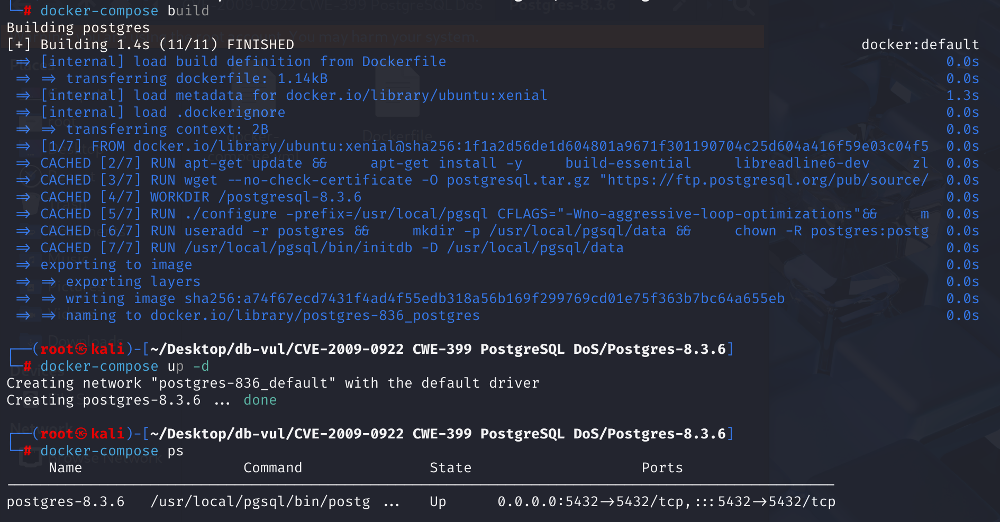
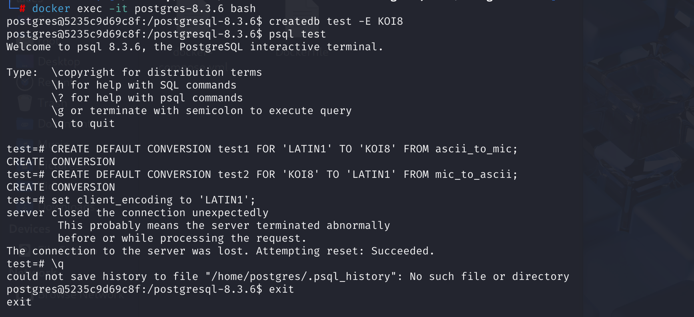
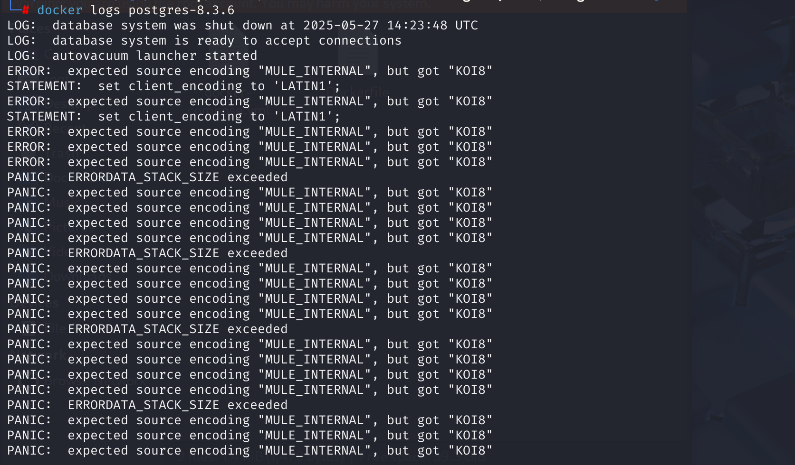
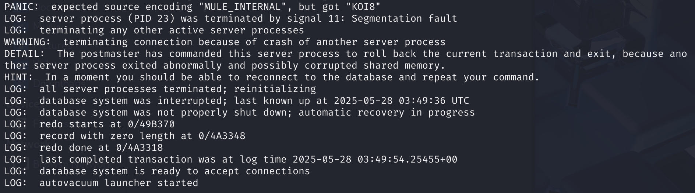

# CVE-2009-0922 CWE-399 PostgreSQL DoS

## Vulnerability Background
- **Recursion errors causing stack overflow**: If an error occurs again during recursion (for example, error reports also require encoding conversion), it triggers new errors and pushes them onto the stack. Without effective limiting measures, stacks may exceed maximum depth, causing the system to enter a `PANIC` state and crash.
- **PANIC State:** In PostgreSQL, the `PANIC` state is the most severe error state, usually triggered by unrecoverable situations such as exhausted system resources, hardware failures, or internal software errors. When entering `PANIC` state, the system immediately terminates the current operation, cleans up resources, and logs error messages. At the same time, related processes or entire database systems may be terminated to prevent further spread of errors or cause greater damage.
- **LATIN1, KOI8, and MULE_INTERNAL:** `LATIN1` and `KOI8` are two different single-byte encodings, each used in different language environments. When data exchange is needed between them, PostgreSQL performs encoding conversion. As an internal encoding, `MULE_INTERNAL` uses MULE_INTERNAL encoding by default, which may require conversion to other encodings (including `LATIN1` and `KOI8`) to transfer text data between different systems or components.

## Vulnerability Mechanism
 PostgreSQL improperly handles client-side encoding transformations when handling error messages. When system error messages need to be converted to client-specified encoding, using error (mismatch) transformation functions may cause stack overflow and server crashes. In PostgreSQL's error handling mechanism, if an error occurs again during the process, the system will attempt recursive processing, but if the recursion depth exceeds `ERRORDATA_STACK_SIZE`, a PANIC error will be triggered and the process will be terminated.

**CWE-399 Resource Management Error --> DoS**

**User Information Requiring "Create Database" Permission --> Causes DoS Attacks** 

## Vulnerability Location
1. In the src \backend \commands \conversioncmds .c file, line 38 of the `CreateConversionCommand` function is used to create a conversion. It handles `CREATE CONVERSION` SQL commands used to define conversions between character encodings. In line 93, when the `ConversionCreate` function is called to create a transformation, the compatibility of the conversion function is not checked, meaning it is not verified whether the conversion function can correctly perform the conversion from source code to target encoding. This allows attackers to create incompatible transformation functions, causing recursive errors and server crashes when the server tries to use it to handle error messages. When an error occurs, PostgreSQL calls the `errstart` function to start handling the error, record error data, and track the function.

   ```c
   /*
    * CREATE CONVERSION
    */
   void
   CreateConversionCommand(CreateConversionStmt *stmt)
   {
   	Oid			namespaceId;
   	char	   *conversion_name;
   	AclResult	aclresult;
   	int			from_encoding;
   	int			to_encoding;
   	Oid			funcoid;
   	const char *from_encoding_name = stmt->for_encoding_name;
   	const char *to_encoding_name = stmt->to_encoding_name;
   	List	   *func_name = stmt->func_name;
   	static Oid	funcargs[] = {INT4OID, INT4OID, CSTRINGOID, INTERNALOID, INT4OID};
   
   	/* Convert list of names to a name and namespace */
   	namespaceId = QualifiedNameGetCreationNamespace(stmt->conversion_name,
   													&conversion_name);
   
   	/* Check we have creation rights in target namespace */
   	aclresult = pg_namespace_aclcheck(namespaceId, GetUserId(), ACL_CREATE);
   	if (aclresult != ACLCHECK_OK)
   		aclcheck_error(aclresult, ACL_KIND_NAMESPACE,
   					   get_namespace_name(namespaceId));
   
   	/* Check the encoding names */
   	from_encoding = pg_char_to_encoding(from_encoding_name);
   	if (from_encoding < 0)
   		ereport(ERROR,
   				(errcode(ERRCODE_UNDEFINED_OBJECT),
   				 errmsg("source encoding \"%s\" does not exist",
   						from_encoding_name)));
   
   	to_encoding = pg_char_to_encoding(to_encoding_name);
   	if (to_encoding < 0)
   		ereport(ERROR,
   				(errcode(ERRCODE_UNDEFINED_OBJECT),
   				 errmsg("destination encoding \"%s\" does not exist",
   						to_encoding_name)));
   
   	/*
   	 * Check the existence of the conversion function. Function name could be
   	 * a qualified name.
   	 */
   	funcoid = LookupFuncName(func_name, sizeof(funcargs) / sizeof(Oid),
   							 funcargs, false);
   
   	/* Check we have EXECUTE rights for the function */
   	aclresult = pg_proc_aclcheck(funcoid, GetUserId(), ACL_EXECUTE);
   	if (aclresult != ACLCHECK_OK)
   		aclcheck_error(aclresult, ACL_KIND_PROC,
   					   NameListToString(func_name));
   
   	/*
   	 * All seem ok, go ahead (possible failure would be a duplicate conversion
   	 * name)
   	 */
   	ConversionCreate(conversion_name, namespaceId, GetUserId(),
   					 from_encoding, to_encoding, funcoid, stmt->def);
   }
   ```

2. In the src \backend \utils \error \elog .c file, line 166 of the `errstart` function is used to handle error reports, initializing the error stack and preparing the error handling flow. When an error occurs, PostgreSQL calls the `errstart` function to start handling the error and record the error data. At line 289, this code records the current error message in the `errordata` array. **If the problem lies in the conversion function (PoC error occurs because the conversion function between the system's default encoding and the database's specified encoding is not set), then during the error reporting process, the error information also needs to be converted into encoding, which will call the conversion function again and cause recursive errors. **In `errstart`, if the stack depth exceeds `ERRORDATA_STACK_SIZE`, a stack overflow is triggered and the state enters a **PANIC** state. This state causes database processes to crash, thereby disconnecting the client from the database connection.

   ```c
   bool
   errstart(int elevel, const char *filename, int lineno,
   		 const char *funcname)
   {
       // ...
       
       289 lines
   	/* Initialize data for this error frame */
   	edata = &errordata[errordata_stack_depth];
   	MemSet(edata, 0, sizeof(ErrorData));
       
       // ...
   }
   ```

## Remediation
Before calling the `ConversionCreate` function in the conversioncmds.c file to create a transformation, a `OidFunctionCall5` function is added to verify the conversion function. Before calling the conversion function, the system will verify whether it is handled correctly by calling the function and passing an empty string.

```c
/*
 * Check that the conversion function is suitable for the requested
 * source and target encodings. We do that by calling the function with
 * an empty string; the conversion function should throw an error if it
 * can't perform the requested conversion.
 */
OidFunctionCall5(funcoid,
                 Int32GetDatum(from_encoding),
                 Int32GetDatum(to_encoding),
                 CStringGetDatum(""),
                 CStringGetDatum(result),
                 Int32GetDatum(0));
```

Additionally, in the elog.c file, a `push_errordata` function is added before pushing error data to check stack depth. If the stack depth exceeds `ERRORDATA_STACK_SIZE`, it terminates and triggers a `PANIC` error.

```c
static ErrorData *
push_errordata(void)
{
    if (++errordata_stack_depth >= ERRORDATA_STACK_SIZE)
    {
        if (errordata[ERRORDATA_STACK_SIZE - 1].elevel >= PANIC)
        {
            ImmediateInterruptOK = false;
            fflush(stdout);
            fflush(stderr);
            abort();
        }
        errordata_stack_depth = -1; /* make room on stack */
        ereport(PANIC, (errmsg_internal("ERRORDATA_STACK_SIZE exceeded")));
    }
    return &errordata[errordata_stack_depth];
}

```

## Affected Versions
PostgreSQL below 8.3.7, 8.2.13, 8.1.17, 8.0.21, and 7.4.25 

## Environment Setup
The bundled environment runs the affected PostgreSQL release with the database initialized and reachable through the default PostgreSQL client. Confirm the exact server version before executing the PoC because later releases contain the arithmetic correction.



## Vulnerability Reproduction
1. Enter the container command line

```bash
docker exec -it postgres-8.3.6 bash
```

2. Create a new database named `test` and specify its code as KOI8. `-E KOI8` parameter ensures the database is encoded at `KOI8`, meaning all character data in the database is stored using `KOI8` encoding.

```bash
createdb test -E KOI8
```

3. Connect to the newly created `test` database and enter its interactive terminal

```bash
psql test
```

4. Create a default conversion named "test1". Its function is to convert from LATIN1 encoding to KOI8 encoding, and the conversion function is specified as ascii_to_mic. With such conversion, text data can be switched between different encodings, allowing data stored and read in different encoding environments to be properly displayed and processed. At the same time, a default conversion called "test2" is created to convert from KOI8 encoding to LATIN1 encoding. The conversion function is set to mic_to_ascii, and its purpose is to enable mutual conversion between different encoded text data.

```bash
CREATE DEFAULT CONVERSION test1 FOR 'LATIN1' TO 'KOI8' FROM ascii_to_mic;

CREATE DEFAULT CONVERSION test2 FOR 'KOI8' TO 'LATIN1' FROM mic_to_ascii; 
```

5. Set the client's encoding to LATIN1. Client encoding determines the character encoding format used for data transmission between applications and databases. Setting appropriate client encoding ensures that data sent from the client to the database and back from the database is consistent in character encoding, avoiding garbled text and similar issues. You can see the server unexpectedly shut down the connection.

```bash
set client_encoding to 'LATIN1';
```



6. Checking the container logs, you can see multiple `ERROR: expected source encoding "MULE_INTERNAL", but got "KOI8"` appears, indicating that during database operations, the server's expected source code is `MULE_INTERNAL`, but the actual code obtained is `KOI8`. This is usually caused by a mismatch between the client's request encoding and the server's internal encoding.

At the same time, `PANIC: ERRORDATA_STACK_SIZE exceeded` repeatedly appears in the logs, indicating that during error processing, the depth of the error stack exceeds the system-set limit (`ERRORDATA_STACK_SIZE`). This is usually caused by errors in infinite recursion. Each error handling process triggers new errors, causing the stack to grow continuously, eventually exhausting stack space and putting the database server into a PANIC state.



Afterwards, the log shows that the database server process was terminated (`LOG: server process (PID 23) was terminated by signal 11`) due to a segment error (`Segmentation fault`). Subsequently, the system terminates other active server processes and attempts to reinitialize the database system. This indicates that the entire database instance crashed due to previous errors and required a restart to restore normal service.



## PoC Analysis

```sql
set client_encoding to 'LATIN1';
```

This command sets the client's encoding to LATIN1. At this point, the client will attempt to exchange data with the database using LATIN1 encoding. However, the database itself is encoded KOI8, which leads to the need for encoding conversion between the client and the database. The client encodes LATIN1, and when sending data, PostgreSQL needs to convert the data encoded in LATIN1 into KOI8 encoding, or vice versa.

The POC only creates conversions between `LATIN1` and `KOI8`, but **no conversion functions for `MULE_INTERNAL` to `LATIN1` or `KOI8`** are created. When handling encoding conversion, PostgreSQL uses `MULE_INTERNAL` as its internal encoding format by default. Due to the lack of valid conversion settings, ** the system will report errors. If you attempt to convert again during error handling (for example, encoding error information), it will cause recursive errors. **

## References
[PostgreSQL: Error #4680: If an incorrect (mismatching) transformation function is used, the server crashes](https://www.postgresql.org/message-id/200902271040.n1RAeiMG071835@wwwmaster.postgresql.org)

[PostgreSQL prior to 8.3.7, 8.2.13, 8.1.17, 8.0.21, and 7.4. CVE-2009-0922 Vulnerability · GitHub Advisory Database](https://github.com/advisories/GHSA-fj47-2vxw-632j)

[PostgreSQL: Re: BUG #4680: Server crashed if using wrong (mismatch) conversion functions](https://www.postgresql.org/message-id/49A7D92A.7080808@enterprisedb.com)
