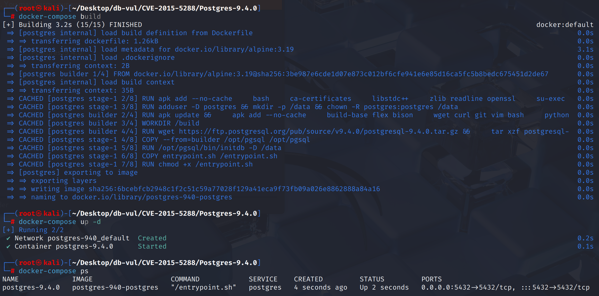
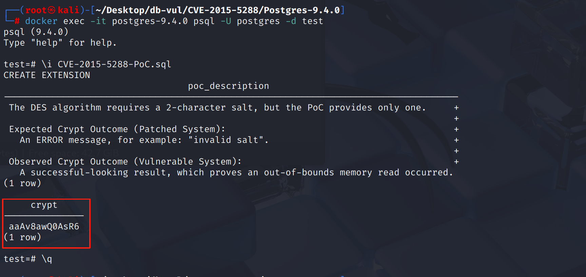

# CVE-2015-5288 CWE-200 PostgreSQL information leak

## Vulnerability Background
- **PostgreSQL**:P ostgreSQL is an open-source, powerful object-relational database management system widely used in web development, data analysis, and enterprise-level applications. It supports ACID transactions, complex queries, full-text searches, and Multi-Version Concurrency Control (MVCC), ensuring high concurrency and data consistency. PostgreSQL offers extensibility, allowing users to customize data types, functions, and indexes, and also supports JSON and geospatial data.
- **pgcrypto Component:** A cryptographic extension module provided by PostgreSQL supporting symmetric encryption, asymmetric encryption, hash functions, and digital signatures, commonly used for encrypted data storage and transmission security. In `pgcrypto`, users can use functions such as `pgp_pub_encrypt`, `pgp_pub_decrypt`, `digest` to encrypt, decrypt, and summarize data. It supports multiple algorithms (such as AES, RSA, SHA series, etc.), and is widely used for data protection in security-sensitive scenarios. When OpenSSL support is not enabled, it uses its built-in large number computing library `imath`.
- **Salt:** A randomly generated value usually used with passwords for encryption to enhance password security. The main function of salt is to prevent rainbow table attacks (which reverse crack passwords by precomputed hash values) and the problem of identical hash values for the same password. Each user's password is assigned a unique salt value, so the generated hash value will differ, even if multiple users use the same password. This makes it difficult for attackers to recover passwords even if they are leaked, significantly enhancing system security.

## Vulnerability Mechanism
In PostgSQL's contrib/pgcrypto module, the `crypt()` function does not check the length of the `salt` string passed. When an "overly short" salt is passed, underlying cryptographic functions (such as DES and Blowfish) attempt to read data beyond its boundaries from the string, causing the database to crash or leak memory.

## Vulnerability Location
Analysis of PostgreSQL 9.4.0 source code:

In the contrib \pgcrypto \crypt-des.c file, line 649** of the `px_crypt_des` function is used in PostgreSQL's pgcrypto extension to execute DES (Data Encryption Standard) algorithm cryptographic hashes. XDES encryption expects a 9-character salt compared to traditional DES Encryption expects a 2-character salt.

Lines **687** and **690** are used to handle the output of XDES encryption, directly accessing `setting[0-8]`. If an attacker provides a salt of less than 9 lengths, the `for` loop will read data outside the string's own memory when trying to read `setting[8]`.

Lines **733** and **740** are used to handle DES encryption output, directly accessing `setting[1]` and `setting[0]`. If the `setting` string passed by the user is only one character (for example, `'a'`), its memory layout is `{'a', '\0'}`. `setting[0]` will successfully read `'a'`. `setting[1]` then accesses the position after the empty terminator `\0` at the end of the string, which leads to an unknown adjacent memory region and a **out-of-bounds read**. The random byte obtained is used for `salt` calculations.

```cpp
// crypt-des.c file contains 649 lines
char *px_crypt_des(const char *key, const char *setting)
{
    // ...
	
#ifndef DISABLE_XDES
	if (*setting == _PASSWORD_EFMT1)
	{
		/*
		 * "new"-style: setting - underscore, 4 bytes of count, 4 bytes of
		 * salt key - unlimited characters
		 */
		for (i = 1, count = 0L; i < 5; i++)
			count |= ascii_to_bin(setting[i]) << (i - 1) * 6;

		for (i = 5, salt = 0L; i < 9; i++)
			salt |= ascii_to_bin(setting[i]) << (i - 5) * 6;

		while (*key)
		{
			/*
			 * Encrypt the key with itself.
			 */
			if (des_cipher((char *) keybuf, (char *) keybuf, 0L, 1))
				return (NULL);

			/*
			 * And XOR with the next 8 characters of the key.
			 */
			q = (uint8 *) keybuf;
			while (q - (uint8 *) keybuf - 8 && *key)
				*q++ ^= *key++ << 1;

			if (des_setkey((char *) keybuf))
				return (NULL);
		}
		strncpy(output, setting, 9);

		/*
		 * Double check that we weren't given a short setting. If we were, the
		 * above code will probably have created weird values for count and
		 * salt, but we don't really care. Just make sure the output string
		 * doesn't have an extra NUL in it.
		 */
		output[9] = '\0';
		p = output + strlen(output);
	}
	else
#endif   /* !DISABLE_XDES */
	{
		/*
		 * "old"-style: setting - 2 bytes of salt key - up to 8 characters
		 */
		count = 25;

		salt = (ascii_to_bin(setting[1]) << 6)
			| ascii_to_bin(setting[0]);

        // 733 Line ************************* Vulnerability Points *******************
		output[0] = setting[0];

		// 740 lines ************************* vulnerability points*******************
		output[1] = setting[1] ? setting[1] : output[0];

		p = output + 2;
	}
	setup_salt(salt);

	// ...
}

```

## Remediation

Upgrade to PostgreSQL 9.4.5, 9.3.10, 9.2.14, 9.1.19, 9.0.23, or a later release on the corresponding branch.
`pgcrypto`'s `crypt()` function incorporates strict input validation to ensure that the "salt" provided by users meets the minimum requirements of the underlying encryption algorithm before being passed to it.

In the px-crypt.c file, when handling XDES (extending DES, starting with `_`), a check for salt lengths of 9 characters has been added. When handling traditional DES, a check was added to ensure the salt length must be 2 characters.

```cpp
/*
		 * "new"-style: setting must be a 9-character (underscore, then 4
		 * bytes of count, then 4 bytes of salt) string. See CRYPT(3) under
		 * the "Extended crypt" heading for further details.
		 *
		 * Unlimited characters of the input key are used. This is known as
		 * the "Extended crypt" DES method.
		 *
		 */
		if (strlen(setting) < 9)
			ereport(ERROR,
					(errcode(ERRCODE_INVALID_PARAMETER_VALUE),
					 errmsg("invalid salt")));`
            
            
            
        /*
		 * "old"-style: setting - 2 bytes of salt key - only up to the first 8
		 * characters of the input key are used.
		 */
		count = 25;

		if (strlen(setting) < 2)
			ereport(ERROR,
					(errcode(ERRCODE_INVALID_PARAMETER_VALUE),
					 errmsg("invalid salt")));
```

## Affected Versions
**Affected version:** PostgreSQL:

-  ~ to 9.0.18
- 9.1.0 to 9.1.14
- 9.2.0 to 9.2.9
- 9.3.0 to 9.3.5
- 9.4.0 to 9.4.0

**Impact Component:** `contrib/pgcrypto` module.

## Environment Setup
Start the Docker environment, PostgreSQL version 9.4.0, administrator postgres, password postgres, database test already exists.

Build and install `contrib/pgcrypto` extensions simultaneously.

```txt
NIST:NVD   Base Score: 6.4 MEDIUM   Vector:(AV:N/AC:L/Au:N/C:P/I:N/A:P)
```

```txt
cpe:2.3:a:postgresql:postgresql:9.4.0:*:*:*:*:*:*:*
```



## Vulnerability Reproduction
1. Use Postgres user identity to connect to the PostgreSQL database test in the container.

   ```bash
   docker exec -it postgres-9.4.0 psql -U postgres -d test
   ```

2. Execute PoC code. Since `crypt()`'s DES mode requires a 2-byte salt, the PoC only provides 1 byte. However, it reads the next byte immediately after it from memory, treats this byte as the second character of the salt, outputs the result, and causes information leakage.

   ```postgresql
   \i CVE-2015-5288-PoC.sql
   ```

   3. Enter \q to exit the container.

   

## PoC Analysis

```sql
CREATE EXTENSION pgcrypto;

SELECT crypt('password', 'a');
```

`crypt()` DES mode requires a 2-byte salt, and this SELECT statement only provides 1 byte (`'a'`). But the code does not check the length; it receives `'a'`, then **continues reading the next byte immediately after it from memory**, treating this byte as the second character of the salt. Regions of memory that shouldn't be read are read and used for computation. Repeatedly calling this function may expose different memory bytes.

## References
[NVD - CVE-2015-5288](https://nvd.nist.gov/vuln/detail/CVE-2015-5288)

[pgcrypto: Detect and report too-short crypt() salts. · postgres/postgres@1d812c8](https://github.com/postgres/postgres/commit/1d812c8b059d0b9b1fba4a459c9876de0f6259b6#diff-7cdd4dba2f606745d5674271052e6879cb4c0d7468ee921d3d961fcb682885e8)
