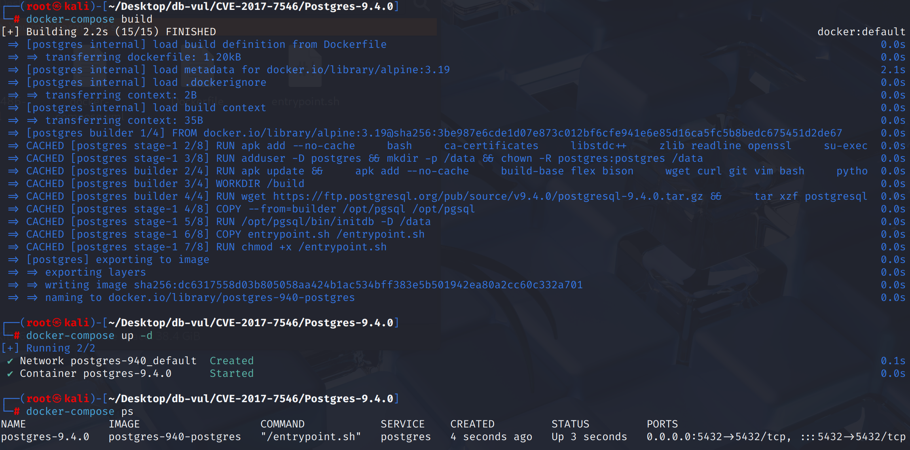
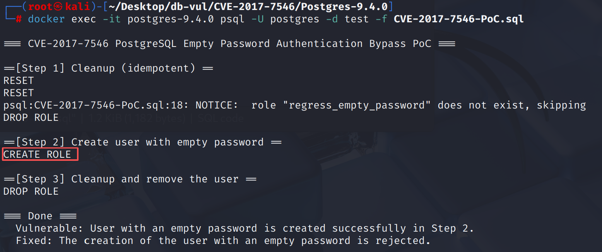

# CVE-2017-7546 CWE-287 PostgreSQL 身份认证绕过

## 漏洞背景

- **PostgreSQL**：PostgreSQL 是一个开源、功能强大的对象关系型数据库管理系统，广泛应用于 Web 开发、数据分析和企业级应用。它支持 ACID 事务、复杂查询、全文搜索和多版本并发控制（MVCC），确保高并发和数据一致性。PostgreSQL 提供了扩展性，允许用户自定义数据类型、函数和索引，还支持 JSON 和地理空间数据。
- **CWE-287（Improper Authentication 身份验证不当）** ：系统在身份验证机制上存在缺陷，无法正确验证用户身份，从而允许未授权用户绕过访问控制或以不应有的权限访问系统资源。该类漏洞通常源于认证逻辑错误、密码策略不严或错误配置，导致攻击者可以轻易地冒充合法用户或绕过身份验证，进而访问敏感数据或执行受限制操作。

## 漏洞原理

PostgreSQL 在处理用户创建时，错误地允许为空字符串的密码（即空密码）。在受影响的版本中，数据库不会拒绝空密码，导致攻击者可以创建没有密码的用户。这使得恶意用户可以绕过身份验证机制，直接登录数据库并执行任意操作，从而导致未经授权的访问和潜在的安全风险。

## 漏洞定位


漏洞涉及密码接收和角色密码存储两个环节：

1。 联合国 `src/backend/libpq/auth.c`  `recv_password_packet()` 只读取客户端端口令包,不拒绝长度1的空密码(仅包含结尾的NUL)。 PAM、LDAP、RADIUS和简写 `password` 将调用此函数的认证方法,从而可以继续验证空字符串。
2。 国家 `src/backend/commands/user.c`  `CreateRole()`/`AlterRole()` 加密并保存用户提供的密码,但不清除空字符串或对应空字符串的“预加密散列” SQL  `NULL`。

```c
static char *
recv_password_packet(Port *port)
{
    StringInfoData buf;

    pq_startmsgread();
    if (pq_getmessage(&buf, 1000))
        return NULL;
    /* Vulnerable versions did not reject buf.len == 1 here. */
    return buf.data;
}
```

因此,在字符创建/修改阶段,认证方法接受的空密码可以留在系统目录中,登录阶段缺乏最终的统一截取。 同时修复和修改这两个文件,以完全禁用绕行路径。

## 漏洞修复


升级到 PostgreSQL 9.6.4、9.5.8、9.4.13、9.3.18、9.2.22，或相应分支中的更高版本。
1。 在src/backend/libpq/auth.c文件中,在服务器侧通道中增加了一个统一的检查(c).`recv_password_packet`) 收到纯文本密码的地方:如果客户端发送的密码包是1(仅NUL,相当于空密码),错误(`ERRCODE_INVALID_PASSWORD` 因此,启用了纯文本密码认证(例如： `password`,PAM/方法如LDAP/RADIUS使用"向外密码获取/验证"直接阻断空密码的使用。

   ```c
   if (buf.len == 1)
   		ereport(ERROR,
   				(errcode(ERRCODE_INVALID_PASSWORD),
   				 errmsg("empty password returned by client")));
   ```

2。 在src/backend/commands/user.c文件中,在创建/修改角色时,添加逻辑:如果指定的密码是空字符串,则不要存储密码(将其清除为NULL)。 如果指定的散列是一个"null等效密码"(例如,MD5对应一个空字符串),它也会被清除。

   ```c
   if (password[0] == '\0' ||
   			plain_crypt_verify(stmt->role, password, "", &logdetail) == STATUS_OK)
   		{
   			ereport(NOTICE,
   					(errmsg("empty string is not a valid password, clearing password")));
   			new_record_nulls[Anum_pg_authid_rolpassword - 1] = true;
   		}
   		else
   		{
   			/* Encrypt the password to the requested format. */
   			shadow_pass = encrypt_password(Password_encryption, stmt->role,
   										   password);
   			new_record[Anum_pg_authid_rolpassword - 1] =
   				CStringGetTextDatum(shadow_pass);
   		}
   ```

## 影响范围


** 受影响的版本:** PostgreSQL：

-  9.2.0 改为 9.2.21
-  9.3.0 改为 9.3.17
-  9.4.0 改为 9.4.12
-  9.5.0 改为 9.5.7
-  9.6.0 改为 9.6.3

## 环境搭建

启动 Docker 环境，PostgreSQL 版本为 9.4.0，管理员为 postgres，密码为 postgres，已存在数据库 test。

```txt
NIST:NVD   Base Score:9.8 CRITICAL   CVSS:3.0/AV:N/AC:L/PR:L/UI:N/S:U/C:H/I:N/A:H
```

```txt
cpe:2.3:a:postgresql:postgresql:9.4:*:*:*:*:*:*:*
```



## 漏洞复现

使用 postgres 用户身份连接容器中的 PostgreSQL 的数据库 test 并运行 PoC 文件。在 Step 2 可以看到成功创建了密码为空的用户。

```bash
docker exec -it postgres-9.4.0 psql -U postgres -d test -f CVE-2017-7546-PoC.sql
```



## PoC分析


那个 PoC 用空密码创建或更改一个角色,然后检查受影响的服务器上由此产生的行为。 接受空证书可以显示密码处理错误； 网络登录行为仍然取决于配置 `pg_hba.conf` 认证方法。


```sql

```

## 参考链接


[NVD - CVE-2017-7546](https://nvd.nist.gov/vuln/detail/CVE-2017-7546)

[PostgreSQL: CVE-2017-7546: empty password accepted in some authentication methods](https://www.postgresql.org/support/security/CVE-2017-7546/)

[Don't allow logging in with empty password. · postgres/postgres@bf6b9e9](https://github.com/postgres/postgres/commit/bf6b9e94445610a3d84cf9521032fab993f96fd6#diff-ddbffc8b11d0950821faea9d3292d160af287ac4ce4b34177d9d6d5f80a0660e)
