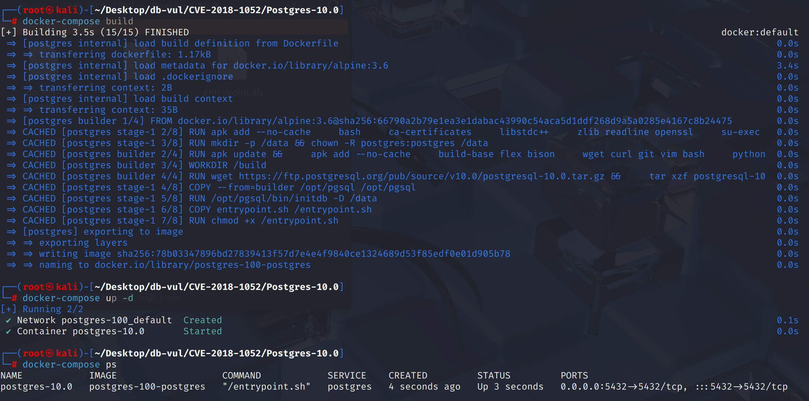
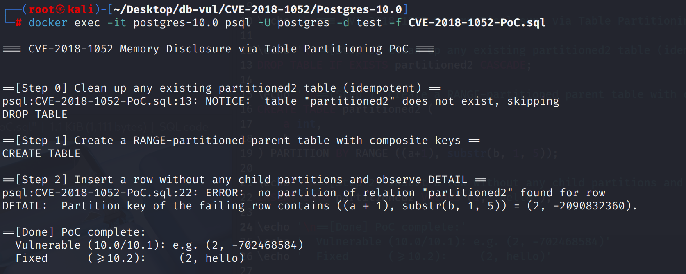

# CVE-2018-1052 CWE-200 PostgreSQL 内存泄露

## 漏洞背景

- **PostgreSQL**：PostgreSQL 是一个开源、功能强大的对象关系型数据库管理系统，广泛应用于 Web 开发、数据分析和企业级应用。它支持 ACID 事务、复杂查询、全文搜索和多版本并发控制（MVCC），确保高并发和数据一致性。PostgreSQL 提供了扩展性，允许用户自定义数据类型、函数和索引，还支持 JSON 和地理空间数据。
- **分区表（Partitioned Table）：** PostgreSQL 提供的一种将大表按某个分区键拆分成多个子表存储和管理的机制，父表本身不存数据，只保存结构和分区规则，具体的数据行会根据分区键的值自动路由到相应的子分区中；常见的分区方式有 RANGE（范围分区）、LIST（列表分区）、HASH（哈希分区），它能提升查询性能、简化大表管理，并支持对子分区进行独立维护与优化。
- **CWE-200（向未授权参与方暴露敏感信息）：**软件因权限校验不严或输出控制不当，把本应受保护的数据（如口令、密钥、令牌、个人信息、内部配置、系统版本等）泄露给未授权对象。

## 漏洞原理

在 PostgreSQL 10.0–10.1 中，`RelationBuildPartitionKey()` 在构建分区表的分区键信息时处理表达式型分区键存在缺陷。它既没有检查表达式数量是否足够，也没有在循环中推进链表指针，导致多个分区键错误地共享同一个表达式或读取到未定义内存，从而使类型信息与真实表达式错位；在分区路由或错误信息回显时，系统会按错误的类型解释实际值，结果把后端内存数据当作正常输出泄露给客户端，造成内存泄露。

## 漏洞定位

分析 PostgreSQL 10.0 源码：

在 src/backend/utils/cache/relcache.c 文件中，第 **827** 行`RelationBuildPartitionKey`函数用于在打开分区表时，解析并构建分区键的类型与表达式信息，填充到内存结构 PartitionKey 里，以便后续插入路由、约束生成、错误信息回显和查询优化使用

在第 **959** 行用于在分区键构建阶段，区分“列键”和“表达式键”，然后把每个键的数据类型、类型修饰、排序规则收集起来存入 `PartitionKey` 结构。

其中第 **965** 行的分支用于处理表达式型分区键，但是这里：循环的每一轮都在重复使用同一个表达式节点（通常是第一个）。于是后续键位会拿到第一个表达式的类型信息，造成键位和表达式错位。

同时没有在取 `lfirst(partexprs_item)` 前判空。如果表达式个数不足，就会把未定义内存当作 `ListCell*` 解析，进一步放大错位/崩溃/信息泄露的风险。

```c
// relcache.c  827 行
static void RelationBuildPartitionKey(Relation relation)
{
	// ...
    
		/* 第 959 行，为分区键收集类型信息 */
    	// 列键:直接使用表里的某一列
		if (attno != 0)
		{
			key->parttypid[i] = att->atttypid;       // 列的类型OID，比如 int4
    		key->parttypmod[i] = att->atttypmod;     // 列的 typmod，比如 varchar(10) 里的 10
   			key->parttypcoll[i] = att->attcollation; // 列的排序规则 OID
		}
   		// 965 行，表达式键:用表达式计算出来的值，如 (a+1) 或 substr(b,1,5) ********** 漏洞点 *************
		else
		{
			key->parttypid[i]  = exprType(lfirst(partexprs_item));       // 表达式返回值的类型OID
    		key->parttypmod[i] = exprTypmod(lfirst(partexprs_item));     // 表达式结果的 typmod
    		key->parttypcoll[i]= exprCollation(lfirst(partexprs_item));  // 表达式结果的排序规则
		}
    
		// ....
}
```

## 漏洞修复


升级到 PostgreSQL  10.2 或后来。
添加的空语句:如果表达式数量不足,则立即抛出一个错误以避免读取垃圾。 同时,提前链接列表指针,以确保密钥和表达式对应一对一。

```sql
else
{
    /* First, perform consistency checks to avoid reading junk */
    if (partexprs_item == NULL)
        elog(ERROR, "wrong number of partition key expressions");

    Node *expr = lfirst(partexprs_item);
    key->parttypid[i]  = exprType(expr);
    key->parttypmod[i] = exprTypmod(expr);
    key->parttypcoll[i]= exprCollation(expr);

    /* Proceed to the next expression to ensure one-to-one correspondence */
    partexprs_item = lnext(partexprs_item);
}

```

## 影响范围


** 受影响的版本:** PostgreSQL：

-  10.0 改为 10.1

## 环境搭建

启动 Docker 环境，PostgreSQL 版本为 10.0，管理员为 postgres，密码为 postgres，已存在数据库 test。

```txt
NIST:NVD   Base Score:6.5 MEDIUM   CVSS:3.0/AV:N/AC:L/PR:L/UI:N/S:U/C:H/I:N/A:H
```

```txt
cpe:2.3:a:postgresql:postgresql:10.0:*:*:*:*:*:*:*
```



## 漏洞复现

使用 postgres 用户身份连接容器中的 PostgreSQL 的数据库 test 并运行 PoC 文件

```bash
docker exec -it postgres-10.0 psql -U postgres -d test -f CVE-2018-1052-PoC.sql
```

在 Step 2 返回的错误信息中 `DETAIL` 把第二个分区键打印成了 随机负整数 `-2090832360`，而不是期望的 `hello`。



## PoC分析

```sql
-- 创建分区表
CREATE TABLE partitioned2 (
	a int,
	b text
) PARTITION BY RANGE ((a+1), substr(b, 1, 5));

INSERT INTO partitioned2 VALUES (1, 'hello');
```

`DETAIL` 应展示复合分区键两个表达式的计算结果为 ((a + 1), substr(b, 1, 5)) = (2, hello)。

但由于`RelationBuildPartitionKey()` 中遍历表达式列表的指针 没有前移，并且缺少个数校验。第 0 位键正确填成 `int`，而第 1 位键也被错误地填成 `int`（本应是 `text`），甚至在一些情况下会读到未初始化的垃圾内存作为“类型/排序信息”。

当插入一行找不到分区时，错误信息里的 `DETAIL` 会把“计算得到的键值”按“元数据记录的类型”来格式化输出。于是，系统把一个本来指向文本的 `Datum` 当成 32 位整数来解读，输出成了类似 `-702468584` 这样的垃圾数（本质就是把指针/内存头几字节当 int4 解释了）。

## 参考链接


[NVD - CVE-2018-1052](https://nvd.nist.gov/vuln/detail/CVE-2018-1052#match-14744146)

[Fix RelationBuildPartitionKey's processing of partition key expressions. · postgres/postgres@3492a0a](https://github.com/postgres/postgres/commit/3492a0af0bd37e7f23e27fd3f5537f414ee9ab9b#diff-2ba7e4001546dd7fcc0d7bb872d9474ef85a6f6fa329d8168b9cb587bf0cce47)

